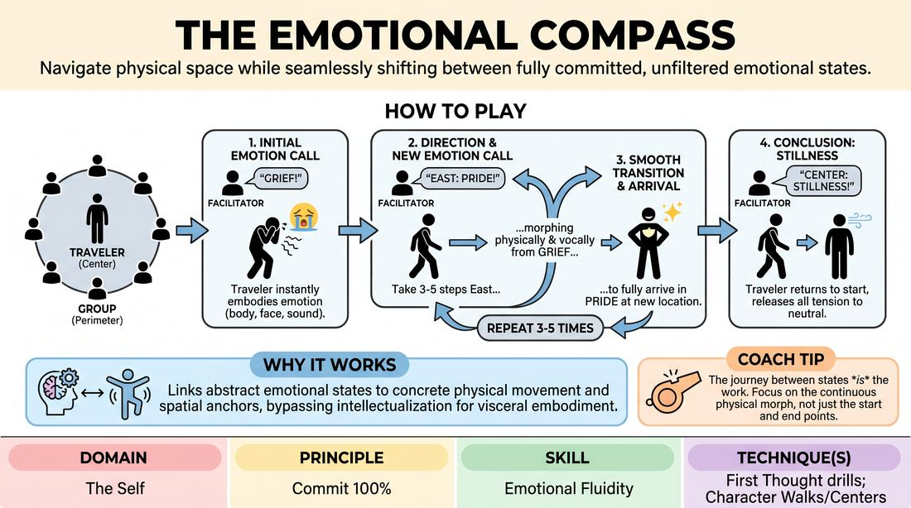

# 🎲 Drill B — under load — The Emotional Compass

{ .infographic }

> Navigate physical space while seamlessly shifting between fully committed, unfiltered emotional states.

`Players 2–99` · `~30 min` · `Complexity 2/5` · `Energy medium` · `Contact none` · `Props: none`

⬅️ [Back to the Week 07 run-sheet](../week-07.md)

## Why this activity, here

Drill A gave them emotion sitting still, in their own time, with no one specifically watching. This adds three loads at once: an audience, a clock, and a body in motion. It is the last rung before the week's scene work, where emotion has to arrive while they are also handling a partner and an offer. Everything here — breath leading, contrast, clean release — gets reused in that scene block.

## What students actually learn

- They stop waiting to feel something before showing it. The breath goes first and the feeling follows it.
- They find out that a big state can be entered in one second and dropped in three breaths, which makes big states less frightening.
- They notice how much of an emotion lives in the walk — pace, weight, where the chest points — not just the face.
- They stop apologising with a laugh at the end of a turn.

## Setup

Empty floor, wide enough for a five-step walk in any direction from the centre. Push chairs to the walls. Decide your four compass points before class and point them out. Have a written list of twenty emotions in your hand — you will run dry otherwise. Mix physical states (dread, glee, itching suspicion) with social ones (shame, triumph, wounded pride). Avoid anything that reads as a request for personal disclosure. No props, no music.

## How to run it — 30 minutes

| Min | What you do |
|---:|---|
| 4 | Circle up. Name the compass points. Explain the shape in thirty seconds, then demonstrate one full turn yourself: emotion, two shifts, centre-stillness. Demonstrate badly on purpose once — arrive at the new emotion only after stopping — so they can see the gap you want closed. |
| 4 | Everyone practises at once, in place, no travel. Call an emotion. They breathe it, then let it reach the body and a sound. Call a new one. Four or five calls. No one is being watched; this is just to get the breath leading. |
| 8 | First travellers. Three shifts each, short paths, then centre-stillness. Move fast — roughly forty-five seconds a person. Keep your calls crisp and contrasting. Do not comment between turns; just call the next person in. |
| 8 | Second wave, harder. Four to five shifts, longer paths, sharper contrasts (grief straight into ecstasy). Side-coach mid-walk. If someone is arriving early, call an extra direction to keep them moving. |
| 4 | Two Travellers on the floor at once, ignoring each other, each following their own called path. Alternate your calls between them. Anyone who has not gone yet goes now. |
| 2 | Everyone stands, three slow breaths together, shake out arms and legs. Two debrief questions. Move on. |

## Side-coaching script

| When | Say |
|---|---|
| As the first emotion is called | *"Breath first. Let it change your breath before it changes your words."* |
| When a Traveller stalls before starting | *"Don't decide. Just start and let it get truer."* |
| Mid-walk, when the emotion has not moved yet | *"Change on the way, not at the end."* |
| When the face is doing all the work | *"Put it in your feet. Change how you weigh."* |
| When a Traveller stays polite and small | *"Louder in the body, not the voice."* |
| When someone laughs their way out of a state | *"Stay in it three more seconds."* |
| On the return to centre | *"Put it down. Three breaths. Nothing to hold."* |
| If the watching circle starts commenting | *"Circle silent. Just watch."* |

!!! success "What good looks like"
    You can tell what state someone is in from the back of the room before you see their face. The change happens across the walk, not on arrival — by step three you are already unsure which emotion you are looking at. Sounds come out unforced and unfunny: a hum, a hiss, an exhale. Travellers arrive at centre-stillness and actually go quiet rather than shrugging or grinning. The circle watches without laughing at people.

## When it goes wrong

| You see | What's causing it | The fix |
|---|---|---|
| The Traveller walks neutrally across the room, then strikes the new emotion when they stop. | They are treating the walk as travel and the arrival as the performance. Very common in round one. | Stop the turn. Ask them to walk it again at half speed while you count the steps aloud, one changed thing per step. Then let them go at full speed. |
| Everything comes out as a comic bit — pratfalls, silly voices, playing to the circle for a laugh. | Being watched alone is exposing, and comedy is the exit. It spreads through a group in two turns. | Name it plainly and without blame: this one is not for laughs. Ban sound for one wave — body and breath only. The jokes go with the voice. |
| Faces working hard, bodies unchanged. Emotion from the neck up. | Habit from everyday life, plus a fear of looking foolish in the torso. | Call one round where they must change their spine or their pace with every shift. Do the whole-group in-place practice again for thirty seconds. |
| Someone goes somewhere genuinely raw on grief or shame and cannot come out. | The prompt landed on something real. Rare, but it happens. | Call 'Centre — stillness' immediately, breathe with them, and move to the next Traveller without comment. Check in quietly at the break. Do not make it a group moment. |

## Scaling

| Class size | What changes |
|---|---|
| **10–13** | One circle. Everyone gets a solo turn with room to spare — give the second wave five shifts and longer paths. Skip the two-at-once round and give those four minutes back to the second wave. |
| **14–17** | One circle, but keep first-wave turns to forty seconds and call the next Traveller in before the last one has fully sat down. Run the two-at-once round as written to clear the remainder. |
| **18–20** | Split into two circles at opposite ends of the room after the demo. Run one yourself; brief a confident participant to call for the other, or alternate your calls between the two circles every turn. Three shifts per Traveller throughout. Some people will get one turn only — say so up front. |

## Variations

**Escort** — The Traveller picks one person from the circle to walk the path beside them, matching their body and breath without leading.  
*Easier — being watched alone is the hardest part, and a walking companion removes it while keeping the physical work intact.*

**Weather Front** — Call the new emotion only after the Traveller has already started walking, on step two.  
*Harder — they must commit to movement before they know the destination, which kills pre-planning entirely.*

**Two Bodies, One Compass** — Two Travellers walk the same called path in contact-free parallel, staying within arm's reach and matching each other's timing.  
*Different emphasis — shifts the work from solo commitment to shared tempo, which is what the scene block needs next.*

## Debrief

1. **Which shift was easiest, and what did your body do first?**
   > *A good answer sounds like:* Something specific and physical: 'the breath went short before I knew it was panic', 'my shoulders dropped and then it was grief'. If they answer with an emotion word only, ask what changed in their breathing. Move on once two or three people have named a body part.

2. **What happened when you tried to arrive rather than travel?**
   > *A good answer sounds like:* They describe the gap — a blank walk, a decision made at the end, feeling like a fake. Good sign if someone says the walk felt like waiting. That is exactly the thing the scene block will punish.

3. **How did centre-stillness feel?**
   > *A good answer sounds like:* Honest reports either way: relief, or a lag where the state hung around. Both are useful. You want them to notice that releasing is a separate skill from committing, not an automatic result of stopping.

!!! warning "Safety & inclusion"
    No contact in the base version; the Escort and Two Bodies variations stay contact-free at arm's reach, so no consent step is needed — say that out loud when you introduce them. Anyone may pass on a turn or take a shorter path with no reason given; state this before the first Traveller steps in and mean it. Travel can be done seated in a wheeled chair, with fewer steps, or as a turn on the spot — the change across time is what matters, not the distance. Vocalisations may be near-silent. Keep prompt emotions general and situation-free; you are asking for a state, not a memory, and never ask anyone what they were thinking about. Watch for a Traveller who goes somewhere real: end the turn early, breathe with them, check in at the break. Warn the room that grief and shame are on your list so anyone can opt out in advance.

## Why it works

Emotional fluidity fails when people treat feeling as something that must be found before it can be shown. Walking removes that option. The floor imposes a fixed duration — three to five steps — inside which the change must happen, so there is no time to search inwardly and no way to hide the search. Because the breath is the fastest thing in the body to change, and because it drags posture and voice behind it, coaching breath-first gives them a mechanism that works under time pressure. The compass adds contrast: consecutive emotions are chosen to be far apart, so half-committed states are visibly indistinguishable and the room can see it. The compulsory return to stillness teaches the other half of the skill — that a state can be dropped on purpose — which is what makes committing to the next one cheap.

[Open the full activity card »](../../../../games/D1_P1_S2_T0_G261__the-emotional-compass.md){target=_blank rel=noopener}
