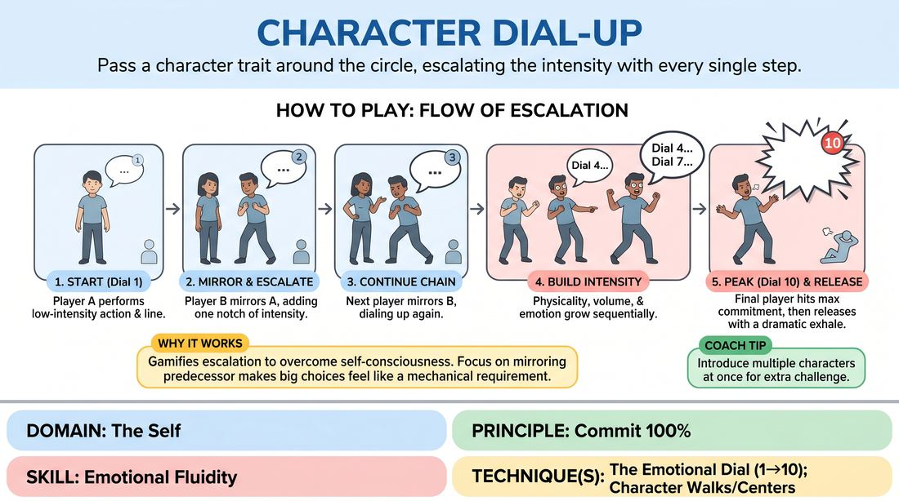

# 🎯 Scene Lab — Incremental Character Dial

{ .infographic }

> Pass a character trait around the circle, escalating the intensity with every single step.

`Players 5–99` · `~30 min` · `Complexity 2/5` · `Energy high` · `Contact none` · `Props: none`

⬅️ [Back to the Week 07 run-sheet](../week-07.md)

## Why this activity, here

Week 7 has already put emotion into the body through warm-ups and voice work. This block turns that into a controllable range rather than an on-off switch. Students have been asked to feel things; here they learn to size them. It feeds directly into the two-person scenes at the end of the session, where a partner's shift has to be matched and answered rather than ignored.

## What students actually learn

- They stop treating emotion as binary. A 3 becomes as playable as a 9.
- They find that breath moves before speech does, and that the audience reads the breath.
- They can copy another person's emotional state accurately, which is the first half of listening.
- Big playing stops feeling embarrassing, because everyone in the ring arrives there by increments.

## Setup

Clear floor space for a circle of the whole group. No chairs inside the ring. Push bags to the walls. You need nothing but the circle and a way to keep time. Know in advance whether you are running one circle or two, based on numbers.

## How to run it — 30 minutes

| Min | What you do |
|---:|---|
| 4 | Circle up. Explain the dial with your own body: say one line at 1, then the same line at 5, then at 9. Name what changed — breath, then body, then volume. |
| 6 | Run one full chain slowly. Stop it at any point and ask the room what number they are seeing. Correct the drift. Restart from the corrected number. |
| 6 | Run continuous chains at pace. Each time a character hits 10, the next player starts fresh at 1. Aim for three or four complete chains. |
| 5 | Add the breath rule. Before each player speaks, they must let the emotion change their breathing first. Hold the group to it for one full chain. |
| 5 | Launch two characters at once, three players apart, same direction. Let it get messy. Run it twice. |
| 4 | Stop. Shake out. Debrief standing in the circle. |

## Side-coaching script

| When | Say |
|---|---|
| First chain, players jumping too high too fast | *"One notch. Only one."* |
| A player speaks before anything else changes | *"Breath first. Then the words."* |
| Copies are getting loose | *"Same line. Same gesture. Copy it exactly."* |
| Mid-chain, around level 5 or 6 | *"Let it into your feet."* |
| A player rushes the pass | *"Land it on them. Then move."* |
| Approaching 10 | *"All of it. Nothing held back."* |
| After a 10, before the next start | *"Fresh line. Back to one."* |
| Two characters running, players losing track | *"Watch the person next to you, not the room."* |

!!! success "What good looks like"
    The chain climbs in visible, even steps and you can guess the number from across the room. Players at 3 and 4 are still small and specific, not already loud. Breath changes before the line arrives. The 10 is genuinely full — voice, spine, floor — and nobody laughs it off. The reset to 1 is immediate and quiet.

## When it goes wrong

| You see | What's causing it | The fix |
|---|---|---|
| The chain hits maximum by the fourth player and stays flat for the rest of the circle. | Players are matching the feeling of escalation rather than the actual size, and volume is the only dial they are using. | Stop the chain. Ask the room to number what they just saw. Restart at the number where it broke and insist on smaller steps for the first five players. |
| Players copy the emotion but invent their own line or gesture. | They are watching the mood, not the person, and filling the gap with their own idea. | Run a chain with the line and gesture only, no escalation. Rebuild the copying, then reintroduce the dial. |
| One or two players visibly shrink when the level passes 7 and pass a lower version on. | Self-consciousness about being loud in front of the group, not lack of understanding. | Let it pass. Coach the whole circle to breathe with the player at high numbers so the noise is shared, and give that player an early position next chain. |
| With two characters running, the circle collapses into laughter and stops. | Peripheral demand exceeded what the group can hold yet. | Widen the gap to five players, or drop back to one character and spend the remaining time on cleaner chains. |

## Scaling

| Class size | What changes |
|---|---|
| **10–13** | One circle, everyone in. A full 1-to-10 chain uses most of the ring, so expect one or two chains per pass. Run four chains in the pace section. Two simultaneous characters, four players apart. |
| **14–17** | One circle still works but the chain wraps. Keep it — the reset to 1 mid-circle is useful. Run three chains in the pace section. Two simultaneous characters, five players apart. |
| **18–20** | Split into two circles of nine or ten with clear space between them. Run both at once. You coach one for three minutes, then the other. Add the breath rule to both circles at the same time by calling it across the room. Two simultaneous characters only if a circle is running clean. |

## Variations

**Dial of Five** — Run the scale from 1 to 5 instead of 1 to 10. Each notch is a bigger visible jump and chains resolve faster.  
*easier — less discrimination needed between adjacent levels, and more players get to play the top*

**Called Numbers** — Instead of climbing by one, you call a number and the next player must hit exactly that level. Jump around: 2, 7, 3, 9.  
*harder — removes the ramp, so players must size an emotion cold rather than by comparison*

**Down the Dial** — Start a character at 10 and descend one notch per player to 1, where it disappears into stillness.  
*different emphasis — trains containment and the small end of the range, which most players neglect*

## Debrief

1. **Which number was hardest to play honestly?**
   > *A good answer sounds like:* Someone naming the low numbers — that 2 and 3 felt like doing nothing, or that they were tempted to add something. That tells you the small end is the real work.

2. **What changed in you first when you took the pass?**
   > *A good answer sounds like:* A player describing breath, jaw, shoulders or stomach before mentioning the line. If everyone says 'I thought about how to say it louder', run the breath rule again next week.

3. **When someone raised it a notch, how did you know?**
   > *A good answer sounds like:* Concrete physical observations — the shoulders came up, the breath got shorter, they leaned in. Not 'they seemed angrier'. Specificity here means they were actually watching.

!!! warning "Safety & inclusion"
    No contact in this activity. Warn the group that levels 8 to 10 get loud and ask anyone with hearing sensitivity to stand where they prefer or step out of the ring for the top of a chain. Anyone can pass their turn by saying 'pass' and turning to the next player — say this out loud before the first chain. Players with limited mobility play the dial through breath, face, hands and voice; make clear the escalation does not have to be in the legs. Watch for anyone whose intensity tips from played to actual distress and stop the chain if so.

## Why it works

Emotional fluidity fails when players hold only two settings: neutral and full. Forcing a single-notch increment removes the choice to leap, so the body has to find the intermediate states it usually skips. Because each player copies the one before, the reference point is external and physical rather than internal and vague — you can see a 6 because you just saw the 5. Running it round a circle means every player passes through the whole range in one session, including the top, arrived at gradually enough that nobody has to decide to be big on their own. The breath rule enforces the cue directly: put the change in the body first and the voice inherits it, rather than a shouted line with a still body underneath.

[Open the full activity card »](../../../../games/D1_P1_S2_T1_G657__character-dial-up.md){target=_blank rel=noopener}
