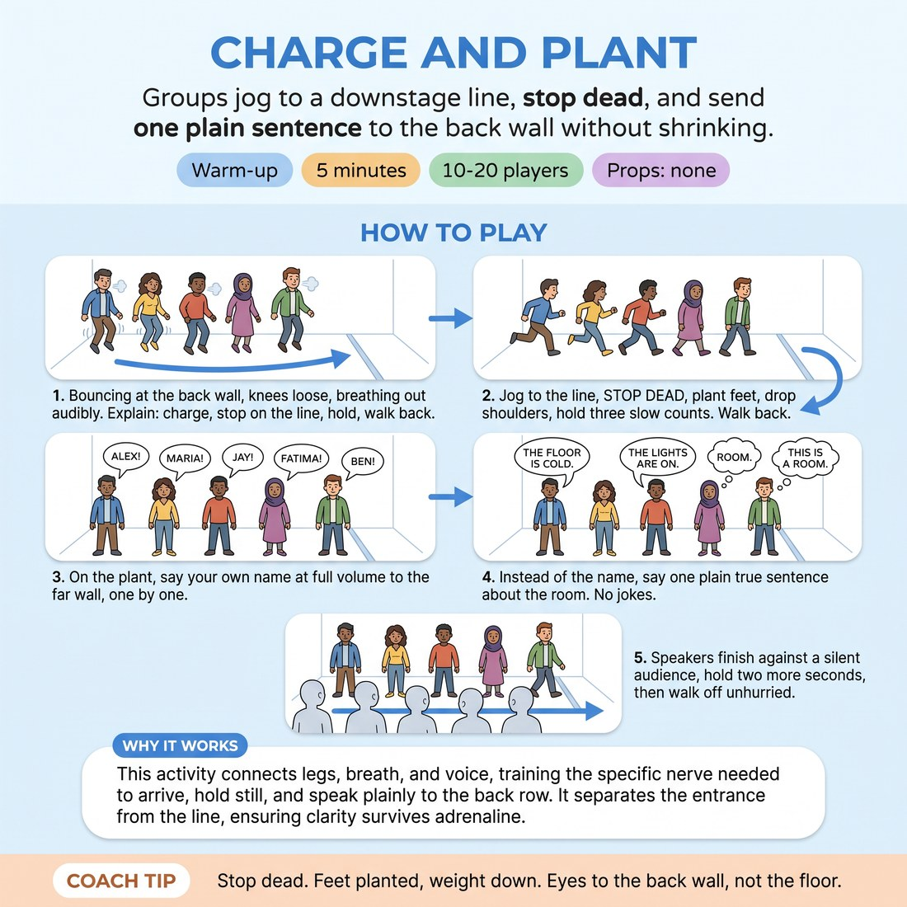

# 🔥 Warm-up cluster — Charge and Plant

{ .infographic }

> Groups jog to a downstage line, stop dead, and send one plain sentence to the back wall without shrinking.

`Players 10–20` · `~5 min` · `Complexity 2/5` · `Energy high` · `Contact none` · `Props: none`

⬅️ [Back to the Week 08 run-sheet](../week-08.md)

## Why this activity, here

It opens showcase week. Bodies arrive cold and nervous, and the first instinct under an audience is to shrink — rush the line, drop the voice, apologise with the shoulders. This block installs the physical default before anything else runs: arrive, stop, be seen, speak. Everything later in the session — two-chair scenes or games night — depends on players holding a stage position long enough to be heard. It feeds the cue directly: take care of your own body and voice first, then you have something to give your partner.

## What students actually learn

- Being looked at without laughing is survivable, and lasts about three seconds.
- The difference between speaking to a partner and sending a voice to a back wall.
- That a stopped body reads as confident, whether or not the person feels confident.
- Stillness after a line is a choice, not an accident.

## Setup

Clear a strip of floor at least four metres deep. Mark a downstage line with tape, or set two chairs at either end of it. Put the whole group at the back wall. Facilitator stands at the far end of the room, at the back — the wall they will speak to. No props. Shoes on or off, their choice; check the floor is safe for socks.

## How to run it — 5 minutes

| Min | What you do |
|---:|---|
| 1 | Show the line. Whole group bounces at the back wall, knees loose, audible out-breath. Walk them through the shape in words: charge, stop, hold, return along the side. |
| 1 | Waves of five. Jog, stop dead on the line, plant feet shoulder-width, shoulders down, eyes on the far wall. Count three slow beats aloud for them. Walk back along the side. |
| 1 | Same waves. On the plant, each person sends their own name to the far wall at full volume, one at a time down the line. Leave air between names. |
| 1 | Same waves. Replace the name with one plain true statement about the room. Refuse jokes. If someone gets a laugh, send them again with something duller. |
| 1 | Final pass. Tell watchers to stay silent and blank on purpose. Speakers deliver, hold two extra seconds, walk off unhurried. No applause between waves. |

## Side-coaching script

| When | Say |
|---|---|
| During the bounce at the back wall | *"Breathe out loud. Let the knees be soft."* |
| As a wave hits the line | *"Stop dead. Nothing extra."* |
| Bodies fidgeting on the hold | *"Feet under your hips. Shoulders down."* |
| First name is spoken quietly | *"Send it to the back wall, not to me."* |
| People rushing one name into the next | *"Wait. Let the room go quiet first."* |
| Sentences getting witty | *"Duller. Just what's true."* |
| Speakers leaving the moment they finish | *"Hold two more. Then walk."* |
| Last wave, blank watchers | *"Nothing's wrong. Finish it anyway."* |

!!! success "What good looks like"
    Five people arrive at the line and genuinely stop — no drift, no bounce, no hands finding pockets. The hold is uncomfortable to watch for a second and then it isn't. Voices land at the back of the room without shouting or straining. Sentences are boring and clearly audible. Nobody flinches at the silent final pass. The whole group has slightly higher chests and slower breathing than when they came in.

## When it goes wrong

| You see | What's causing it | The fix |
|---|---|---|
| People slow down as they approach the line and coast to a stop. | They are managing the arrival so they never have to be caught still. | Call "stop dead" as the wave hits. Run that wave twice. Tell them the stop is the exercise, not the jog. |
| Sentences turn into jokes and the watchers laugh every time. | The group is defusing being looked at. Comedy is the escape hatch. | Send that person back for one more, and specify the topic: name a colour you can see. Praise the flat delivery out loud. |
| Volume drops on the last word of every sentence. | Untrained breath support, plus retreating from the end of the thought. | Give one call: "finish the word." Have them repeat the same sentence once more, same wave, no discussion. |
| One or two people hang at the back and never join a wave. | Being seen alone at a line is genuinely exposing for a beginner. | Put them in the middle of a wave of five rather than an end. Let them do the walk and hold without speaking on the first two passes. |

## Scaling

| Class size | What changes |
|---|---|
| **10–13** | Two waves of five or six. Every wave runs all four passes. You will have about fifteen spare seconds — use it on a second attempt at the true-sentence pass. |
| **14–17** | Three waves. Keep the hold at three counts but tighten the gap between waves — send the next group the moment the previous one clears the side wall. |
| **18–20** | Four waves of five. Cut the hold to two counts on the name pass to protect the clock, and run only three waves on the final blank pass, choosing the ones who shrank most. |

## Variations

**Name only** — Drop the true-sentence pass. Run all four minutes on charge, plant, hold, and name.  
*Easier — removes the pressure to generate content and isolates the physical stop.*

**Solo charge** — After the group waves, send three or four individuals down the line alone, whole class watching.  
*Harder — removes the cover of the wave and makes the exposure explicit.*

**Charge and answer** — On the plant, you call a plain question from the back — what's the date, what did you eat. They answer to the far wall, then hold.  
*Different emphasis — shifts from projection to holding presence while thinking on the spot.*

## Debrief

1. **What did your body want to do the second you stopped?**
   > *A good answer sounds like:* Something specific and physical — touch my face, shift my weight, look at the floor, start talking early. Not "I felt nervous." Move on once two or three people name a concrete habit.

2. **What changed when the watchers went blank?**
   > *A good answer sounds like:* Someone notices they wanted a laugh or a nod and didn't get one, and that they finished anyway. If someone says the silence was fine once they stopped checking for it, you're done.

!!! warning "Safety & inclusion"
    No contact in this activity. Jogging is optional — a brisk walk to the line achieves the same thing, so say that at the start rather than waiting to be asked. Anyone with knee, hip or balance concerns walks. Check the floor for cables and grip before the first wave; if it's slick, everyone walks. Nobody has to speak on a given pass; standing in the wave and holding the plant counts as full participation. Volume is about direction, not force — if a voice sounds pushed or scraped, tell them to speak lower and slower instead of louder.

## Why it works

Stage presence and clarity are usually taught as feelings, which cannot be instructed. This works on the two things a beginner can actually control: where the feet stop and where the voice is aimed. The charge raises the heart rate so the stop is a real interruption, not a polite pause — the body has to choose stillness against momentum, and that choice is visible from the back of the room. Holding three counts past the point of comfort teaches that exposure has a floor; it does not keep getting worse. The plain-sentence rule strips out wit, so nothing is being evaluated except whether the words arrived. That directly serves the cue: the speaker sorts out their own stance, breath and target before anyone else is in the picture, which is the precondition for giving a scene partner anything at all.

[Open the full activity card »](../../library/warmups/WU__charge-and-plant.md){target=_blank rel=noopener}
