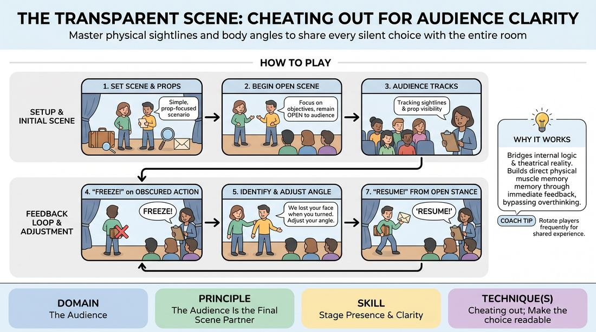

# 🎲 Drill A — isolation — The Open Frame

{ .infographic }

> Master physical sightlines and body angles to share every silent choice with the entire room.

`Players 3–99` · `~30 min` · `Complexity 2/5` · `Energy medium` · `Contact none` · `Props: required`

⬅️ [Back to the Week 08 run-sheet](../week-08.md)

## Why this activity, here

Week 8 is the showcase. The room has spent seven weeks learning to listen and commit; now the work has to reach people sitting eight metres away. This drill isolates the physical half of clarity before the games and two-chair scenes that follow, so nobody spends showcase night playing brilliantly into the upstage wall. It feeds directly into every later block: once bodies are open, side-coaching in Drill B and the showcase runs can stay on story.

## What students actually learn

- They stop treating the audience as accidental witnesses and start treating them as the third person in the scene.
- They discover they can change an angle without changing what they feel — openness is not a loss of honesty.
- They develop a background awareness of where their own face is pointing, which keeps running after the drill ends.

## Setup

Two chairs, a clear playing area, and audience seating in rows with a clearly marked back row. A prop table with six or seven neutral objects: a coin, a folded letter, a small box, a key, a mug, a book, a phone. Write six one-line scenarios on cards beforehand. Make sure the sightline from the back row is genuinely representative — if the room is wide, put a chair at the extreme side too.

## How to run it — 30 minutes

| Min | What you do |
|---:|---|
| 3 | Frame it. Say the cue: take care of yourself first, then your partner. Explain that being seen is part of taking care of yourself. Show one bad angle and one open angle yourself. |
| 4 | Round one. First group of two plays a prop scenario. Freeze often — every twenty seconds if needed. Keep your notes to what was hidden. Resume quickly. |
| 5 | Round two. New group. Ask the seated audience to call 'Freeze!' with you when they lose something. Confirm each call by naming the lost element. |
| 5 | Round three. Three players this time. Add the blocking problem: watch who steps in front of whom. Freeze on masking, not just on turned backs. |
| 5 | Round four. New group of two. Give a scenario with a small prop that wants to be hidden — a ring, a note. Freeze on prop angle specifically. |
| 4 | Final round. Any players who have not been up yet. Freeze less. Let them self-correct. Only call when they miss it twice. |
| 4 | Debrief seated. Two or three questions. Land the cue for the rest of the session and send them into the next block. |

## Side-coaching script

| When | Say |
|---|---|
| As a group starts a scenario | *"Play to the back row. They paid too."* |
| On the freeze, before naming the fix | *"Hold the shape. Don't fix it yet."* |
| A player begins adjusting | *"Same feeling. New angle."* |
| A prop is flat or palmed | *"Show us the object. Tilt it up."* |
| Two players are stacked in a line | *"Open the triangle. Step off the line."* |
| A player drops their eyes to the floor for a beat too long | *"Lift your face. We lost you."* |
| After a successful adjustment | *"Resume. Carry on from there."* |
| Late rounds, when they are self-correcting | *"Good — you caught that one yourselves."* |

!!! success "What good looks like"
    Freezes come fast and land without embarrassment. Players adjust in three seconds and pick the scene straight back up, no apology, no reset. By round four the seated group is calling freezes before you do, and the players on stage are drifting open on their own — cheating a shoulder out, lifting a prop to chest height — without being told. The scenes themselves stay simple and slightly dull. That is fine. This drill is not about the scenes.

## When it goes wrong

| You see | What's causing it | The fix |
|---|---|---|
| Players adjust into a stiff, flat, presentational line facing front, and the scene goes dead. | They have heard 'open' as 'face the audience' rather than 'let the audience in'. | Stop and demonstrate the cheated three-quarter angle: hips open, eyes on partner. Say the phrase 'quarter turn, not half'. Rerun the last thirty seconds. |
| Players start performing to your freezes — deliberately doing big open shapes and no scene. | You are freezing on aesthetics rather than lost information, so they are playing for your approval. | Freeze only when you genuinely cannot see something. Name it factually. Cut your call rate in half for the next round. |
| Someone frozen mid-adjustment goes red and starts apologising. | The freeze is reading as a correction of them rather than of the picture. | Say 'this is a camera note, not an acting note' out loud to the room. Freeze the next group within twenty seconds so it is clearly routine. |
| The seated group stops watching and starts chatting. | Rounds are running long and they have no job. | Give them the freeze call from round two onward. Keep every round under five minutes even if the scene is going well. |

## Scaling

| Class size | What changes |
|---|---|
| **10–13** | One playing area, five rounds of two players, everyone gets a turn on stage. Keep rounds to four minutes. You can afford one extra round of three players. |
| **14–17** | One playing area, but run rounds of three players from round two onward so everyone stands up once. Cut each round to three and a half minutes and freeze more decisively. |
| **18–20** | Split into two circles in opposite corners after the framing. Appoint a confident participant as the second freeze-caller and brief them for one minute: name what is hidden, never comment on acting. Rotate every three minutes. Bring both groups back for the last round and the debrief so the whole room sees one shared example. |

## Variations

**Silent objects** — Remove speech entirely. Players do the scenario in mime with the prop, no dialogue. Freeze purely on prop and face visibility.  
*easier — removes the pressure to invent dialogue and puts all attention on the body*

**Moving audience** — Every ninety seconds, move three audience members to a new seat — extreme side, far back, front corner. Players must stay open to wherever people now are.  
*harder — forces continuous adjustment rather than one fix per freeze*

**Reaction hunt** — Freeze only when an emotional reaction is lost — a wince at the floor, a smile behind a hand. Ignore props and backs entirely.  
*different emphasis — shifts from geometry to the face as the thing being shared*

## Debrief

1. **What did you catch yourself hiding?**
   > *A good answer sounds like:* Something specific and physical: 'I kept turning the letter towards me,' or 'I look down whenever I'm thinking.' Not 'I was nervous.' If you get the general answer, ask what their hands were doing.

2. **Did opening up change what you felt in the scene?**
   > *A good answer sounds like:* Mostly no — 'it felt the same, I was just standing differently.' Some will say it felt exposing at first and then normal. Both are fine. Move on once someone says the feeling survived the adjustment.

3. **How does taking care of yourself first apply to where you stand?**
   > *A good answer sounds like:* Something like: if nobody can see me, my partner is working alone. Being visible is the minimum I owe the scene. If the room only offers politeness answers, say the line yourself and move to the next block.

!!! warning "Safety & inclusion"
    No contact is required in this drill — scenarios are prop-based and players work at arm's length. If a scenario naturally invites contact, say clearly that contact is optional and to ask first. Freezing a person mid-movement can feel exposing; announce at the start that freezes are notes on the picture, never on the performance, and that anyone can say 'pass' and sit back down mid-round with no explanation. Watch for anyone holding an awkward frozen position with a knee, back or shoulder issue — tell the room that if a freeze hurts, they should move and simply say where they were. Ensure the seated observation area has chairs for anyone who cannot stand for long stretches.

## Why it works

Stage presence and clarity (D5.S3) fail for physical reasons far more often than emotional ones. The player is committed, the choice is real, and it dies four rows back because a shoulder is in the way. The freeze does two things: it interrupts the moment at the exact instant of the loss, so the correction attaches to a felt physical memory rather than an abstract note, and it separates the geometry from the acting, which removes the shame that usually makes physical notes stick badly. Repeating that interruption twenty times in half an hour installs a low-level background monitor. By showcase night the player is no longer thinking about angles; the body has learned to drift open. That is exactly the cue in practice — you take care of your own visibility first, because a partner cannot rescue a scene the room cannot see.

[Open the full activity card »](../../../../games/D5_P1_S3_T1_G508__the-transparent-scene-cheating-out-for-audience-clarity.md){target=_blank rel=noopener}
