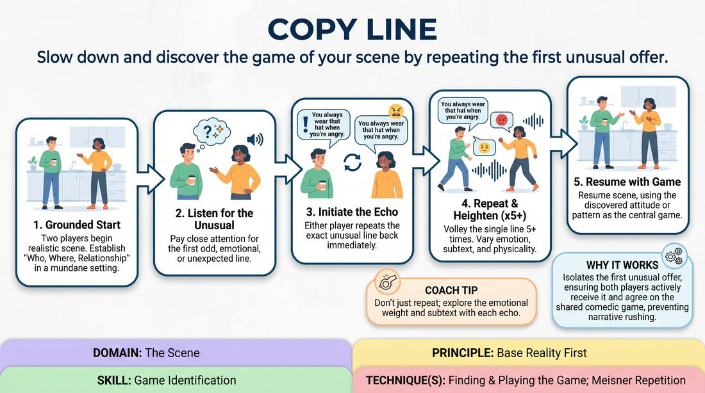

# 🎲 Drill B — under load — The Echo Line

{ .infographic }

> Slow down and discover the game of your scene by repeating the first unusual offer.

`Players 2–99` · `~30 min` · `Complexity 2/5` · `Energy medium` · `Contact none` · `Props: none`

⬅️ [Back to the Week 08 run-sheet](../week-08.md)

## Why this activity, here

Drill A worked presence with no complication — being seen while doing very little. This adds load: repetition in front of a watching room, with no new words to hide behind. It feeds directly into the showcase scenes at the end of the session, where students need one clear attitude they can hold rather than a pile of ideas.

## What students actually learn

- That the same eight words carry a different scene depending on the body and the breath behind them — clarity lives in delivery, not vocabulary.
- That the odd thing they said by accident is usable, so they stop apologising for it.
- That slowing down reads as confidence from the audience seats, even when it feels like stalling on stage.
- That committing to their own reading first gives their partner something solid to answer.

## Setup

Two chairs facing three-quarters out. Playing space clear at the front. Everyone else seated in a rough arc where they can see faces. You sit at the side, close enough to side-coach without walking on. No props, no music. Have a running order so nobody has to volunteer under pressure — pair people yourself and read the list out.

## How to run it — 30 minutes

| Min | What you do |
|---:|---|
| 4 | Frame it. Say the cue: take care of yourself first, then your partner. Grab one volunteer and demo — two ordinary lines, plant one odd line, volley it four times. Show that the words never change. |
| 3 | Everyone on their feet in pairs. Give the whole room the same line: "You always do this on a Tuesday." Sixty seconds of volleying, both directions. Call "new tone" three times. |
| 6 | Round one, two scenes. You spot the unusual line and call "echo" out loud. Players volley five times, then resume. Cut at three minutes each. |
| 7 | Round two, two or three scenes. Players now find and start the echo themselves. Side-coach only if forty-five seconds pass with no odd line landing. |
| 6 | Round three, under load. Two scenes. Add a second echo later in the scene, called by you at random. Players must volley again and still land somewhere. |
| 4 | Sit everyone down. Run the debrief questions. Finish on one sentence each about which pass of their line felt truest. |

## Side-coaching script

| When | Say |
|---|---|
| First twenty seconds of any scene | *"Ordinary first. Just the room."* |
| Forty-five seconds in with no odd line yet | *"Next strange thing — take it."* |
| The echo begins | *"Same words. Exactly."* |
| Second or third pass of the volley | *"New tone, not louder."* |
| Fourth or fifth pass | *"Mean it more than last time."* |
| The volley has found something and is about to sag | *"Land it, then move."* |
| Returning to the scene | *"Now play what you found."* |
| Players drift back into pleasant chat | *"That attitude is the scene. Keep it in the room."* |

!!! success "What good looks like"
    A scene about a broken kettle stops dead on "I've been saving that." The line comes back five times — accusing, tender, baffled, small, then very calm. By the fifth pass the room knows exactly who these two people are without a single new fact. They resume, and everything after that is about saving things. Nobody is being clever. The scene has slowed by half and reads twice as loud.

## When it goes wrong

| You see | What's causing it | The fix |
|---|---|---|
| The words shift during the volley — "I've been saving that" becomes "I was saving it, actually." | The player is still trying to advance the plot and finds repetition unbearable. | Freeze it. Say the original line back to them out loud, get them to repeat it verbatim, restart the count from one. |
| Ninety seconds of pleasant, realistic conversation and nothing unusual arrives. | Both players are being careful and treating oddness as a mistake. | Call the echo yourself. Pick any line — the flattest one works fine. Odd is manufactured by repetition, not by the original line. |
| The volley turns into a shouting match and dead-ends in a wall. | They think heightening means volume. | Call "quieter, same size." Name three other dials out loud: slower, closer, colder. |
| A strong volley, then the resumed scene ignores it entirely. | They mentally filed the echo as a separate exercise. | Stop the scene after ten seconds. Ask what they learned about the character. Restart from the line after the volley. |

## Scaling

| Class size | What changes |
|---|---|
| **10–13** | One playing area. Five or six scenes across the three rounds, three minutes each — everyone plays once. Keep the whole-room pair drill at three minutes. |
| **14–17** | One playing area, but cut scenes to two and a half minutes and run seven or eight of them. Anyone who does not get up in round two is first up in round three. Announce that at the start. |
| **18–20** | Split into two halves after the demo, each with its own playing area and its own arc of watchers. Nominate a timekeeper in the half you are not sitting with. Rotate yourself every two scenes. Accept that two or three people will only play once. |

## Variations

**Called echo** — You spot the line and call "echo" every time. Players only volley and resume — they never have to choose.  
*easier — removes the decision under pressure and lets nervous players just commit to delivery*

**Two-minute lock** — Players must find the line, complete five volleys and establish the game within two minutes total. Hard cut at the buzzer.  
*harder — forces early commitment and kills the polite establishing chat*

**Silent pass** — Two of the five volleys must be delivered with the line whispered or mouthed, carried by body and face only.  
*different emphasis — moves clarity out of the voice and into physical presence, which is what reads from the back row*

## Debrief

1. **Which pass of your line landed differently from how you expected?**
   > *A good answer sounds like:* They name a specific pass — "the third one, when I stopped pushing" — and can say what changed in their body or tempo, not just that it "felt better".

2. **What did the repetition tell the audience that the first delivery did not?**
   > *A good answer sounds like:* Watchers describe learning something about the relationship — status, history, who wants what — rather than saying it got funnier.

3. **Where in the volley did you stop worrying about being interesting?**
   > *A good answer sounds like:* An honest location: "around four, when I ran out of ideas." That admission is the point — running out of ideas is where committed delivery starts.

4. **How does this help you on Sunday's showcase floor?**
   > *A good answer sounds like:* Something practical: hold one attitude, say less, trust that the audience is still reading me when I am not adding information.

!!! warning "Safety & inclusion"
    No contact is required. If players want to touch — a hand on an arm during the volley — they ask in the moment and a no costs nothing. Volleys can get loud; warn the front row and tell anyone sensitive to sound where to sit. A repeated line can land close to someone's real life; anyone may say "switch" and you swap in a different line immediately, no explanation asked. Nobody has to be funny to pass this drill — repeating four words with commitment is a complete success. Anyone who wants to sit out a round watches and answers one debrief question instead.

## Why it works

Stage presence and clarity fail when a player floods the scene with new information to feel useful. Removing the option to add words removes that escape route. All that is left is the delivery — breath, tempo, eyeline, weight — which is precisely the channel the audience actually reads. The cue applies mechanically: on each pass the player must first decide what the line means to them, commit to that, and only then register what came back. Doing your own choice first is not selfishness, it is the thing that gives your partner something definite to answer. Five repetitions is long enough that the clever options run out, and what survives is a genuine attitude the pair can build on.

[Open the full activity card »](../../../../games/D3_P2_S1_T1_G678__copy-line.md){target=_blank rel=noopener}
