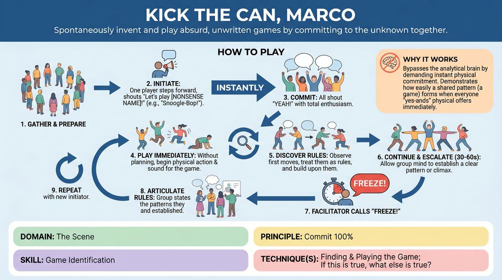

# 🎯 Scene Lab — Instant Game Engine

{ .infographic }

> Spontaneously invent and play absurd, unwritten games by committing to the unknown together.

`Players 3–99` · `~30 min` · `Complexity 2/5` · `Energy high` · `Contact none` · `Props: none`

⬅️ [Back to the Week 08 run-sheet](../week-08.md)

## Why this activity, here

Week 8 is showcase week, and the room is about to play games in front of an audience. This block comes after warm-up and before the showcase set itself. It puts the whole group into one shared engine so nobody is carrying a scene alone, and it rehearses the exact thing a games night demands: commit fast, be legible from the back row, notice what your partner started. It feeds straight into the Two Chairs or Games Night set by proving the group can build a pattern without a plan.

## What students actually learn

- That committing at full volume before you know what you are doing is survivable, and usually easier than hedging.
- That a clear physical choice is a gift to everyone else, and a vague one leaves the group guessing.
- That patterns emerge from watching, not from deciding — they can name rules afterwards that nobody agreed in advance.
- That taking care of their own clarity first is what makes them useful to the group.

## Setup

Clear the floor completely. Chairs and bags to the walls. You need a space where fifteen adults can move without collision — if the room is tight, run two smaller circles instead of one. No props, no music, no paper. Wear shoes you can move in and say so at the start. Before the first round, get explicit consent for contact: tell the group that these games can end up involving touch, ask anyone who would rather not be touched to raise a hand now, and tell the room to keep those players in eyeline and play near them, not on them. Nobody has to explain why.

## How to run it — 30 minutes

| Min | What you do |
|---:|---|
| 3 | Frame it in three sentences: someone shouts a made-up game, everyone shouts "Yeah!", everyone plays immediately. Run the consent check for contact. Drill the "Yeah!" twice, loud, with no game attached. |
| 5 | You initiate the first two rounds so nobody has to be brave yet. Shout a nonsense name, join in, play. Freeze at about forty seconds. Ask two players what the rules were. |
| 5 | Hand initiation to the group. Two rounds. Any volunteer steps in and names a game. If nobody moves, count down from three and take whoever steps in first. |
| 5 | Two more rounds, this time with a clarity note: each player makes one big, readable action and repeats it. Freeze and ask specifically what the shape of the game was, not the story. |
| 5 | Two rounds with endings. Tell them a game finishes when it peaks, and the group should build towards something — a countdown, a collapse, a winner. Still freeze it yourself if it drifts. |
| 4 | Final round. The group calls its own ending: when someone senses the peak, they shout "Game over!" and everyone stops. Let this one run longer if it is working. |
| 3 | Circle up standing. Run two debrief questions. Keep it short — the room is warm and you want it that way going into the showcase set. |

## Side-coaching script

| When | Say |
|---|---|
| During the drilled "Yeah!" before round one | *"Louder than feels sensible. Again."* |
| First seconds of any round, when people hesitate | *"Move first. Understand later."* |
| When players are shuffling and watching each other | *"Copy someone. Anyone. Now."* |
| When actions are small and internal | *"Make it big enough for the back row."* |
| Mid-round, when a pattern starts to appear | *"That's the rule. Do it again."* |
| When the group is clumping in one corner | *"Fill the space. Spread out."* |
| When someone is narrating or explaining out loud | *"Body, not commentary."* |
| Just before you freeze it | *"Build to the finish. Three, two, one — freeze."* |

!!! success "What good looks like"
    The "Yeah!" is instant and loud, with no gap between the offer and the noise. Bodies start moving before anyone knows what the game is. Within twenty seconds you can see a shared shape from across the room — a chase, a chant, a passing action, a collapse. Two or three people are clearly copying someone else and adding one thing. When you freeze it and ask for the rules, players give confident, specific answers that contradict each other slightly and nobody minds. The room is breathing hard and laughing.

## When it goes wrong

| You see | What's causing it | The fix |
|---|---|---|
| A long pause after the game name, everyone looking at the initiator for instructions. | They are waiting to be told the rules because they think there is a right answer. | Stop the round. Say the first physical action anyone makes is the rule. Restart with you making a deliberately stupid first move for them to copy. |
| Everyone doing something different, no shared shape, the round looks like a car park. | Nobody is watching anybody. All offer, no reception. | Side-coach "Copy someone. Anyone." Then run a round where the only permitted action is to imitate another player exactly for the first ten seconds. |
| The same two or three people initiate every round, the rest stay quiet. | Initiating feels like it requires a good idea. | Go round the circle in order for the next few rounds. Tell them the game name is allowed to be gibberish — worse names work better. |
| Energy is high but rounds dissolve into shouting with no discernible pattern. | Volume is standing in for clarity. Common and worth naming honestly. | Cap it: one repeated action each, no new ideas after ten seconds. Constraint produces the pattern that volume was hiding. |

## Scaling

| Class size | What changes |
|---|---|
| **10–13** | One circle for everything. Roughly nine rounds fit in the time. Everyone can initiate at least once if you go round in order after the halfway mark. |
| **14–17** | One circle still works but the floor gets busy — enforce spreading out. Expect about seven rounds. Ask for rules from three players after each freeze rather than two. |
| **18–20** | Split into two circles at opposite ends of the room after the first two rounds you lead. Each circle runs its own games simultaneously; you float between them and call a shared "Freeze!" for both. Bring them back into one circle for the final round only. |

## Variations

**Named Rule First** — The initiator shouts the game name and one rule with it: "Let's play Bucket Ladder — everyone has to hop!" The group takes it from there.  
*Easier. The single rule removes the blank-page moment that stalls nervous groups.*

**Silent Engine** — Same structure, but after the "Yeah!" nobody may make a sound. Games are built entirely from physical action.  
*Harder. Strips away the volume that groups use to fake commitment, and forces genuine watching.*

**Two Teams, One Audience** — Half the group plays a round while the other half watches from the side, then swap. Watchers state the rules they saw, not the players.  
*Different emphasis — shifts the work onto legibility from outside, which is exactly the showcase problem.*

## Debrief

1. **When did you know what the game was?**
   > *A good answer sounds like:* Someone points to a moment of watching, not deciding — "I saw two people stamping so I stamped." If answers describe planning or a clever idea, run one more round with the copying constraint before moving on.

2. **What did you do to take care of yourself in there?**
   > *A good answer sounds like:* Concrete self-management — picked one action and stuck to it, found a spot in the space, breathed, went loud so they'd stop worrying. Vague "I just went for it" is fine once; press for the specific thing they did.

3. **What does this tell you about tonight's set?**
   > *A good answer sounds like:* They connect committing early and being readable to playing in front of people. Something like "if I make a clear choice fast, nobody has to rescue me." Then stop and move on.

!!! warning "Safety & inclusion"
    Take the contact consent check before round one, out loud, and repeat it briefly if new people join. Anyone who raises a hand plays fully but untouched; the room keeps a bubble around them. These games get physical fast — say clearly that running, jumping and floor work are optional and that a standing, arms-only version of any action counts as full participation. Anyone can step to the edge of the circle at any point and rejoin without explanation; name this before you start so it does not read as failure. Watch for collisions when the circle is over fifteen — call "eyes up" rather than letting it get chaotic. Keep an eye on knees and the floor surface. If someone looks winded, freeze the round early; you never need a reason to call "Freeze!"

## Why it works

Stage presence and clarity break down when a player spends the first seconds of a scene deciding what to do. This activity removes deciding as an option: the "Yeah!" commits everyone before content exists, so the only available move is to act and be seen. Because the rules are constructed afterwards from what bodies actually did, players learn that clarity is a physical property, not a mental one — a big repeated action reads as a rule, a hesitant one reads as nothing. The cue lands directly. Each player has exactly one job at the start: make their own choice legible. Only once that is done does watching a partner become possible, and the group pattern emerges from a room full of people who each took care of their own clarity first. Naming the rules at the end proves the pattern was real without anyone having agreed it.

[Open the full activity card »](../../../../games/D3_P0_S1_T1_G751__kick-the-can-marco.md){target=_blank rel=noopener}
