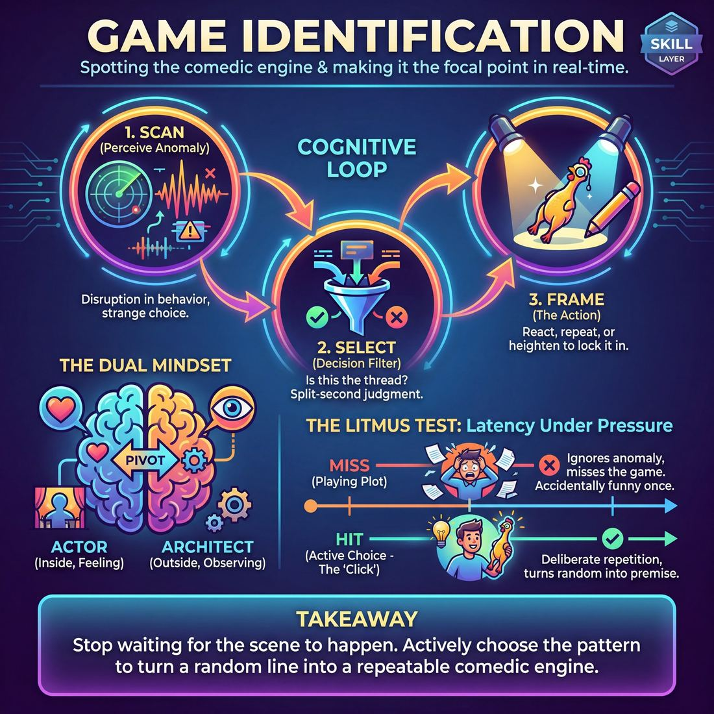

# Week 01 — Re-contract & The Two-Person Scene

> *A scene is about the one thing that isn't normal — find it, then play it on purpose.*

| Course | Week | Domain | Focus | Stage | Length | Class |
|---|---|---|---|---|---|---|
| The Engine — Scene & Ensemble | 1/8 | D3 | `D3.S1` — Game Identification | Advanced Beginner → Competent | 180 min | 10–20 |

!!! warning "Layer 0 — before anything else"
    Anyone may say **"Cut"** at any moment, for any reason, with no explanation owed.
    Everything here is opt-out-able: you can step out, sit down, or watch. The rule of
    consent overrides the rule of agreement — *Yes, And* never means *yes, you must*.

!!! note "Builds on"
    Foundations closed with two-person scenes played on instinct. Here we make the instinct conscious.

## 🎬 The arc of this session

They arrive comfortable with each other and slightly complacent — Foundations ended well and everyone can hold a two-person scene without panic. The shift comes when you make them say the unusual thing out loud inside the first minute, which feels rude and mechanical at first and then obvious. They leave able to name a game and repeat it on purpose, and knowing that pleasant is not the same as watchable.

!!! tip "Watch for"
    This group likes each other. That warmth will show up as scenes where both players agree, smile, and nothing unusual is ever named — watch for pleasant drift and interrupt it early rather than letting it become the house style.

## ⏱️ Session flow (180 minutes)

| Time | Block | Activity |
|---|---|---|
| **0:00–0:05** | 🧊 Ice-breaker | *Unreasonably Particular* |
| **0:05–0:10** | 😄 Laughter Blast | *The Sneeze Choir* |
| **0:10–0:25** | 🔥 Warm-up cluster | *Catch the Glitch*, *Then Also*, *One Thing Off* |
| **0:25–0:45** | 🧠 Theory | — |
| **0:45–1:10** | 🎲 Drill A — isolation | *Premise Purge* |
| **1:10–1:20** | ☕ Break | — |
| **1:20–1:45** | 🎲 Drill B — under load | *The Ripple Effect* |
| **1:45–2:20** | 🎯 Scene Lab | *The Instant Spark* |
| **2:20–2:50** | 🏟️ Showcase round | *The Pattern Weaver* |
| **2:50–3:00** | 💭 Reflection & homework | — |

## 🎒 Before you start

- Clear the floor for a playing space with a chair either side; seat the watching group in a shallow arc, not a full circle.
- Two chairs only as props. Whiteboard or flipchart for the theory block, plus a marker that works.
- Write the cue on the board before anyone arrives: "If this is true, what else is true?"
- Re-read your Layer 0 wording so you can deliver it in ninety seconds without a script — the group has heard it before and will switch off if you read it.
- Check who is new or returning after a gap; pair them with a confident partner in the first drill.
- Have a water break point and know where the toilets are; three hours is long and nobody will ask.

## 1. 🧊 Ice-breaker (5 min)

*Stand up, loose circle. One thing each, and make it more specific than is reasonable.*

**Why here:** Gets voices in the room and plants the week's skill sideways — everyone declares one oddly specific preference, which is the raw material of game.

### Unreasonably Particular

> A fast round of tiny personal fussiness that puts every voice in the room before anyone has to be interesting.

`Players 10–20` · `~5 min` · `Complexity 2/5` · `Energy medium` · `Contact none` · `Props: none`

**How to play**

1. Stand everyone in one circle. Say the prompt: name one small thing you are unreasonably particular about. Give your own example first — teabag timing, cutlery order, which seat on the bus.
2. Tell everyone to turn to the person on their left. On your go, both people say their thing at the same time for twenty seconds. Overlapping is expected.
3. Run lap one. One sentence each, around the circle, about seven seconds. No questions, no commentary, no follow-ups from you.
4. Tell anyone who is particular about a thing already said to tap their own chest instead of speaking. That counts as their turn.
5. Run lap two in the same direction, three seconds each. Each person points at one other person and says that person's thing back in three words.
6. Say accuracy, not wit. Repeats are allowed — two people may name the same person.
7. Ask one debrief question. Take two or three answers. Stop on time and move straight into the next block.

📄 **[Full teaching notes »](week-01/intermediate_w01__b1_1.md)**

**Side-coach:** *“More specific. Nobody has ever been arrested for too much detail.”*

## 2. 😄 Laughter Blast (5 min)

*Same circle, no talking for this one. We're going to build a sneeze together and it will sound ridiculous.*

**Why here:** Breaks the polite adult register early so the pleasant-drift problem has less to work with.

### The Sneeze Choir

> The whole room builds one enormous fake sneeze together, over and over, until the breath-holding turns into laughing.

`Players 10–20` · `~5 min` · `Complexity 1/5` · `Energy high` · `Contact none` · `Props: none`

**How to play**

1. Say nothing. Do the biggest, ugliest fake sneeze you can — long wind-up, huge release. Do a second one. Then tell the room: that, all of us, together.
2. Teach the signal. Your arm rises for the build — everyone breathes 'aaah, aaah, aaah'. Your arm drops — everyone sneezes at once. Run it twice with no comment.
3. Run three unison rounds, each wind-up longer than the last. Stretch the third until people are laughing before you drop. Hold that wait; it is doing the work.
4. Call four sneeze types, one build each, whole room together: tiny mouse, opera, dog, slow-motion. Demonstrate each yourself, louder than anyone.
5. Call a sneeze storm. Everyone sneezes freely at their own rhythm for thirty seconds, no signal. Then raise your arm and take one final unison sneeze on the drop.
6. Stop dead. Ask one question, take quick answers, allow no discussion. Move straight into the next block.

📄 **[Full teaching notes »](week-01/intermediate_w01__b2_1.md)**

**Side-coach:** *“Commit to the build-up — the release only lands if the wind-up is honest.”*

## 3. 🔥 Warm-up cluster (15 min)

*Three quick ones back to back. Each one is a piece of what we're doing all day — you'll see how they join up after the break.*

**Why here:** Three short warm-ups that isolate the three moves of the skill: spot the anomaly, follow the consequence, hold one thing off-normal.

### Catch the Glitch

> The room marches as one, someone breaks the pattern, and everyone copies the break within two seconds.

`Players 10–20` · `~5 min` · `Complexity 2/5` · `Energy high` · `Contact none` · `Props: none`

**How to play**

1. Start everyone marching on the spot, knees low, arms swinging. Clap a steady beat. Call "baseline" and hold it until the room locks to one tempo.
2. Give the rule aloud: you call a name, that person alters one thing about the march. One limb, one angle, one rhythm. Nothing more.
3. Tell the room to copy the change within two seconds and keep marching. No stopping, no discussion, no waiting for permission.
4. Call five or six names, about fifteen seconds apart. After each copy lands, call "and what else is true?" and let the room add the obvious knock-on change.
5. Drop the names. Tell them anyone may glitch now. One glitch at a time. If two land together, the room takes the bigger one. Keep the tempo up.
6. Freeze the room mid-glitch. Ask three people to finish "we are all..." in six words or fewer. Shake out arms and legs. Move on.

📄 **[Full teaching notes »](week-01/intermediate_w01__b3_1.md)**

### Then Also

> Pairs take one odd fact about an imaginary neighbour and chain out its consequences, face to face, so the room arrives already asking what else must be true.

`Players 10–20` · `~5 min` · `Complexity 2/5` · `Energy medium` · `Contact none` · `Props: none`

**How to play**

1. Call pairs. Any odd number joins a pair as a trio. Tell them to stand facing each other, feet still, eye contact, talking at normal conversational volume — no shouting across the room.
2. Demo it with one volunteer. Say a small odd fact about an imaginary neighbour: "My neighbour irons his money." They answer starting "Then also…" and add one consequence. You add the next. Stop after three rungs.
3. Round one: A states a small odd fact about an imaginary neighbour. B replies "Then also…" with a consequence. Alternate rungs until you call time. Insist on small and specific, not wacky.
4. Round two: swap. B opens a fresh odd fact. Same chain. Tell them to put each new consequence in a different area of the neighbour's life — work, food, family, sleep.
5. Round three: fast. New fact, one short sentence each, no thinking pauses. Every reply begins "Then also". Call "next rung" at any pair that goes quiet.
6. Stop the room. Take two chains out loud, ten seconds each. Name the pattern: the opening fact never changed, and everything after it obeyed.

📄 **[Full teaching notes »](week-01/intermediate_w01__b3_2.md)**

### One Thing Off

> Small groups freeze an ordinary picture with one thing wrong in it, and the watching room names the wrong thing out loud in ten seconds.

`Players 10–20` · `~5 min` · `Complexity 2/5` · `Energy low` · `Contact none` · `Props: none`

**How to play**

1. Split the room into groups of four or five. Call a dull location to each one aloud: bus queue, lift, waiting room, photocopier. Send the first group to the playing end.
2. Tell every group to agree a picture and hold it still. The person standing nearest the door does one small thing wrong. Everyone else plays the picture completely straight.
3. Bring up the first picture. Count ten seconds of silence while the room looks. Say nothing. Let no one comment while the picture is up.
4. Snap your fingers. The watchers call out the odd thing at once, in a short phrase — not a sentence, not a joke.
5. Ask the odd player: if this is true, what else is true? They answer in one sentence, still frozen. Release them. Call the next group.
6. Run every group the same way: freeze, ten seconds, snap, name it, one sentence, release.
7. For the last group only, plant two things wrong. Watchers name both, then vote by hand which is more interesting to watch. Move straight to the next piece of work.

📄 **[Full teaching notes »](week-01/intermediate_w01__b3_3.md)**

**Side-coach:** *“Don't fix the glitch. Notice it and go towards it.”*

## 4. 🧠 Theory — Game Identification (20 min)

{ .infographic }

- **The big idea:** A scene is built on the one thing that isn't normal. Find it, name it, then do it again on purpose.
- **Where you are on the path:** They can sustain a scene and listen to each other. What they can't do yet is notice, mid-scene, which specific thing is the odd one — they play everything at the same weight and hope something happens.
- **The one cue to coach:** *“If this is true, what else is true?”*

**The three beats**

1. **Say it.** Say: every scene starts normal. Then someone does or says one thing that isn't. That thing is the game. Your job is to spot it, say it out loud in your own words inside the first minute, and then keep the pattern going by asking: if this is true, what else is true? Not funnier. Just more of the same true thing, further along.
2. **Show it.** Take a volunteer. Start a flat scene — two people waiting for a bus. Have them say one slightly odd thing. Freeze. Ask the room: what was the unusual thing? Take one answer. Unfreeze, and play sixty seconds where you name it out loud and follow the consequence. Then say what you did: noticed, named, repeated with escalation.
3. **Try it.** Pairs, seated where they are. Person A says one ordinary sentence about their day. Person B says one sentence that makes it slightly unusual. A names the unusual thing in plain language — "so you iron your money" — and asks what else is true. Two rounds each, five minutes, no standing up.

!!! warning "The misunderstanding that always comes up"
    They hear "name it" as "comment on it from outside the scene" and start being wry narrators. Correct it fast: name it as the character, with interest, not as a critic. Curiosity, not commentary.

!!! abstract "📖 Go deeper"
    Read the full write-up: [Game Identification](../../../theory/03_the-scene/03_S1__game-identification.md)

## 5. 🎲 Drill A — isolation (25 min)

*Two chairs, two people, and no story. If you find yourself explaining a plan, you've left the exercise.*

**Why here:** Strips out plot so they have nothing to hide behind — the only available move is finding the unusual thing.

### Premise Purge

> Strip away narrative clutter to isolate, commit to, and relentlessly escalate a single comedic game.

`Players 2–99` · `~25 min` · `Complexity 3/5` · `Energy medium` · `Contact none` · `Props: none`

**How to play**

1. Bring two players up. Give them a location only — no plot, no relationship, no conflict. Something plain: a launderette, a car boot sale, a late-night petrol station.
2. Start the scene and let it run about two minutes. Tell the pair to build an ordinary, solid reality and let odd behaviour surface on its own.
3. Call 'PURGE!' the moment one repeatable pattern or unusual dynamic is clear. Freeze the scene exactly there.
4. Take thirty to sixty seconds and name the game out loud with the players. One sentence: who does the unusual thing, and how the other treats it.
5. Reset both players to their opening positions and run the same scene again from the very first line.
6. Tell them to establish the place in two lines, then go straight into the named game. Every line, reaction and physical choice heightens that one thing.
7. Tell them to drop or reframe anything from run one that doesn't serve the game. Off-game details are owed nothing.
8. Call 'TOO WIDE!' if they introduce fresh conflict or drift. They pivot the next line back to the game — no discussion, no apology.
9. End the scene when the game reaches a peak or has been fully explored. Cut it rather than let it limp.

📄 **[Full teaching notes »](week-01/intermediate_w01__b5_1.md)**

**Side-coach:** *“Name it now, in your own words, as your character. Don't wait until it's clever.”*

## ☕ Break — 10 minutes

Water, notes, informal talk. Non-negotiable at three hours — do not let it collapse into a working discussion.

## 6. 🎲 Drill B — under load (25 min)

*Same skill, but now you don't get to stay in one place — every time you name it, something else has to move.*

**Why here:** Adds consequence pressure: they must now take the named thing and follow it outward, which is where most of them stall.

### The Ripple Effect

> Escalate mundane details into high-stakes narrative climaxes using the logic of cause and effect.

`Players 2–99` · `~25 min` · `Complexity 3/5` · `Energy medium` · `Contact none` · `Props: none`

**How to play**

1. Put two players in the space. Have them agree a calm, ordinary location — kitchen, bus stop, staff room — before anything goes wrong.
2. Tell A to open with one small, dull observation about the place or situation. No jokes. No crisis. Something a bored person would notice.
3. Tell B to accept the observation as true, then say one direct consequence of it. One step only, not a leap.
4. Tell A to take B's line and give a consequence of that line, raising what it now costs these two people.
5. Keep them alternating. Before each line they ask silently: if that is true, what else must now be true?
6. Hold them to the chain. Every offer answers the line immediately before it, not the original observation.
7. Let the stakes climb until the scene reaches a real breaking point. Call "Scene!" when it lands, or when the chain stalls.

📄 **[Full teaching notes »](week-01/intermediate_w01__b7_1.md)**

**Side-coach:** *“If this is true, what else is true? Say the next consequence out loud.”*

## 7. 🎯 Scene Lab (35 min)

*Full scenes now, watched by everyone. Sixty seconds to find it and say it — after that you're just being nice to each other.*

**Why here:** First full-length scenes of the course with the skill applied under real conditions and a watching room.

### The Instant Spark

> Ignite a compelling scene dynamic and establish the game within the first two exchanges.

`Players 2–99` · `~35 min` · `Complexity 3/5` · `Energy medium` · `Contact none` · `Props: none`

**How to play**

1. Take one everyday location from the room. Keep it plain — a launderette, a bus stop, a dentist's waiting room. Say it once, loudly, so both players hear it.
2. Send Player A into the space alone. Tell them to arrive already doing something: a clear posture, one obvious feeling, one thing they want right now.
3. Have A deliver a single opening line that shows all three at once. The line names the want out loud. No greetings, no scene-setting narration.
4. Send Player B in. B's first job is to accept what A is doing as real and justify it — out loud, in their own words.
5. Require B's same first line to add an obstacle: a conflicting want, or something B has, knows or refuses. One line only.
6. Give A one line back. They react to the obstacle and raise their stakes. They do not solve it and do not change the subject.
7. Give B one final line that repeats the shape of the clash, so the pattern between the two is unmistakable.
8. Call "Cut" the instant that fourth line lands. Do not let them keep going. Name what the pattern was in one sentence, then bring up the next pair.

📄 **[Full teaching notes »](week-01/intermediate_w01__b8_1.md)**

**Side-coach:** *“You've found it. Stop looking for a second one and play that one harder.”*

## 8. 🏟️ Showcase round (30 min)

*Last round. Same job, longer runway — and this is the shape a showcase might take, so watch how the pattern holds.*

**Why here:** Shows what identified game looks like when it's sustained across a longer form, and introduces the showcase format without rehearsing it.

### The Pattern Weaver

> Spot the emerging comedic engine, call it out, and jump in to escalate it.

`Players 3–99` · `~30 min` · `Complexity 3/5` · `Energy medium` · `Contact none` · `Props: none`

**How to play**

1. Send two players out. Tell them to start an ordinary relationship scene — who they are, where they are, how they feel about each other. No jokes required.
2. Line the rest along the sides as Weavers. Their job is watching for a repeating behaviour, an odd reaction, or a loop that keeps returning.
3. Tell any Weaver who spots a pattern to call "Weave!" loudly. Everyone on stage freezes exactly where they are, mid-word if needed.
4. Have the Weaver name the pattern out loud in one sentence, to the room: "Every time she apologises, he gives her another job."
5. Have that Weaver tap out one of the two players and take their exact position. The tagged player joins the sideline.
6. Restart the scene at once. The incoming Weaver's first line or action must push the pattern they just named one step further.
7. Keep the scene running until the next Weave. Aim for a call every forty to ninety seconds. Cut the scene yourself when it stops moving.

📄 **[Full teaching notes »](week-01/intermediate_w01__b9_1.md)**

**Side-coach:** *“Return to the pattern. The audience is waiting for it, not for something new.”*

## 9. 💭 Reflection & homework (10 min)

**Deepen your improv**
1. In your scenes today, what stopped you naming the unusual thing sooner — not knowing, or not wanting to be the one who said it?
2. Think of a scene you watched, not one you played. What was the game, and how long did it take the players to find it?

**Beyond the stage**
3. This week, notice one conversation where everyone can see the odd thing and nobody says it. You don't have to say it — just clock how long the silence lasts.

➡️ **[This week's homework](../homework/HW-INTW01.md)**

??? note "🎓 Facilitator notes"

    **Timing risks**
    - Layer 0 re-contract will eat into the warm-up cluster if you let it become a discussion — cap it at ninety minutes' worth of goodwill and two minutes of talking.
    - Drill A runs long because every pair wants a turn; at 18-20 run two spaces at once with you moving between them.
    - Scene Lab at 35 minutes gives roughly six scenes at 10-13, four at 14-17, three plus a shared side-coach at 18-20. Decide before you start who is not going up today and tell them at the top.

    **Failure modes this week**
    - Naming the unusual thing turns into sarcastic commentary from outside the scene. Freeze it and ask them to say the same line with genuine interest.
    - They find a game and immediately abandon it for a better one. Side-coach the return, repeatedly.
    - Warmth becomes agreement becomes nothing happening. If two scenes in a row are pleasant, stop the round and say so plainly.
    - Confident players from Foundations dominate the volunteer slots. Track who has played and call names rather than taking hands after the first two scenes.

    **What good looks like by the end:** By the end, most players name the unusual thing out loud within the first minute without being prompted, and at least half can repeat it a second and third time with escalation rather than switching to a new idea. The room can say what the game was after each scene, and agree.

    **Carry into next week:** Note two or three players who found games but couldn't sustain them — that's next week's material. Also note the vocabulary the group naturally used for "the unusual thing"; adopt their word rather than imposing yours.
