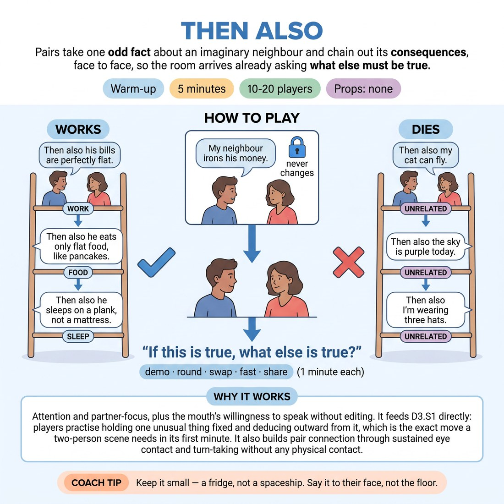

# 🔥 Warm-up cluster — Then Also

{ .infographic }

> Pairs take one odd fact about an imaginary neighbour and chain out its consequences, face to face, so the room arrives already asking what else must be true.

`Players 10–20` · `~5 min` · `Complexity 2/5` · `Energy medium` · `Contact none` · `Props: none`

⬅️ [Back to the Week 01 run-sheet](../week-01.md)

## Why this activity, here

First block of the first session in the Engine. Before anyone plays a scene, the room practises the move that carries the whole term: take one thing as given, then follow it. It feeds the cue "If this is true, what else is true?" straight into the two-person scene work later in the session, where game identification means noticing an unusual thing and repeating its logic rather than inventing a new joke.

## What students actually learn

- That a consequence is easier to find than an invention — you don't need a new idea, you need the next one.
- That an odd fact holds more scene in it than a wild one, because you can actually reason from it.
- That agreement is a mechanical act: keep the first thing fixed and let everything else bend around it.

## Setup

No chairs, no props. Clear enough floor for pairs to stand facing each other without backing into anyone. Have two or three small odd facts in your pocket in case a pair stalls at the start: irons his money, only buys square food, keeps the car keys in the freezer. Know the room's volume — this is conversational, not projected.

## How to run it — 5 minutes

| Min | What you do |
|---:|---|
| 1 | Call pairs, standing, facing, still. Demo three rungs with one volunteer in front of everyone: your fact, their "Then also…", your next. Stop at three. Say nothing about being funny. |
| 1 | Round one. A gives a small odd fact about an imaginary neighbour, B answers "Then also…", alternate. Call time at the minute. Side-coach small over wacky. |
| 1 | Round two. Swap openers. New fact. Same chain, but each rung lands in a different area of the neighbour's life — work, food, family, sleep. Call the areas out as prompts. |
| 2 | Round three, fast: new fact, one sentence each, no pauses, every reply starts "Then also". Call "next rung" at silent pairs. At ninety seconds, stop everyone. Hear two chains, ten seconds each. Name the pattern and move on. |

## Side-coaching script

| When | Say |
|---|---|
| During the demo, before round one | *"Small and strange. Not enormous and strange."* |
| Thirty seconds into round one | *"Consequence, not a new idea."* |
| Any pair drifting into a second unrelated fact | *"The first fact still stands. Obey it."* |
| Start of round two | *"Move it to his job. Now his kitchen."* |
| Round three, at the start | *"One sentence. Don't improve it."* |
| Any pair that goes quiet in round three | *"Next rung."* |
| Ten seconds before you stop round three | *"Last rung — make it the biggest one."* |
| Just after you stop, before the harvest | *"Notice you never argued with the fact."* |

!!! success "What good looks like"
    A steady, low hum of conversation, not laughter spikes. Pairs are still, close, looking at each other. Chains build: the ironed money leads to a wallet with creases in it, which leads to a job where he handles paper, which leads to a wife who has stopped commenting. Nobody is topping anyone. When you take two chains at the end, the room recognises the shape immediately without you over-explaining it.

## When it goes wrong

| You see | What's causing it | The fix |
|---|---|---|
| Opening facts that are cartoons — "my neighbour is a wizard who lives in a volcano" | People think odd means big, and big facts have no ordinary life around them to disturb. | Interrupt once, take a wild fact and shrink it out loud: "Your neighbour keeps one shoe in the fridge." Then restart that pair. One correction is enough for the room. |
| Pairs abandoning the first fact and each adding unconnected weirdness | They are treating this as a list game, not a chain. | Call "the first fact still stands" to the whole room, then ask one loud pair to say their opening fact again before continuing. |
| Long pauses, faces going up and to the left, apologising for being slow | They are searching for a clever consequence instead of an obvious one. | Call "next rung" directly at the pair. Then tell the room the dull consequence is the correct one. Speed is doing the teaching in round three. |
| Volume climbing until nobody can hear their partner | Standing pairs in an open room drift into performing outward. | Stop, drop your own voice to half, and have everyone take one step closer to their partner. Restart from the current rung. |

## Scaling

| Class size | What changes |
|---|---|
| **10–13** | Straight pairs, one trio if odd. Run all three rounds as written. Harvest three chains at the end instead of two — you have the room. |
| **14–17** | Straight pairs. Keep the harvest to two chains and cut round two to forty-five seconds if the pairing took longer than expected. Move between clusters rather than around the edge. |
| **18–20** | Pairs only, no trios — pull one person in with you as your partner if the number is odd. Round three is where noise bites: split the room into two halves down the middle and stand between them so you can hear both. Harvest two chains, ten seconds each, hard stop. |

## Variations

**Given fact** — You supply the opening fact to the whole room. Everyone chains from the same one. Change the fact for each round.  
*Easier — removes the invention step entirely, so nobody stalls before they start, and the room hears how differently the same fact resolves.*

**No repeats** — Round three only: a consequence cannot touch a life area already used in that chain. If a pair repeats an area, they restart with a new fact.  
*Harder — forces the chain outward instead of circling one detail, which is the actual failure in scenes.*

**Then also, therefore** — Alternate the connective. Odd rungs start "Then also", even rungs start "Which is why", pointing backwards to explain a rung already said.  
*Different emphasis — shifts from forward consequence to retroactive justification, which is the other half of game identification.*

## Debrief

1. **Which was easier to build on — the small facts or the big ones?**
   > *A good answer sounds like:* Someone says the small one, because there was still a normal life around it to disturb. If you get "the big ones were funnier but we got stuck", that's the answer too — move on.

2. **What did you do when you couldn't think of a consequence?**
   > *A good answer sounds like:* "I said something obvious and it was fine." Or "I looked at what we'd already said and went one step further." Not "I panicked and changed the subject" — if you hear that, name it as normal and move on.

3. **Where does this go in a scene?**
   > *A good answer sounds like:* Something like: notice the odd thing, don't fix it, ask what else it makes true. If someone says "so the first unusual thing becomes the rule", you're done — go straight into the next block.

!!! warning "Safety & inclusion"
    No contact and no touching. Pairs stand facing at a distance they choose — say so when you call pairs. Anyone who prefers to sit can sit while their partner stands. Nobody has to invent an opening fact; if someone would rather only answer, tell their partner to open every round, and offer facts from your pocket. Voices stay conversational, which keeps it usable for anyone uncomfortable with performing volume in week one. The imaginary neighbour is a stranger, not a real person — redirect quickly if a pair starts on someone they actually know.

## Why it works

Game identification depends on treating an unusual detail as a premise rather than a punchline. The forced connective "Then also" removes the choice: you cannot contradict, question or top the fact, because the only grammatical move available is a consequence of it. Speed in round three removes the second escape route — with no time to search for a clever reply, players take the obvious one, and the obvious one is what a chain actually needs. By the time you name the pattern, the room has already produced twenty examples of the cue working, so "If this is true, what else is true?" lands as a description of something they did, not as advice.

[Open the full activity card »](../../library/warmups/WU__then-also.md){target=_blank rel=noopener}
