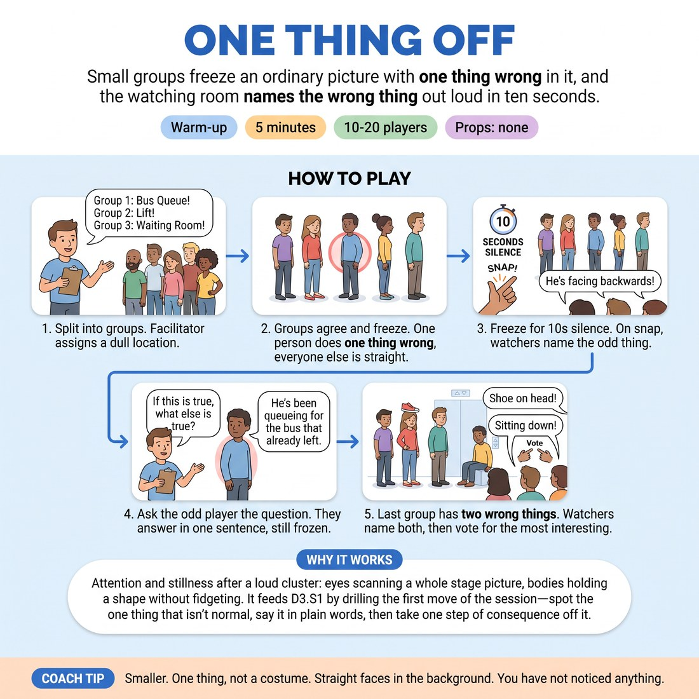

# 🔥 Warm-up cluster — One Thing Off

{ .infographic }

> Small groups freeze an ordinary picture with one thing wrong in it, and the watching room names the wrong thing out loud in ten seconds.

`Players 10–20` · `~5 min` · `Complexity 2/5` · `Energy low` · `Contact none` · `Props: none`

⬅️ [Back to the Week 01 run-sheet](../week-01.md)

## Why this activity, here

First block of the first week back. The session teaches game identification, and game identification starts with noticing the one thing that differs from normal. This puts that noticing in the body and in the room's mouth before anyone has to build a scene around it. It feeds directly into the two-person scene work later, where the cue 'if this is true, what else is true?' becomes the engine of the second beat.

## What students actually learn

- They notice they already agree. The room names the odd thing in unison, which shows them that the unusual is obvious, not something they have to invent cleverly.
- They feel the difference between one thing off and everything off — and see that the straight players are what make the odd one readable.
- They get one rep of the session cue with no scene pressure: name the truth, extend it one sentence, stop.

## Setup

Clear a playing end. Chairs pushed back or in a loose arc facing it. No props needed. Have four to six dull locations ready in your head. Know which door you are calling 'the door' so the odd-player rule is unambiguous.

## How to run it — 5 minutes

| Min | What you do |
|---:|---|
| 1 | Split into groups of four or five. Give each a location aloud. State the rule: agree a picture, freeze in it, person nearest the door does one small thing wrong, everyone else plays it dead straight. Send group one up. |
| 1 | Groups huddle and agree pictures. Keep it fast. Cut anyone still negotiating at thirty seconds — the picture does not need to be good. |
| 2 | Run groups back to back. Freeze, ten seconds of silence, snap, watchers name the odd thing, ask the odd player the cue question, one sentence, release. Roughly forty-five seconds each. |
| 1 | Last group: two things wrong. Watchers name both, then vote by show of hands which is more interesting to watch. Take the count, say nothing about it, hand over to the next block. |

## Side-coaching script

| When | Say |
|---|---|
| Groups are huddling and starting to plan a story | *"A picture, not a plot. Stand still."* |
| A picture goes up and the room starts murmuring | *"Silence. Just look."* |
| Straight players are pulling faces or reacting | *"Straight players — bored. Completely bored."* |
| Just before the snap | *"Short phrase. All together."* |
| The watchers name it hesitantly or in a question | *"Say it flat. You already know."* |
| Asking the odd player the cue question | *"If this is true, what else is true? One sentence."* |
| The odd player starts explaining or justifying | *"One sentence. Then hold."* |
| The two-wrong picture is up | *"Both. Name both."* |

!!! success "What good looks like"
    Pictures go up in seconds and hold still. The ten seconds of silence feels slightly long and nobody fills it. When you snap, most of the room says roughly the same short phrase at the same time. The odd player's sentence is a plain consequence, not a punchline — 'so nobody in this queue has spoken since Tuesday.' You get through every group and finish on time.

## When it goes wrong

| You see | What's causing it | The fix |
|---|---|---|
| Groups make three or four things wrong and the picture reads as chaos. | They think odd equals funny, so they stack oddities. | Stop the picture. Point at each wrong thing and ask the group to drop all but one. Restate: the straight players are the joke's frame. |
| The room's answers scatter — five different phrases, none confident. | The odd thing is too subtle, or the straight players are also doing something. | Ask the odd player to make it bigger by half and re-freeze for five seconds. Tell straight players to do less than they think. |
| The odd player answers the cue question with a joke and the room laughs. | Habit. They are performing rather than extending. | Take the answer, then ask once more: 'and what else is true?' Accept the flatter second answer. Move on without comment. |
| You run out of time with two groups unplayed. | Huddles ran long or you let commentary in between pictures. | Run the last two simultaneously at opposite ends of the playing area. Watchers name both odd things. Drop the cue question for those groups. |

## Scaling

| Class size | What changes |
|---|---|
| **10–13** | Three groups of four. Fifty seconds per picture, so the middle block breathes. Run the two-wrong rule on the third group as written. |
| **14–17** | Four groups of four. Forty seconds per picture in the middle block. Keep huddle time to thirty seconds — call it hard. |
| **18–20** | Five groups of four. Skip the cue question for groups two and three; keep it for one, four and five. Huddles get twenty-five seconds. Cut the vote at the end to a single show of hands, no discussion. |

## Variations

**Named location, named oddity** — You call both the location and the one thing wrong. The group only has to arrange themselves.  
*Easier — removes all negotiation, useful with a very new or very quiet room.*

**Silent watchers** — Watchers write the odd thing on a slip instead of calling it. Read three aloud after the release.  
*Harder — no chorus to hide in, and mismatches between slips become visible data about clarity.*

**Second frame** — After the odd player answers the cue, the whole group takes one step into a second picture ten minutes later, still frozen.  
*Different emphasis — shifts from spotting the unusual to extending it through time, which is where game actually lives.*

## Debrief

1. **When the room named it together — how did you know?**
   > *A good answer sounds like:* Something about everything else being ordinary. They point at the frame rather than the oddity: 'because the other four were doing nothing.' Move on as soon as someone says that.

2. **What happened to the pictures where two things were wrong?**
   > *A good answer sounds like:* They report having to choose, or say attention split. Someone notes that one oddity got clearer once they ignored the other. Do not push for a rule about it.

!!! warning "Safety & inclusion"
    No contact is required. Pictures are shoulder-to-shoulder at most — say so before the first group goes up. Anyone who does not want to stand can play their part in the picture seated; put a chair at the playing end before you start so it is not a special request. Nobody is made the odd player against their will: if the person nearest the door does not want it, the next person along takes it, no discussion. The 'wrong thing' is behaviour, never a comment on anyone's body or appearance — say that once at the top and enforce it immediately if it slips.

## Why it works

Game identification depends on a shared baseline. Until a group agrees what normal looks like, nobody can say what deviates from it. This activity builds the baseline physically — four still, ordinary bodies — and then places exactly one deviation inside it, so the deviation is the only thing available to notice. The ten seconds of silence forces the room to look rather than react, and the unison call is evidence: everyone saw the same thing, so the unusual thing is not a matter of taste. The cue question then does the second half of the job. Naming the oddity is only half of game; the other half is treating it as true and following it. Asking for one sentence, while still frozen, trains the extension without letting it become a scene.

[Open the full activity card »](../../library/warmups/WU__one-thing-off.md){target=_blank rel=noopener}
