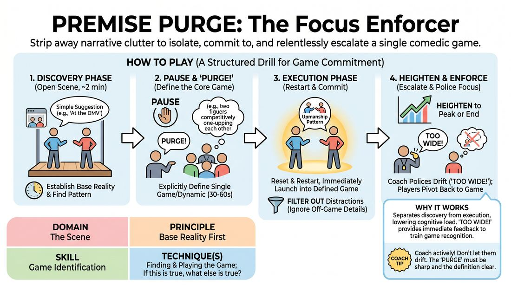

# 🎲 Drill A — isolation — Premise Purge

{ .infographic }

> Strip away narrative clutter to isolate, commit to, and relentlessly escalate a single comedic game.

`Players 2–99` · `~25 min` · `Complexity 3/5` · `Energy medium` · `Contact none` · `Props: none`

⬅️ [Back to the Week 01 run-sheet](../week-01.md)

## Why this activity, here

Week 1 opens the Engine module by re-contracting how the room works, then narrowing to the two-person scene. This is the first drill of the day and it isolates one thing: spotting the unusual pattern and playing only that. It comes before any full scene work, so students meet the cue 'If this is true, what else is true?' in a protected frame where the scene is allowed to be restarted. It feeds Drill B and the longer two-person scenes later in the session, where nobody will call 'PURGE!' for them.

## What students actually learn

- They stop hearing a scene as a story and start hearing it as a pattern with a first instance.
- They find out how little base reality a scene actually needs before the game can start.
- They discover that cutting material is a choice available to them mid-scene, not a failure.
- They learn that heightening is repetition with escalating consequence, not louder volume.

## Setup

Clear a playing area with two chairs available but not compulsory. Seat everyone else in a horseshoe facing it, close enough that side-coaching carries without shouting. Have six or seven plain locations ready in your head — no professions, no relationships, no conflicts. You need a watch or phone timer you can see. No props, no music, no handouts.

## How to run it — 25 minutes

| Min | What you do |
|---:|---|
| 3 | Frame the drill standing in the playing space. Explain the two runs, the word 'PURGE!' and the word 'TOO WIDE!'. Say plainly that the first run is allowed to be shapeless — that is its job. Take no questions beyond one. |
| 6 | Run the full cycle with your first pair as the demonstration: two minutes discovery, purge and name, then the second run. Narrate your own thinking briefly when you call the purge, so the room hears what you noticed. |
| 5 | Second pair. Full cycle. Say nothing about your reasoning this time — ask the watchers, in one line each, what pattern they saw before you name it with the players. |
| 5 | Third pair. Full cycle. Tighten the discovery phase to ninety seconds. Use 'TOO WIDE!' at least once in the second run even if the drift is small. |
| 4 | Fourth pair. Ninety-second discovery, thirty-second naming, ninety-second second run. Keep it brisk. Cut the second run the moment the game peaks. |
| 2 | Close the drill on your feet. Ask the two debrief questions, take three answers total, then move straight into the next block. Do not let this become a discussion. |

## Side-coaching script

| When | Say |
|---|---|
| Ten seconds into a first run, when players start inventing plot | *"Just be somewhere. Do something ordinary."* |
| When one player does something odd and the other ignores it | *"Notice that. Say what you saw."* |
| The moment a pattern repeats or a dynamic is unmistakable | *"PURGE!"* |
| During the naming discussion, when the answer is vague | *"One sentence. Who does what, and how does the other treat it?"* |
| At the top of the second run | *"Where you are, in two lines. Then straight in."* |
| Second run, when they add an unrelated problem or a new character | *"TOO WIDE! Next line, back to it."* |
| Second run, when the game is repeating but not growing | *"If this is true, what else is true?"* |
| When the game has clearly peaked | *"That's the top. Stop there."* |

!!! success "What good looks like"
    The first run is unremarkable and a little slow, and nobody minds. When you call 'PURGE!' at least half the watchers nod — they saw the same thing. The naming takes one sentence and both players agree with it. The second run is noticeably shorter, cleaner and funnier than the first, with a clear third and fourth instance of the same behaviour, each costing more than the last. Players cut their own good material from run one without being told. When you call 'TOO WIDE!' the pivot happens on the very next line and the scene does not stumble.

## When it goes wrong

| You see | What's causing it | The fix |
|---|---|---|
| Two minutes pass and there is nothing to purge — the players have talked about a holiday, a boss and a neighbour, all offstage. | They are generating story instead of behaviour. Nothing has been done in the room, so no pattern can repeat. | Call the purge anyway. Name the most repeatable thing that did happen, even a verbal tic. Before the next pair, tell everyone: talk about what is in front of you, not what happened yesterday. |
| The named game is a description of a person — 'he's a weirdo', 'she's uptight'. | They have identified a character, not a pattern. Characters cannot be heightened; behaviours can. | Rephrase it yourself as a verb and a response: 'every time you touch something you apologise to it, and she takes that completely seriously.' Then run it. |
| The second run is louder and faster but the same size — the third instance is no bigger than the first. | They are repeating the game rather than escalating its consequences. | Side-coach 'if this is true, what else is true?' and, if needed, freeze and ask one player what this behaviour would cost them in an hour. |
| The player whose behaviour became the game looks embarrassed; the watchers laugh at them rather than at the scene. | The naming landed as a note about them personally rather than about a choice the scene made. | Name games in the second person plural — 'the game you two found'. Credit the partner's reaction as half the game. Move the next round on quickly. |

## Scaling

| Class size | What changes |
|---|---|
| **10–13** | One playing area, everyone watching. Four cycles as timed, five if a pair finishes early. Everybody gets up in the first two drills of the session even if not in this one — say so, so nobody waits anxiously. |
| **14–17** | Run the demonstration cycle yourself, then split into two groups of seven or eight in opposite corners. Each group nominates a caller who owns 'PURGE!' and 'TOO WIDE!'. Two cycles per group in the remaining sixteen minutes. Rotate the caller. You move between corners and call over the top when a group is stuck. |
| **18–20** | Demonstration cycle with the whole room, then three groups of six or seven. Each group runs two cycles with a rotating caller: ninety-second discovery, thirty-second naming, ninety-second second run. Do not attempt a fourth pair centrally — you will run out of clock. Reserve the final two minutes for the whole-room close. |

## Variations

**Named in advance** — Before the first run, hand the pair a written pattern on a slip — 'one of you keeps offering the other food they clearly don't want'. Skip the discovery phase and run only the second-run rules.  
*Easier. Removes identification and drills commitment and heightening alone. Use it if the first two pairs both produce nothing purgeable.*

**Silent purge** — Call 'PURGE!' but hold the naming discussion. Instead, each player writes their one-sentence version of the game on paper, folds it, and they run the second scene without comparing. Read both out afterwards.  
*Harder. Exposes whether the pair are actually seeing the same pattern or two different ones, which is where most two-person scenes die.*

**Watchers call it** — The pair stay silent during the naming. Three watchers each offer a one-sentence game. The pair pick one and run it, even if it wasn't the one they had in mind.  
*Different emphasis. Shifts the work to the audience's eye and teaches players to accept a read of their own scene they didn't choose.*

## Debrief

1. **What did you cut from the first run, and did it hurt?**
   > *A good answer sounds like:* A specific thing named — a relationship, a joke, a whole subplot — followed by an admission that the scene got better without it. If they can't name anything cut, they ran the same scene twice.

2. **When did you know what the game was — before I called 'PURGE!' or after?**
   > *A good answer sounds like:* Someone says they felt it a line or two before you called it, or that they only saw it once you said it out loud. Both are useful. Move on once two people have answered honestly rather than diplomatically.

3. **What was the difference between repeating the game and heightening it?**
   > *A good answer sounds like:* They point to consequence or stakes — the same behaviour costing more, spreading further, or being taken more seriously — rather than to volume, speed or bigger jokes.

!!! warning "Safety & inclusion"
    No contact is required. If a pair drift into touching, remind them to play the game at a distance. Anyone can decline a turn onstage with no explanation; watching is full participation in this drill and say so at the top. Do not let a game be built on a player's real accent, body, faith or background — if it happens, name a different pattern from the same scene and move on without a lecture. Chairs are available for anyone who wants to play seated. Keep locations neutral: no hospitals-with-bad-news, no funerals, in week one.

## Why it works

Game identification fails because players are asked to notice a pattern and heighten it in the same breath, while also inventing a story. The purge separates those jobs in time. The first run is allowed to be ordinary, which lowers the cost of behaving oddly. The freeze converts an accident into an object the pair can look at and name. The reset then makes the game a decision rather than a discovery — and because the location is already known, the second run has nothing to do except ask 'if this is true, what else is true?' The 'TOO WIDE!' call gives players live evidence that widening a scene is what dilutes it, which is faster than being told.

[Open the full activity card »](../../../../games/D3_P2_S1_T1_G329__premise-purge-the-focus-enforcer.md){target=_blank rel=noopener}
