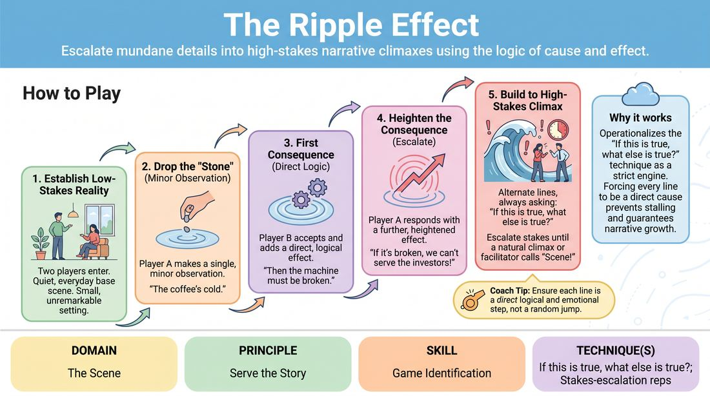

# 🎲 Drill B — under load — The Ripple Effect

{ .infographic }

> Escalate mundane details into high-stakes narrative climaxes using the logic of cause and effect.

`Players 2–99` · `~25 min` · `Complexity 3/5` · `Energy medium` · `Contact none` · `Props: none`

⬅️ [Back to the Week 01 run-sheet](../week-01.md)

## Why this activity, here

The block before this re-contracts the room and puts two people in a scene with no pressure to be clever. This drill adds load: the scene must now have a spine. It isolates one half of game identification — following a pattern's logic — before the session's final block asks players to spot the unusual thing and play it deliberately. It feeds directly into next week's work on second beats.

## What students actually learn

- They stop treating heightening as shouting louder and start treating it as consequence.
- They notice that the scene's material is already on stage, in the last line spoken.
- They get comfortable with a scene that gets serious rather than sillier.
- They hear what a link sounds like when it breaks, and can name the missing step.

## Setup

Clear floor with a playing area at one end, chairs pushed back. Two chairs available in the space for scenes that want them. No props, no music. You need a timer you can see. Have three or four ordinary locations in your head to hand out if a pair stalls: launderette, dentist waiting room, car park, kitchen at 7am. Nobody needs paper.

## How to run it — 25 minutes

| Min | What you do |
|---:|---|
| 3 | Frame it in two sentences: small fact, then consequences, one link at a time. Pull one volunteer and demo six lines with them. Stop the demo mid-climb and name what you just did. |
| 4 | Whole room in a circle, seated or standing. You give one mundane fact. Go round, one consequence each, no repeats. Do two laps. Cut anyone who leaps to disaster and hand them back the previous line. |
| 5 | Pair everyone off. All pairs play at once, on their feet, in their own patch of floor. A initiates. Run one continuous scene. Side-coach across the room; do not stop the whole exercise for one pair. |
| 4 | Swap initiator. B opens this time, with a different location. Same rules. Coach for stakes landing on the people in the scene rather than on the world outside it. |
| 5 | Bring the room into an audience. Three pairs play in front, roughly ninety seconds each. Call "Scene!" on the climb. After each, ask the watchers to name the line where the stakes turned personal. |
| 4 | Debrief seated. Two or three questions, no more. Land the cue phrase out loud before you move on to the next block. |

## Side-coaching script

| When | Say |
|---|---|
| During the circle lap, when someone jumps to death or disaster | *"Too far. Give me the step before that."* |
| Early in the paired scenes | *"Because of that — keep going."* |
| When a pair is generating facts nobody cares about | *"Who does that hurt? Name them."* |
| When a player introduces unrelated new material | *"Use the last line. Nothing else exists."* |
| Mid-climb, when energy rises but content thins | *"Slower. Bigger stakes, same volume."* |
| When a pair has clearly hit the top | *"That's the top. Play the consequence and stop."* |
| Showcase scenes, when players start explaining the chain to the audience | *"Talk to each other, not to us."* |
| Any scene that has stalled for five seconds | *"Repeat their last line, then answer it."* |

!!! success "What good looks like"
    A pair starts with a chipped mug and ends, eight lines later, with one of them admitting they've been lying for a year — and the room can trace every step backwards. Voices stay conversational. The escalation is in what's at stake, not in the volume. Both players look slightly surprised by where they arrived, and neither of them planned it.

## When it goes wrong

| You see | What's causing it | The fix |
|---|---|---|
| Line two is already a house fire, a divorce or a nuclear alert. | Players hear "escalate" as "be dramatic immediately" and skip the middle of the ladder. | Stop them. Give the previous line back and ask for the smallest true consequence. Cap the first three lines at domestic scale. |
| A tidy chain of facts with no feeling — logistics, weather, timetables. | Players are solving a puzzle rather than playing people. | Side-coach "who does that hurt?" after every second line. Make one of them name a person by name. |
| One player quietly reverses the other: "No, it's fine actually." | Discomfort with rising stakes; instinct to make the scene safe again. | Name it in the room without shaming. Rerun four lines with a standing rule: every line begins by agreeing the last one. |
| Pairs keep returning to the original observation instead of the previous line. | They're treating the first fact as the topic of the scene. | Call "link to the last line only". Run one circle lap where each person must repeat the previous line aloud before adding theirs. |

## Scaling

| Class size | What changes |
|---|---|
| **10–13** | Five or six simultaneous pairs. One circle for the warm lap, two full laps. Showcase three pairs at ninety seconds. Everyone gets seen if you want them to. |
| **14–17** | Seven or eight pairs. Split the warm lap into two circles run side by side so nobody waits more than a minute for their turn. Showcase three pairs; note aloud that others go up next block. |
| **18–20** | Nine or ten pairs; check floor space and let two pairs sit for their scenes if it's tight. Two circles for the warm lap, one lap each. Showcase three pairs at eighty seconds and hold the timer strictly. One trio is fine if numbers are odd — they rotate who speaks. |

## Variations

**Consequence ladder, seated** — Pairs sit facing each other and speak only. No movement, no character voices. Six lines, then stop and count the links aloud together.  
*Easier — strips out staging and lets nervous players hear the logic without performing.*

**No adjectives** — Ban intensifiers. No "terrible", "huge", "the worst". Stakes must rise through what happens, not how it's described.  
*Harder — removes the shortcut and forces genuine escalation of event.*

**Backwards ripple** — Give the pair a high-stakes final line. They work backwards, each offer being the cause of the line just spoken, until they reach something mundane.  
*Different emphasis — trains causal reasoning in reverse and shows how much unremarkable ground sits under a big moment.*

## Debrief

1. **In the scenes you watched, which line was the one where it stopped being small?**
   > *A good answer sounds like:* They quote an actual line and can say what changed — usually the moment a consequence landed on a named person rather than on an object or a situation.

2. **What did you do when you couldn't think of a consequence?**
   > *A good answer sounds like:* Honest answers: "I invented something new and it broke." Or "I repeated their line in my head and something came." Both are useful. Move on once someone names re-reading the partner's line as the way out.

3. **How is this different from just making things worse?**
   > *A good answer sounds like:* Someone distinguishes escalation from randomness — the next thing has to be caused by the last thing, so the audience stays with it. If you get "it has to be earned", that'll do.

!!! warning "Safety & inclusion"
    No physical contact is required or expected in this drill; keep hands off partners entirely. If a pair wants contact for a moment of the scene, they ask first and either can decline without discussion. Scenes will drift towards personal stakes — illness, money, betrayal. Say up front that players choose their own material and can steer away from anything they don't want to play; "let's take that somewhere else" is a legitimate move mid-scene, not a failure. Anyone can sit out the showcase and watch instead. Offer seated scenes to anyone who prefers not to stand for five minutes.

## Why it works

Game identification (D3.S1) depends on players noticing that the material for the scene is already present rather than needing to be invented. This drill removes the option of inventing. The only legal move is a consequence of the line just spoken, so attention is forced backwards onto the partner's offer. The cue — if this is true, what else is true? — becomes the mechanical rule of the exercise rather than a note. Because consequences compound, stakes rise without anyone deciding to raise them, and players feel escalation as an outcome of logic rather than a performance choice. That felt difference is what carries into scene work: the pattern is found, not imposed.

[Open the full activity card »](../../../../games/D3_P4_S1_T2_G537__the-ripple-effect.md){target=_blank rel=noopener}
