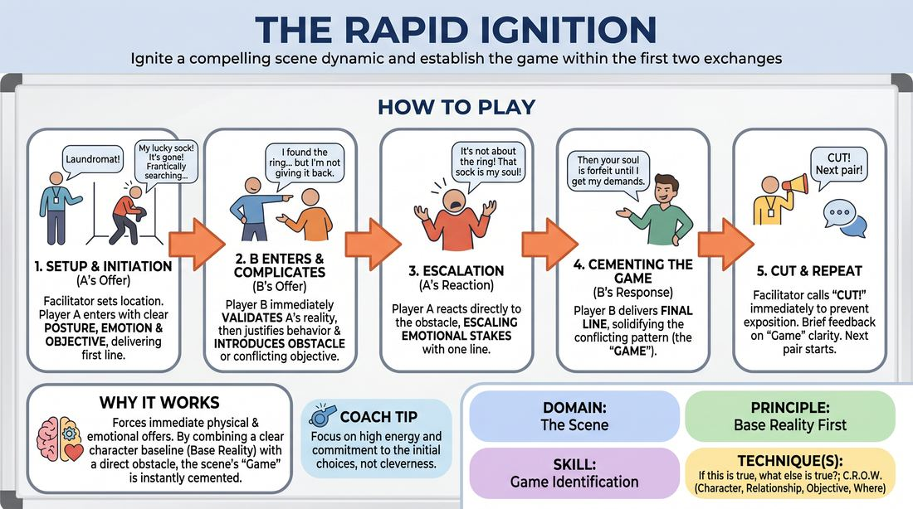

# 🎯 Scene Lab — The Instant Spark

{ .infographic }

> Ignite a compelling scene dynamic and establish the game within the first two exchanges.

`Players 2–99` · `~35 min` · `Complexity 3/5` · `Energy medium` · `Contact none` · `Props: none`

⬅️ [Back to the Week 01 run-sheet](../week-01.md)

## Why this activity, here

It follows the re-contract and the warm-up, and it is the first time this term the group stands in a two-person scene. It strips the scene down to four lines so nobody can hide in preamble. Everything later this session — the longer two-hander, the heightening work — assumes the pair already knows what the scene is about by line four. This is where that assumption gets built.

## What students actually learn

- They stop treating the opening of a scene as admin. They arrive already wanting something.
- They hear the difference between adding information and adding pressure. An obstacle that accepts is not the same as a contradiction.
- They can point at a pattern between two people and say it in a sentence, out loud, without hedging.
- They lose the fear of the first line. Four lines is survivable, so they stop rehearsing in their head before stepping out.

## Setup

Clear a playing area about three metres wide with a clear entrance side. Seat everyone in a shallow arc facing it. Two chairs at the edge for the pair on deck. You need nothing else — no props, no music. Have a short list of plain locations in your pocket in case the room dries up. Pair people off before you start and tell each pair who is A and who is B, so no time is lost negotiating between scenes.

## How to run it — 35 minutes

| Min | What you do |
|---:|---|
| 4 | Lay out the shape: four lines, then Cut. Say what each line must carry. Demo it yourself with one volunteer, badly first, then properly, so they see the difference. |
| 5 | Run the first three or four pairs. Take a location from the room each time. Call Cut hard on line four. One sentence of feedback each, then move on. |
| 6 | Keep going through the remaining pairs in this pass. Speed up your feedback. Push A's openings towards a want that is urgent, not a mood. |
| 5 | Stop. Replay one scene from earlier, same four lines. Ask the room: if this is true, what else is true? Collect three answers. That is the game. |
| 6 | Second pass. Swap roles within each pair — B opens now. New locations. Add one rule: no questions anywhere in the four lines. |
| 5 | Finish the second pass. After each Cut, the pair themselves names the game in one sentence before they sit down. |
| 4 | Debrief seated. Two questions, short answers, no war stories. Land it on what they carry into the next block. |

## Side-coaching script

| When | Say |
|---|---|
| A steps out and hesitates at the edge | *"Already doing it. Walk in mid-task."* |
| A's opening line states a feeling but no want | *"What do you want in the next ten seconds? Say that."* |
| B enters and asks what A is doing | *"You already know. Tell them."* |
| B contradicts A's reality instead of blocking their want | *"Accept the world. Block the want."* |
| The fourth line has landed | *"Cut. Sit down."* |
| A pair drifts into explaining backstory | *"Cut. Too late — you were talking about the scene, not in it."* |
| During the second pass, before a pair steps out | *"Same clash, twice. That's all you need."* |
| A pair nails it and the room laughs | *"Name it. What was the pattern?"* |

!!! success "What good looks like"
    Someone walks in already halfway through an action and says one line you could repeat back afterwards. The second person accepts it and immediately makes it harder. By line four the room could tell you, in one sentence, what these two people keep doing to each other. Scenes last twenty to thirty seconds. There is a small pile-up of people wanting to go next.

## When it goes wrong

| You see | What's causing it | The fix |
|---|---|---|
| B walks in and says "Hey, what's going on here?" | B is buying thinking time by making A do the work twice. | Ban questions outright from the second pass onwards. Tell B their first word must be a statement about what they can see. |
| A opens with a posture and a mood but the scene has nowhere to go | No objective. A is performing a state, not chasing something. | Stop them and restart with one instruction: finish the sentence "I have to ___ before ___." Then play that. |
| Scenes run to eight or ten lines and get chatty | You are calling Cut a beat late, and they are enjoying themselves. | Count the lines on your fingers where they can see. Call Cut over the top of the fourth line, not after it. |
| B's obstacle wipes out A's reality — "actually we're not in a launderette" | Confusing conflict with contradiction. | Say it plainly: keep every fact, take away the thing they want. Replay the same scene immediately with that one change. |

## Scaling

| Class size | What changes |
|---|---|
| **10–13** | One playing area. Five or six pairs. Everyone plays A once and B once across the two passes, with room for a 30-second note after each scene. |
| **14–17** | One playing area, seven or eight pairs. Cut your feedback to one sentence for every scene and skip it entirely on alternate scenes — the pair names their own game instead. Both passes still fit. |
| **18–20** | unused halareas.hals at the the of theroom. of the room.anks of the room.ches.the ches. thees.the rooms.the halfmats.the ches.of the room.the halves of the room.of the room.into two halves.two halves.split.the split.ches. Appoint a caller in each half who says Cut on line four; you circulate between them and give feedback on every third scene. One pass only, but each person plays A in their half and B in the other.ves.two ends. Appoint a caller in each half who says Cut on line four; you circulate and give feedback on every third scene.itr.the it.of the it.of thes.the its. Everyone still plays once as A and once as B.two two halves.the halves.ha.two halves. Appoint a caller in each who says Cut on line four; you circulate, giving feedback on every third scene. Everyone plays A once and B once.into two halves at opposite ends of the room. Appoint a caller in each who says Cut on line four. You circulate and give feedback on every third scene. Everyone plays A once and B once.into two halves at opposite ends of the room, each with its own caller who says Cut on line four. Circulate between them. Feedback on every third scene. Everyone plays A once and B once..at opposite ends of the room, each with a caller who says Cut on line four. Circulate. Feedback on every third scene. Everyone plays A once and B once.at opposite ends of the room. Each half appoints a caller who says Cut on line four. Circulate between them and give feedback on every third scene. Everyone plays A once and B once., opopposite ends of the room, each with a nominated caller who says Cut on line four. Circulate. Give feedback on every third scene. Everyone plays A once and B once.the room into two halves at opposite ends, each with a nominated caller who says Cut on line four. Circulate between them. Give feedback on every third scene. Everyone plays A once and B once.the room into two halves at opposite ends, each with a nominated caller who says Cut on line four. Circulate between them, giving feedback on every third scene. Everyone plays A once and B once.the room into two halves at opposite ends, each with a nominated caller who says Cut on line four. Circulate between them, giving feedback on every third scene. Everyone plays A once and B once.the room into two halves at opposite ends, each with a nominated caller who says Cut on line four. Circulate between them, giving feedback on every third scene. Everyone plays A once and B once.the room into two halves at opposite ends, each with a nominated caller who says Cut on line four. Circulate between them, giving feedback on every third scene. Everyone plays A once and B once.the room into two halves at opposite ends, each with a nominated caller who says Cut on line four. Circulate between them, giving feedback on every third scene. Everyone plays A once and B once.the room into two halves at opposite ends, each with a nominated caller who says Cut on line four. Circulate between them, giving feedback on every third scene. Everyone plays A once and B once.the room into two halves at opposite ends, each with a nominated caller who says Cut on line four. Circulate between them, giving feedback on every third scene. Everyone plays A once and B once.the room into two halves at opposite ends, each with a nominated caller who says Cut on line four. Circulate between them, giving feedback on every third scene. Everyone plays A once and B once.the room into two halves at opposite ends, each with a nominated caller who says Cut on line four. Circulate between them, giving feedback on every third scene. Everyone plays A once and B once.the room into two halves at opposite ends, each with a nominated caller who says Cut on line four. Circulate between them, giving feedback on every third scene. Everyone plays A once and B once.the room into two halves at opposite ends, each with a nominated caller who says Cut on line four. Circulate between them, giving feedback on every third scene. Everyone plays A once and B once.the room into two halves at opposite ends, each with a nominated caller who says Cut on line four. Circulate between them, giving feedback on every third scene. Everyone plays A once and B once.the room into two halves at opposite ends, each with a nominated caller who says Cut on line four. Circulate between them, giving feedback on every third scene. Everyone plays A once and B once.the room into two halves at opposite ends, each with a nominated caller who says Cut on line four. Circulate between them, giving feedback on every third scene. Everyone plays A once and B once.the room into two halves at opposite ends, each with a nominated caller who says Cut on line four. Circulate between them, giving feedback on every third scene. Everyone plays A once and B once.the room into two halves at opposite ends, each with a nominated caller who says Cut on line four. Circulate between them, giving feedback on every third scene. Everyone plays A once and B once.the room into two halves at opposite ends, each with a nominated caller who says Cut on line four. Circulate between them, giving feedback on every third scene. Everyone plays A once and B once.the room into two halves at opposite ends, each with a nominated caller who says Cut on line four. Circulate between them, giving feedback on every third scene. Everyone plays A once and B once.the room into two halves at opposite ends, each with a nominated caller who says Cut on line four. Circulate between them, giving feedback on every third scene. Everyone plays A once and B once.the room into two halves at opposite ends, each with a nominated caller who says Cut on line four. Circulate between them, giving feedback on every third scene. Everyone plays A once and B once.the room into two halves at opposite ends, each with a nominated caller who says Cut on line four. Circulate between them, giving feedback on every third scene. Everyone plays A once and B once.the room into two halves at opposite ends, each with a nominated caller who says Cut on line four. Circulate between them, giving feedback on every third scene. Everyone plays A once and B once.the room into two halves at opposite ends, each with a nominated caller who says Cut on line four. Circulate between them, giving feedback on every third scene. Everyone plays A once and B once.the room into two halves at opposite ends, each with a nominated caller who says Cut on line four. Circulate between them, giving feedback on every third scene. Everyone plays A once and B once.the room into two halves at opposite ends, each with a nominated caller who says Cut on line four. Circulate between them, giving feedback on every third scene. Everyone plays A once and B once.the room into two halves at opposite ends, each with a nominated caller who says Cut on line four. Circulate between them, giving feedback on every third scene. Everyone plays A once and B once.the room into two halves at opposite ends, each with a nominated caller who says Cut on line four. Circulate between them, giving feedback on every third scene. Everyone plays A once and B once.the room into two halves at opposite ends, each with a nominated caller who says Cut on line four. Circulate between them, giving feedback on every third scene. Everyone plays A once and B once.the room into two halves at opposite ends, each with a nominated caller who says Cut on line four. Circulate between them, giving feedback on every third scene. Everyone plays A once and B once.the room into two halves at opposite ends, each with a nominated caller who says Cut on line four. Circulate between them, giving feedback on every third scene. Everyone plays A once and B once.the room into two halves at opposite ends, each with a nominated caller who says Cut on line four. Circulate between them, giving feedback on every third scene. Everyone plays A once and B once.the room into two halves at opposite ends, each with a nominated caller who says Cut on line four. Circulate between them, giving feedback on every third scene. Everyone plays A once and B once.the room into two halves at opposite ends, each with a nominated caller who says Cut on line four. Circulate between them, giving feedback on every third scene. Everyone plays A once and B once.the room into two halves at opposite ends, each with a nominated caller who says Cut on line four. Circulate between them, giving feedback on every third scene. Everyone plays A once and B once.the room into two halves at opposite ends, each with a nominated caller who says Cut on line four. Circulate between them, giving feedback on every third scene. Everyone plays A once and B once.the room into two halves at opposite ends, each with a nominated caller who says Cut on line four. Circulate between them, giving feedback on every third scene. Everyone plays A once and B once.the room into two halves at opposite ends, each with a nominated caller who says Cut on line four. Circulate between them, giving feedback on every third scene. Everyone plays A once and B once.the room into two halves at opposite ends, each with a nominated caller who says Cut on line four. Circulate between them, giving feedback on every third scene. Everyone plays A once and B once.the room into two halves at opposite ends, each with a nominated caller who says Cut on line four. Circulate between them, giving feedback on every third scene. Everyone plays A once and B once.the room into two halves at opposite ends, each with a nominated caller who says Cut on line four. Circulate between them, giving feedback on every third scene. Everyone plays A once and B once.the room into two halves at opposite ends, each with a nominated caller who says Cut on line four. Circulate between them, giving feedback on every third scene. Everyone plays A once and B once.the room into two halves at opposite ends, each with a nominated caller who says Cut on line four. Circulate between them, giving feedback on every third scene. Everyone plays A once and B once.the room into two halves at opposite ends, each with a nominated caller who says Cut on line four. Circulate between them, giving feedback on every third scene. Everyone plays A once and B once.the room into two halves at opposite ends, each with a nominated caller who says Cut on line four. Circulate between them, giving feedback on every third scene. Everyone plays A once and B once.the room into two halves at opposite ends, each with a nominated caller who says Cut on line four. Circulate between them, giving feedback on every third scene. Everyone plays A once and B once.the room into two halves at opposite ends, each with a nominated caller who says Cut on line four. Circulate between them, giving feedback on every third scene. Everyone plays A once and B once.the room into two halves at opposite ends, each with a nominated caller who says Cut on line four. Circulate between them, giving feedback on every third scene. Everyone plays A once and B once.the room into two halves at opposite ends, each with a nominated caller who says Cut on line four. Circulate between them, giving feedback on every third scene. Everyone plays A once and B once.the room into two halves at opposite ends, each with a nominated caller who says Cut on line four. Circulate between them, giving feedback on every third scene. Everyone plays A once and B once. |

## Variations

**Accept only** — Drop the obstacle. B's line simply justifies A's behaviour and adds one detail that makes it more true. Still four lines, still Cut.  
*easier — removes the hardest ask and lets nervous groups practise arriving with a want before they practise blocking one*

**Silent open** — A's first beat is wordless: thirty seconds of physical action, no speech. B enters and speaks first, naming what they see and blocking it. Then three lines.  
*harder — forces the objective into the body and takes away the safety of explaining yourself*

**Name it from the floor** — After Cut, the watching group has ten seconds to call out the pattern in one sentence. If nobody can, the pair replays the same four lines sharper.  
*different emphasis — shifts the work from performing the game to recognising it, which is the session skill*

## Debrief

1. **When you were B, what told you what to block?**
   > *A good answer sounds like:* They point at something specific A did or said — the searching, the word "before", the urgency — rather than saying they had an idea ready. That means they were watching, not planning.

2. **Which of tonight's scenes could you describe in one sentence, and what was the sentence?**
   > *A good answer sounds like:* A clean pattern with two people in it: "he keeps apologising and she keeps charging him for it." Not a plot summary. If they narrate events, ask again.

3. **What did four lines stop you doing?**
   > *A good answer sounds like:* Some version of: there was no time to set up, explain, or be clever, so they just went. Ideally someone admits the scenes were better for it.

!!! warning "Safety & inclusion"
    No contact is required and none should be improvised into these scenes — the four-line limit is short enough that nobody needs to touch anyone. Say so before the first pair. Anyone who does not want to perform can take the caller's job, saying Cut on line four, or feed locations; both are real jobs and both count as taking part. Standing is not required — a chair in the space is fine, and A can arrive seated and already busy. Keep locations mundane; if a suggestion carries obvious weight (hospitals, funerals, police stations), take another one without comment.

## Why it works

Game identification depends on noticing a pattern early enough to repeat it. Long scenes bury the pattern under information, so students learn to look for it at line twenty, by which point they have invented three of them. Four lines removes everywhere else to look. B must accept A's reality and then squeeze it, which produces exactly one clash, and A's third line confirms whether that clash has traction. The fourth line repeats the shape. Repetition is what makes a pattern visible, so the cue — if this is true, what else is true — has something concrete to bite on. Cutting hard also breaks the habit of playing on out of politeness, which is what buries games in longer scenes later.

[Open the full activity card »](../../../../games/D3_P2_S1_T2_G590__the-rapid-ignition.md){target=_blank rel=noopener}
