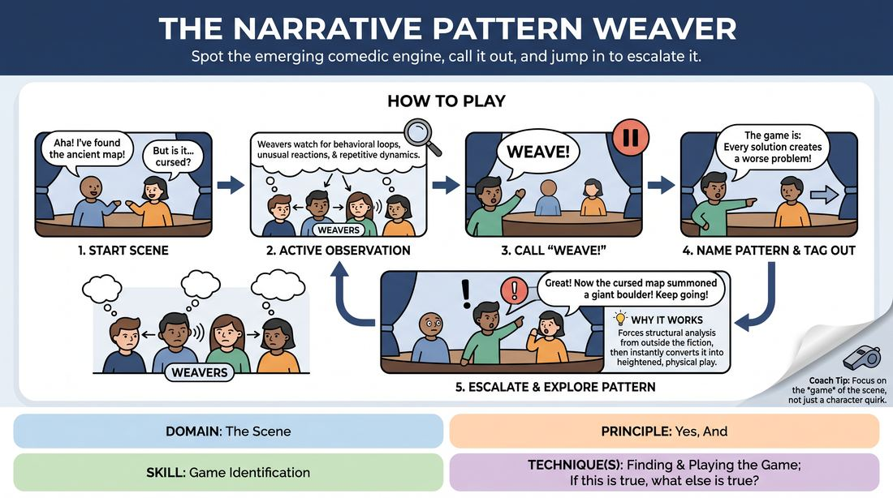

# 🏟️ Showcase round — The Pattern Weaver

{ .infographic }

> Spot the emerging comedic engine, call it out, and jump in to escalate it.

`Players 3–99` · `~30 min` · `Complexity 3/5` · `Energy medium` · `Contact none` · `Props: none`

⬅️ [Back to the Week 01 run-sheet](../week-01.md)

## Why this activity, here

Week 1 has already re-contracted the room and rebuilt the two-person scene: platform, relationship, honest reaction. This block is the showcase — the first time students are asked to look at a scene from outside and say what it is doing. It turns the session cue, "If this is true, what else is true?", from a private instinct into a public naming. It feeds every later block in The Engine, where students will be expected to find and ride the game from inside the scene without anyone freezing it for them.

## What students actually learn

- They stop hunting for the funny line and start noticing what the scene is already repeating.
- They can say what a scene is doing in one plain sentence, out loud, without hedging.
- They discover that heightening is a follow-on from a named pattern, not a leap to something wilder.
- Watching becomes active work rather than waiting for a turn.

## Setup

Clear a playing area with a wide open front. Two chairs available but not placed. Everyone else stands or sits along two sides in a shallow V so all Weavers can see faces, not backs. No props, no music. Have the cue "If this is true, what else is true?" visible on a board or flipchart. You need a timer you can glance at, and enough floor space for a tagged player to step off and a new one to step in cleanly.

## How to run it — 30 minutes

| Min | What you do |
|---:|---|
| 3 | Frame it. A pattern is anything the scene has done twice. Name the call word, the one-sentence rule, the tag. Point at the cue on the board. Do not explain game theory. |
| 4 | Demo. Put two willing players in a simple scene. Let it run ninety seconds, then call "Weave!" yourself, name the pattern out loud, tag in, and heighten once. Step out. Take one question. |
| 6 | Round one. Two starters, everyone else weaving. Push for early calls even if imperfect. Cut and reset with fresh starters if the chain stalls. Aim for four or five weaves. |
| 6 | Round two. New starters. Now require the naming sentence to describe behaviour, not character — "every time X, he does Y." Refuse vague calls and ask for a rewording on the spot. |
| 6 | Round three. New starters. Ask incoming Weavers to heighten within the same world rather than escalating volume. Anyone who has not weaved yet goes first. |
| 5 | Sit the room down where they are. Run the debrief questions. Finish on one named pattern from the day that surprised everybody. |

## Side-coaching script

| When | Say |
|---|---|
| First scene starts and nobody is calling | *"Watch for the second time. Anything twice is a pattern."* |
| A Weaver calls but describes the character | *"Name the behaviour, not the person."* |
| The naming sentence runs long | *"One sentence. Every time blank, blank."* |
| Incoming player changes the subject | *"Play the pattern you just named."* |
| Heightening turns into shouting | *"Bigger stakes, same volume."* |
| The scene keeps resetting to a new topic | *"If this is true, what else is true?"* |
| Calls have dried up for ninety seconds | *"Next Weave in ten seconds. Anyone."* |
| A pattern has been named and pushed three times | *"Take it one step further, then let it land."* |

!!! success "What good looks like"
    Weaves land every minute or so, from several different people, not just the three confident ones. The naming sentences are short and specific enough that the room nods. The incoming player's first line obviously belongs to the pattern just named — you can hear the connection without being told. The scene stays in one world across four or five tags rather than becoming four unrelated scenes. Some named patterns are wrong, and nobody minds; the scene absorbs the wrong call and carries on.

## When it goes wrong

| You see | What's causing it | The fix |
|---|---|---|
| Nobody calls "Weave!" for two or three minutes and the starting pair grinds on. | Weavers are waiting to be certain, or they think naming badly will embarrass the players. | Call one yourself, deliberately naming something small and obvious. Then set a rule: next call within twenty seconds, correctness optional. |
| The naming sentence is a judgement — "he's being annoying", "she's a control freak". | Students are labelling character instead of tracking repeated action. | Stop the scene. Ask for the sentence again in the form "every time ___, ___ does ___." Hold them there until it is behavioural. |
| Each tag starts what is effectively a new scene; the location and relationship reset. | Incoming players are performing an idea they arrived with rather than the pattern they named. | Require the first line after a tag to include a detail already established. Side-coach "same room, same people" as they step in. |
| Two or three people do all the weaving; the rest never step in. | Speed of call rewards the bold, and quiet students never get the gap. | Run round three with a rule that only people who have not yet weaved may call. Wait through the silence. |

## Scaling

| Class size | What changes |
|---|---|
| **10–13** | One playing area, three rounds as written. Almost everyone will weave at least once — track who has not and open round three to them only. Keep chains to four or five tags. |
| **14–17** | One playing area, but shorten each chain: cut and reset with new starters after four tags so more people cycle through. Add a hard rule in round two that a person may weave only once until everyone has gone. |
| **18–20** | Split into two circles for rounds one and two, each running its own chain in opposite corners; you float between them. Bring both back together for round three as a single watched showcase with two chains of five tags. Debrief as one group. |

## Variations

**Called from the chair** — You do all the weaving for the first round. Students only step in and heighten a pattern you have named for them.  
*Easier — separates the two hard jobs, so nervous groups practise heightening before they practise spotting.*

**No freeze** — Remove the freeze. Weavers must enter the live scene, name the pattern inside the fiction as a line of dialogue, and tag out on the move.  
*Harder — forces the pattern to be named in character and keeps the scene's momentum, closer to real play.*

**Weave the emotion** — Restrict all calls to emotional patterns only: what feeling keeps recurring, and who keeps causing it. Physical and verbal loops do not count.  
*Different emphasis — pushes attention from behaviour onto relationship, which is where two-person scenes usually live.*

## Debrief

1. **What was the earliest moment a pattern existed, looking back?**
   > *A good answer sounds like:* Someone points to a specific second occurrence — "the second time he checked the door" — and notices it was there long before anyone called it.

2. **What made a naming sentence useful to play, versus one that killed the scene?**
   > *A good answer sounds like:* Useful ones described an action and a trigger, leaving room to do it again bigger. Dead ones were opinions or so specific there was nowhere to go.

3. **When you stepped in, what did you actually do to heighten?**
   > *A good answer sounds like:* Concrete answers: raised the stakes, made the same move at a worse moment, had a third person notice. Not "I made it crazier."

4. **Where did you feel the pull to abandon the pattern and start something new?**
   > *A good answer sounds like:* Honest admission that the pattern felt thin or repetitive, plus recognition that the repetition was the point and the audience had not tired of it yet.

!!! warning "Safety & inclusion"
    Tagging is a tap on the shoulder or upper arm; offer a hand raised in front of the player as a no-contact alternative and say so before the demo. Ask at the start whether anyone would rather not be touched at all, and honour it without discussion. Nobody is obliged to call "Weave!" — participation as a watcher is real participation, and say that out loud. Patterns get named publicly, which can feel like being critiqued; state clearly that the Weaver is describing the scene, not the person. Steer people away from naming patterns that trade on a player's real accent, body or identity. If a scene drifts to material someone flags as uncomfortable, cut it and reset with new starters, no explanation demanded.

## Why it works

Game identification fails in most students not because they cannot see patterns but because seeing stays silent and unverified. This block forces the perception into speech, in public, in one sentence, and then immediately tests it — the person who names the pattern has to play it. A wrong call is exposed within seconds, and a right call is rewarded by the scene getting easier. That tight loop between noticing, articulating and acting is what converts vague intuition into a repeatable skill. The cue "If this is true, what else is true?" is the engine of the heighten: once a pattern is named as true, the next move is not invention but consequence, which removes the pressure to be clever and replaces it with the far more reliable job of following logic.

[Open the full activity card »](../../../../games/D3_P0_S1_T1_G485__the-narrative-pattern-weaver.md){target=_blank rel=noopener}
