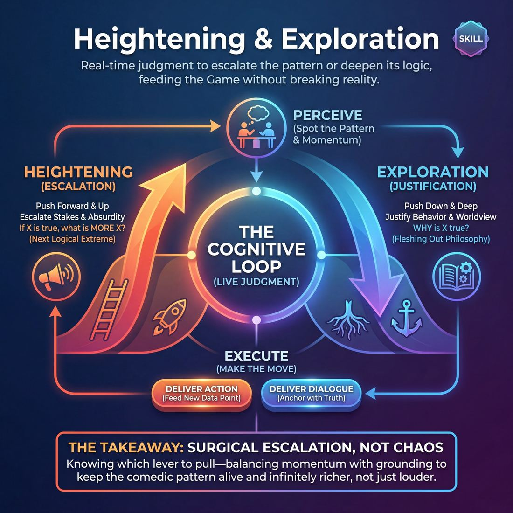

# Week 02 — Base Reality & the One Odd Thing

> *Nothing is strange until something is normal, so build the ordinary first and then stay with the exception long enough to learn what it is.*

| Course | Week | Domain | Focus | Stage | Length | Class |
|---|---|---|---|---|---|---|
| The Engine — Scene & Ensemble | 2/8 | D3 | `D3.S2` — Heightening & Exploration | Advanced Beginner → Competent | 180 min | 10–20 |

!!! note "Builds on"
    Last week they learned to name the unusual thing; this week they earn the right to name it by building the ordinary world it interrupts.

## 🎬 The arc of this session

They arrive pleased with themselves — last week they learned to spot the odd thing and they will want to prove it again in line one. The session slows them down: first the ordinary, built with enough detail that it could be described to a stranger, and then a single exception held long enough to become interesting. They leave able to make a first minute that is recognisable, and to treat the strange thing as something to investigate rather than something to shout about.

!!! tip "Watch for"
    The laugh that arrives in line one. This group has been rewarded for spotting the strange thing, so they will lead with it and the room will reward them again. Notice who is playing to that laugh and quietly hold them to sixty seconds of ordinary before they are allowed anything.

## ⏱️ Session flow (180 minutes)

| Time | Block | Activity |
|---|---|---|
| **0:00–0:05** | 🧊 Ice-breaker | *Pocket Evidence* |
| **0:05–0:10** | 😄 Laughter Blast | *Slow-Motion Champions* |
| **0:10–0:25** | 🔥 Warm-up cluster | *Rung by Rung*, *The Usual*, *Twenty True Things* |
| **0:25–0:45** | 🧠 Theory | — |
| **0:45–1:10** | 🎲 Drill A — isolation | *Biographical Beats* |
| **1:10–1:20** | ☕ Break | — |
| **1:20–1:45** | 🎲 Drill B — under load | *The Iterative Scene* |
| **1:45–2:20** | 🎯 Scene Lab | *That Scene Was About* |
| **2:20–2:50** | 🏟️ Showcase round | *Understudy* |
| **2:50–3:00** | 💭 Reflection & homework | — |

## 🎒 Before you start

- Chairs stacked at the edges, floor clear. Two chairs kept out as the only scenic furniture all day — everything else is mimed.
- Whiteboard or flipchart. Write the cue at the top before anyone arrives: "Establish normal. Then find the one thing that isn't." Leave it up all session.
- Ask everyone last week to bring one object they carry anyway — keys, a receipt, a bus pass. Have five spares in a bag for people who forget, and never point out who used the bag.
- Check last week's homework in the first five minutes of Block 1: they were asked to name the unusual thing. Take two examples out loud, no more, then move on.
- Decide your grouping numbers now, on paper: 10–13 = two groups for Drill A, three pairs for Drill B, five scenes in Scene Lab, four Understudy rounds. 14–17 = three groups, four pairs, six scenes, five rounds. 18–20 = four groups, two parallel halves in Drill B, seven scenes at three minutes, six rounds.
- Slow-Motion Champions involves near-contact. Say before it starts: no touching, arm's length minimum, and anyone can stand out and adjudicate instead.

## 1. 🧊 Ice-breaker (5 min)

*Objects out, everyone stand in one circle. No stories yet — just the true, dull fact about it.*

**Why here:** Puts everyone's hands on something genuinely ordinary within ninety seconds of arriving, which is the whole content of the day disguised as a warm greeting.

### Pocket Evidence

> Everyone shows one real object they're carrying and gives the honest reason it's on them today.

`Players 10–20` · `~5 min` · `Complexity 1/5` · `Energy medium` · `Contact none` · `Props: none`

**How to play**

1. Circle everyone up standing. Say: find one thing you are actually carrying today. Not the most interesting thing — the first thing your hand lands on.
2. Pair each person with the neighbour on their left. Give thirty seconds each: what the object is, and the true reason it is on them today.
3. Call the swap at fifteen seconds so the second person gets equal time. Keep the volume of the room up; do not let pairs go quiet.
4. Run a whip round the full circle. Ten seconds each: hold the object up, one sentence, what it is and why it's there. No commentary, no follow-up questions.
5. Keep the whip moving. If someone stalls past ten seconds, say their object's name for them and move to the next person.
6. Ask everyone to hold the object up if they'd notice within an hour that it had gone. Look round. Let people see the show of hands.
7. Ask them to hold it up if they couldn't say when they last used it. Look round again. Say nothing about what it means.
8. Everything back into pockets and bags. Ask each person to name one object from the circle they want to hear more about later. Move straight into the next block.

📄 **[Full teaching notes »](week-02/intermediate_w02__b1_1.md)**

**Side-coach:** *“Duller. Give me the fact, not the anecdote.”*

## 2. 😄 Laughter Blast (5 min)

*Objects in your pockets, shoes on, arm's length from everyone at all times — and everything you do from now takes four times as long.*

**Why here:** Bodies are cold and the room is sitting on last week's pleasure in itself; five minutes of physical absurdity spends that energy before the patient work starts.

### Slow-Motion Champions

> Everyone runs an imaginary race in slow motion at the same time and celebrates winning it like a nine-year-old.

`Players 10–20` · `~5 min` · `Complexity 1/5` · `Energy high` · `Contact none` · `Props: none`

**How to play**

1. Spread everyone out and face them at the walls, backs to the room. Say plainly that nobody watches anybody for the next five minutes.
2. Tell them you will be the loudest and the worst in the room. Then do it. Your commitment sets the floor for theirs.
3. Round one: slow-motion running on the spot while you count down from ten. On zero, everyone breaks the tape and throws both arms up, still slow.
4. Round two: half that speed. Same countdown, same finish. Add a long, low, slow roar that stretches across the whole arms-up moment.
5. Round three: quarter speed. Countdown, finish, roar, then a mimed knee slide, shirt pulled over the head, whole body celebrating one imaginary win.
6. Shake it out at normal speed — arms, legs, face. Finish with three sharp claps together on your count.
7. Ask one question. Take two or three quick answers. Move straight into the next block without comment.

📄 **[Full teaching notes »](week-02/intermediate_w02__b2_1.md)**

**Side-coach:** *“Slower than that. Let us see your face decide.”*

## 3. 🔥 Warm-up cluster (15 min)

*Three quick things, no scenes in any of them. Rung by Rung first — one circle at 10–13, two at 14–17, three at 18–20.*

**Why here:** Three short pieces that separate the day's two halves: climbing one rung at a time, describing a routine, and generating plain truth at volume — the raw material for base reality.

### Rung by Rung

> The whole room mimes one ordinary chore, then climbs it five notches without ever changing the chore.

`Players 10–20` · `~5 min` · `Complexity 2/5` · `Energy high` · `Contact none` · `Props: none`

**How to play**

1. Stand everyone up with space to swing their arms. Explain: one mimed chore, five sizes. One is real life. Five is as big as your body honestly goes. The chore never changes.
2. Name the first chore yourself: wiping a table. Everyone starts at one — real cloth weight, real speed, no comment, no comedy.
3. Call "two", "three", "four", "five" about every twelve seconds. Each rung adds weight, speed and urgency. Same table, same cloth, bigger commitment.
4. Take a chore shout from the room — carrying shopping, scraping ice, folding sheets. Rebuild at one for fifteen seconds, then climb the same five rungs.
5. Pick a third chore yourself. Climb faster, roughly eight seconds a rung. Stop at five and hold it, breathing hard, for ten seconds.
6. Call "back to one". Everyone snaps to real size and keeps working, silent, for twenty seconds. Let the smallness register.
7. Shake out arms. Say the cue: establish normal, then find the one thing that isn't. Move straight into the next block.

📄 **[Full teaching notes »](week-02/intermediate_w02__b3_1.md)**

### The Usual

> Pairs build a shared ordinary routine one detail at a time, then hold on a single exception and question it instead of adding to it.

`Players 10–20` · `~5 min` · `Complexity 2/5` · `Energy medium` · `Contact none` · `Props: none`

**How to play**

1. Put everyone in pairs. Any pair that can't find a partner, make a three — the third alternates in the same rotation.
2. Tell them: you two share a weekly routine. Alternate one mundane detail each, one sentence at a time. Ordinary only. No jokes, no twists, no strange.
3. Start them. Let the routine build for about a minute. Push for boring, specific, agreed-on — the launderette, the wrong coins, the same broken chair.
4. Call "except". Partner A names one thing that is different today, in one sentence. One exception only.
5. From that moment, both may only ask and answer questions about that one thing. No new oddities. No escalation. Stay on it until you call time.
6. Reset with the same partner. New routine, about forty seconds of ordinary, then Partner B names the exception and both question that.
7. Stop the room. Take two quick answers to one debrief question. Hand on.

📄 **[Full teaching notes »](week-02/intermediate_w02__b3_2.md)**

### Twenty True Things

> The room builds a quiet inventory of dull, literal facts, then holds its attention on the single one that isn't ordinary.

`Players 10–20` · `~5 min` · `Complexity 2/5` · `Energy low` · `Contact none` · `Props: none`

**How to play**

1. Circle everyone up standing. Tell them: name only true, visible, boring things in this room. No jokes, no metaphors, no comments about anybody's body.
2. Give thirty seconds of silence to scan the room. Eyes move, mouths shut.
3. Run lap one round the circle. Each person says one true detail in a flat, low voice. Roughly three seconds each. Passing is allowed.
4. Run lap two in the same order. Each person names something smaller and more specific than their first: a mark, a screw, a hum, a scuff.
5. Choose one detail from the laps and say it aloud. Everyone looks at it in silence for twenty seconds.
6. Take three quiet sentences from volunteers, each beginning "The odd thing about it is...". Do not discuss them.
7. Hold all eyes on that one thing for three slow breaths. Say the cue, then move straight into the next block.

📄 **[Full teaching notes »](week-02/intermediate_w02__b3_3.md)**

**Side-coach:** *“You skipped two rungs. Go back to the one you missed.”*

## 4. 🧠 Theory — Heightening & Exploration (20 min)

{ .infographic }

- **The big idea:** Strange is a relationship, not a property. A thing is only odd against a background of things that are not odd, so the background is the work. Build a recognisable place with two people doing something recognisable in it, allow exactly one exception, then find out what the exception is instead of making it bigger.
- **Where you are on the path:** Competent looks like patience under a mild itch. They know how to heighten; they can do it on demand. What they cannot yet do is sit in an unresolved detail for ninety seconds without adding a second one. In the room this shows as scenes with three or four odd things competing, none of them explored.
- **The one cue to coach:** *“Establish normal. Then find the one thing that isn't.”*

**The three beats**

1. **Say it.** Two minutes, standing at the board. "Last week you learned to name the unusual thing. That was the easy half. This week you earn it. Nothing is strange until something is normal — so before you get to name anything, I want a place, a relationship and an activity I could describe to someone who wasn't here. Then one exception. Only one. And when it lands, you don't make it louder. You find out what it is." Point at the cue. Leave it.
2. **Show it.** Grab one volunteer. Play it twice, sixty seconds total. First version: sit down, "So the thing about my third arm—" and let it die. Say nothing about it. Second version: two people at a bus stop, complaining about the timetable, one hands over a coffee, and only then — "You've done something to your hands." Stop dead on that line. Ask the room which version they wanted to see the next minute of. Do not explain the answer.
3. **Try it.** Everyone stands, pairs, no scene. Sixty seconds each pair to say out loud only what is ordinary about a place they both know — the till, the smell, who is always there on a Tuesday. Then one person adds a single sentence beginning "the only strange thing is...". Stop them there. Do not let anyone play the scene. Point out that the sentence only worked because of the sixty seconds in front of it.

!!! warning "The misunderstanding that always comes up"
    They hear "establish normal" as "be boring for a minute, then start the real scene". It is not a waiting room. The ordinary material is what the exception will be made of — the coffee, the timetable, the Tuesday regular are the tools you use to explore later. Say this out loud when it comes up, because it will.

!!! abstract "📖 Go deeper"
    Read the full write-up: [Heightening & Exploration](../../../theory/03_the-scene/03_S2__heightening-and-exploration.md)

## 5. 🎲 Drill A — isolation (25 min)

*Into groups — two at 10–13, three at 14–17, four at 18–20 — and nobody is allowed anything unusual until I say so.*

**Why here:** Isolates the ordinary entirely: build a person's plain life in beats, with the strange thing withheld until the material is thick enough to hold it.

### Biographical Beats

> Explore a single character's lifetime through non-linear, escalating snapshots of their defining relationships.

`Players 3–99` · `~25 min` · `Complexity 3/5` · `Energy medium` · `Contact none` · `Props: none`

**How to play**

1. Split the room into circles of five to seven. Each circle gets its own playing space. Ask each circle to pick one volunteer — the Anchor — and give them a full name.
2. Tell the Anchor to step out and show a baseline only: posture, walk, one vocal quality. Nothing extreme yet. This is the person before anything odd appears.
3. Send one player in to open scene one. Their first line names the relationship and the time period out loud, so everyone hears both.
4. Let the scene run until the Anchor shows one clear behaviour — a habit, a fixation, a way of handling people. That behaviour is the ladder for the whole game.
5. Have an off-stage player call "Scene" to end it. Early rounds use the call only. Later rounds allow a shoulder tap to swap out the supporting player, if everyone consented.
6. Open the next scene at a different point in the Anchor's life, earlier or later, never simply next. Same behaviour, new relationship, higher stakes.
7. Tell supporting players to reuse names, objects and phrases from earlier scenes. The trait stays identical; only the context and the cost change.
8. Stop after five to seven scenes. Finish on the largest version of the behaviour, in the highest-stakes relationship the circle has found.

📄 **[Full teaching notes »](week-02/intermediate_w02__b5_1.md)**

**Side-coach:** *“That's a second odd thing. Drop it and go back to the first.”*

## ☕ Break — 10 minutes

Water, notes, informal talk. Non-negotiable at three hours — do not let it collapse into a working discussion.

## 6. 🎲 Drill B — under load (25 min)

*Back on your feet. One scene, played more than once, and each time through you're allowed to know more and add less.*

**Why here:** Same skill with the pressure of repetition: the scene comes back, and each pass has to deepen the ordinary rather than add to the strange.

### The Iterative Scene

> Replay the same scene repeatedly to isolate, distill, and supercharge its comedic game.

`Players 6–99` · `~25 min` · `Complexity 3/5` · `Energy medium` · `Contact none` · `Props: none`

**How to play**

1. Ask the room for a mundane, everyday location or task. Take the plainest offer, not the wildest. Say it back so everyone hears it.
2. Bring up two players. Give them two minutes to build a clear relationship and place, and to let one odd behaviour appear inside it.
3. Edit the scene with a clap. Name the odd thing out loud in one short sentence so the whole room agrees what the game is.
4. Send in a fresh pair immediately. Tell them to run the same scene: same relationship, same beats, same key lines, but shorter, starting closer to the odd thing.
5. Repeat with new pairs, cutting the time each round: ninety seconds, sixty, forty-five, thirty. Each pair keeps the spine and pushes the odd behaviour further.
6. Hold every pair to the original scene. No new premises, no new characters. They may drop setup, never the game.
7. Stop when the scene is roughly thirty seconds and made almost entirely of the odd thing. Applaud, take a new suggestion, run another ladder.

📄 **[Full teaching notes »](week-02/intermediate_w02__b7_1.md)**

**Side-coach:** *“You've added. I want you to notice instead — what was already in the room?”*

## 7. 🎯 Scene Lab (35 min)

*Two chairs, four minutes a scene, and when it ends the watchers tell us what it was about before the players say a word.*

**Why here:** Full scenes with the audience naming what the scene was actually about, which exposes fast whether the ordinary was real or a runway to the joke.

### That Scene Was About

> Extract the core theme of a scene to inspire the next, deeper exploration.

`Players 4–99` · `~35 min` · `Complexity 3/5` · `Energy medium` · `Contact none` · `Props: none`

**How to play**

1. Take one word from the room as a suggestion. Send two players out to play an ordinary two-person scene from it. No games, no gimmicks — just a relationship in a place.
2. Let the scene run sixty to ninety seconds. Call "scene" the moment a dynamic is legible, even if nothing has been resolved. Cut early rather than late.
3. Send in the next pair immediately. Before they speak to each other, one of them faces the group and says: "That was a scene about —" and names it.
4. Require the naming to be abstract: an emotion, a relational pressure, a fear. "Unspoken jealousy." "Needing to be the one who knows." Refuse plot summaries like "a scene about a bike shop."
5. Have the new pair start a fresh scene straight away — different place, different people, same theme underneath. They never reference the previous scene's content.
6. Run the chain unbroken: play, cut, name, play. Each pair distils the scene they just watched and hands a new one on.
7. Keep a queue so everyone knows their turn. Nobody names the theme of their own scene.

📄 **[Full teaching notes »](week-02/intermediate_w02__b8_1.md)**

**Side-coach:** *“Stay with it. Ask a question about the thing you already found.”*

## 8. 🏟️ Showcase round (30 min)

*Rounds now, watchers on the chairs. Your job in the seats is to mark two moments out loud: where normal got established, and where it tipped.*

**Why here:** Rounds where players step into a world someone else established, so the ordinary has to be legible enough for a stranger to inhabit — the honest test of whether base reality got built.

### Understudy

> Heighten character patterns and emotional games by stepping into another actor's shoes mid-scene.

`Players 4–99` · `~30 min` · `Complexity 3/5` · `Energy medium` · `Contact none` · `Props: none`

**How to play**

1. Send two players out. Tell them to build a grounded relationship scene — who they are, where they are, what they're doing. No gags. Ordinary life, played straight.
2. Tell the seated group to watch for one repeating thing: a phrase, a posture, a way of reacting, an odd opinion. That repetition is the pattern.
3. Let the scene run until a pattern shows up twice. Then freeze it by calling "Understudy for [character name]".
4. Have the original player step out and hold still at the edge. An off-stage player steps into their exact position, same posture, same eyeline.
5. Call "Resume". The understudy plays the same pattern larger — more committed, more frequent, more obvious. Nothing new is invented. Only the existing thing grows.
6. Give it four or five lines, then call "Originals back". The understudy leaves; the first player returns and keeps the enlarged version, not their earlier one.
7. Swap the other character next. Alternate. Run two or three swaps per scene, then end it and bring up a fresh pair.

📄 **[Full teaching notes »](week-02/intermediate_w02__b9_1.md)**

**Side-coach:** *“Understudy — play what they built, not what you'd have built.”*

## 9. 💭 Reflection & homework (10 min)

**Deepen your improv**
1. Think of one scene today where the odd thing landed properly. What specific ordinary detail was already in the room that made it land?
2. When you felt the itch to add a second strange thing, what were you actually avoiding — silence, or not knowing what happens next?

**Beyond the stage**
3. Where outside this room do you lead with the interesting bit and skip the context — and who has to do the work of catching up?

➡️ **[This week's homework](../homework/HW-INTW02.md)**

??? note "🎓 Facilitator notes"

    **Timing risks**
    - Drill A over-runs because the ordinary is enjoyable to build. Hard stop at 25 minutes even mid-group; the point is made by then.
    - Scene Lab naming discussion sprawls. Cap the watchers at two contributions per scene and move on at 3 minutes of talk.
    - At 18–20, Understudy rounds will not all happen. Cut to six rounds and let four people watch throughout rather than rushing.

    **Failure modes this week**
    - Line-one reveals, all session. Do not lecture. Ring it back and restart the scene from the top with a sixty-second embargo.
    - Base reality played as deliberately tedious — long silences and nothing happening. Say plainly: ordinary is not empty. Give them an activity to do with their hands.
    - Two or three odd things stacking. Name which one arrived first and make them return to it.
    - The room laughs the loudest at the worst habit. Notice it out loud once, without blame, then stop rewarding it with your own reaction.

    **What good looks like by the end:** By the last Understudy round, a first minute you could describe to someone who wasn't in the room without mentioning the joke — a place, two people, something they are doing. One exception, held and questioned for at least a minute before anything else changes. Watchers able to point at the tipping moment and agree on where it was.

    **Carry into next week:** Bring the two Understudy rounds where the exception was explored longest into next week as reference points. Note which three players still reveal in line one and pair them with patient scene partners early next session.
