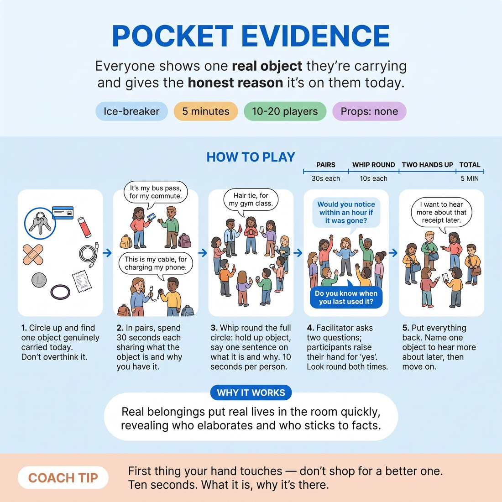

# 🧊 Ice-breaker — Pocket Evidence

{ .infographic }

> Everyone shows one real object they're carrying and gives the honest reason it's on them today.

`Players 10–20` · `~5 min` · `Complexity 1/5` · `Energy medium` · `Contact none` · `Props: none`

⬅️ [Back to the Week 02 run-sheet](../week-02.md)

## Why this activity, here

First thing in Week 2, before anyone has played a scene. The week's cue is establish normal, then find the one thing that isn't — this is that operation run on the room's own pockets rather than on invented material. The two show-of-hands questions produce a live sorting of ordinary from anomalous. It feeds the base-reality scene work later in the session, where students will be asked to build an unremarkable world and then locate its single deviation.

## What students actually learn

- That the odd thing is usually already present in the ordinary, not something you bolt on.
- That a true reason is more specific and more interesting than an invented one.
- That you can be interesting in a circle of strangers without preparing anything.

## Setup

No props, no chairs, no writing. Standing circle with room to see everyone's hands. Have a timer or phone with a visible second hand. Before starting, tell anyone with no pockets that a bag, a phone case, a lanyard, a ring or a shoelace all count. If people arrived without coats and bags, tell them to grab something from their seat before the circle closes.

## How to run it — 5 minutes

| Min | What you do |
|---:|---|
| 1 | Circle up standing. Give the brief in two sentences: one real object, first thing your hand lands on. Wait until everyone is holding something. Pair each person with the neighbour on their left. |
| 1 | Pairs talk. Thirty seconds each — what it is, the honest reason it's on them today. Call the swap out loud at fifteen seconds. Keep the room noisy. |
| 2 | Whip round the full circle. Object up, one sentence, ten seconds. Point to the next person before the current one finishes. Cut anyone who starts a story. |
| 1 | Two show-of-hands questions: would you notice within an hour it was gone, and could you not say when you last used it. Look both times. Pockets. Each person names one object they want to hear about later. Move on. |

## Side-coaching script

| When | Say |
|---|---|
| As they hunt for an object | *"First thing your hand touches. Don't shop."* |
| Fifteen seconds into the pairs | *"Swap. Second person now."* |
| Someone in pairs is explaining rather than answering | *"Why it's on you today. That's the whole answer."* |
| Starting the whip round | *"Up, sentence, next. Ten seconds."* |
| A whip-round answer starts turning into an anecdote | *"Land it. Next."* |
| Someone apologises for a boring object | *"Boring is the point. Say it plainly."* |
| During the two show-of-hands questions | *"Look round. See who's holding what."* |
| Closing | *"One name, then pockets. Go."* |

!!! success "What good looks like"
    The whip round has a beat to it — object, sentence, next, no dead air. Answers are flat and specific: keys, a bus pass, a hair tie that lives on a wrist. At least two people laugh at their own honest reason without trying to be funny. On the second show of hands, a noticeable number of arms go up and people glance at each other. The room is warmer and slightly more alert than it was five minutes ago, and nobody has performed.

## When it goes wrong

| You see | What's causing it | The fix |
|---|---|---|
| People digging in bags for the funniest possible item, and the circle stalls for a minute. | They heard the brief as an invitation to be entertaining. | Say it again shorter: first thing your hand lands on. Start the pairs while two people are still hunting; they'll grab something. |
| The whip round overruns and you're at three and a half minutes with six people to go. | You let the first three people tell stories, which set the length for everyone. | Cut the first over-runner audibly. Point at the next person before the current one finishes. Drop the closing question if you must. |
| Flat, mumbled answers — "my phone, because everyone has a phone". | They're answering the general question, not today's. | Side-coach "on you today" and take one yourself, out of turn, with a genuinely specific reason. Specificity is contagious in a circle. |
| Someone visibly uncomfortable showing what they're carrying. | The object is private — medication, something from home, something with a story they don't want here. | Say early and once that anyone can pick a different object or pass with a shrug. Take the pass without comment and keep the rhythm. |

## Scaling

| Class size | What changes |
|---|---|
| **10–13** | One circle. Ten seconds each fits comfortably inside the whip round with slack. Use the spare twenty seconds to let two people say a second sentence about the object nobody understood. |
| **14–17** | One circle. Hold ten seconds hard — point at the next person early. Cut the pairs to twenty-five seconds each side if you're running behind. |
| **18–20** | Split into two circles of nine or ten for the whip round only. Run them simultaneously; you stand between and call the ten-second beat for both. Bring the room back into one circle for the two show-of-hands questions so everyone sees the whole count. |

## Variations

**Neighbour's evidence** — In the whip round, each person holds up their own object but the person to their left says what it is and guesses why it's there. Owner confirms or corrects in three words.  
*Easier — takes the pressure off self-disclosure and gives the shy a scripted line.*

**The one that doesn't fit** — After the whip round, ask each person to point at one object in the circle that seems out of place next to the others, and say the one word that makes it odd.  
*Harder — forces an explicit call on where base reality ends, which is exactly the judgement they'll need in the scene work.*

**Two objects, one lie** — Each person shows two real objects and gives an honest reason for one and an invented reason for the other. The circle doesn't guess; you just move on.  
*Different emphasis — the group hears, in real time, how much thinner an invented reason sounds than a true one.*

## Debrief

1. **Whose object stayed with you, and what made it stick?**
   > *A good answer sounds like:* They name a specific detail — the reason, not the object. "The receipt he's been meaning to claim for three weeks." If they only name the object, ask why that one.

2. **Second show of hands — what were you all holding up?**
   > *A good answer sounds like:* Someone says the thing you're after without you saying it: the odd item was already in the pocket, alongside the ordinary ones. Move on as soon as anyone lands near that.

!!! warning "Safety & inclusion"
    No contact. Nobody touches or handles anyone else's belongings. State up front that anyone can swap to a different object or pass entirely with a shrug — take passes without comment or eye contact. Do not ask follow-up questions about anything sentimental, medical or religious; if someone volunteers it, thank them in three words and move the whip on. Anyone who can't stand runs it seated and the circle sits with them. Anyone whose pockets are genuinely empty uses a bag item, a ring, glasses or a shoelace.

## Why it works

The session cue asks students to build an unremarkable world and then locate its single deviation. Invented objects skip that work — people jump straight to the odd thing and there's no normal underneath it. Real pockets can't be invented, so the whip round produces a genuine base reality: keys, cards, chargers, the mundane sediment of twenty adult lives. Only once that baseline exists in the room's ears do the two questions do their job. The first confirms the ordinary. The second isolates the anomaly — the object carried daily and never used — and the anomaly arrives as a discovery rather than a decision. That is the exact sequence of heightening from exploration: establish, notice, then pull on the one thread that's loose.

[Open the full activity card »](../../library/icebreakers/IB__pocket-evidence.md){target=_blank rel=noopener}
