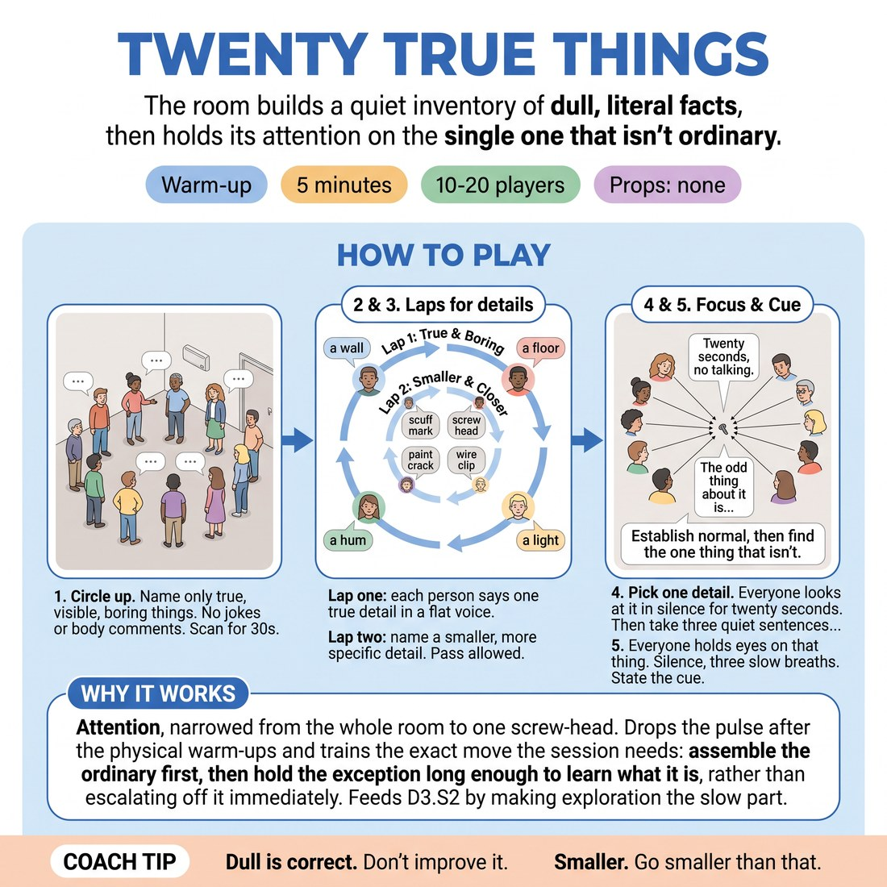

# 🔥 Warm-up cluster — Twenty True Things

{ .infographic }

> The room builds a quiet inventory of dull, literal facts, then holds its attention on the single one that isn't ordinary.

`Players 10–20` · `~5 min` · `Complexity 2/5` · `Energy low` · `Contact none` · `Props: none`

⬅️ [Back to the Week 02 run-sheet](../week-02.md)

## Why this activity, here

Opens Week 2. Last week the room learned to accept and add; today it learns that a scene needs a floor before it needs a surprise. This warm-up makes noticing ordinary detail feel like work worth doing, so the base-reality scene work later has material to build on rather than invention pulled from nowhere.

## What students actually learn

- That naming something dull out loud is a legitimate offer, not a failure to be interesting.
- That specificity is a muscle: the second look finds more than the first.
- That attention held on one thing for twenty seconds starts producing material by itself.

## Setup

Standing circle, no chairs needed. Nothing to prepare. Do a quick sweep for anything in the room you would rather nobody named aloud — someone's open bag, a noticeboard with private information — and either move it or say it's off limits before you start. Know where you'll stand so you can start lap one and lap two cleanly.

## How to run it — 5 minutes

| Min | What you do |
|---:|---|
| 1 | Circle up. Give the rule: true, visible, boring, present tense. No jokes, no metaphors, no bodies. Then thirty seconds of silent scanning. Do not fill the silence. |
| 1 | Lap one. Round the circle, one flat detail each, about three seconds per person. Keep the rhythm brisk. Accept passes without comment and move on. |
| 1 | Lap two, same order, same speed. Each person names something smaller and more specific than their first offer. Side-coach for size, not for cleverness. |
| 1 | Name one detail from the laps. Everyone looks at it. Twenty seconds of silence. Then take three sentences starting "The odd thing about it is..." and let them sit. |
| 1 | Everyone holds their eyes on that thing. Three slow breaths, no talking. Say the cue: establish normal, then find the one thing that isn't. Move straight on. |

## Side-coaching script

| When | Say |
|---|---|
| During the thirty-second scan, if someone starts whispering | *"Eyes only. Nothing out loud yet."* |
| Early in lap one, if the first offers are performed or amusing | *"Flatter. Just report it."* |
| Mid lap one, if the circle is slowing | *"Three seconds. Say it and pass."* |
| At the start of lap two | *"Smaller. Something you'd only see standing close."* |
| During lap two, if someone gives another large object | *"Go one level in. A part of it, not the whole."* |
| During the twenty-second look | *"Keep looking. Don't solve it."* |
| Before the three sentences | *"Odd, not funny. Say what's actually strange about it."* |
| Final breaths, closing the block | *"Establish normal. Then find the one thing that isn't."* |

!!! success "What good looks like"
    The circle sounds boring and moves fast. Voices are low and flat. Lap two is visibly harder and slower to think of, but the details are smaller — a chip in the paint, the second hum under the first hum. During the twenty seconds nobody fidgets or laughs. The three "odd thing" sentences come out unhurried and slightly serious. The room feels quieter at the end than at the start.

## When it goes wrong

| You see | What's causing it | The fix |
|---|---|---|
| Every offer gets a small laugh and people start playing to it. | The group has read "warm-up" as "be entertaining", and one early joke set the tone. | Stop the lap. Restate: true, visible, boring. Restart from the person after the joke. Do not scold — just reset the register and keep moving. |
| Lap two produces the same size of detail as lap one — another chair, another window. | People are scanning the room again rather than looking closer at what's already been named. | Call "one level in". Give one example yourself — not "the radiator" but "the third bolt on the radiator" — then resume. |
| The twenty seconds of silence collapses into shuffling and eye contact. | Adults find unstructured silence uncomfortable and will break it unless given a task. | Give them a job for the silence: count the edges, or find something about it you hadn't seen. Say it before the silence, not during. |
| The "odd thing" sentences turn into fantasy — ghosts, conspiracies, what if it's alive. | They've heard "odd" as an invitation to invent. | Redirect once: odd means genuinely strange about the real object. Take one more sentence, then close the block on time. |

## Scaling

| Class size | What changes |
|---|---|
| **10–13** | One circle, both laps, comfortably inside the time. If you finish laps early, take four "odd thing" sentences instead of three rather than extending the silence. |
| **14–17** | One circle. Tighten laps to two seconds each and say so out loud. Take three sentences only, from whoever speaks first. |
| **18–20** | Split into two circles of nine or ten in opposite corners; each runs its own two laps at two seconds each. Bring them back together for one shared detail, the shared silence and three sentences. |

## Variations

**Pointing lap** — Lap one is silent — each person just points at their detail and the next person goes. Words only arrive in lap two.  
*easier — removes speaking pressure from anyone anxious about their first contribution*

**No repeats, no nouns** — Lap two bans any noun already said and any object name at all. Only textures, sounds, temperatures, marks.  
*harder — forces sensory specificity when the obvious vocabulary is gone*

**Two-person inventory** — Pairs instead of a circle. Alternate details for ninety seconds, then each pair picks their one odd thing and shows it to another pair.  
*different emphasis — shifts from group attention to partner listening and shared focus*

## Debrief

1. **What was harder, lap one or lap two?**
   > *A good answer sounds like:* Lap two — someone says the obvious things were used up, or that they had to actually go and look rather than remember. Move on as soon as one person names that shift.

2. **What happened during the twenty seconds of looking?**
   > *A good answer sounds like:* Someone reports the thing changed, or that they found something they'd missed, or that it started to seem strange. That's the point: attention makes material. Don't chase agreement.

!!! warning "Safety & inclusion"
    No contact in this activity. Rule out comments about anybody's body, clothing or belongings before you start, and enforce it immediately if it slips — this game can drift into remarks about people. Passing is always available and never remarked upon. Anyone who can't stand for five minutes takes a chair in the circle; the game doesn't need standing. If someone can't easily see a chosen detail from where they are, choose a different detail — never ask them to move to prove they can see it. Keep the room's private objects out of bounds.

## Why it works

Heightening needs somewhere to heighten from. If the base is vague, the odd thing has no contrast and lands as random. This drill separates the two operations and makes the first one physical: two laps of literal reporting build a shared, specific normal that everyone in the room can hear. The second lap forces resolution upwards — the same object, seen closer — which is the mechanic of exploration rather than escalation. Then the twenty seconds of held attention demonstrates that oddness is found by staying with something, not by adding to it. Students carry that into scene work as patience: describe the ordinary until the unusual is visible against it.

[Open the full activity card »](../../library/warmups/WU__twenty-true-things.md){target=_blank rel=noopener}
