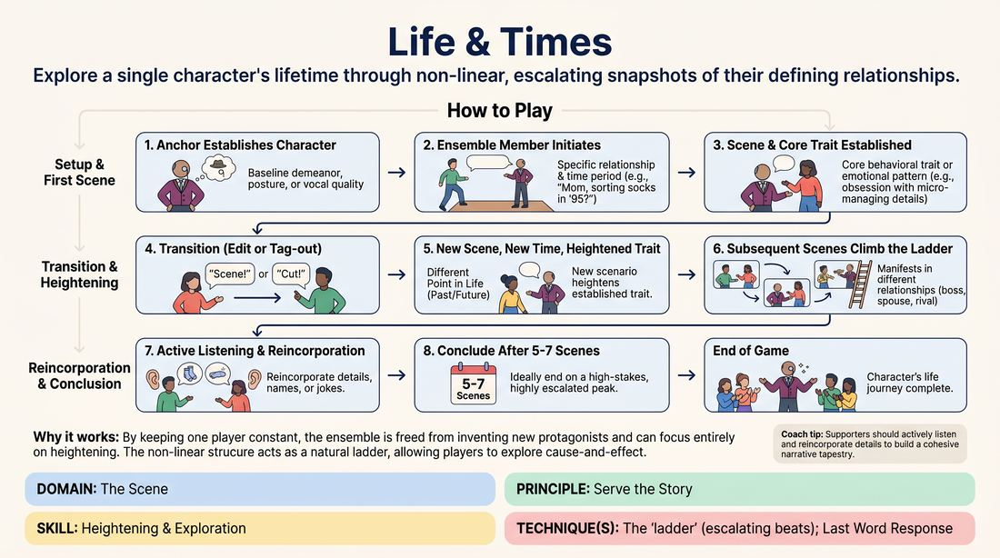

# 🎲 Drill A — isolation — Biographical Beats

{ .infographic }

> Explore a single character's lifetime through non-linear, escalating snapshots of their defining relationships.

`Players 3–99` · `~25 min` · `Complexity 3/5` · `Energy medium` · `Contact none` · `Props: none`

⬅️ [Back to the Week 02 run-sheet](../week-02.md)

## Why this activity, here

Week 2 opens with base reality: the ordinary world, then the single thing that deviates from it. This drill isolates the second half. The Anchor's baseline is normal; one behaviour is the odd thing; every scene after is that odd thing under a different light. It feeds Drill B and the scene work later in the session, where players must find the deviation inside a scene they are also building. Here they only have to find it and climb it.

## What students actually learn

- That heightening is repetition with new pressure, not escalation of volume.
- That a character stays recognisable across forty years if one behaviour stays fixed.
- That reincorporating a name or an object from scene two makes scene five feel earned.
- That editing early, before a scene finishes its business, keeps the ladder climbing.

## Setup

Clear floor. Each circle needs a playing area about three metres square and a place for off-stage players to stand where they can see. No chairs in the playing space. Nothing else. Have a timer visible to you. If your room is narrow, run circles along the length rather than side by side, so sound doesn't collide.

## How to run it — 25 minutes

| Min | What you do |
|---:|---|
| 3 | Frame it. One Anchor, one behaviour, life told out of order. Say the cue: establish normal, then find the one thing that isn't. Split into circles. Ask for consent to shoulder-tap; anyone opting out gets verbal edits only. |
| 2 | Demonstrate with one volunteer in front of everyone. Two scenes, thirty seconds each. Show the baseline, show the behaviour, jump twenty years, show the same behaviour bigger. Stop there. Do not finish the game. |
| 4 | Round one. Verbal edits only, no tagging. Five scenes per circle. Side-coach for clear relationship and era in the opening line. |
| 4 | Round two. New Anchor in each circle. Introduce tag-outs for anyone who consented. Coach reincorporation: names, objects, phrases from earlier scenes. |
| 4 | Round three. New Anchor. Ask circles to include at least one scene set before the Anchor turned twelve, and one set in the last year of their life. |
| 4 | Round four. New Anchor. Seven scenes. Push for the final scene to be the highest-stakes relationship available — deathbed, wedding, courtroom, whatever the circle has built toward. |
| 4 | Bring circles together. Debrief standing. Two questions, quick answers, then move on. |

## Side-coaching script

| When | Say |
|---|---|
| During the Anchor's baseline, if it is already a caricature | *"Dial it back. Normal first."* |
| When a scene opens without context | *"Who are you to them, and what year is it?"* |
| Once the behaviour has landed clearly in scene one | *"Lock that. That's the ladder."* |
| When a scene is running past its point | *"Edit it. Now."* |
| When a new scene picks up chronologically from the last | *"Jump further. Not the next day."* |
| When players change the trait instead of the setting | *"Same trait. New room."* |
| When scenes are escalating in volume rather than stakes | *"Quieter. Cost more."* |
| Going into the final scene of a round | *"Biggest relationship. Land it high."* |

!!! success "What good looks like"
    You can walk between circles and identify each Anchor's behaviour within ten seconds of watching. Scenes are short — forty to ninety seconds. Editors cut on a laugh or a clear beat rather than waiting for an ending. Someone in scene five says a name that was invented in scene one and the circle reacts. The Anchor's posture is consistent whether they are playing four years old or eighty. The last scene of a round is recognisably the same behaviour as the first, but it now matters to someone.

## When it goes wrong

| You see | What's causing it | The fix |
|---|---|---|
| Scenes running three minutes with no edit, players glancing at each other off-stage. | Nobody wants to be the one who cuts a scene that might still be going somewhere. | Assign a designated editor for each round who must cut at sixty seconds regardless. Rotate the role. Remove the assignment once they get comfortable. |
| Each new scene invents a different quirk instead of returning to the first one. | Players are generating rather than listening; they treat variety as the goal. | Pause the circle. Ask them to say the behaviour out loud in one sentence. Restart from that sentence. Repeat the sentence between scenes if needed. |
| The Anchor is loud and cartoonish by scene two and has nowhere left to go. | The baseline was pitched too high, so heightening has no floor to climb from. | Stop the round. Have the Anchor redo the baseline at half intensity, then restart at scene one. |
| All scenes are set in adulthood, in offices or living rooms. | Default settings; nobody has claimed a childhood or old-age scene. | Call out an era before the next scene starts — "age seven" — and let a player take it. |

## Scaling

| Class size | What changes |
|---|---|
| **10–13** | Two circles of five to seven. Four rounds as written, five scenes per round. You can watch both circles from one position, so side-coach freely. |
| **14–17** | Three circles of five or six. Four rounds. Rotate your attention — spend the first round with circle one, second with circle two, third with circle three, fourth roaming. Circles run without you when you're elsewhere; that is fine. |
| **18–20** | Four circles of five. Cut round four to three minutes and add the minute to the debrief, so every circle gets four Anchors in a tighter frame. Ask one circle per round to keep their scene count at five, not seven, to stay in step. |

## Variations

**Called eras** — Before each scene, you name the age out loud — "nine", "thirty-four", "seventy". Players only have to supply the relationship and the behaviour.  
*Easier. Removes the timeline decision, which is where nervous players stall.*

**Silent edits only** — No verbal calls. Every transition is a tag-out or a sweep across the space. Consenting players only; anyone opting out uses a raised hand as their signal.  
*Harder. Editors must commit physically and read the beat without a safety word.*

**Two anchors, one trait** — Two players share the Anchor role across the life — one plays every scene before thirty, one plays every scene after. Same name, same behaviour.  
*Different emphasis. Forces precise observation and copying of a partner's physical and vocal choices.*

## Debrief

1. **What was the one behaviour in your circle, in a single sentence?**
   > *A good answer sounds like:* A short, specific description everyone in the circle recognises — "he apologised before anyone was upset" — not a list of things the character did.

2. **Which scene made the behaviour feel biggest, and what made it big?**
   > *A good answer sounds like:* They point to stakes or relationship rather than volume: "it was the same tiny thing, but she did it at her daughter's funeral."

3. **What did somebody bring back from an earlier scene?**
   > *A good answer sounds like:* A concrete callback — a name, an object, a phrase — and a note that it landed because it had been planted, not because it was clever.

!!! warning "Safety & inclusion"
    Tag-outs involve a hand on the shoulder. Ask for consent before round two, out loud, to the whole room: anyone who would rather not be touched says so now or tells their circle privately. Those players use verbal edits and a raised hand, and nobody comments on it. Life-story material can drift toward illness, death and family conflict; say up front that scenes stay fictional, that nobody has to play an era that sits badly with them, and that stepping out of a circle for a round needs no explanation. Anchors do not have to age physically in ways that mock disability or frailty — coach that out if you see it.

## Why it works

Heightening fails when players change the thing instead of raising it. This drill removes every other variable: the character is fixed, the behaviour is fixed, and only the era and the relationship move. Because the timeline jumps, players cannot lean on cause and effect to carry a scene — the only continuity available is the odd thing itself, so they are forced to notice it, hold it, and find a context where it costs more. Establishing the baseline first gives the deviation something to deviate from; without the ordinary demeanour in scene one, scene five has no measure. Repetition across unrelated settings is what makes the pattern legible to an audience, and legibility is what heightening is for.

[Open the full activity card »](../../../../games/D3_P4_S2_T1_G759__life-times.md){target=_blank rel=noopener}
