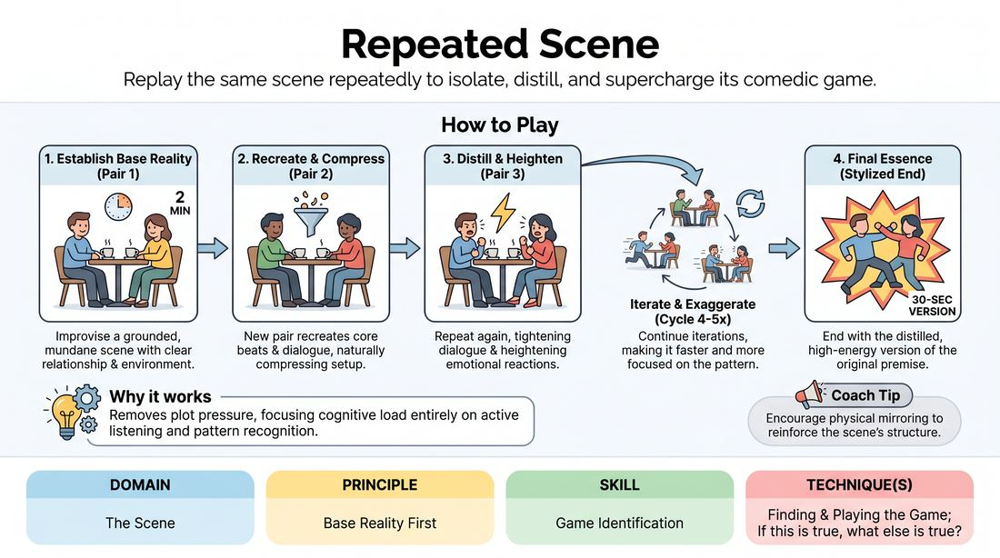

# 🎲 Drill B — under load — The Iterative Scene

{ .infographic }

> Replay the same scene repeatedly to isolate, distill, and supercharge its comedic game.

`Players 6–99` · `~25 min` · `Complexity 3/5` · `Energy medium` · `Contact none` · `Props: none`

⬅️ [Back to the Week 02 run-sheet](../week-02.md)

## Why this activity, here

Drill A gave them base reality and the first unusual thing at low pressure. This block puts the same skill under load: the scene is fixed, the clock shrinks, and they must decide in seconds which material is scaffolding and which is the game. It feeds the long-form scenes later in the session, where they will need to find the odd thing without four spare minutes to hunt for it.

## What students actually learn

- They stop treating exposition as the scene. Once they have watched three pairs cut the doorway and the greeting, they start scenes later by instinct.
- They can name the game of a scene out loud, quickly, in one sentence — because they have to before they play it.
- Heightening stops meaning louder. They feel the difference between repeating the odd thing bigger and repeating it with more consequence.
- They learn that watching carefully is preparation. The next pair up is the audience that was paying attention.

## Setup

Clear playing space with two chairs to the side. Everyone else sits or stands in a loose watching arc. Have a visible timer or a phone stopwatch — you will call times aloud, so accuracy matters more than discretion. No props needed. Decide before you start how you will edit: a single clap works better than a shout.

## How to run it — 25 minutes

| Min | What you do |
|---:|---|
| 3 | Frame it. Explain that one scene will be replayed by new pairs, each shorter than the last, keeping the same beats and losing the setup. Take the first mundane suggestion. |
| 3 | Run 1. First pair, two minutes, ordinary world plus one odd behaviour. Clap the edit. Name the odd thing in one sentence and check the room agrees. |
| 4 | Runs 2 and 3. New pair, ninety seconds, same scene. Clap. New pair, sixty seconds. Call the cut times aloud as they play. |
| 3 | Runs 4 and 5. Forty-five seconds, then thirty. Stop when the scene is almost entirely the odd thing. Applaud the whole ladder, not the last pair. |
| 6 | Second ladder. Fresh suggestion, fresh pairs who have not played yet. Same descending clock, run it without re-explaining. Move faster between pairs. |
| 4 | Third ladder, short form. Two minutes for the base scene, then straight to sixty, then thirty. Use anyone still waiting to play. |
| 2 | Sit down where you are. Run two debrief questions. Do not summarise; take three answers and close the block. |

## Side-coaching script

| When | Say |
|---|---|
| During the first two-minute scene, if they are inventing chaos | *"Keep it ordinary. One thing off, not five."* |
| Immediately after the first edit | *"Say the odd thing back to me in one sentence."* |
| As each new pair steps in | *"Same scene. Same people. Later start."* |
| When a pair rebuilds the greeting or the doorway | *"Cut the front. Begin at the odd thing."* |
| Mid-round when dialogue is padding | *"Half the words."* |
| When heightening has become shouting | *"Not louder. Costlier."* |
| On the thirty-second run | *"Three beats only. Go."* |
| If a pair starts inventing a new premise | *"Back to the original. You inherit, you don't invent."* |

!!! success "What good looks like"
    By the third or fourth pass the room laughs before anyone speaks, because they know what is coming and they want to see how far it goes. Entrances get later. Lines get shorter. The odd behaviour arrives in the first five seconds and escalates twice. Players waiting to go on are leaning forward, tracking lines. The final version is recognisably the same scene, ninety per cent shorter, and clearly about one thing.

## When it goes wrong

| You see | What's causing it | The fix |
|---|---|---|
| The second pair plays a completely different scene in the same location. | The game was never named clearly after the first edit, so there was nothing to inherit. | Always name the odd thing aloud before the next pair steps in. If you cannot name it, ask the room. If the room cannot, replay the first scene rather than moving on. |
| Each version gets louder and more manic but no shorter. | Players hear 'heighten' as 'more energy' rather than 'more consequence, less setup'. | Call 'not louder, costlier' mid-scene. Ask what the odd behaviour is now costing the other character, and make the next pair start after that cost has already landed. |
| The base scene never finds an odd thing at all, and there is nothing to distil. | First pair playing safe, or two people negotiating rather than committing. | Edit at ninety seconds instead of two minutes. Pick any repeated detail — a phrase, a gesture, an attitude — declare that the game, and let the ladder do the work. |
| The same three confident players keep volunteering. | Open invitations reward the fast. | Assign pairs before each ladder. Say the names. Nobody plays a second time until everyone has played once. |

## Scaling

| Class size | What changes |
|---|---|
| **10–13** | One ladder at a time, five pairs, everyone else watching. Ten people fill one ladder exactly. Run two full ladders and one short one; with thirteen, put the spare three into the short third ladder as a trio version. |
| **14–17** | Two ladders in the first six-minute round, running one after the other in the same space with the whole group watching. Cut the base scene to ninety seconds so both fit. Everyone plays once by the end of the block. |
| **18–20** | Split the room in half after the first demonstration ladder. Each half takes a corner, appoints its own timer and caller, and runs its own ladder on its own suggestion. Rejoin for the last four minutes and watch one half's final thirty-second version. |

## Variations

**Called freeze** — Instead of new pairs, the same two players replay the scene each time. You call the shrinking times and edit.  
*Easier — removes the memory load of copying someone else and lets nervous players focus only on cutting.*

**Blind inheritance** — The incoming pair may not be told the game. They must work it out from watching, and the outgoing pair says nothing.  
*Harder — puts all the weight on precise watching and forces players to infer pattern rather than be handed it.*

**Silent ladder** — From the third iteration onward, no dialogue. The scene must survive on physical behaviour and reaction alone.  
*Different emphasis — shifts distillation from cutting words to finding the physical shape of the game.*

## Debrief

1. **What got cut first, every time?**
   > *A good answer sounds like:* They name the setup: hellos, explaining where they are, saying who they are to each other. Someone notes the scene still made sense without it. Move on once two people say this.

2. **When did you know what the game was?**
   > *A good answer sounds like:* Someone points to a specific moment in the first scene — a repeated line, a reaction — rather than a general feeling. If answers stay vague, ask one watcher to name it precisely, then close.

3. **What was lost in the thirty-second version?**
   > *A good answer sounds like:* Honest — usually the relationship, or the reason anyone cared. Good answers hold both: it was funnier and thinner. That tension is the point; do not resolve it for them.

!!! warning "Safety & inclusion"
    No contact is required. If a pair wants to touch — a hand on a shoulder, a shove — they ask before the scene and either can decline without explanation. Watching is participation here: anyone can sit a ladder out and come in on the next one, and you assign pairs so opting out is invisible. Some people find repeated public replay exposing; say at the start that the scene belongs to the room, not the first pair, so nobody is defending their own material.

## Why it works

The cue is establish normal, then find the one thing that isn't. In a single pass, the odd thing is buried in setup and players cannot tell which is which. Repetition with a shrinking clock forces a sort: anything that survives four cuts was load-bearing, anything cut was scaffolding. Because each pair inherits rather than invents, attention goes entirely to pattern recognition — they must watch to play. And because the clock, not their judgement, does the cutting, they experience the discovery instead of being told it. The final thirty seconds is the proof: the scene was always about one thing.

[Open the full activity card »](../../../../games/D3_P2_S1_T1_G818__repeated-scene.md){target=_blank rel=noopener}
