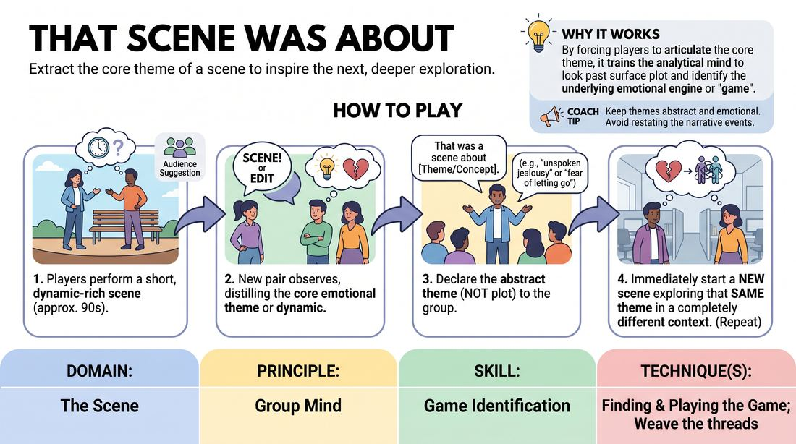

# 🎯 Scene Lab — That Scene Was About

{ .infographic }

> Extract the core theme of a scene to inspire the next, deeper exploration.

`Players 4–99` · `~35 min` · `Complexity 3/5` · `Energy medium` · `Contact none` · `Props: none`

⬅️ [Back to the Week 02 run-sheet](../week-02.md)

## Why this activity, here

Week 2 spends its first half on base reality — the ordinary world a scene needs before anything can stick out. This block turns that around. Scenes get made, then read. Players discover that the odd thing they noticed and the theme underneath it are the same information. It feeds directly into the week's closing long-form, where they must find and heighten the one unusual element without being told what it is.

## What students actually learn

- They stop watching scenes for plot and start watching for pressure — what is actually going on between two people.
- They find they can name a theme out loud without being clever, and that a plain naming is more useful than a smart one.
- They notice their own scenes have themes they never planned, which makes them trust what emerges instead of steering.
- They learn a new setting can carry old material, so they stop protecting a premise.

## Setup

Clear playing space at one end, chairs in a loose arc facing it. Two chairs available in the space for anyone who wants them. Write the naming phrase on a board or flipchart where players can see it from the space: "That was a scene about —". Have an order list ready so pairs know when they are up. No props.

## How to run it — 35 minutes

| Min | What you do |
|---:|---|
| 4 | Explain the chain: scene, cut, name, new scene. Show the difference between a plot naming and an abstract one — "a scene about a lost dog" versus "a scene about being blamed for something you couldn't prevent." Set the order. |
| 5 | Naming drill, no scenes. Read out three short scene descriptions. Whole group calls out abstract themes for each, several answers per description. Reject plot summaries on the spot and ask again. Speed over quality. |
| 8 | First chain. Take a suggestion. Run pairs continuously, cutting at sixty to ninety seconds. Aim for five or six links. Do not stop to correct — let the chain hold its own shape. |
| 3 | Pause. Ask the room what the last theme in the chain was, and what the first one was. Note aloud what got dropped or narrowed. Give one adjustment for round two. |
| 10 | Second chain with the remaining players. Cut at sixty seconds now. Push the naming to be shorter and more emotional. Get through seven or eight links if you can. |
| 5 | Debrief seated. Two questions, brief answers, everyone who wants to speak gets one turn. Close by connecting the theme-naming to the week's cue. |

## Side-coaching script

| When | Say |
|---|---|
| A pair opens their scene with a high-concept premise | *"Two people, one place. Start ordinary."* |
| A namer starts summarising the plot | *"Not what happened. What it cost them."* |
| The namer hesitates too long | *"First thing you felt. Say it."* |
| A new pair sets their scene in the same location as the last | *"New world. Same weight."* |
| Players are commenting on the theme inside the scene | *"Play it, don't discuss it."* |
| Scenes drift and nothing is at stake | *"Something between you is unresolved. Let it show."* |
| Themes are getting narrower each link | *"Go wider. What's underneath that."* |
| Round two needs pace | *"Cut fast. Name fast. Go."* |

!!! success "What good looks like"
    The chain moves without gaps. Namings are short, spoken plainly, and land as recognitions rather than jokes. Scenes look nothing alike on the surface — a kitchen, a car park, a waiting room — but the room can feel the same thing running through them. Players cut their own scenes at the right moment. Nobody is straining to be clever, and the themes get simpler and more human as the chain goes on rather than more elaborate.

## When it goes wrong

| You see | What's causing it | The fix |
|---|---|---|
| Namings that are plot summaries — "that was a scene about buying a sofa" | Players are describing surface content because it is safer and requires no interpretation. | Stop the chain. Give them the sentence stem "that was about wanting —" or "that was about being afraid of —". Restart with the stem compulsory for two links. |
| The new scene is obviously the old scene relocated — same characters, same argument, new room | Players are copying the surface rather than working from the abstract theme. | Call "new world" before they open. Ask the pair to fix an unrelated setting and relationship before the naming is even spoken. |
| Namings getting laughs and the room playing for the naming rather than the scene | The naming has become the performance slot; the scenes are being thrown away. | Have the namer speak facing away from the group, quietly, and immediately start playing. Remove the applause moment. |
| Scenes running long and dying before the cut | Facilitator waiting for a resolution that this format does not need. | Cut the moment a dynamic is visible, usually around forty-five seconds. An unfinished scene names better than a finished one. |

## Scaling

| Class size | What changes |
|---|---|
| **10–13** | One chain, whole group watching. Everyone plays once and names once. Six links in round one, five or six in round two. Keep cuts at ninety seconds in round one. |
| **14–17** | Split into two groups after the naming drill, each with its own playing area at opposite ends of the room. Run both chains simultaneously for round one; bring them back together for a single shared chain in round two so everyone sees the same material. |
| **18–20** | Two standing groups throughout, each with a nominated timekeeper who calls "scene". Cut at sixty seconds in both rounds. Facilitator circulates and side-coaches; do not try to run both chains yourself. Use the three-minute pause to swap two players between groups. |

## Variations

**Named for you** — The facilitator names the theme after each cut, not the incoming players. The pair only has to play it.  
*Easier — removes the interpretive load so nervous groups can practise carrying a theme into a fresh setting.*

**Two-step distillation** — Each namer must name a theme that sits underneath the previous naming, not alongside it. "Jealousy" becomes "fear of being replaceable" becomes "needing proof you matter."  
*Harder — forces genuine abstraction and stops the chain circling the same idea.*

**Odd thing first** — The namer states the theme, then the pair must build a completely ordinary scene with exactly one detail that carries the theme. Everything else is unremarkable.  
*Different emphasis — ties the naming straight to the week's base-reality cue instead of theme-driven play.*

## Debrief

1. **When you were naming, what were you actually looking at in the scene?**
   > *A good answer sounds like:* Something behavioural and specific — a pause, who kept apologising, what one player would not admit. Not "the storyline". If they name a moment rather than a plot, move on.

2. **Did your scene turn out to be about what you thought it was about?**
   > *A good answer sounds like:* Someone admits they were playing one thing and the room read another, and that the room's read was better. Or that they only found the theme afterwards. Either is the point.

3. **How does naming a theme help you find the one odd thing in a scene?**
   > *A good answer sounds like:* A connection between the two: the odd thing is where the theme shows on the surface. If someone says they now watch for what a scene is pressing on rather than what happens next, close there.

!!! warning "Safety & inclusion"
    No contact in this activity; if players choose to touch during a scene, they ask first in character or out. Themes get personal fast — say up front that nobody has to name something that lands close to home, and that "pass, someone else name it" is always available with no explanation. Watch for a chain drifting into grief, illness or abuse; if it does, cut and reset the chain with a fresh suggestion rather than following it down. Anyone who prefers not to play can hold the timer or track the theme list, and that counts as taking part.

## Why it works

Heightening & Exploration depends on knowing what to heighten. Most beginners heighten the loudest surface detail because they cannot see anything else. Forcing a spoken abstract naming between every scene installs a reading step: the player has to convert observed behaviour into a pressure before they are allowed to play. Repeating that seven or eight times in a block makes the conversion fast enough to happen inside a scene rather than after it. The requirement to change setting entirely stops them solving the problem by imitation, so the only thing that can transfer is the abstraction itself. By the end of the chain they are heightening a dynamic, not a joke.

[Open the full activity card »](../../../../games/D3_P0_S1_T1_G864__that-scene-was-about.md){target=_blank rel=noopener}
