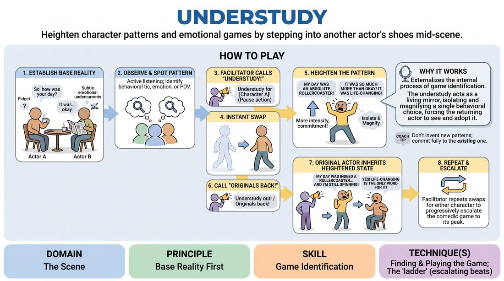

# 🏟️ Showcase round — Understudy

{ .infographic }

> Heighten character patterns and emotional games by stepping into another actor's shoes mid-scene.

`Players 4–99` · `~30 min` · `Complexity 3/5` · `Energy medium` · `Contact none` · `Props: none`

⬅️ [Back to the Week 02 run-sheet](../week-02.md)

## Why this activity, here

Earlier blocks this week had them build base reality and notice the single deviation inside it. This is the showcase: the same skill under pressure, in front of the room, with the deviation handed to someone else to enlarge. It feeds Week 3, where players heighten their own game without an outside eye naming it for them.

## What students actually learn

- They stop treating heightening as "getting weirder" and start treating it as doing the same thing more.
- They learn to watch a scene for repetition rather than for jokes — which changes how they listen when they're the one on stage.
- They find out their own patterns are visible to everyone else, usually before they notice them.
- They get used to inheriting a choice made by another player and continuing it without softening it.

## Setup

Clear a playing area with two chairs available but not compulsory. Seat everyone else in a shallow arc facing it, close enough to step in within two seconds. No props needed. Before the first scene, name the two calls out loud so nobody is guessing: "Understudy for —" and "Originals back". Say clearly that stepping in is voluntary and anyone can stay seated all session.

## How to run it — 30 minutes

| Min | What you do |
|---:|---|
| 3 | Explain the shape. Two players, grounded scene, you freeze it, someone swaps in and plays the pattern bigger, then the original returns carrying the bigger version. Take no questions yet. |
| 4 | Run one demo scene yourself with a volunteer. Make your own pattern obvious — check your watch three times. Swap one player in, swap out, stop. Point at what just happened. |
| 6 | Scene one. New pair. Let base reality land for a full minute before any call. Two swaps. Ten seconds of notes at the end, no more. |
| 6 | Scene two. New pair. Ask the seated group to call the pattern this time — they say the character name, you say when. Two or three swaps. |
| 6 | Scene three. New pair, ideally people who haven't stepped in yet. Push for a third swap and let the pattern get properly loud before you end it. |
| 5 | Final scene or a fourth if time allows, then stop early and debrief seated. Two questions, honest answers, no summing up from you. |

## Side-coaching script

| When | Say |
|---|---|
| First minute of any scene, before a pattern exists | *"Ordinary. Just talk."* |
| Players start inventing incidents instead of relating | *"Nothing new. Stay in the room."* |
| You spot the second occurrence of a repeated behaviour | *"Freeze — understudy for the sister."* |
| The understudy is stepping in | *"Same feet. Same face."* |
| The understudy invents a fresh quirk instead of enlarging the old one | *"Not different. More."* |
| The understudy plays it once and drops it | *"Again. Now again."* |
| Bringing the original back | *"Originals back — keep it up there."* |
| The original shrinks the pattern on return | *"You inherited that. Play it."* |

!!! success "What good looks like"
    The first minute is dull in a good way — two people talking about something small. Then one behaviour repeats and half the seated group leans forward at the same moment. The swap is quick and physically matched. The understudy does the same thing three times in four lines and the room laughs at the third. The original comes back louder than they left and doesn't apologise for it. By the third swap the scene is absurd but still about the original relationship.

## When it goes wrong

| You see | What's causing it | The fix |
|---|---|---|
| Understudies keep adding new eccentricities — a limp, an accent, a phobia that wasn't there. | They've read "heighten" as "be funnier", and inventing is easier than observing. | Stop the scene. Ask the room to say the pattern out loud in one sentence before the swap happens. Restart with that sentence as the only instruction. |
| You can't find a pattern to call, and the scene drifts past three minutes. | The pair are keeping everything neutral, or they're plot-driving so fast nothing repeats. | Side-coach "stay on this topic" and wait. If still nothing at ninety seconds, call an understudy anyway and let the incomer choose any small thing to enlarge. |
| The original returns and quietly plays their old, smaller version. | The enlarged version feels like someone else's character and they're embarrassed to wear it. | Freeze immediately. Say "that's your character now" and resume from the same line. Praise the pickup, not the pattern. |
| The same four confident people step in every time. | Volunteering is self-selecting and fast, so hesitant players never get there. | Name the understudy yourself for the last two scenes. Choose from people who haven't played. Keep their stint to three lines. |

## Scaling

| Class size | What changes |
|---|---|
| **10–13** | One playing area, four scenes of roughly six minutes, two or three swaps each. Everyone gets on stage at least once, most twice. You call every swap yourself. |
| **14–17** | One playing area, four scenes, but cap swaps at two per scene so more people get a turn. Hand the pattern-spotting call to the seated group from scene two onward. |
| **18–20** | Split into two circles of nine or ten in separate corners, each with its own caller — you take one, brief a confident participant for the other. Three scenes per circle, two swaps each. Regroup for the final five minutes and debrief together. |

## Variations

**Named pattern** — Before the swap, the seated group says the pattern aloud in five words or fewer: "he apologises for everything". The understudy steps in with that instruction.  
*Easier — removes the guesswork and makes the heightening target explicit.*

**Double swap** — Replace both players at once. The two understudies must each carry their character's pattern and keep the relationship intact.  
*Harder — no anchor left on stage, so both incomers must have been watching properly.*

**Understudy down** — The understudy plays the pattern with less intensity than the original — quieter, more suppressed, more contained.  
*Different emphasis — shows that commitment, not volume, is what makes a pattern read.*

## Debrief

1. **When you were watching, what made a pattern obvious to you?**
   > *A good answer sounds like:* They point at repetition and specifics — "she said 'anyway' three times to change the subject" — rather than "he was funny". Somebody mentions noticing it before the player did.

2. **What was it like coming back into your own character after the understudy?**
   > *A good answer sounds like:* Honest discomfort. "It felt too big." "I wanted to dial it down." Ideally followed by someone saying it played better once they stopped fighting it.

3. **Did any scene stop being about the relationship once the pattern got loud?**
   > *A good answer sounds like:* They can name the moment — usually a third swap where the behaviour detached from who the people were to each other. Not a defence, just a spotted seam.

!!! warning "Safety & inclusion"
    No contact is required. If a scene drifts toward touch, side-coach distance rather than stopping the scene. Stepping into another player's position means matching posture, not touching them — the original steps clear first. Say at the top that watching is a full role: pattern-spotting is the same skill from a seat, and anyone can decline a swap by shaking their head, at which point you name someone else without comment. Enlarging a pattern can tip into mimicry of a person's voice or body in a way that stings; if you see a player being copied rather than their character, freeze and redirect to the behaviour. Chairs available for anyone who prefers to play seated.

## Why it works

Heightening fails when players try to escalate by adding. This forces the opposite: the understudy arrives with nothing of their own and can only amplify what already exists, so "more" is the only available move. The outside eye does the noticing, which is the hard half of the skill, and demonstrates it publicly — the pattern gets named by being played, not described. Returning the original then closes the loop: they receive their own behaviour back at a size they wouldn't have chosen, and have to keep it. That completes the session cue. Base reality is built by the first pair; the one odd thing is identified by the room; the swap makes it undeniable.

[Open the full activity card »](../../../../games/D3_P2_S1_T1_G880__understudy.md){target=_blank rel=noopener}
