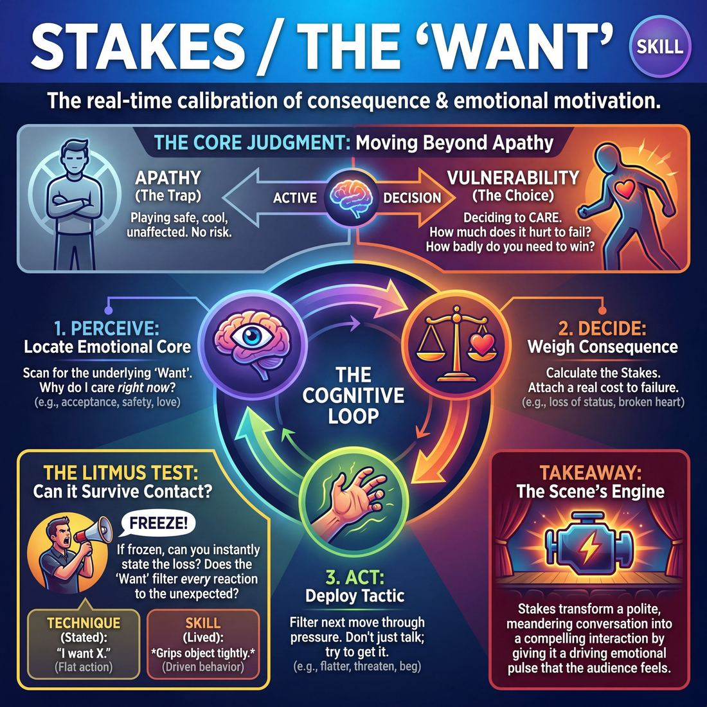

# Week 03 — The Want — Stakes & Objectives

> *A scene starts to matter the moment someone in it can lose something.*

| Course | Week | Domain | Focus | Stage | Length | Class |
|---|---|---|---|---|---|---|
| The Engine — Scene & Ensemble | 3/8 | D3 | `D3.S4` — Stakes / The 'Want' | Advanced Beginner → Competent | 180 min | 10–20 |

!!! note "Builds on"
    Last week gave them a normal and an exception; this week hangs a person's need on that exception so the exploring has somewhere to go.

## 🎬 The arc of this session

They arrive able to build a clean premise and hold it — last week's normal and exception gave them tidy, legible scenes that nobody in them actually needs anything from. Over the session you hang a person's need on that structure: what this character wants from the one standing opposite, what happens to them if they don't get it, and why they can't just walk out. They leave with scenes that have a temperature — uneven turns, someone pressing, someone resisting — and a cue they can run on any scene they watch.

!!! tip "Watch for"
    Politeness. This group likes each other now, and that shows up as instant granting — one player asks, the other hands it over inside two lines and the scene has nowhere to go. Watch for the second player agreeing before the first has finished the sentence, and name it as generosity pointed the wrong way.

## ⏱️ Session flow (180 minutes)

| Time | Block | Activity |
|---|---|---|
| **0:00–0:05** | 🧊 Ice-breaker | *Last Photo, Five Words* |
| **0:05–0:10** | 😄 Laughter Blast | *Slow-Motion No* |
| **0:10–0:25** | 🔥 Warm-up cluster | *Ten Seconds Left*, *If I Don't*, *Last of Its Kind* |
| **0:25–0:45** | 🧠 Theory | — |
| **0:45–1:10** | 🎲 Drill A — isolation | *The Truth Cascade* |
| **1:10–1:20** | ☕ Break | — |
| **1:20–1:45** | 🎲 Drill B — under load | *Stakes Topography* |
| **1:45–2:20** | 🎯 Scene Lab | *Consequence Countdown* |
| **2:20–2:50** | 🏟️ Showcase round | *The Shifting Want* |
| **2:50–3:00** | 💭 Reflection & homework | — |

## 🎒 Before you start

- Clear a playing area big enough for two players plus a full standing circle around it. Chairs stacked at the side, not in a ring — you want the watchers on their feet for most of the day.
- Print or write on the board: "What do they stand to lose?" Leave it up all session. It is the only thing they need to remember.
- Two chairs available for Drill B and Scene Lab. Nothing else. No props today — props give them something to play with instead of each other.
- Review last week's homework aloud in the first ten minutes: ask two people for the normal-and-exception pair they noticed in ordinary life. Do not workshop them. You are only reminding the room what they already own.
- Have a timer with an audible end (phone is fine). Consequence Countdown and Ten Seconds Left both need the room to hear the clock, not watch you.
- Decide your groupings before anyone arrives: at 10-13 you run one circle throughout and everyone sees every showcase scene; at 14-17 you split into two circles for the warm-up cluster and Drill A and rejoin from Drill B; at 18-20 you run three circles for warm-ups, two for Drill A, and you will need to cut the showcase to one scene per pair rather than two.

## 1. 🧊 Ice-breaker (5 min)

*Phones out, circle up. Last photo you took — five words, no explanation, no apology for it being a receipt.*

**Why here:** Gets voices in the room and puts personal specifics on the table before you ask them for character specifics.

### Last Photo, Five Words

> Everyone describes the most recent photo on their phone in five words or fewer, no scrolling for a better one.

`Players 10–20` · `~5 min` · `Complexity 2/5` · `Energy medium` · `Contact none` · `Props: none`

**How to play**

1. Circle everyone up standing, phones out. Tell them to open the most recent photo on their camera roll — the actual last one. No scrolling for a better or funnier one.
2. Say: if the last photo is private, use the most recent one you're happy to describe out loud. No one shows a screen to anyone.
3. Have everyone turn to a neighbour and describe their photo and why it exists — all at once, everybody talking. Tell them nobody has to listen. Just get it out.
4. Go round the circle one at a time. Each person describes their photo in five words or fewer. Cut anyone who hits six. No questions, no explaining, keep it moving.
5. Run a second lap in the same order. One word each: how you felt when you took it. Take the first word out of their mouth, then move to the warm-up.

📄 **[Full teaching notes »](week-03/intermediate_w03__b1_1.md)**

**Side-coach:** *“Five words, not a sentence. Next.”*

## 2. 😄 Laughter Blast (5 min)

*On your feet, spread out. We are going to practise saying no badly and slowly, because later I am going to ask you to mean it.*

**Why here:** Today's work depends on someone being willing to refuse, and this is refusal with no cost attached.

### Slow-Motion No

> The whole room drops the same enormous film-trailer "nooooo" in slow motion, together, three times over.

`Players 10–20` · `~5 min` · `Complexity 1/5` · `Energy high` · `Contact none` · `Props: none`

**How to play**

1. Get everyone standing in one circle, arms' length apart. Say the whole block is one sound: a huge film-trailer "nooooo", dropped in slow motion, together.
2. Demonstrate once at full size. Bend the knees, stretch a long low "noooooo" across about five seconds. Tell them to go bigger than feels sensible.
3. Count three and run three reps together, everyone at once, each at their own volume. Reset to standing between reps.
4. Add the reach. Both hands to the ceiling, knees soften, chin lifts on the sound. Run three more reps all together.
5. Rewind it. Same movement backwards, sound backwards: a fast high "oooon" as they fold up to standing. Three reps.
6. Open it up. Twenty seconds of slow-mo and rewind at any speed, overlapping, nobody synchronised. Call "freeze" and hold two seconds.
7. Ask one question: what were you losing? Take two or three words from the room, then move straight on. Do not discuss further.

📄 **[Full teaching notes »](week-03/intermediate_w03__b2_1.md)**

**Side-coach:** *“Slower. Let the no take up room.”*

## 3. 🔥 Warm-up cluster (15 min)

*Three warm-ups back to back, fifteen minutes, no notes between them. Just play them and notice which one makes your chest tighten.*

**Why here:** Three short forms that each isolate one part of the day — time pressure, consequence, irreplaceability — before you name any of it as theory.

### Ten Seconds Left

> The whole room mimes a mundane task against a shouted countdown, then names what it just lost.

`Players 10–20` · `~5 min` · `Complexity 2/5` · `Energy high` · `Contact none` · `Props: none`

**How to play**

1. Spread the room out. Everyone needs arm's length in every direction and a clear sightline to you. No partners, no circle — everyone works alone, all at once.
2. Explain the shape: you name a mundane task and a deadline. The whole room mimes it flat out while counting down from ten together, out loud. Everyone freezes on zero.
3. Run two plain rounds to set the mechanism. Call "the lift doors are closing and your bag is inside", count ten to zero with them, freeze. Then "the pan is boiling over". Count. Freeze.
4. Add the loss. Run three rounds the same way, but on zero everyone shouts one or two words naming what they just lost — "my train", "the dinner", "my job". All at once, no turn-taking.
5. Shorten the fuse. Run three rounds counting from five, with costlier tasks: the interview call is ringing, the cement is setting, the baby is waking. Shout the loss on zero.
6. Stop. Shake the arms out. Say one line and move on: the countdown is not the point — what the countdown costs you is.

📄 **[Full teaching notes »](week-03/intermediate_w03__b3_1.md)**

### If I Don't

> In pairs, one person hands over a small everyday want and the other answers, eye to eye, with what they lose if they fail.

`Players 10–20` · `~5 min` · `Complexity 2/5` · `Energy medium` · `Contact none` · `Props: none`

**How to play**

1. Pair everyone off. Odd number, make one three and have them rotate the answering seat.
2. Explain the shape: A says a small everyday want in one sentence. B answers immediately, holding eye contact, starting "If I don't, I lose..."
3. Demo once with a volunteer. Give them a want. Take their answer. Don't comment on it. Move on.
4. Run round one. A feeds a new want every few seconds. B answers each time. No discussion, no jokes about the answer. Aim for six or seven exchanges.
5. Swap. B feeds, A answers. Tell the feeders to go smaller than last round: post a letter, unload the dishwasher, ring your sister back.
6. Send everyone to a new partner. Now alternate — you give a want, they answer, they give a want, you answer. Faster, eye contact stays.
7. Have each pair pick the one loss that landed hardest. Go round the room, one pair per turn, one sentence each. Then stop the exercise cleanly.

📄 **[Full teaching notes »](week-03/intermediate_w03__b3_2.md)**

### Last of Its Kind

> A single small object travels the circle in silence as the last one in existence, and whoever holds it when you clap says what losing it would cost.

`Players 8–20` · `~5 min` · `Complexity 2/5` · `Energy low` · `Contact incidental` · `Props: required`

**How to play**

1. Circle everyone up standing. Hold up one small object — a key, a pebble, a teaspoon. Tell the room this is the last one of its kind on earth.
2. Give four rules: silence, both hands, eyes meet at every handover, nobody throws it.
3. Offer the opt-out now. Anyone who would rather not take it hand-to-hand receives on a flat open palm, or lets it be set down in front of them to pick up.
4. Start it round the circle. Silent. Each person holds still with it for two full seconds before passing on.
5. Coach the pace down until the rushing stops. Slower hands, longer look, no hurry to be rid of it.
6. Keep it travelling and clap roughly every fifteen seconds. Whoever is holding it says one quiet sentence: "If I lose this, I lose ___." Then it moves on.
7. Take the object back yourself. Say the cue once — what do they stand to lose. No applause. Go straight into the next thing.

📄 **[Full teaching notes »](week-03/intermediate_w03__b3_3.md)**

**Side-coach:** *“Say what you lose, not what you feel about losing it.”*

## 4. 🧠 Theory — Stakes / The 'Want' (20 min)

{ .infographic }

- **The big idea:** A want is not a topic, it is a demand aimed at the person opposite. Stakes are what it costs the character to leave the scene without it.
- **Where you are on the path:** They can already build a premise and stay in it. What is missing is pressure — nobody in their scenes needs anything, so the scenes are pleasant and inert. Competent, for today, means every character on the floor has a named thing to lose, and both players know what the other's is.
- **The one cue to coach:** *“What do they stand to lose?”*

**The three beats**

1. **Say it.** Say: a scene is legible when we know where we are. A scene matters when we know what someone will lose. Then split it into two questions the players must be able to answer at any point — what do I want from you, and what happens to me if I don't get it. Stress that the want must be from the partner, not from the world. "I want a promotion" is a topic. "I want you to tell them I'm ready" is a want. And stress the second half: the cost has to be specific and personal, not big. Losing a friend's respect beats losing a city.
2. **Show it.** Take a volunteer. Run sixty seconds of a scene where you ask them for a lift to the airport, and they say yes immediately. Let the room feel it die. Reset. Same opening, but this time tell them in front of everyone: you have a reason you cannot say yet, and you will not say yes. Play it again for sixty seconds. Point at the difference and say nothing clever about it. Ask the room only: what did I stand to lose?
3. **Try it.** Pairs, standing, three minutes. A says one sentence: "I need you to ___." B says one sentence: "If I do that, I lose ___." Swap roles. Two rounds each. No scene, no acting — just the two sentences, said to a real face. Then thirty seconds: hands up if your partner's answer surprised you. At 18-20, make them trios with one listener who says whether the want was aimed at the person or at the world.

!!! warning "The misunderstanding that always comes up"
    They hear "stakes" and reach for scale — bombs, terminal diagnoses, the end of the world. That is size, not stakes. Correct it early: the measure is not how bad the outcome is, it is how much this specific character cannot afford it. A teenager losing face in front of one classmate has higher stakes than a stranger losing a planet.

!!! abstract "📖 Go deeper"
    Read the full write-up: [Stakes / The 'Want'](../../../theory/03_the-scene/03_S4__stakes-the-want.md)

## 5. 🎲 Drill A — isolation (25 min)

*Two circles, no scenes yet. We are only working the ladder: each answer costs a bit more than the one before it.*

**Why here:** Isolates the want from the scene entirely, so they practise raising cost without having to also invent a story.

### The Truth Cascade

> Escalate dramatic tension instantly by justifying and integrating sudden, high-stakes narrative truths.

`Players 3–99` · `~25 min` · `Complexity 3/5` · `Energy medium` · `Contact none` · `Props: none`

**How to play**

1. Bring two players up. Give them a relationship: neighbours, siblings, driving instructor and pupil. Tell them to start ordinary — real place, real activity, no jokes required.
2. Let them establish who they are to each other and where they are. Stay out of it for the first minute or so.
3. When the scene settles or starts drifting, call "Freeze." Both players stop moving and stop talking on the word.
4. Say one Cascade Truth: a short declarative sentence that raises what is at risk between these two. "You have not paid the mortgage in four months."
5. Hold the freeze for three or four seconds of silence. The players fit the truth into what already exists. Nothing is contradicted; everything is now heavier.
6. Call "Unfreeze." Within their first line or two, one or both players must speak or behave as if the truth has always been true.
7. Let the scene run on the new stakes for a minute. Then freeze again. Give a second truth that builds on the first, not a fresh topic.
8. Run two or three truths total, then let the pair land the scene once the last one has cost them something. Clap them out.

📄 **[Full teaching notes »](week-03/intermediate_w03__b5_1.md)**

**Side-coach:** *“Don't jump to the worst thing. One rung.”*

## ☕ Break — 10 minutes

Water, notes, informal talk. Non-negotiable at three hours — do not let it collapse into a working discussion.

## 6. 🎲 Drill B — under load (25 min)

*Back into one group. Chairs out. Now you both want something, and you both stand to lose — and neither of you is allowed to make it easy.*

**Why here:** Puts the same skill under scene conditions, with both players holding a cost at once — this is where the polite granting will surface.

### Stakes Topography

> Navigate physical stage zones to dynamically escalate, de-escalate, and resolve narrative tension in real time.

`Players 2–99` · `~25 min` · `Complexity 3/5` · `Energy medium` · `Contact none` · `Props: required`

**How to play**

1. Tape five zones on the floor in a rough cross: Neutral Ground in the centre, Dilemma Alley, Crisis Point, Resolution Nook and Consequence Junction around it. Label each with paper.
2. Send two players into Neutral Ground. Tell them to open a plain scene: who they are to each other, where they are, what they are doing.
3. Tell players they may step into any adjacent zone at will. The instant a foot crosses a line, both players shift the scene's tension to match that zone.
4. Set the zone rules: Dilemma Alley means naming a concrete problem or obstacle. Crisis Point means an urgent emergency demanding action now. Neutral Ground means ordinary pressure.
5. Give them the Stakes Check: either player taps the floor twice and asks 'What are the stakes, right now?' The partner answers instantly, in character, in one line.
6. Once pairs move confidently on their own, take control. Call 'SHIFT!' and point at a zone. Players walk there immediately and justify the new pressure as they arrive.
7. Require the shift in the body and the voice, not just the words. Posture, breath and pace change on the crossing, then dialogue catches up.
8. End every scene in Resolution Nook or Consequence Junction. Call 'Scene' the moment they arrive and land a final line.

📄 **[Full teaching notes »](week-03/intermediate_w03__b7_1.md)**

**Side-coach:** *“You just gave it away. Take it back and tell us why you can't.”*

## 7. 🎯 Scene Lab (35 min)

*Same skill, but now there is a timer and it does not care how you're feeling. Two players up, the rest around the edge, eyes on the person who is losing.*

**Why here:** The clock does the work you have been doing by hand — it forces the want to escalate without anyone deciding to escalate.

### Consequence Countdown

> Escalate narrative tension under rapid-fire time constraints and high-stakes external consequences.

`Players 2–99` · `~35 min` · `Complexity 3/5` · `Energy high` · `Contact none` · `Props: none`

**How to play**

1. Take a location, a relationship and one small everyday problem from the room. Keep it ordinary. Send two players into the playing area and start them straight away.
2. Tell the pair to establish who they are to each other and where they are within the first thirty seconds. No preamble, no long setup.
3. Require each player, inside the first minute, to state or show what they want and the small thing they lose if they don't get it.
4. Let the scene run about two minutes untouched. You are building a real relationship and a real room before anything is threatened.
5. Freeze the scene. Speak directly to one or both characters. Name a new, specific external consequence attached to the want they already declared. Set forty-five seconds. Unfreeze.
6. Tell players to take the threat as true, raise urgency, and keep chasing the same want. They justify the threat inside the fiction; they never argue with it.
7. Freeze at the buzzer. Raise the consequence so it builds logically or comically on the last one. Set thirty seconds. Unfreeze.
8. Freeze once more. Give one extreme, near-impossible consequence. Set fifteen to twenty seconds. Unfreeze and let them go flat out.
9. Cut the scene on the final buzzer at the peak of tension. Do not let them resolve it, tidy it, or explain it afterwards.

📄 **[Full teaching notes »](week-03/intermediate_w03__b8_1.md)**

**Side-coach:** *“Twenty seconds left. Ask for it again, differently.”*

## 8. 🏟️ Showcase round (30 min)

*Last round. You will play, and when you are watching you have one job: name what each character stood to lose. One line, no advice.*

**Why here:** Shows them they can hold a want that moves mid-scene, and the watcher note trains the diagnostic eye they need for the rest of the course.

### The Shifting Want

> Drive narrative momentum by continuously evolving character objectives and raising what they stand to lose.

`Players 2–99` · `~30 min` · `Complexity 3/5` · `Energy medium` · `Contact none` · `Props: none`

**How to play**

1. Bring two players into the space. Everyone else sits and watches. Keep the audience close so the scene doesn't have to shout.
2. Take one suggestion from the room — a place or a relationship. Take the first one offered. Don't collect options.
3. Tell Player One to start and to name a concrete want out loud inside their first three lines. Object, action, answer — something you could film.
4. Tell Player Two to answer that want directly: grant it, block it, or complicate it. Then name their own conflicting want and one consequence if they fail.
5. Have them alternate lines, each line built on the line before: if that's true, what else is true. No resetting, no new topics.
6. Tell them the want may change as the situation changes — but each new want must follow from what just happened, and each must carry a fresh thing at risk.
7. Side-coach into the scene while it runs. Call 'Want!' when an objective goes vague. Call 'Stakes!' when consequences stop moving.
8. Cut after four to six escalations, on a peak of pressure or an impossible choice. Say 'scene' clearly and start the applause.

📄 **[Full teaching notes »](week-03/intermediate_w03__b9_1.md)**

**Side-coach:** *“The want just changed. Play the new one.”*

## 9. 💭 Reflection & homework (10 min)

**Deepen your improv**
1. In your scene today, what did your character want from the other person — not from the world? If you can't name it in one sentence starting with "I need you to", where did the scene go instead?
2. Think of the moment your partner refused you. What did that give you to play that agreement would not have?

**Beyond the stage**
3. Think of something you asked someone for in the last month. What would you have lost if they'd said no — and did you let them know that?

➡️ **[This week's homework](../homework/HW-INTW03.md)**

??? note "🎓 Facilitator notes"

    **Timing risks**
    - The theory block runs long because the sixty-second demo scenes invite discussion. Cap the room's response to one question — what did I stand to lose — and move.
    - Drill B is the block most likely to overrun at 18-20, because everyone wants a turn. Set the rotation before you start and run it as a hard clock; some people will do the drill once and that is acceptable.
    - The showcase at 18-20 will not fit two scenes per pair. Cut to one and keep the watcher note — the note is the part that teaches.

    **Failure modes this week**
    - Escalation into disaster. They mistake stakes for melodrama and reach for death, illness, catastrophe. Redirect to the person: who specifically finds out, and what do they think of you afterwards.
    - Instant granting out of friendliness. The second player says yes to be a good scene partner. Reframe refusal as the gift, out loud, more than once.
    - Wants aimed at the world rather than the partner — "I want to be respected", "I want a better life". Make them re-say it as "I need you to..." on the spot.
    - Players narrating stakes instead of playing them. "I could lose everything" spoken flatly is a caption. Ask for the behaviour instead: what does someone who can't afford this do with their hands, their volume, their next question.

    **What good looks like by the end:** By the showcase, turns stop being even. One player presses twice in a row, the other resists without blocking, and the scene has a lean to it. Watchers can name what each character stood to lose without hedging, and the answers are small and specific rather than enormous. You should hear at least one scene go quiet in a way that isn't awkward.

    **Carry into next week:** They now have a person with a need pinned to last week's premise. Next week that need has to survive contact with a second one — bring forward any scene from today where the two wants were actually incompatible, and name it in the first ten minutes as the thing you are about to build on.
