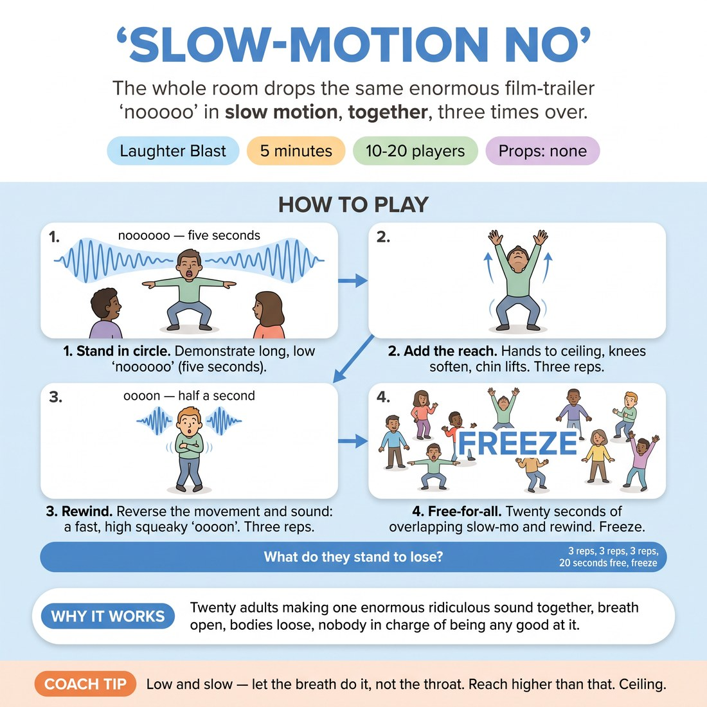

# 😄 Laughter Blast — Slow-Motion No

{ .infographic }

> The whole room drops the same enormous film-trailer "nooooo" in slow motion, together, three times over.

`Players 10–20` · `~5 min` · `Complexity 1/5` · `Energy high` · `Contact none` · `Props: none`

⬅️ [Back to the Week 03 run-sheet](../week-03.md)

## Why this activity, here

Week 3 is about the want and what it costs to miss it. This block sits at the front of the session, before anyone has to build a scene. It puts loss in the body first — the sound a person makes when the thing they wanted is going away — so that when you later say "what do they stand to lose?", the class has already made that noise out loud in a room full of people. It feeds directly into the scene work that follows: an actor who has physically committed to a big "no" is less likely to play the next scene at a shrug.

## What students actually learn

- Their voice can go louder and lower than they normally allow, and nothing bad happens.
- Stakes are felt before they are decided — the body reaches the loss before the head names it.
- Doing something oversized in unison is easier than doing it alone, and the unison makes the oversize normal.

## Setup

Clear a circle big enough for everyone to raise both arms without touching. No chairs, no props. Check the ceiling and light fittings if the room is low. You stand in the circle, not outside it — you do every rep with them.

## How to run it — 5 minutes

| Min | What you do |
|---:|---|
| 1 | Circle up. Demonstrate once at full size: knees bend, long low "noooooo" over five seconds. Then count three and run the first three reps together, standing tall between each. |
| 1 | Add the reach — both hands up, knees soft, chin lifting. Three more reps together on your count. Push the volume up a notch between reps. |
| 1 | Rewind. Fast high squeaky "oooon" as they fold back to standing. Demonstrate once, then three reps together. |
| 1 | Free-for-all: twenty seconds of slow-mo and rewind at any speed, overlapping. Call "freeze". Hold two seconds in silence. Release. |
| 1 | Ask: what were you losing? Take two or three quick answers, no more than a few words each. Say the cue — "what do they stand to lose?" — and move on. |

## Side-coaching script

| When | Say |
|---|---|
| During your demonstration | *"Bigger than is sensible. That's the size."* |
| On the first unison rep | *"Lower. Let it come from the floor."* |
| When adding the reach | *"Hands all the way up. Chin follows."* |
| If the sound is polite or short | *"Stretch it. Five seconds, not two."* |
| Going into rewind | *"Backwards and fast. Squeaky."* |
| During the free-for-all | *"Don't match anyone. Your own speed."* |
| On the freeze | *"Freeze. Hold it. Don't laugh it off."* |
| Straight after the last answer | *"That's the note. Carry it into the next thing."* |

!!! success "What good looks like"
    The room is loud and slightly ridiculous. Nobody is watching anybody. By the second set of reps the sound has dropped in pitch and gained length, and at least half the circle is fully extended with arms up. The freeze holds for two real seconds before it collapses into laughter. Answers to the closing question are concrete and quick — "the last train", "my dog" — not abstract.

## When it goes wrong

| You see | What's causing it | The fix |
|---|---|---|
| Thin, high, short "no"s that end after two seconds and trail into giggles. | People are still self-monitoring and hedging the size. | Stop coaching volume. Coach duration instead: "count five in your head before you run out". Length pulls the size up on its own. |
| Half the circle watching the other half instead of doing it. | You demonstrated from outside the circle, so it reads as a performance to be judged. | Stand in the circle and do every rep at full commitment. Close your eyes for one rep and tell them to do the same. |
| The rewind turns into general noise and the shape is lost. | They heard "fast and silly" and stopped tracking the movement. | Call it as one instruction: "same shape, backwards, half a second". Do one slow demonstration of the fold before running the reps. |
| The closing question turns into a conversation. | Someone gives an interesting answer and you follow it. | Take words, not sentences. Say "one thing each, three people" before you ask, and move the moment you have three. |

## Scaling

| Class size | What changes |
|---|---|
| **10–13** | One circle. Run the full six reps as written and give the free-for-all the full twenty seconds — a small room needs the extra time to reach volume. |
| **14–17** | One circle, arms' length plus a step. Same rep counts. Expect the unison to drift slightly; count the start clearly and let the ends stagger. |
| **18–20** | One circle, pushed to the walls. Drop to two reps in the reach set and two in the rewind to protect the minute. Count the start loudly — twenty people need a bigger cue. |

## Variations

**Sitting no** — Run the whole thing seated in the circle. Reach and chin lift only, no knees.  
*Easier — removes the standing and the full-body extension, useful for mixed mobility or a very tight room.*

**Name the loss first** — Before each set of reps, each person silently picks one thing they are losing. Same reps, no sharing.  
*Harder — adds specific private content, so the sound has to carry a real object rather than a general noise.*

**Call and answer** — Split the circle in half. One half drops the slow "no", the other half answers with the rewind, then swap.  
*Different emphasis — shifts from unison courage to listening and timing off another group.*

## Debrief

1. **What were you losing?**
   > *A good answer sounds like:* Something specific and fast: "the keys", "my brother", "the last bus". Two or three answers, then stop. If you hear "nothing, I was just making a noise", that is honest — take it and move on rather than pushing.

2. **Which rep was the biggest?**
   > *A good answer sounds like:* "The third one" or "the free-for-all" — a recognition that size grew once they stopped counting themselves. You do not need agreement, just the observation. Move on inside thirty seconds.

!!! warning "Safety & inclusion"
    No contact. Check spacing so nobody clips a neighbour on the reach. Anyone with back, knee or shoulder trouble does the sound only, or the seated version — say this before the demonstration, not as an afterthought. Anyone who needs to be quiet can mouth it and do the shape. Warn the class the noise is coming if there is another group in the building, and tell them so they don't feel they have to hold back.

## Why it works

The session skill is stakes — knowing what a character stands to lose. Stakes fail in scenes because people decide them intellectually and never let them reach the voice or the spine. This block reverses the order. The body makes the shape of loss (extension, low pitch, long duration) before anyone has named a thing to lose, so the physical vocabulary exists first and the naming can attach to it later. Unison does the rest: an oversized sound is exposing alone and unremarkable when eighteen people make it at once, which lets people find their upper range without the risk of being the only one there. The closing question is deliberately unanswered — it plants the cue rather than resolving it.

[Open the full activity card »](../../library/laughter/LB__slow-motion-no.md){target=_blank rel=noopener}
