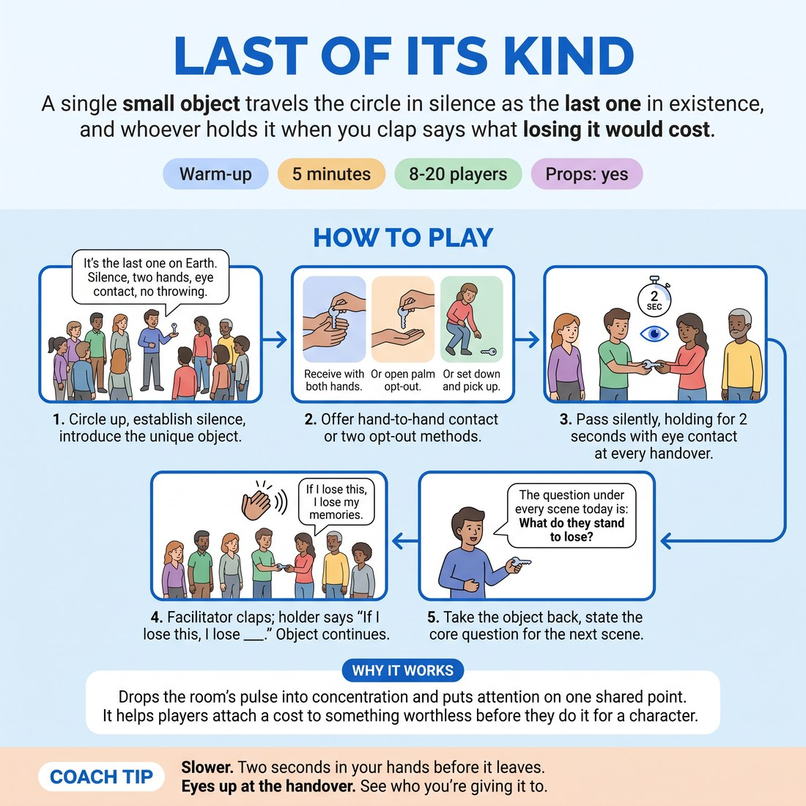

# 🔥 Warm-up cluster — Last of Its Kind

{ .infographic }

> A single small object travels the circle in silence as the last one in existence, and whoever holds it when you clap says what losing it would cost.

`Players 8–20` · `~5 min` · `Complexity 2/5` · `Energy low` · `Contact incidental` · `Props: required`

⬅️ [Back to the Week 03 run-sheet](../week-03.md)

## Why this activity, here

Opens Week 3. The room has spent two weeks on listening and agreement; today it learns that a scene needs someone who stands to lose something. This puts loss in the hands before it goes in the mouth — the physical care comes first, the sentence second. It feeds every scene block that follows, where you will ask the same question out loud.

## What students actually learn

- That stakes are something you treat an object with, not something you announce.
- That naming what you'd lose takes one plain sentence, not a speech.
- That slowing down makes a thing matter more than speeding up ever does.

## Setup

Standing circle, no chairs, arms' length apart. One small, unbreakable, roughly palm-sized object — a door key, a smooth stone, an old teaspoon, a single glove. Nothing valuable, nothing sharp, nothing you'd mind dropping. Have it in your pocket so the reveal is the first thing they see. Clear the floor of bags.

## How to run it — 5 minutes

| Min | What you do |
|---:|---|
| 1 | Circle up. Hold the object out. Tell them it is the last one on earth. Give the four rules — silence, both hands, eyes at handover, no throwing. Offer the opt-out: open flat palm, or set it down to be picked up. |
| 1 | Send it round in silence. Two seconds still in each pair of hands before it moves. Walk the outside of the circle and slow the pace with your voice until the hurry drains out. |
| 2 | Keep it moving. Clap roughly every fifteen seconds. Whoever holds it says one sentence — "If I lose this, I lose ___" — then passes on. Aim for eight to ten claps. |
| 1 | Clap a last time, take the object back into your own hands. Say the cue: what do they stand to lose. Hold it up once more, pocket it, move straight into the next block. No applause. |

## Side-coaching script

| When | Say |
|---|---|
| First pass, hands still quick | *"Slower. It doesn't want to leave you."* |
| Eye contact skipped | *"Look up before you let go."* |
| Someone grins and rushes the handover | *"Two seconds. Hold it."* |
| First clap | *"If I lose this, I lose — one sentence."* |
| Sentence turns into a paragraph | *"Shorter. One thing."* |
| Someone reaches for a joke | *"Plain is enough."* |
| Room has gone quiet and careful | *"That's the weight. Keep it."* |
| Final clap | *"Last one. Then it's mine."* |

!!! success "What good looks like"
    The room goes quiet without you asking twice. Hands slow down. People look at each other at the handover instead of past each other. The sentences are short, unadorned and slightly awkward — "I lose the last thing my mum gave me", not a routine. Nobody applauds anything. When you take the object back there is a small pause before the room lets it go.

## When it goes wrong

| You see | What's causing it | The fix |
|---|---|---|
| Giggling, exaggerated reverence, the object passed like a comedy prop. | The premise feels precious and the room is defending against it with irony. | Stop the pass. Say "Silence. Two seconds each." Restart. Do not explain or defend the exercise — the slower pace kills the giggle on its own within one circuit. |
| Sentences that are all jokes — "if I lose this I lose my will to live." | They think a sentence has to be interesting to be worth saying. | Side-coach "Plain is enough." Model one yourself on the next clap: "If I lose this, I lose the only key to the flat." Concrete and boring beats clever. |
| Long pauses, people freezing when the clap lands on them. | They are searching for the right answer instead of any answer. | Call "Anything true. Say it wrong." If they still stall after three seconds, say "Pass it on" and let the clap find someone else. Don't wait them out. |
| The pass speeds back up as soon as you stop coaching. | Group nerves; movement discharges tension. | Stand still in the middle of the circle for one circuit. Your stillness slows the ring faster than instructions do. |

## Scaling

| Class size | What changes |
|---|---|
| **10–13** | One circle. The object gets round roughly twice. Clap every fifteen seconds, about ten claps — most people speak once. Keep the full two-second hold. |
| **14–17** | One circle still. The object gets round about once and a half. Clap every twelve seconds so more voices land; accept that three or four people won't be caught by a clap. |
| **18–20** | Two circles, two objects, run simultaneously. Position yourself between them and clap once for both. Drop the hold to one second so each object completes a circuit. Roughly half the room speaks — that is fine, do not extend. |

## Variations

**Named object** — Before you send it round, tell them what the object is — the last front-door key on earth, the last photograph. They fill in the sentence against that.  
*Easier. Removes the invention step; they only supply the loss.*

**Second person** — On the clap, the holder says what the person who just passed it to them would lose. "If you lose this, you lose ___."  
*Harder. Requires reading someone else and offering them a want, which is exactly what scene partners do.*

**Two objects, one wanted** — Send two objects the opposite way round. Only one is the last of its kind; do not say which. On the clap, whoever holds either one says whether theirs is the real one and what losing it costs.  
*Different emphasis — shifts from stakes to commitment, since the value comes entirely from how they hold it.*

## Debrief

1. **What changed in your hands when the pace slowed?**
   > *A good answer sounds like:* Something physical and specific — "I started holding it with two hands without being told", "I didn't want to be the one who dropped it." Not "it felt more meaningful." Move on when one person names a bodily change.

2. **Which sentence in the room landed hardest?**
   > *A good answer sounds like:* They quote someone else's actual words and it's a plain one — a person, a place, a thing they can't replace. If they quote a joke, ask why that one and let the room notice the difference.

3. **So what does a scene need that this had?**
   > *A good answer sounds like:* Something like "someone who'd mind losing it." You want them to arrive at the cue in their own words. Once one person says it, say the cue back cleanly and stop.

!!! warning "Safety & inclusion"
    Hand-to-hand contact is optional and offered before the first pass, not after. Two alternatives: receive on a flat open palm with no touch, or have the object set down on the floor in front of you to pick up. Say both aloud so nobody has to ask. Nobody must speak on the clap — "pass" is a complete answer and you move the object on without comment. The object is drop-proof and worthless; say so if anyone looks anxious. Standing is not required — a seated circle works identically, and if one person sits, keep the circle low so eye lines match.

## Why it works

Stakes are usually taught as information — tell us what your character wants. That produces announcements. This routes it through the body first: the two-second hold and the enforced eye contact make the object behave as if it matters, before anyone has to claim that it does. By the time the clap lands, the sentence is describing something already true in the room rather than inventing something out of nothing. That is the mechanism behind the cue — what they stand to lose is legible in how they handle it, and only afterwards in what they say. Five minutes of this gives you a physical reference you can point back to all session: when a scene goes flat, ask whether they're holding it like the last one.

[Open the full activity card »](../../library/warmups/WU__last-of-its-kind.md){target=_blank rel=noopener}
