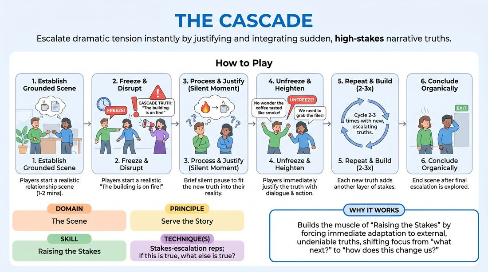

# 🎲 Drill A — isolation — The Truth Cascade

{ .infographic }

> Escalate dramatic tension instantly by justifying and integrating sudden, high-stakes narrative truths.

`Players 3–99` · `~25 min` · `Complexity 3/5` · `Energy medium` · `Contact none` · `Props: none`

⬅️ [Back to the Week 03 run-sheet](../week-03.md)

## Why this activity, here

Week 3 opens with the want. Players can now name what a character is after; they still play it as preference rather than need. This drill isolates the second half of the cue — the loss — by handing it to them from outside, so no one has to invent stakes and act on them at the same time. It feeds Drill B and the long scenes later in the session, where players generate their own raises without a caller.

## What students actually learn

- They stop treating a new piece of information as an interruption and start treating it as something that was always true.
- They feel the difference between saying a stake out loud and letting it change how they behave towards the other person.
- They notice that raised stakes narrow choices rather than widen them — fewer options, more urgency.
- They get comfortable being frozen and not knowing yet. The three seconds of silence stop being panic.

## Setup

Clear a playing area with a chair or two. Audience in a loose arc facing it. Write ten or twelve Cascade Truths on index cards beforehand so you are never inventing under pressure — money, health, a lie about to surface, someone arriving, a deadline, a shared secret. Keep them about the two people on stage. Have a marker and blank cards for the audience-supplied round. State your content boundaries before the first scene.

## How to run it — 25 minutes

| Min | What you do |
|---:|---|
| 3 | Frame it in one line: the caller adds truths, the players make them have always been true. Bring up two volunteers, run forty seconds of scene, freeze, give one truth, unfreeze, stop after their next exchange. Point out the justification. |
| 5 | Scene one. New pair. Relationship suggestion from the room. You call three truths, roughly a minute apart, each building on the last. Let them land the ending. No notes yet. |
| 4 | Scene two. New pair. Same shape, three truths. Push the second and third truths harder — make them about the relationship, not the world. |
| 2 | Stop and give one note to the whole room, drawn from what you have seen: usually "justify, do not explain" or "let it land on the other person, not on us." |
| 4 | Scene three. New pair. Take the truths from the audience on cards — collect three while the scene starts, read only the ones that raise stakes between the two players, discard plot bombs silently. |
| 4 | Scene four. New pair. Tell the players this time to name, in behaviour or line, what they stand to lose after each truth. Call three truths. |
| 3 | Sit everyone down. Run the debrief questions. Close by restating the cue and pointing at where it goes next in the session. |

## Side-coaching script

| When | Say |
|---|---|
| As you call the stop, every time | *"Freeze. Stay in it."* |
| During the frozen beat, if a player looks blank | *"Three seconds. Let it be true."* |
| Immediately after the reveal | *"Unfreeze. Speak to it."* |
| When a player argues with the truth or hedges it | *"Don't negotiate. Inherit it."* |
| When they explain the truth to each other in flat exposition | *"Behave it, don't brief it."* |
| When the stakes are stated but the playing stays light | *"What do they stand to lose? Show me."* |
| When one player starts fixing the problem quickly | *"Don't solve it. Live in it."* |
| Before the final beat of the scene | *"Let it cost something. Then land it."* |

!!! success "What good looks like"
    The freeze is clean — both bodies stop on the word. The three seconds are quiet and nobody fills them. On unfreeze, the first line already assumes the truth: no "wait, what?", no recap. The scene gets slower and more specific rather than louder. By the third truth the two players are looking at each other more, not less. The room stops laughing at the reveals and starts leaning in.

## When it goes wrong

| You see | What's causing it | The fix |
|---|---|---|
| A player says "No, that's not right" or plays confusion about the new truth. | They heard the truth as a challenge from you rather than as an established fact about their character. | Freeze again immediately. Say: "This has been true for a year. Start from there." Unfreeze. Repeat the truth once, calmly, if needed. |
| Scenes become a sequence of announcements — each unfreeze produces a speech about the new fact, then a pause for the next. | Players are treating justification as narration, and the caller is dropping truths too fast. | Widen your gaps to ninety seconds. Call "Behave it, don't brief it." Tell the next pair their first line after unfreeze must be about something small and physical. |
| Audience-supplied truths introduce guns, aliens, twins or amnesia, and the scene collapses into gag territory. | The room hears "high stakes" as "big event" rather than "more to lose between these two". | Filter the cards silently. Then say out loud: "Truths are about them, not about the world." Give an example of each so they hear the difference. |
| The pair play the stakes as generalised gloom — everything heavy, nothing specific, energy sinking. | They are performing seriousness instead of protecting something particular. | Side-coach: "Name one thing you're trying to keep." If it stays vague, freeze and ask the player directly, in one word, then unfreeze. |

## Scaling

| Class size | What changes |
|---|---|
| **10–13** | Run as written: one playing area, four scenes of three truths, everyone else watching. Roughly eight players get on their feet; tell the rest they are up first in Drill B. |
| **14–17** | Cut scene two to three minutes and add a fifth scene of three minutes, two truths only. Ten players on stage. Keep all callouts yourself — do not hand off yet. |
| **18–20** | Split after the demo. Two playing areas at opposite ends. You call for one; hand a stack of pre-written cards to a confident participant to call the other. Three scenes per area, two truths each, three minutes per scene. Cut the mid-point note to sixty seconds and debrief both halves together. |

## Variations

**Truth first** — Give the pair the Cascade Truth before they start, out loud, and let them open the scene already inside it. One truth per scene, no freezes.  
*Easier. Removes the integration-under-pressure and isolates just playing raised stakes.*

**Private truths** — On the freeze, whisper a different truth to each player. Neither knows what the other received. Both must justify their own on unfreeze.  
*Harder. Forces listening, because the only way to stay in one scene is to read the other person's new behaviour.*

**Name the loss** — After every unfreeze, the watching room calls out one word: what this character now stands to lose. Players must play towards it for the next thirty seconds.  
*Different emphasis. Moves the work from justification to consequence, and gets the audience practising the cue as diagnosis.*

## Debrief

1. **What changed in your body when the truth landed?**
   > *A good answer sounds like:* Something concrete and physical — "I stopped moving around the room", "I couldn't look at her", "my voice dropped". Not "I felt the stakes go up". If you get the abstract version, ask them to say where they felt it.

2. **Which truth was hardest to take, and what did you do with it?**
   > *A good answer sounds like:* They identify a truth that contradicted their plan for the scene and describe folding it in anyway — "I'd decided he was the reliable one, so I made the lie recent." Move on once someone says they gave up a plan.

3. **Watching, when did you stop believing them?**
   > *A good answer sounds like:* The room points at a specific line where a player explained rather than behaved, or brushed the truth off. Precise timestamps, not general praise. Two or three examples is enough.

4. **You had truths handed to you here. Where do they come from in a real scene?**
   > *A good answer sounds like:* From what has already been established — the object, the relationship, the thing someone said in the first thirty seconds. Someone should say the raise was already in the room. That is the bridge to the next block.

!!! warning "Safety & inclusion"
    No contact is required in this drill and none should be added. Say so before the first scene. Freeze means stop where you are — it is not a held pose, and anyone mid-stretch can settle into something comfortable. State your content boundaries out loud before scene one: no truths involving sexual violence, self-harm, or child harm. Tell players they can say "different truth" at any freeze, no reason given; have a replacement card ready and move straight on without comment. When you take audience cards, read them yourself first and bin anything that targets a person in the room. Anyone who prefers not to play can call truths for a scene instead — that is real work, not sitting out.

## Why it works

The cue for this week is "What do they stand to lose?" and the usual blockage is that players must invent the stake and play it in the same breath, so they invent something safe. This drill splits the two jobs. You supply the loss; they only have to accept it. The freeze is doing the real work: it inserts a mandatory processing beat between hearing the information and responding, so the response is integration rather than reflex denial. Because the truth arrives as an assertion about their established world rather than a new event, the only available move is retroactive justification — the character must have always been in this trouble. Repeating it two or three times, each building on the last, means players experience stakes as cumulative pressure rather than a single reveal, which is how stakes actually function in a scene.

[Open the full activity card »](../../../../games/D3_P4_S7_T1_G290__the-cascade.md){target=_blank rel=noopener}
