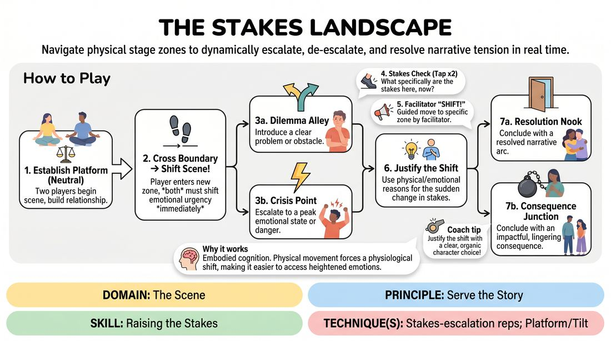

# 🎲 Drill B — under load — Stakes Topography

{ .infographic }

> Navigate physical stage zones to dynamically escalate, de-escalate, and resolve narrative tension in real time.

`Players 2–99` · `~25 min` · `Complexity 3/5` · `Energy medium` · `Contact none` · `Props: required`

⬅️ [Back to the Week 03 run-sheet](../week-03.md)

## Why this activity, here

Drill A gave them stakes as language — naming what a character stands to lose. This block puts that naming under physical load, so the want has to survive movement, interruption and a facilitator's call. It feeds the long-form scene work later in the session, where nobody will remind them to raise the stakes; they will need the internal sense of where on the map their scene is sitting.

## What students actually learn

- They stop treating stakes as a volume dial and start treating them as a specific, named loss that can grow or shrink.
- They feel that tension has gears — that you can drop back down to ordinary and it makes the next rise land harder.
- They can answer 'what are the stakes' in one line, in character, without stopping the scene.
- They notice their own default: some live in crisis, some never leave neutral.

## Setup

Mark five zones on the floor with tape, chairs or A4 sheets. Neutral Ground in the middle, roughly two metres square. Around it, at compass points: Dilemma Alley, Crisis Point, Resolution Nook, Consequence Junction. Write the names large. Clear bags and coats well clear of the map. Seat everyone else on three sides so the map reads from the audience. You need no props. Have a spare marker in case a label goes missing under a foot.

## How to run it — 25 minutes

| Min | What you do |
|---:|---|
| 3 | Walk the map yourself. Stand in each zone, say its name, say in one sentence what pressure lives there. Ask the group for an example of a Dilemma Alley line and a Crisis Point line. |
| 4 | Run one demo scene with a volunteer. Start in Neutral Ground. Step to Dilemma Alley yourself, name a concrete loss, then step back to Neutral. Call your own Stakes Check aloud so they hear the format. |
| 6 | Round one, self-directed. Pairs up, two minutes maximum each. Players choose their own crossings. No 'SHIFT' calls from you. Insist on at least one Stakes Check per scene. |
| 6 | Round two, guided. Fresh pairs. You call 'SHIFT!' and point. Two calls per scene minimum, one of them a drop back to Neutral Ground or Resolution Nook. Two minutes each. |
| 3 | Full arc round. One or two pairs only. They must pass through at least three zones and finish in Resolution Nook or Consequence Junction. You stay silent. Call 'Scene' on arrival. |
| 3 | Debrief seated on the map's edge. Two questions. End by asking each person to name, in three words, the zone they default to. |

## Side-coaching script

| When | Say |
|---|---|
| A player crosses a line and keeps talking the same way | *"Body first. Change how you stand."* |
| Stakes are named vaguely — 'everything', 'my whole life' | *"Name the thing. One noun."* |
| The scene has drifted and neither player knows the pressure | *"Stakes check. Tap the floor."* |
| Guided round, players have sat in Crisis Point too long | *"SHIFT — Neutral Ground. Justify it."* |
| A shift is played as pure volume | *"Quieter. Same danger."* |
| Players describe the new zone instead of playing it | *"Stop explaining. Do something about it."* |
| The scene is close to a natural end but wandering | *"Choose your ending zone. Walk there."* |
| Watchers are drifting | *"Watchers — where would you send them?"* |

!!! success "What good looks like"
    A pair crosses into Dilemma Alley and the temperature changes before anyone speaks — a held breath, a step back, a hand on a chair. The problem they name is small and specific: a missing key, a name on a form. When you call 'SHIFT' to Crisis Point they are already moving, and the emergency grows out of the small problem rather than replacing it. A Stakes Check gets answered in six words without breaking character. The scene ends in Consequence Junction and the audience knows exactly what was lost.

## When it goes wrong

| You see | What's causing it | The fix |
|---|---|---|
| Both players sprint to Crisis Point in the first thirty seconds and stay there, shouting. | They read high stakes as high energy, and there is no platform to raise from. | Stop it. Restart with a rule: sixty seconds in Neutral Ground before anyone may cross. Then call the shift yourself. |
| The zone changes and the scene changes topic entirely — new characters, new location. | They are treating the boundary as a reset button rather than a pressure change. | Side-coach 'same people, same problem'. Run one scene where they may only cross back and forth between Neutral Ground and Dilemma Alley. |
| Stakes Checks get answered with a paragraph, and the scene dies. | Players step out of character to explain the fiction to the room. | Cap the answer at one sentence, in character, spoken to the partner. Demonstrate one yourself. If it runs long, call 'one line'. |
| Players stand on the line, half in, half out, hedging. | Commitment anxiety — crossing means having to invent something. | Say 'both feet'. Tell them the zone supplies the pressure; they only have to react to it, not invent a plot. |

## Scaling

| Class size | What changes |
|---|---|
| **10–13** | One map. Everyone watches. Round one gets four pairs, round two gets three, final arc gets two. Everybody plays at least once; track it on your fingers. |
| **14–17** | Two maps, one at each end of the room, tape only, half the group at each. Run rounds one and two simultaneously with a shared timer — you shout 'SHIFT' for both maps and each pair takes it. Bring everyone back to one map for the final arc round. |
| **18–20** | Two maps, ninety-second scenes instead of two minutes, and give each map a nominated caller from the watchers to shout 'SHIFT' in round two while you circulate. Final arc round: one pair only, whole room watching. |

## Variations

**Two zones only** — Use Neutral Ground and Dilemma Alley. Nothing else. Players cross back and forth as often as they like.  
*Easier. Removes the pull towards emergency and forces them to find pressure in small, specific problems.*

**Silent crossings** — When a player crosses a boundary, neither player may speak for five seconds. The shift must land in body and face alone, then dialogue resumes.  
*Harder. Kills the habit of announcing the new stakes and forces physical commitment.*

**Audience cartography** — Watchers call the shifts by pointing, one call each, going round the seats. Players must justify every call, including bad ones.  
*Different emphasis. Moves the work from choosing stakes to accepting and justifying imposed ones — useful prep for scene work where your partner sets the temperature.*

## Debrief

1. **Which crossing was hardest to justify, and what did you do about it?**
   > *A good answer sounds like:* They name a specific moment — 'going from Crisis to Neutral felt like a lie' — and describe the choice they made, like letting the character decide the danger had passed. Not 'it was all fine'.

2. **When the stakes were clearest, what had been named out loud?**
   > *A good answer sounds like:* Something concrete and small: the rent, the sister's phone call, the sixty seconds before the door opens. If they say 'the emotion' or 'the energy', push once for the noun.

3. **Which zone do you avoid?**
   > *A good answer sounds like:* An honest default — 'I never leave Neutral' or 'I go straight to Crisis because it feels like doing something'. Self-recognition, not self-criticism. Move on once each person has named one.

!!! warning "Safety & inclusion"
    No contact is required at any point; say so before round one. Tape lines are a trip hazard — use low-profile tape and check nobody is in socks. Anyone with mobility limits can play the map from a chair placed at the boundary, moving the chair or simply declaring the crossing aloud; announce this option rather than waiting to be asked. Crisis Point invites emergencies — steer away from graphic medical, violent or bereavement content by seeding examples that are ordinary and domestic. Anyone who prefers not to play can be a shift-caller for the round; that is a real job, not a sideline.

## Why it works

Stakes are hard to teach as a note because 'raise the stakes' has no address — the player hears it and gets louder. Putting the gradient on the floor gives the abstraction a location, so the choice becomes a step rather than a judgement. The physical crossing also forces commitment: once both feet are over the line, the body has already declared the change and the dialogue has to catch up, which is the correct order. The Stakes Check enforces the cue — 'what do they stand to lose?' — as an in-scene habit rather than a post-mortem question, so players learn to answer it while the scene is still moving. And because the map includes Neutral Ground and Resolution Nook, they learn that stakes go down as well as up, which is what makes the rises readable.

[Open the full activity card »](../../../../games/D3_P4_S7_T1_G306__the-stakes-landscape.md){target=_blank rel=noopener}
