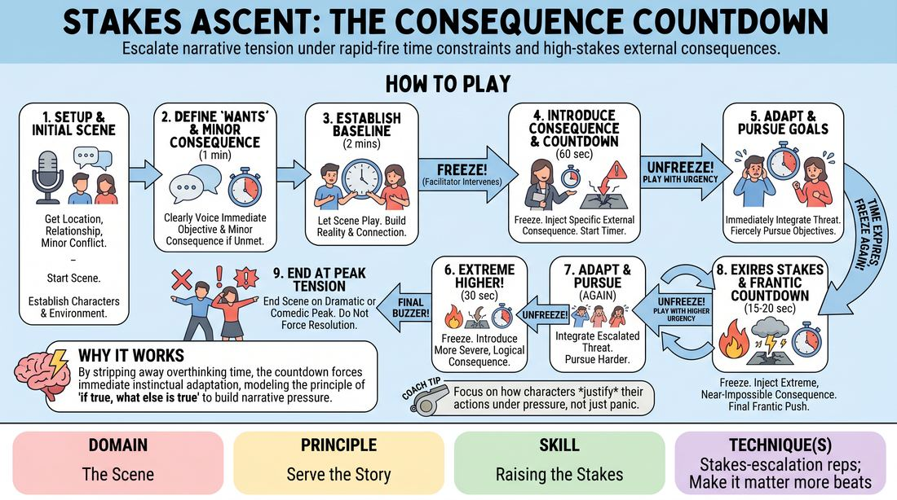

# 🎯 Scene Lab — Consequence Countdown

{ .infographic }

> Escalate narrative tension under rapid-fire time constraints and high-stakes external consequences.

`Players 2–99` · `~35 min` · `Complexity 3/5` · `Energy high` · `Contact none` · `Props: none`

⬅️ [Back to the Week 03 run-sheet](../week-03.md)

## Why this activity, here

Week 3 has already asked players to name a want and to let a partner's want land on them. Those scenes were often true but weightless — wanting something with nothing riding on it. This block adds the second half of the equation: cost. It keeps the want fixed and multiplies what failure would take away, so players feel stakes as a separate lever from objective. It feeds the closing block of the session, where players have to generate their own stakes without you calling them, and it feeds Week 4's work on scenes that build rather than repeat.

## What students actually learn

- They stop confusing wanting something with something being at stake, because they feel the same want get heavier three times in four minutes.
- They learn to accept a hard offer from outside the scene and justify it, instead of arguing that it couldn't happen.
- They discover that urgency lives in behaviour and choice, not in volume or speed.
- They find they can hold one objective through escalating pressure rather than switching to a new want every time trouble arrives.

## Setup

Chairs in a horseshoe facing a clear playing area big enough for two people to move. Two spare chairs in the space if the pair wants furniture. A phone or timer with an audible buzzer — you will use it constantly, so have it in your hand. Write the ladder on the board where players can see it: BASELINE 2 min / 45s / 30s / 20s. Under it write the cue: What do they stand to lose? Have a pairing order decided before you start so no time is lost choosing.

## How to run it — 35 minutes

| Min | What you do |
|---:|---|
| 3 | Frame it. The want stays the same all the way through; only the cost changes. Point at the ladder on the board. Tell them you will freeze the scene three times and hand them a new consequence each time, and that the consequence is never up for debate. |
| 4 | Run one demo scene yourself with a confident pair. Take location, relationship and small problem from the room. Call every freeze out loud and slightly over-clearly so the shape is obvious. Cut on the buzzer at the peak. Say nothing about quality. |
| 8 | Two scenes. Same shape, no notes between them. Between scenes, take the next location, relationship and problem from the audience in under twenty seconds. Side-coach during play only — never in the freezes, where your only job is the consequence and the number. |
| 8 | Two more scenes. Now push your consequences to be specific and physical — a named person arriving, a door locking, a deadline with a face on it. Avoid abstract threats. Keep the buzzer strict even when a scene is going well. |
| 8 | Final two scenes. Ask the room, before each one, to notice whether the player still wants the same thing at twenty seconds as they did at two minutes. Cut hard on the buzzer both times. |
| 4 | Debrief seated in the horseshoe. Two questions, brisk. End on the cue and send them into the next block. |

## Side-coaching script

| When | Say |
|---|---|
| First thirty seconds of any scene, if they are chatting pleasantly | *"Who are you to each other. Say it."* |
| Approaching the one-minute mark with no objective voiced | *"Name the want. Out loud."* |
| Just after you unfreeze on the first consequence | *"Same want. Higher cost."* |
| When a player starts to question the new threat | *"It's true. Deal with it."* |
| When urgency is turning into shouting | *"Quieter. Faster."* |
| Mid-countdown, when the scene has gone general | *"What do they stand to lose?"* |
| Last five seconds of the final round | *"Don't fix it. Play it."* |
| On the final buzzer | *"Cut. Sit down."* |

!!! success "What good looks like"
    The pair states two clear wants in the first minute without being reminded. When you freeze and hand them a threat, they take a breath, absorb it, and come back into the scene with changed behaviour rather than a changed subject. The want at twenty seconds is recognisably the want at two minutes — just costlier. The room leans in during the last countdown. Scenes end mid-crisis and nobody tries to tie them off. Turnaround between scenes is under half a minute.

## When it goes wrong

| You see | What's causing it | The fix |
|---|---|---|
| A player answers your frozen consequence with "no, actually the hospital's closed" or renegotiates the threat inside the scene. | They are treating your offer as an obstacle to be argued with rather than a fact of the world, usually from anxiety about being cornered. | Call "It's true. Deal with it." and let the scene continue. Afterwards, say once to the room that the consequence is scenery, not an opinion. Do not debate it in the debrief. |
| The scene gets louder and faster each round but nothing actually changes — same lines, more volume. | Players are performing urgency instead of raising stakes. Escalation has gone into the delivery rather than the choices. | Side-coach "Quieter. Faster." Mid-round, freeze and ask one character what they are willing to do now that they weren't willing to do a minute ago. Unfreeze on their answer. |
| After the second consequence the original want has vanished and the scene is about surviving the threat. | Your consequence was too large or unrelated to the objective, so it replaced the want instead of pressing on it. | Tie every consequence explicitly to the stated want — "if you don't get the apology, your sister hears the recording." If it has already drifted, freeze and say the want back to them. |
| Watching players go quiet and scenes start to feel like a test being marked. | You are commenting between scenes, or the demo praised one pair. | Say nothing evaluative between scenes. Take the next suggestion immediately. Save all comment for the four-minute debrief, and keep it about the mechanism, not the performers. |

## Scaling

| Class size | What changes |
|---|---|
| **10–13** | One playing area, everyone in one horseshoe. Demo plus six scenes covers fourteen players, so at this size every person plays once and you may have a scene spare — use it for a pair who want a second go with a harder ladder. If you have an odd number, give the extra person the timer and the buzzer for the whole block. |
| **14–17** | One playing area, but tighten so nobody sits out. Cut the baseline to ninety seconds and run 40 / 25 / 15 second rounds, giving roughly three minutes per scene. That fits eight scenes across the three eight-minute blocks. Hand the timer to a student so your attention stays on the freeze calls. |
| **18–20** | Split into two horseshoes after the demo, in opposite corners. Run one yourself. Give the other a student caller with the ladder written on a card and one instruction: freeze, name a specific consequence tied to the stated want, say the number, unfreeze. Each circle gets four to five scenes. Debrief back together. |

## Variations

**Called Wants** — Before the scene starts, hand each player a folded slip with a simple want already written on it — get the keys back, be forgiven, leave without being noticed. They play that want. You build the consequences from it.  
*Easier. Removes the invention load at the top so players can spend everything on escalation.*

**Silent Ladder** — Don't announce the consequence out loud. Write it on a card and hand it to one player only during the freeze. The other player never learns what it says and must read it off behaviour.  
*Harder. Forces the threatened player to show the cost physically, and the partner to respond to change rather than information.*

**Falling Stakes** — Run the same shape, but each freeze removes something the character was afraid of losing until, by the last round, nothing is at risk. Play the final twenty seconds with zero stakes.  
*Different emphasis. Makes the mechanism audible in reverse — the room hears the scene go flat and understands what stakes were doing.*

## Debrief

1. **At the last buzzer, did you still want the same thing you wanted at the start?**
   > *A good answer sounds like:* A player says the want stayed put but what they were prepared to do about it changed — they lied, or begged, or gave something up. Weak answers describe a new want appearing each round; if you hear that, name it and move on.

2. **What made a consequence land, and what made one bounce off?**
   > *A good answer sounds like:* Specificity and connection. "When it was my brother finding out, I felt it. When it was 'the building explodes', I didn't." Someone should notice that consequences tied to a relationship worked harder than large impersonal ones.

3. **Where do you get stakes from when nobody is calling them?**
   > *A good answer sounds like:* Someone points at the relationship already onstage — that the cost is usually what the other character could withdraw, believe, or find out. That is the answer you want before the next block; when you hear it, stop.

!!! warning "Safety & inclusion"
    No contact is required. If a scene moves towards touch, ask both players in the freeze whether it's welcome and take a no without comment. Keep consequences concrete and playable — a deadline, a witness, a door, a letter. Steer away from consequences involving death of a child, sexual threat, self-harm or serious illness; if a player introduces one, freeze and redirect the next consequence somewhere else rather than making it a lesson. Anyone can decline a playing slot and take the timer or the suggestion-taking instead; say this at the top so nobody has to ask. Watch for players who go genuinely distressed rather than dramatically distressed under the countdown, and cut early if you see it.

## Why it works

Stakes and objective get muddled because they usually arrive together. This block prises them apart mechanically: the want is fixed by the players in the first minute and never touched again, while you multiply the cost of failure three times in under four minutes. Holding one variable still and moving the other is what makes the difference perceptible. The shrinking countdowns do a second job — at forty-five seconds a player can still reason their way out, at twenty they cannot, so choice replaces deliberation and the body starts making decisions the head would have talked itself out of. And because the consequence comes from outside the scene, players practise accepting a hard offer whole, which is the same muscle as accepting any offer they didn't plan for. The cue — what do they stand to lose? — is the question that turns a stated want into a scene with pressure in it.

[Open the full activity card »](../../../../games/D3_P4_S7_T1_G308__stakes-ascent-the-consequence-countdown.md){target=_blank rel=noopener}
