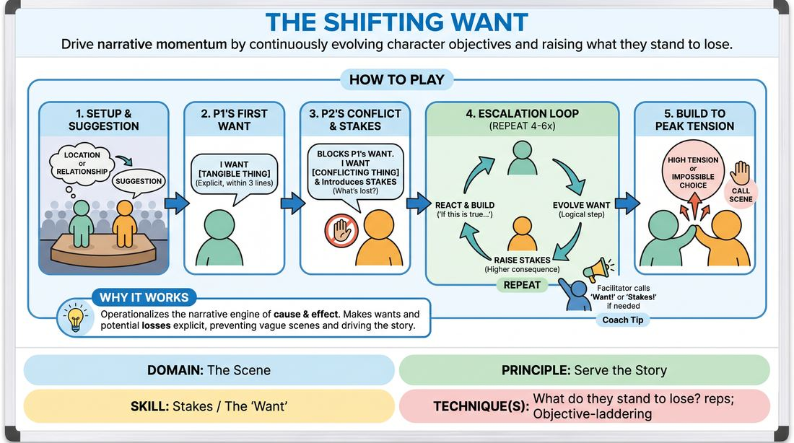

# 🏟️ Showcase round — The Shifting Want

{ .infographic }

> Drive narrative momentum by continuously evolving character objectives and raising what they stand to lose.

`Players 2–99` · `~30 min` · `Complexity 3/5` · `Energy medium` · `Contact none` · `Props: none`

⬅️ [Back to the Week 03 run-sheet](../week-03.md)

## Why this activity, here

Weeks one and two built the platform: agreement, shared reality, listening. Players can now stay in a scene without breaking it. What they still produce is pleasant nothing — two people who agree and drift. This block puts the want on the table out loud and keeps it moving, so the scene has somewhere to go. It feeds the back half of the course, where objective is assumed rather than announced, and the wanting sits under the dialogue instead of on top of it.

## What students actually learn

- That saying what you want out loud is not clumsy writing — it's the fastest way to give your partner something to push against.
- That a want can change mid-scene without the scene collapsing, as long as the new want grows out of what just happened.
- That stakes are not volume. Raising them means naming a specific loss, not shouting about death.
- That they can feel a scene sag in real time, and that the fix is usually one concrete sentence.

## Setup

Clear a playing area roughly three metres wide with two chairs available but not pre-set. Arrange the audience in a shallow arc facing it — close enough that quiet playing works. You need a visible clock or phone timer you can glance at without turning away. Have a list of two or three fallback suggestions in your pocket (hospital car park, brother-in-law, night shift) in case the room goes quiet. No props. No music.

## How to run it — 30 minutes

| Min | What you do |
|---:|---|
| 3 | Frame it. Give the cue — 'What do they stand to lose?' Give three rules: name a concrete want in the first three lines, answer your partner's want directly, and say the new risk out loud each time it changes. Tell them you will call over the top. |
| 4 | Demo it yourself with one volunteer. Play badly on purpose for thirty seconds — vague want, no stakes — then let them hear you call 'Want!' and 'Stakes!' and watch the scene sharpen. Cut it at ninety seconds. Point out the two moments where the want changed. |
| 6 | Run the first three scenes back to back, two minutes each. Take a suggestion, go, cut, applaud, next pair straight out. Give no notes between scenes. Side-coach inside the scenes only. |
| 3 | Stop and give one adjustment to the whole room, based on what you actually saw. Usually: the want is a mood, make it a thing you could hand someone. Or: you're arguing about the same want, let it change. |
| 8 | Run four more scenes, two minutes each. Push the side-coaching harder now. Interrupt earlier. If a pair flatlines twice, call 'new want, same scene' and let them find it. |
| 3 | Run one final scene with an added rule: it must end on an impossible choice, where one player has to pick between two things they've said they can't lose. Cut the instant that choice lands. |
| 3 | Debrief seated. Two questions, short answers, no speeches. Close by putting the cue back in the room and naming what it feeds next week. |

## Side-coaching script

| When | Say |
|---|---|
| Player One's first three lines go by with no stated want | *"Name it. Out loud, now."* |
| The want is abstract — respect, closure, happiness | *"Something you could hand them."* |
| Player Two ignores the want and starts a new topic | *"Answer what they asked for."* |
| The exchange repeats itself — same want, third time | *"New want. Same scene."* |
| Consequences have stopped moving; the argument is level | *"What do they stand to lose?"* |
| A player rushes to resolve or apologise | *"Don't fix it yet."* |
| Escalation goes cartoonish — bombs, death, aliens | *"Smaller. Closer to home."* |
| Pressure peaks or an impossible choice appears | *"Take the choice. Scene."* |

!!! success "What good looks like"
    Two people who know exactly what they want and say so within twenty seconds, then spend the rest of the scene unable to have it. The wants are ordinary — the keys, the apology, ten more minutes — and they collide because the room only holds one of them. Each exchange adds one specific thing at risk, and the audience can name it. Wants shift two or three times across the scene and each shift is traceable back to a line that just happened. When you cut, the room exhales. Nobody has been funny on purpose and several moments have been funny anyway.

## When it goes wrong

| You see | What's causing it | The fix |
|---|---|---|
| Both players state wants, then stand still and negotiate the same disagreement for two minutes. The dialogue is fluent and nothing happens. | They're treating want as a fixed position to defend rather than something that changes under pressure. Nobody is allowed to lose ground. | Call 'new want, same scene' over the top. Tell them to let something they said be true and want the next thing. Coach it again before the following pair goes up. |
| Stakes escalate to death, prison or the end of the world inside three lines, and the scene has nowhere left to go. | They hear 'raise the stakes' as 'go bigger' rather than 'get more specific about the loss'. | Call 'smaller, closer to home'. In the mid-block note, give the example: not 'I'll die' but 'she'll find out I lied about the money'. Personal beats catastrophic. |
| The want is stated but the player performs it as narration — describing their feelings to the audience rather than pursuing anything from their partner. | Nerves in front of a watching room. Talking is safer than asking for something and being refused. | Call 'ask them for it'. Direct the line at the partner. If it persists, put the two chairs face to face so they physically cannot address the audience. |
| Pairs playing for the laugh — jokes about the suggestion, wants chosen because they're absurd. | Showcase format plus a laughing audience. The reward loop has shifted from the scene to the room. | Say nothing to the pair mid-scene. Between scenes, tell the audience their job is to listen for the want, not to enjoy it. The laughter drops and the playing steadies. |

## Scaling

| Class size | What changes |
|---|---|
| **10–13** | Every pair plays once. Five or six scenes fits comfortably — run them at two and a half minutes instead of two and drop one scene from the second run. Pair people yourself so nobody is left standing. Keep the final impossible-choice scene as written. |
| **14–17** | Seven or eight pairs. Hold scenes to two minutes hard and cut on time even mid-line — cutting mid-line is fine and teaches its own lesson. Trim the mid-block note to ninety seconds and add that time to the second run so everyone plays. |
| **18–20** | Nine or ten pairs will not fit at showcase length. After the demo, split the room in two halves in opposite corners. Give each half a timer and a nominated caller who says 'Want!' and 'Stakes!' from the audience. You float between them. Reconvene for the final scene, played once for the whole room, and debrief together. |

## Variations

**Want on a card** — Hand each player a folded slip with a concrete want written on it before they go up — the last biscuit, a lift home, an apology by name. They must state it in the first three lines as given.  
*Easier. Removes the invention pressure at the top so they can spend all their attention on escalation and on answering each other.*

**Silent stakes** — Players may name their want out loud but may never state the consequence. The audience writes down what they think is at risk. Compare notes after each scene.  
*Harder. Forces the loss to show up in behaviour and specificity rather than in declaration. Reveals who is announcing stakes and who is playing them.*

**Three-hander** — Add a third player who enters at the ninety-second mark with a want that only one of the two can satisfy, and only by abandoning their own.  
*Different emphasis. Shifts from two-way escalation to alliance and betrayal, and tests whether players can track two objectives at once.*

## Debrief

1. **In the scene you watched or played, what was the moment the want changed — and what caused it?**
   > *A good answer sounds like:* They name a specific line. 'When she said she'd already sold it, he stopped wanting the car and started wanting to know who to.' That's traceable causation, not a general impression. If answers stay at 'it got more intense', push once for the line, then move on.

2. **When you were up there, what was harder — saying what you wanted, or letting it be refused?**
   > *A good answer sounds like:* An honest split in the room. Some say naming it felt blunt or unrealistic; others say they kept softening the refusal to be kind. Both are the right admission. You're listening for people noticing their own avoidance, not for a consensus.

3. **What does the cue give you that 'raise the stakes' doesn't?**
   > *A good answer sounds like:* Something like: it points at a person and a specific loss rather than a volume dial. It's answerable in one sentence. If they can restate it in their own words and give an example from a scene, you're done.

!!! warning "Safety & inclusion"
    No contact is required. If a pair wants to touch — a hand on an arm, blocking a doorway — they ask first, out of scene or in it, and either can decline without explanation. Say this once at the top and mean it. Wants and stakes stay fictional: tell the room not to use a real bereavement, illness, breakup or financial trouble as material, theirs or anyone else's. If someone does and the scene turns raw, cut it, thank them, move on, and check in during the break. Anyone can pass on playing and take a caller role in the audience instead — say 'Want!' and 'Stakes!' from the seats. That's a real job, not a sideline. Watch for players who freeze on the spot in front of a full room; step in with a suggestion of your own rather than waiting.

## Why it works

Stakes are hard to teach because they're usually invisible — a player either has an inner sense of what's at risk or produces flat, agreeable scenes. This block makes the invisible thing verbal, then keeps it moving. Saying the want out loud removes the guessing on both sides: the partner now has something concrete to obstruct, so obstruction becomes an offer rather than a block. The requirement to state a fresh loss each exchange means escalation can't happen through intensity alone; it has to happen through specificity, which is a learnable move rather than a temperament. And because the want must evolve from what just happened, players are forced to apply if-this-is-true-what-else-is-true to their own objective, not just to the world of the scene. Over five or six scenes the room stops hearing 'raise the stakes' as an instruction to shout and starts hearing the cue — what do they stand to lose — as a question with an answer in it.

[Open the full activity card »](../../../../games/D3_P4_S4_T1_G404__the-shifting-want.md){target=_blank rel=noopener}
