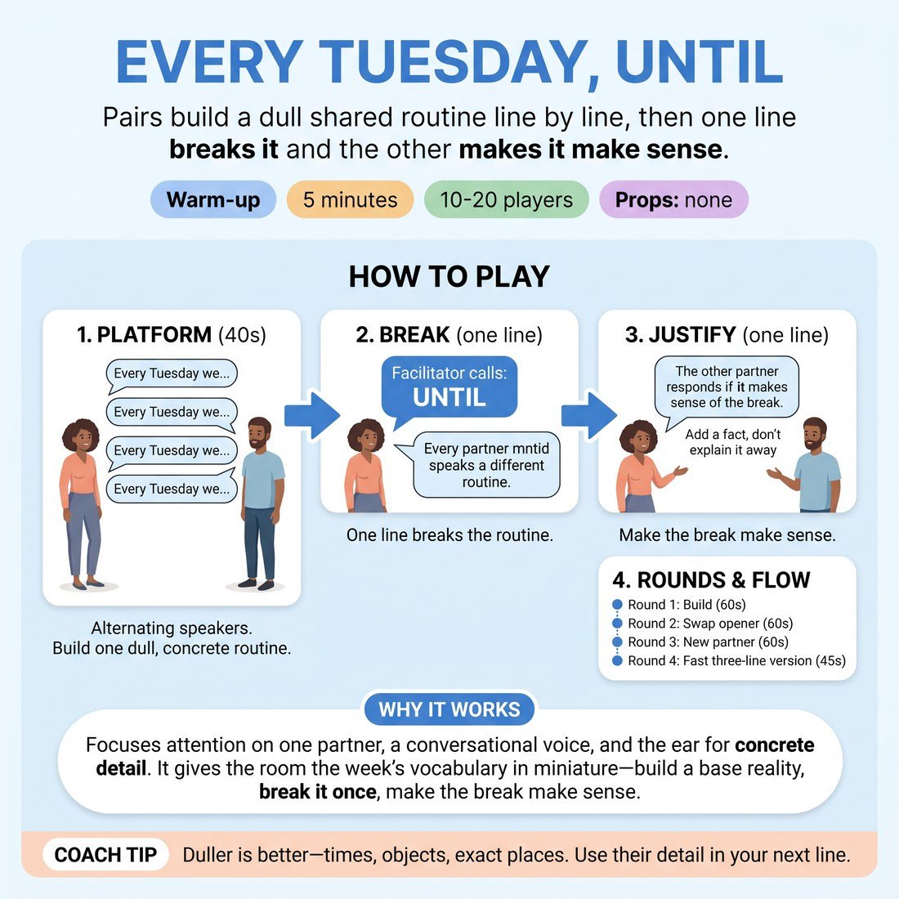

# 🔥 Warm-up cluster — Every Tuesday, Until

{ .infographic }

> Pairs build a dull shared routine line by line, then one line breaks it and the other makes it make sense.

`Players 10–20` · `~5 min` · `Complexity 2/5` · `Energy medium` · `Contact none` · `Props: none`

⬅️ [Back to the Week 04 run-sheet](../week-04.md)

## Why this activity, here

Week 4 is platform, tilt and spine. This is the smallest possible version of that shape: a pattern established, a single break, a single justification. It runs before the longer platform work so the class already has the three-beat shape in their mouths when scenes get bigger. It feeds directly into any tilt exercise later in the session — they will have felt that the break is cheap and the justification is the work.

## What students actually learn

- That a boring, specific platform makes the break land — vagueness kills the tilt before it happens.
- That breaking the pattern is easy; the interesting move is the next line, which absorbs the break instead of laughing at it.
- That 'making it make sense' is an offer, not an explanation — you add information rather than defend the story.

## Setup

Clear floor space so pairs can stand facing each other without shouting over neighbours. No chairs, no props. You need a voice that carries over twenty people talking — practise the word 'Until' at volume before class. Know your own two demo lines in advance so the demo takes ten seconds, not forty.

## How to run it — 5 minutes

| Min | What you do |
|---:|---|
| 1 | Pair everyone face to face. Explain alternating lines starting 'Every Tuesday we…', one shared dull routine. Demo two flat lines with a volunteer. Tell them 'Until' means break next line, partner justifies. |
| 1 | Round 1. Pairs build the routine. At forty seconds call 'Until'. Next speaker breaks it in one line; partner lands it in one line. Stop them there. |
| 1 | Round 2. New routine, other partner opens. Call 'Until' at forty seconds. One line to break, one line to justify. Stop. |
| 1 | Round 3. Everyone finds a new partner — hands up if unpaired. Build, call 'Until' at forty seconds, break, justify, stop. |
| 1 | Fast round with the same partner: three lines of routine, then call 'Until' immediately. Break, justify, stop. Take two pairs shouting a break and its justification. Move on. |

## Side-coaching script

| When | Say |
|---|---|
| Early in Round 1, when routines get whimsical | *"Duller. Buy the bread."* |
| Mid-build, if lines are getting long | *"One line each. Short."* |
| At the forty-second mark, every round | *"Until!"* |
| Immediately after 'Until', while the breaker hesitates | *"Break it now — don't set it up."* |
| When the justifier stalls or laughs | *"Make it make sense. Add a fact."* |
| If a pair argues about the break | *"Yes, and why."* |
| Going into the fast round | *"Three lines only. Then I'm calling it."* |
| After the last justification | *"Stop. Hands down. Two pairs, shout it."* |

!!! success "What good looks like"
    The room sounds flat and slightly bored for forty seconds, then goes quiet for a beat on 'Until', then two crisp lines and laughter. Justifications arrive fast and treat the break as normal — 'that's because the Tuesday deliveries stopped in March' — rather than as a joke to be topped. Pairs are looking at each other, not at you.

## When it goes wrong

| You see | What's causing it | The fix |
|---|---|---|
| Routines are already surreal by the third line — talking dogs, moon bases. | They think interesting means strange, so they tilt before the platform exists. | Stop the room, ten seconds: 'Every line must be something you could actually buy, do or complain about.' Restart the round. |
| After 'Until', the justifying partner explains the break away — 'no, that didn't happen'. | Instinct to protect the established pattern rather than absorb the new information. | Call 'Yes, and why.' Give one model line yourself: 'Because it's the last Tuesday before he moves.' |
| Pairs keep going after the justification, spinning out a scene. | Momentum, plus not hearing your stop. | Cut hard with 'Stop — hands down.' Repeat that the shape is two lines only. It makes the next round tighter. |
| Everyone is trying to be funny in the build, and the break lands on nothing. | Performance nerves in a warm-up slot. | Say 'Boring is the job. I'll take the funny at Until.' Praise the dullest routine you overhear. |

## Scaling

| Class size | What changes |
|---|---|
| **10–13** | Straight pairs, all four rounds as written. Volume is manageable, so you can call 'Until' at normal speaking level. If one person is spare, join in yourself as their partner. |
| **14–17** | Straight pairs. Raise your call — walk to the centre of the room before saying 'Until'. Trim the demo to a single exchange to protect the round time. In the closing share, take two pairs only, not three. |
| **18–20** | Expect one trio; tell them they cycle in order and the third person justifies. Call 'Until' from the middle of the floor with a hand raised as a visual cue — some pairs will not hear you. Cut Round 3's partner swap to a simple 'turn to your nearest neighbour' to save fifteen seconds. |

## Variations

**Given routine** — You supply the routine's subject for each round — the bus stop, the shared kitchen, the Tuesday phone call. Pairs only add detail.  
*Easier — removes the invention load from the platform so all attention goes to the break and the justification.*

**Second justification** — After the partner justifies, the breaker adds one more line that treats the new reality as ordinary — back to 'Every Tuesday we…', including the change.  
*Harder — forces them to rebuild a platform on top of the tilt, which is what a real scene demands.*

**Break by omission** — The break must be something that stops happening, not something new that starts. 'Every Tuesday we don't unlock the shop.'  
*Different emphasis — absence is harder to justify than novelty, so it pushes them towards inference rather than invention.*

## Debrief

1. **Which was harder — the break or the line after it?**
   > *A good answer sounds like:* Someone says the line after, because the break can be anything but the justification has to fit what was already built. That is the point; move on.

2. **What made a break land?**
   > *A good answer sounds like:* Reference to the platform being specific and dull — 'we'd said the bread three times, so the empty shelf meant something'. If answers stay at 'it was funny', ask what was set up first.

!!! warning "Safety & inclusion"
    No contact. Pairs stand facing each other at conversational distance; anyone who prefers more space takes it. Content stays at the level of ordinary domestic and working routines — say so in the setup, and redirect once, without comment, if a break heads somewhere personal. Anyone who wants to sit for a round can pair up standing next to a chair or observe; give them the closing share as their way in. Deaf or hard-of-hearing participants need your raised hand as well as the spoken 'Until' — use both every time.

## Why it works

Narrative architecture runs on contrast: a break only reads as a story event if something regular preceded it. By forcing forty seconds of deliberately dull repetition, the exercise builds a platform whose only function is to be broken, so students feel the causal link rather than being told it. Capping the response at one line blocks the two usual escapes — explaining the break away, or topping it with a bigger break. The only move left is to accept the new fact and supply a reason, which is exactly the tilt-and-justify beat that carries a scene's spine.

[Open the full activity card »](../../library/warmups/WU__every-tuesday-until.md){target=_blank rel=noopener}
