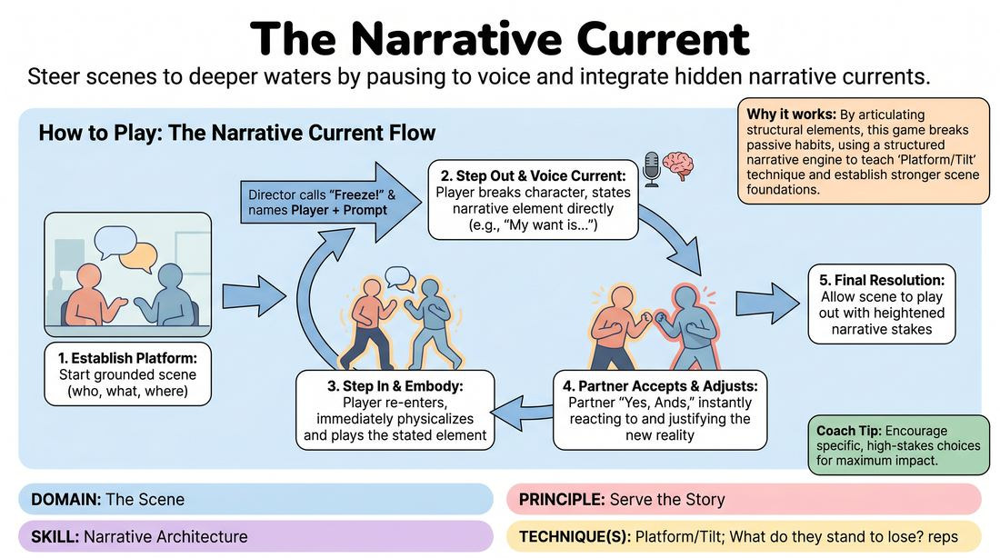

# 🎲 Drill A — isolation — The Narrative Current

{ .infographic }

> Steer scenes to deeper waters by pausing to voice and integrate hidden narrative currents.

`Players 3–99` · `~25 min` · `Complexity 3/5` · `Energy medium` · `Contact none` · `Props: none`

⬅️ [Back to the Week 04 run-sheet](../week-04.md)

## Why this activity, here

Week 4 has already named the parts — platform, tilt, spine. This is the first block where students handle those parts by hand, one at a time, with the scene held still while they do it. It isolates the architecture from the improvising. Drill B and the longer scene work later in the session take the calls away and ask them to supply the same elements unprompted, at speed.

## What students actually learn

- They stop treating "what my character wants" as something to discover later and start deciding it in one second, out loud.
- They feel the difference between saying a truth and playing it — the sentence outside the scene is free, the body inside it does the work.
- They learn that a partner's sudden new reality is cheap to accept and expensive to resist.
- They notice a plateau in their own scene before the Director calls it.

## Setup

Clear floor space so each trio has room for two people to stand and move a couple of paces. No chairs in the playing areas. Print one prompt card per trio: the six Story Currents listed in order — My Want, The Stakes, Relationship Shift, Environmental Truth, Hidden Truth, Complication — with a one-line gloss for each. Have a timer visible. Write the cue on the board: "Break the routine — then make it make sense."

## How to run it — 25 minutes

| Min | What you do |
|---:|---|
| 3 | Frame it. Say: every scene already has wants, stakes and secrets buried in it; today you dig them up out loud, then bury them again in the body. Read the six prompts. Hand out cards. |
| 4 | Demo. Take two volunteers, give a location, direct it yourself. Call three freezes: My Want, The Stakes, Complication. Point out each time that the stepped-out sentence was plain and the stepped-in version was not. |
| 6 | Round one in trios. Two play, one Directs with the card. Director calls four freezes across the scene, then lets it run a final minute. Rotate roles once inside the six minutes if a trio finishes early. |
| 5 | Round two. Rotate so a new person Directs and whoever has not played yet plays. Same four freezes, but Directors must include Hidden Truth and Relationship Shift this time. |
| 4 | One scene in front of the room. You Direct. Pick a pair who worked well. Run all six prompts fast — roughly forty seconds apart — then release for the final minute. |
| 3 | Debrief standing. Two questions, quick answers, no long stories. End on the cue and move straight into the next block. |

## Side-coaching script

| When | Say |
|---|---|
| Platform is drifting into jokes before the first freeze | *"Ordinary first. Just do the thing you came here to do."* |
| A player has stepped out and is starting to explain | *"One sentence. Plain voice."* |
| A player steps back in and quotes their own sentence as dialogue | *"Don't say it. Wear it."* |
| Partner has not adjusted after a revelation | *"You heard it. Change something now."* |
| After a Stakes or Complication prompt | *"Raise the cost. What does it break?"* |
| Scene plateaus between freezes | *"Break the routine — then make it make sense."* |
| Final minute, no calls left | *"No more prompts. Finish it."* |

!!! success "What good looks like"
    The stepped-out sentences are short and unglamorous — "I want him to leave before my sister arrives." The step back in changes the temperature without anyone announcing it. Partners visibly recalibrate: a shift of distance, a change of tone, a different question. By round two the Directors are calling freezes at genuine plateaus rather than on a stopwatch, and the last minute of each scene has more pressure in it than the first.

## When it goes wrong

| You see | What's causing it | The fix |
|---|---|---|
| The stepped-out declaration is a joke or a wild swing — "I want to assassinate the Pope." | Players think the prompt is asking for invention rather than for something already implied by the platform. | Stop the trio. Ask: what does this person plausibly want given the last ninety seconds? Restate that the current runs under the scene, it does not replace it. |
| After the freeze, the player returns and simply narrates the truth as dialogue, then the scene continues unchanged. | They are treating the sentence as the delivery instead of the instruction. | Call "Don't say it — wear it." Have them redo the step back in with no words at all for ten seconds. Body only. |
| The partner keeps playing their original agenda; the scene splits into two monologues. | Listening has stopped because the partner is planning their own next move. | Freeze both. Ask the partner to say aloud what just changed for their character. Then resume from that line. |
| Directors call freezes every twenty seconds and the scene never breathes. | New Directors mistake activity for progress. | Cap it. Four calls maximum per scene, and the platform gets a full minute before the first one. |

## Scaling

| Class size | What changes |
|---|---|
| **10–13** | Four trios; put any spare pair with a trio as a second Director who calls the last two freezes. Run both rounds as written. Keep the front-of-room scene at four minutes. |
| **14–17** | Five or six trios. Same two rounds. For the front-of-room scene, run five prompts instead of six so it still lands inside four minutes. |
| **18–20** | Six or seven trios; two groups of four run as quartets where the fourth person holds the card and the Director only speaks. Cut round two to four minutes and add that minute to the front-of-room scene so two pairs can each take a short one. |

## Variations

**Two currents only** — Restrict the whole drill to My Want and The Stakes. Directors alternate between them.  
*Easier. Removes the choice problem and lets nervous players focus entirely on the step-out, step-in mechanic.*

**Silent declaration** — The named player steps out and writes the sentence on a card the audience can see but their partner cannot. The partner must detect the change and justify it.  
*Harder. Forces the embodying player to make the truth legible without language, and the partner to read rather than receive.*

**Partner calls it** — Drop the Director. Either player may freeze themselves, step out, and declare a current whenever the scene plateaus, up to four times total.  
*Different emphasis. Shifts the skill from executing a prompt to noticing a plateau and choosing which element the scene is missing.*

## Debrief

1. **Which prompt changed your scene most?**
   > *A good answer sounds like:* They name a specific moment and what shifted — "Stakes did it, because until then neither of us minded if we lost." Not a general preference for one prompt over another.

2. **What did you do differently when you stepped back in?**
   > *A good answer sounds like:* A physical or behavioural answer: stood closer, stopped tidying, started lying. If they answer with what they said, push once for what they did.

3. **Where would this scene have gone without the freezes?**
   > *A good answer sounds like:* Honest recognition that it would have stayed pleasant and level. Someone admitting they were comfortable and going nowhere is the answer you want.

!!! warning "Safety & inclusion"
    No physical contact is required at any point; if players want to use it, they agree it between themselves first and either can decline without explanation. Anyone may pass on a prompt by saying "pass" — the Director simply offers a different current. Keep Hidden Truth away from real trauma: tell the room to invent, not to disclose. Anyone who prefers not to play can take the Director seat for both rounds. Standing is not required; a player may run the whole scene seated if they say so before it starts.

## Why it works

Narrative architecture normally has to be built while improvising, which is why beginners default to pleasant, level scenes — the attention is spent on the next line. Freezing the scene splits the two jobs. Declaring a want outside the scene costs nothing, so players make a decision they would otherwise defer. Stepping back in then forces the translation from statement to behaviour, which is the skill that survives when the calls stop. The prompt order runs from want to complication, so each scene assembles a spine in the right sequence: platform, pressure, tilt. The partner's obligation to accept immediately teaches that a story element enters a scene through agreement, not negotiation.

[Open the full activity card »](../../../../games/D3_P4_S3_T2_G047__the-narrative-current.md){target=_blank rel=noopener}
