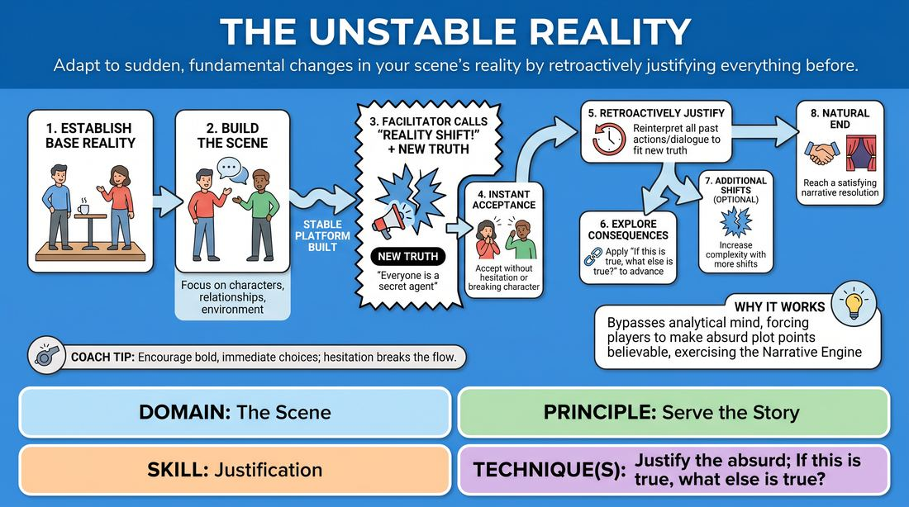

# 🎲 Drill B — under load — Shifting Foundations

{ .infographic }

> Adapt to sudden, fundamental changes in your scene's reality by retroactively justifying everything before.

`Players 3–99` · `~25 min` · `Complexity 3/5` · `Energy medium` · `Contact none` · `Props: none`

⬅️ [Back to the Week 04 run-sheet](../week-04.md)

## Why this activity, here

Week 4 builds platform first, then tilts it. Drill A had them find one tilt and follow it. This one moves the ground under a platform they already own, so they learn the spine holds even when the premise changes. It feeds the closing long-form set, where late information has to be absorbed rather than argued with.

## What students actually learn

- That new information is material to use, not a problem to solve — the reflex to flinch gets replaced by a reflex to reach back.
- That a story spine is made of relationship and want, not of facts, so facts can be swapped without the scene collapsing.
- That justification is a physical act — behaving as if it was always true beats explaining why it now is.

## Setup

Clear a playing space with a clear front. Chairs in an arc facing it. Two chairs available in the space. Have four or five shift lines written on a card so you are not inventing under pressure — examples: 'you two have never met', 'this is happening underwater', 'one of you is lying about everything', 'this is a memory', 'you are both children'. No props needed.

## How to run it — 25 minutes

| Min | What you do |
|---:|---|
| 3 | Frame it. Say: build a normal scene, I will change one fact, you accept it instantly and make everything before it make sense. Take one volunteer pair and demonstrate a single shift yourself. Stop after twenty seconds. |
| 4 | Round one. Two pairs, back to back. Grounded suggestion, forty-five seconds of platform, then one shift each. Cut at ninety seconds. No notes yet — keep the pace up. |
| 4 | Round one continued. Next two pairs, same shape, one shift each. Give one call between pairs: name what the justification did, in a sentence. |
| 5 | Round two. Two shifts per scene. New players, threes if you have the numbers. Land the second shift while the first is still being played out, not after it settles. |
| 5 | Round two continued. Remaining players get their turn. Keep two shifts. Push consequence — after each shift, side-coach 'what else is true' once and let them answer in action. |
| 4 | Last pass and debrief. Run one three-shift scene with a confident pair as a demonstration. Then take the room's questions and run two debrief prompts standing. |

## Side-coaching script

| When | Say |
|---|---|
| Opening thirty seconds of any scene | *"Platform first. Who are you to each other?"* |
| Immediately after you call the shift | *"Take it. Don't check."* |
| A player freezes or laughs after the shift | *"Next line as if it was always true."* |
| Once the new truth is accepted | *"Reach back. Justify one thing you already said."* |
| The scene starts discussing the new reality | *"Stop explaining. Behave."* |
| After the justification lands | *"If that's true, what else is true?"* |
| Second or third shift arrives | *"Stack it. Don't drop the last one."* |
| Approaching ninety seconds | *"Find the ending. One more beat."* |

!!! success "What good looks like"
    The shift lands and nobody blinks. The very next line treats the new fact as old news, and within two lines someone reaches back and re-reads something they already said in the new light — often getting a laugh they did not aim for. The relationship stays the same underneath; only the facts move. Scenes end because they resolve, not because you cut them.

## When it goes wrong

| You see | What's causing it | The fix |
|---|---|---|
| The player says 'oh, so we're underwater' and then narrates what being underwater means. | They are treating the shift as a subject to discuss rather than a condition to inhabit. | Call 'behave, don't explain'. Give them a physical task — make them do something the new reality makes difficult, right now. |
| Everything before the shift is quietly abandoned and a fresh scene starts. | Justifying backwards feels harder than starting over, so they reset. | Freeze the scene. Ask them to repeat one line from before the shift and say it again meaning it under the new truth. Restart from there. |
| Nothing to justify — the shift lands on a scene with no content in it. | The platform was two minutes of small talk about weather, or you called the shift too early. | Extend the platform to a full minute and insist on a named relationship and a visible activity before you call anything. |
| Players deflate after the second shift and the scene goes flat and compliant. | Cognitive load — they are managing facts instead of playing wants. | Drop back to one shift for that pair. Side-coach the want: 'what do you still need from them?' |

## Scaling

| Class size | What changes |
|---|---|
| **10–13** | Everyone plays. Pairs only. Five or six scenes total: four in round one with one shift, two in round two with two shifts. Rest of the group watches from the arc. |
| **14–17** | Mix pairs and threes to fit everyone in. Seven or eight scenes. Cut round-one scenes at seventy-five seconds and give no between-scene notes in round one to protect the time. |
| **18–20** | Run two playing spaces at opposite ends of the room for round one, each with its own suggestion; you call shifts for one, a confident student calls for the other using your card. Bring everyone back together for round two so all eyes are on the two-shift scenes. Accept that three or four people will only play once. |

## Variations

**Shift on a card** — Hand the shift to the players on a folded slip before the scene starts, and let them choose when to reveal it themselves during the scene.  
*Easier — removes the surprise, keeps the justification work, useful with a nervous group.*

**Audience shift** — The watching group calls the shifts instead of you, one call each, hands up and you point.  
*Harder — shifts get stranger and less well-timed, and the players lose the safety of a facilitator shaping the difficulty.*

**Shift the relationship only** — Every shift changes who the characters are to each other. Never the place, never the physics.  
*Different emphasis — forces the justification into behaviour and status rather than world-building, and keeps the spine visible.*

## Debrief

1. **What did you have to give up when the shift landed?**
   > *A good answer sounds like:* Something specific about a plan — 'I had a joke queued up about the car' — and the recognition that the scene was fine without it, or better.

2. **Which part of the scene survived every shift?**
   > *A good answer sounds like:* They name the relationship or the want, not the setting or the facts. Someone says the two of them were still competing, whatever the world turned into.

3. **How did it feel different to justify backwards rather than push forwards?**
   > *A good answer sounds like:* An honest account of the reach — that looking back gave them something concrete to play, where inventing forwards felt like guessing.

!!! warning "Safety & inclusion"
    No contact required. Keep shifts about the fictional world, never about a player's body, identity, or personal history — no 'you're actually a different gender', no illness, no bereavement unless the players have gone there themselves. Anyone can call 'edit' and step out mid-scene with no explanation and no comment from you. If someone would rather watch a round, let them; they still answer in the debrief. Watch for the person who freezes every time and give them the card variation rather than more shifts.

## Why it works

Narrative architecture is the claim that a story holds together through its spine — relationship and want — rather than through its facts. You cannot feel that while the facts stay put. Removing a fact mid-scene tests which layer the players were actually building on. When the justification works, they experience directly that the spine was load-bearing and the details were decoration. The retroactive reach is the mechanism: it forces attention backwards onto material already in the room, which trains the habit of using what exists over inventing what does not. Compounding shifts add load so the habit has to become automatic rather than deliberated.

[Open the full activity card »](../../../../games/D3_P4_S6_T1_G152__the-unstable-reality.md){target=_blank rel=noopener}
