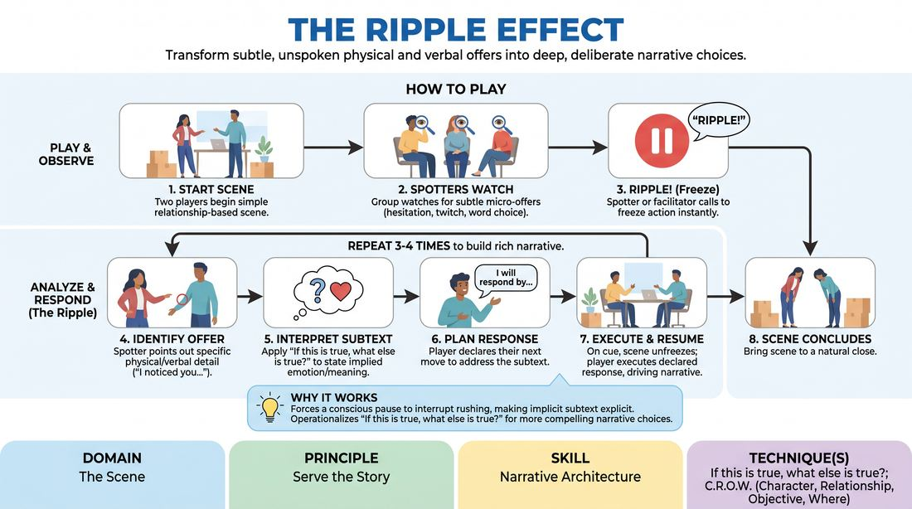

# 🎯 Scene Lab — The Ripple Effect

{ .infographic }

> Transform subtle, unspoken physical and verbal offers into deep, deliberate narrative choices.

`Players 2–99` · `~35 min` · `Complexity 3/5` · `Energy low` · `Contact none` · `Props: none`

⬅️ [Back to the Week 04 run-sheet](../week-04.md)

## Why this activity, here

Week 4 has already given them platform — the shared, ordinary world at the top of a scene. This is where the tilt gets built deliberately instead of hoped for. Ripple slows the moment of departure down until they can see the exact offer a tilt grows from, and forces the justification step that makes it story rather than random escalation. It feeds directly into the unbroken scenes at the end of the session, where nobody will call "Ripple" and they will have to hear it themselves.

## What students actually learn

- They stop waiting for a big offer. A face-down photo frame is enough to build twenty minutes of story on.
- They get the habit of asking "if this is true, what else is true?" out loud, so it survives into scenes where nobody prompts it.
- They learn the difference between reacting to a detail and building on it — declaring the move before making it exposes vague responses.
- They watch scenes differently. Spotting trains attention that transfers straight back into their own two-handers.

## Setup

Clear a playing area with two chairs and a couple of neutral objects — a box, a coat, a mug. Everyone else in a loose arc facing the space, close enough to hear a mumble. Have four or five relationship premises ready on paper: colleagues packing an office, a couple assembling flat-pack furniture, two neighbours returning borrowed tools, adult siblings sorting a parent's kitchen. Each is a shared ordinary task, no conflict written in. No props beyond what's in the room.

## How to run it — 35 minutes

| Min | What you do |
|---:|---|
| 5 | Explain the frame and demonstrate. Start a scene with a volunteer, call "Ripple!" yourself once, model the three sentences — noticed, implies, respond by — then play the response and cut. |
| 6 | First full scene. You call every Ripple. Take four. Keep the interpretations blunt and the responses concrete. Cut the scene when the fourth response has landed. |
| 7 | Second scene, new pair. Spotters call the Ripples now. Coach the callers, not the players — trim any interpretation longer than a sentence. Three or four freezes. |
| 7 | Third scene, new pair. Same rules. Push for earlier calls: the first Ripple inside the opening thirty seconds, before a story has formed. |
| 7 | Fourth scene, new pair. Allow two Ripples only. Tell the players to keep building without prompts after that. Watch whether they self-ripple. |
| 3 | Debrief the whole block. Two questions, quick answers from the floor, no discussion loop. Land the cue and move on. |

## Side-coaching script

| When | Say |
|---|---|
| A Spotter calls Ripple but the scene keeps drifting | *"Freeze. Hold exactly where you are."* |
| A caller starts interpreting before naming the detail | *"What did you see. Just the thing."* |
| An interpretation runs long or hedges | *"One sentence. This implies what."* |
| The declared response is a feeling, not an action | *"Give me the line you'll say."* |
| Restarting the scene | *"Play — straight into it."* |
| Players ease back in with small talk after unfreezing | *"Response first. Now."* |
| A pair is escalating without justifying | *"Make it make sense. Why is that true here."* |
| The last Ripple has landed and the scene is circling | *"Find your ending in three lines."* |

!!! success "What good looks like"
    The freezes are quick and unfussy. Callers name a genuinely small thing — a pause, a repeated word, a hand pulling back — not a big obvious move. Interpretations are specific and sometimes wrong, and nobody minds. Declared responses are lines and actions you could film. When the scene restarts, the story has visibly shifted, and the shift traces back to the detail. By the fourth scene, at least one pair chases a micro-offer without being told to.

## When it goes wrong

| You see | What's causing it | The fix |
|---|---|---|
| Spotters only call Ripple on loud, deliberate moves — a shout, a thrown box | They are watching for content, not behaviour. It feels safer to name something the player clearly meant. | Ban anything intentional for one scene. Only accidental or unnoticed details qualify. Call two yourself to show the size you want. |
| Interpretations turn into notes: "This implies you should have committed more." | The Spotter role slides into critique when they have nothing else to do with the authority. | Stop it on the spot. "Implies something about the character, not the player." Repeat the sentence stem for them until it sticks. |
| The declared response is played, then the scene resets to where it was before | The players treat the Ripple as an interruption to survive rather than a change to the world. | After the next Ripple, ask the pair: "What can't go back to normal now?" Make them answer before you call Play. |
| Long silences while the receiving player composes their declaration | They are auditioning for the cleverest possible response. | Count them down from five. Take whatever arrives. Tell the room the declaration only has to be concrete, not good. |

## Scaling

| Class size | What changes |
|---|---|
| **10–13** | One playing area, everyone Spots. Four scenes as timed. Every person plays at least once — track who has and assign the fourth pair rather than asking for volunteers. |
| **14–17** | Keep one playing area for the demo and first scene, then split into two circles of seven or eight for scenes two and three, running simultaneously. Give each circle a written premise list. Bring everyone back for the final scene watched by all. Same total minutes. |
| **18–20** | Two circles from the start after your demo, each with its own facilitator or an appointed timekeeper. Each circle runs three scenes of six minutes instead of four. Skip the whole-room final scene; debrief together for the last three minutes. Nobody plays twice before everyone has played once. |

## Variations

**Facilitator-only Ripples** — You call every freeze for the whole block. Spotters just watch and are asked afterwards what they would have called.  
*Easier — removes the pressure of calling in front of the room and guarantees the offers named are small enough to be useful.*

**Silent declaration** — Skip step six. The receiving player says nothing and simply plays the response when you call Play. Spotters afterwards say what they think the response addressed.  
*Harder — no rehearsal of the move, and the player has to make the subtext readable through action alone.*

**Ripple the object** — Restrict all callable details to how players handle physical objects — the box, the mug, the coat. Nothing verbal, nothing facial.  
*Different emphasis — moves attention to object work and physical storytelling rather than word choice and tone.*

## Debrief

1. **What was the smallest thing anyone called, and what did the scene get from it?**
   > *A good answer sounds like:* Someone names a genuinely tiny detail — a pause before answering, which box got picked up — and can trace a specific later beat back to it. Not "it was interesting", but "that's why they were lying about the job".

2. **When you were playing, did the Ripple feel like an interruption or a gift?**
   > *A good answer sounds like:* Honesty either way. The useful version is somebody admitting it broke their plan, and that the scene got better anyway. Don't push anyone to say they loved it.

3. **What do you do with this when nobody is calling Ripple for you?**
   > *A good answer sounds like:* Something operational — notice one detail early, name it out loud in the scene, treat it as true, follow the consequence. Not a general statement about listening more.

!!! warning "Safety & inclusion"
    No touch is required. If a pair wants contact — a hand on a shoulder, taking a box from someone — they ask in the moment and either player can decline without explanation. Spotters comment on characters, never on the person playing: shut down anything about a player's body, accent or nerves immediately and re-say the sentence stem. Anyone can sit out a scene and Spot instead; Spotting is real participation, not a bench. Players who freeze mid-scene get a cut from you, not a rescue attempt from the floor. Premises are all mundane and domestic — no bereavement, no illness, no relationship break-ups in the written prompts, though players may steer there themselves.

## Why it works

Narrative architecture depends on a tilt that is both a genuine break in the routine and traceable back to it. Most beginners can do one or the other: they break the platform with something arbitrary, or they stay safe and nothing breaks. The freeze splits the moment into three visible steps — observe, interpret, act — so the causal link is built explicitly rather than hoped for. Naming the detail proves the offer was real and not invented after the fact. Declaring the response out loud before playing it stops a vague emotional reaction passing for a choice. Repeating it three or four times inside one scene shows them a spine assembling from small material, which is the argument the cue makes: break the routine, then make it make sense.

[Open the full activity card »](../../../../games/D3_P4_S3_T0_G080__the-ripple-effect.md){target=_blank rel=noopener}
