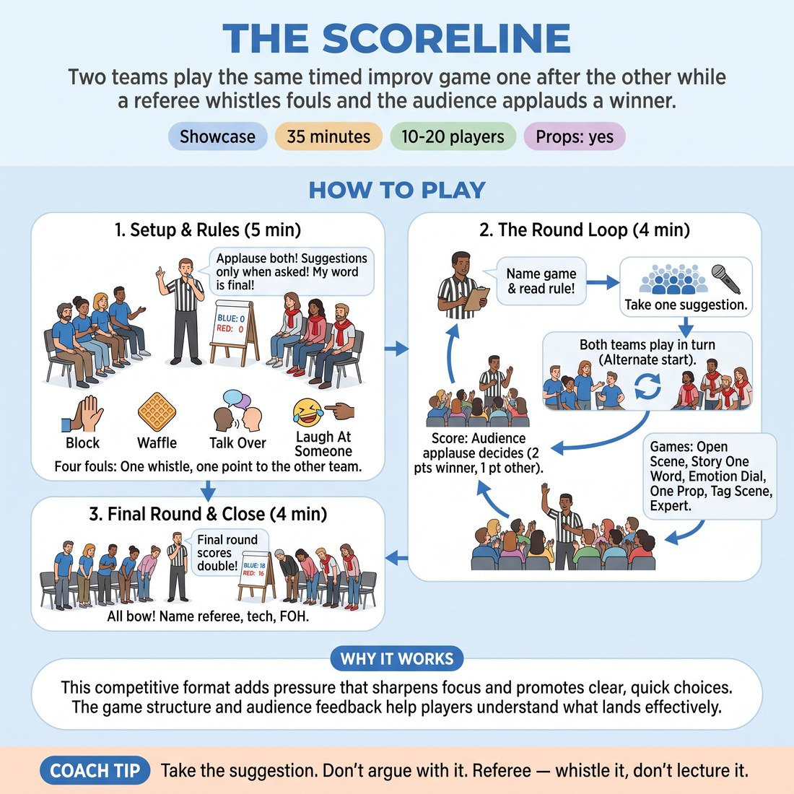

# 🏟️ Showcase round — The Scoreline

{ .infographic }

> Two teams play the same timed improv game one after the other while a referee whistles fouls and the audience applauds a winner.

`Players 10–20` · `~30 min` · `Complexity 3/5` · `Energy high` · `Contact incidental` · `Props: required`

⬅️ [Back to the Week 04 run-sheet](../week-04.md)

## Why this activity, here

Week four builds platform, tilt and spine in the safety of a workshop. This is where it gets tested under a clock and an audience. Everything the session taught about establishing a normal and then breaking it has ninety seconds to happen in front of people who are watching for it. It closes the session and feeds the next block's work on consequence and endings, because players leave knowing exactly which habit — hedging, blocking, over-talking — cost them a whistle.

## What students actually learn

- That a platform can be built in twenty seconds if you stop hedging, because the clock will not wait for you to decide.
- That the tilt is not a joke you find, it is a break in the routine you have just established — and it lands harder when the routine is clear.
- That being scored on is survivable. The applause is for the bench, not for them, and the game ends whether they win or not.
- That an audience tells you instantly whether a story made sense, and that this information is useful rather than shaming.

## Setup

Two rows of chairs angled towards an empty playing area, one row per bench, five to ten chairs each. One spare chair centre stage for One Prop. You need a whistle, a timer you can see, and a scoreboard — a flip pad or two stacks of numbered A4 sheets on a music stand. Write the four fouls on a visible sheet. Keep a card in your hand with the rule for each chosen game so you can read it aloud without improvising it. Clear a metre of walking room behind each bench for tag-outs.

## How to run it — 30 minutes

| Min | What you do |
|---:|---|
| 5 | Set the benches. Take the whistle. Deliver the three house rules, introduce both benches by name, then read the four fouls and whistle once after each so the sound is familiar. Say the cue: break the routine, then make it make sense. |
| 5 | Round one, Open Scene. Read the rule, take one place from the audience, run bench A then bench B, ninety seconds each. Whistle fouls. Score by applause, scorekeeper flips numbers. |
| 5 | Round two, Story One Word. Take a title from the audience. Each bench lines up and tells the story one word per person, twice round the line maximum. Whistle waffling. Score. |
| 5 | Round three, Emotion Dial. Two players per bench, ninety seconds, call a number from one to ten twice during each scene. Bench B goes first this time. Whistle fouls. Score. |
| 5 | Round four, Tag Scene, double points. Two-hander starts, teammates tap out and open a new scene from the last line spoken. Ninety seconds per bench. Whistle fouls. Score, doubled. |
| 5 | Read the totals. Both benches bow together. Name the scorekeeper, tech and front of house and let them bow. Then sit everyone down and run two debrief questions, standing, in three minutes. |

## Side-coaching script

| When | Say |
|---|---|
| First twenty seconds of any two-hander | *"Where are we. Who are you. Now."* |
| A player is hedging between two ideas | *"Choose. Either one."* |
| Immediately after a whistle | *"Point to the other bench. Keep playing."* |
| The platform is set and the scene is idling | *"Break the routine."* |
| Something odd has happened and nobody has reacted | *"Now make it make sense."* |
| Two players are speaking over each other | *"One voice."* |
| Story One Word turns into a list | *"One word each. Keep the sentence alive."* |
| Ten seconds left on a scene | *"Land it."* |

!!! success "What good looks like"
    Both benches are loud for each other. Scenes start with a place and a relationship inside the first three lines, then something changes at the halfway mark and the last twenty seconds deal with what changed. Whistles happen — three or four across the block is healthy — and nobody argues with them. Players come off stage grinning and slightly out of breath. The score is close enough that nobody has checked out, and at the end both benches bow without needing to be told twice.

## When it goes wrong

| You see | What's causing it | The fix |
|---|---|---|
| You whistle six times in one ninety-second scene and the players stop moving. | Refereeing for accuracy rather than for rhythm. Every hesitation reads as a foul. | Whistle only for clear, visible fouls that the audience also spotted. Cap yourself at two whistles per scene. Let small hedges pass and side-coach them instead. |
| One bench applauds tepidly for the other, and losing players go quiet on their chairs. | The competition has become real to them because the house rules were rushed at the top. | Stop between rounds. Restate rule one: applaud both benches. Score the next round on volume for the opposing team only. If it persists, drop scoring and keep the whistle. |
| Scenes are frantic and loud but nothing follows from anything. No story arrives. | Players are treating the clock as a demand for energy rather than for decisions. | Before the next round, say one line: the fastest thing you can do is agree where you are. Then call "break the routine" at the forty-five second mark yourself. |
| The same four confident players keep taking the stage and half the room never plays. | No roster. Benches self-select and the quicker people self-select faster. | Write the playing order on each bench's chair backs before round one. Read the two names for each round yourself. Nobody plays twice until everyone has played once. |

## Scaling

| Class size | What changes |
|---|---|
| **10–13** | Two benches of five to seven. Everybody plays at least twice across four rounds. Keep all four rounds at five minutes. You referee and one non-playing student keeps score from their bench between turns. |
| **14–17** | Two benches of seven to nine. Write a playing roster per bench before round one and read names aloud. Swap Emotion Dial for One Prop if you need more bodies on stage — it takes four per bench comfortably. |
| **18–20** | Two benches of nine or ten. Pull three students out as permanent crew: scorekeeper, timekeeper, front of house who announces each game. Choose Story One Word and Tag Scene as two of your four rounds so whole benches get stage time. Crew are named and bow at the close. |

## Variations

**No whistle** — Run the same four rounds and the same applause scoring, but drop the fouls entirely. Keep the referee role for timing and suggestions only.  
*Easier. Removes the fear of being buzzed, which is what stops nervous players committing. Use it with a group that has never performed.*

**Called tilt** — In every two-hander, blow one short whistle at the forty-five second mark. That is the signal to break the routine. Points are lost if nothing changes.  
*Harder. Forces the tilt on the clock rather than when it feels comfortable, and exposes players who were coasting on a pleasant platform.*

**Audience jury** — Instead of applause, three rotating students sit at the front and each award a point after every round, saying one sentence about which story made more sense.  
*Different emphasis. Shifts scoring from volume to structure, and makes the watching half articulate what a spine looks like rather than just enjoying it.*

## Debrief

1. **Which round had the clearest routine before it broke?**
   > *A good answer sounds like:* Someone names a specific scene and describes the ordinary thing that was established — the queue, the Sunday lunch, the induction day — before saying what broke it. Not "the funny one". Move on when two people can do this.

2. **What did the whistle actually catch you doing?**
   > *A good answer sounds like:* A player owns a habit in plain terms: "I had an idea and I talked around it for ten seconds." Defensive answers about the referee being wrong mean you whistled too much; note it and move on.

3. **What does an audience do to your playing that a workshop doesn't?**
   > *A good answer sounds like:* Honest reports of both directions — faster decisions, but also more showing off, or more freezing. You are looking for awareness rather than a verdict on whether audiences are good.

!!! warning "Safety & inclusion"
    Tag Scene involves a tap on the shoulder. Before that round, ask the whole room whether anyone would rather not be touched. Offer the alternative openly: a clap and a name from the edge of the playing area, used by everyone that round if even one person prefers it. Nobody explains their reason. Anyone who does not want to perform takes a crew role — scorekeeper, timekeeper, front of house — and is named and applauded at the close on the same footing as the players. Laughing at someone's expense is a whistled foul; enforce it the first time it happens, early, so the room knows it is real. The score is a bench score, never an individual one, and you never name who caused a foul.

## Why it works

Narrative architecture fails in the room for two reasons: players will not commit to a normal, and they will not let it break. The ninety-second cap removes the first — there is no time to hedge, so a place and a relationship arrive in the opening lines whether the player planned them or not. The fouls remove the second — blocking and waffling are precisely the moves that prevent a routine from tilting, and a whistle names them in public the moment they happen, which is faster feedback than any note. The audience then supplies the test: applause is louder for the scene where the break was followed through, so players learn the shape of a spine from the volume in the room rather than from a diagram. The competition is a container, not the point. It makes the clock and the whistle feel legitimate, which is what lets people accept correction while still playing.

[Open the full activity card »](../../library/showcase-formats/SF__the-scoreline.md){target=_blank rel=noopener}
