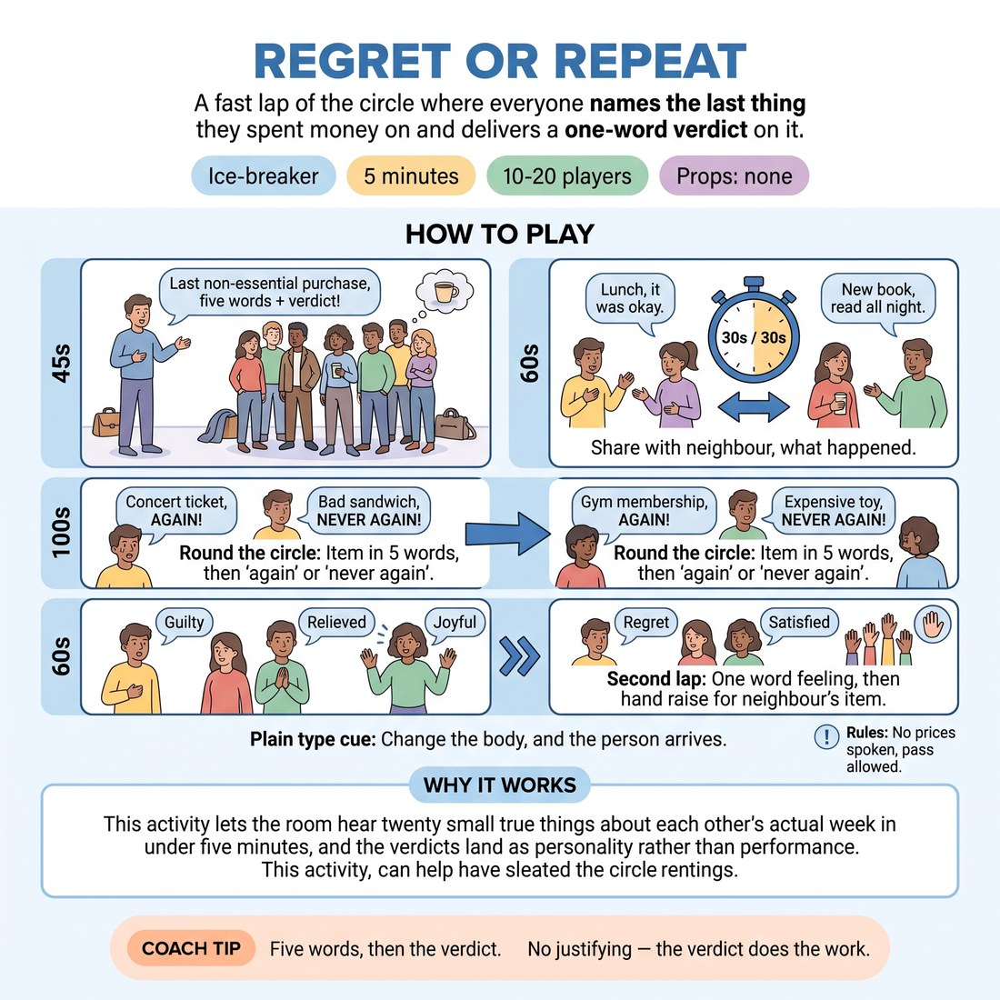

# 🧊 Ice-breaker — Regret or Repeat

{ .infographic }

> A fast lap of the circle where everyone names the last thing they spent money on and delivers a one-word verdict on it.

`Players 10–20` · `~5 min` · `Complexity 1/5` · `Energy medium` · `Contact none` · `Props: none`

⬅️ [Back to the Week 05 run-sheet](../week-05.md)

## Why this activity, here

Opens Week 5, the week on building character from the outside. Before anyone puts on a walk or a posture, they practise landing a verdict in one word with tone and body doing the work. It feeds the physical character blocks later in the session, where the same instinct — commit first, justify never — carries a full figure.

## What students actually learn

- That a single word delivered with a body behind it reads as a whole attitude, and no explanation improves it.
- That they already switch emotional register constantly in ordinary talk, and can do it on cue.
- That waiting for the interesting version of an answer costs the room more than the boring version would.

## Setup

One circle, standing, no chairs, no props. Everyone can see everyone. Have your own example ready before the room walks in — pick something faintly embarrassing and cheap. No phones out. Nobody says a price out loud at any point; say this before you start.

## How to run it — 5 minutes

| Min | What you do |
|---:|---|
| 1 | Circle up standing. Set the task: last non-essential purchase this week, not bills. Model your own — five words, then a one-word verdict. Say the no-prices rule. Offer the pass option. |
| 1 | Pairs to the left. Thirty seconds each way: what it was and what happened after. Call the swap loudly at halfway. Cut it dead at the minute. |
| 2 | Full lap. Each person: item in five words or fewer, then 'again' or 'never again'. Cut any explanation immediately. Keep the pace brisk and even. |
| 1 | Second lap, one word only — the feeling at the moment of paying. Three seconds each. Then hands up for anyone who'd buy their right-hand neighbour's item. Count aloud, thank them, move on. |

## Side-coaching script

| When | Say |
|---|---|
| Setting the task | *"Cheap and slightly embarrassing beats interesting."* |
| First lap, someone starts a story | *"Verdict only. Next."* |
| First lap, energy dipping | *"Faster. Don't improve the answer."* |
| Someone hesitates at their turn | *"First thing. It's already right."* |
| Starting the second lap | *"One word. Let your face do the rest."* |
| Second lap, words coming out flat | *"Put it in the body, not the vocabulary."* |
| During the hands count | *"Honest hands only."* |
| Closing | *"Hold that speed. We're keeping it."* |

!!! success "What good looks like"
    The first lap takes under two minutes and nobody explains themselves. Verdicts land with a shrug, a grimace, a grin — the word is small and the delivery isn't. The second lap is faster than the first. There is laughter at two or three items and it doesn't stop the circle. Everyone has spoken twice inside five minutes.

## When it goes wrong

| You see | What's causing it | The fix |
|---|---|---|
| People telling the story behind the purchase on the first lap. | The pairs step gave them the taste of narrating and you didn't cut hard enough at the switch. | Interrupt on the second offender with 'verdict only' and move to the next person mid-sentence. One firm cut resets the whole circle. |
| Long pauses while people search for something worth saying. | They think the item has to be funny. It doesn't, but the instruction implied a standard. | Say 'a coffee counts' out loud and take the next person immediately. Skip anyone stuck and come back to them at the end. |
| The second lap sounds identical to the first — same verdicts, no feeling words. | They didn't hear the change of task over the momentum. | Stop, restate in six words: 'One word. How you felt paying.' Start the lap from a different person so the rhythm breaks. |
| Visible discomfort around money in one or two people. | Spending is not neutral for everyone in the room, and someone is comparing. | Take the pass without comment and keep the lap moving at the same speed. Do not make it a moment. Afterwards, use borrowed items as the default framing. |

## Scaling

| Class size | What changes |
|---|---|
| **10–13** | One circle, both laps as written. You will finish early — spend the spare thirty seconds on a third lap where the verdict is delivered as a gesture with no word. |
| **14–17** | One circle. Tighten the first lap to four words maximum and count aloud yourself if it drags. Keep the pairs step at thirty seconds each way. |
| **18–20** | Split into two circles of ten for the laps, each with a nominated starter, running simultaneously. You float. Skip the pairs step entirely and give the extra minute to the two laps. Do the hands count in each circle separately. |

## Variations

**Borrowed Basket** — Everyone names something someone else in their life bought recently — a partner, a flatmate, a colleague — and gives the verdict on their behalf.  
*Easier. Removes all personal financial disclosure and still trains the fast committed verdict.*

**Opposite Verdict** — Same two laps, but each person must deliver the verdict they don't hold, and sell it with body and voice.  
*Harder. Forces the delivery to carry meaning the words contradict, which is the week's whole subject.*

**Posture Verdict** — Drop the words on the second lap. Each person shows the moment of paying as one held shape for three seconds. The circle says the feeling word back.  
*Different emphasis. Moves the exercise off language and onto the body, feeding directly into the character blocks.*

## Debrief

1. **Which was quicker to produce — the verdict or the feeling word?**
   > *A good answer sounds like:* Someone says the feeling word came out before they'd thought about it, and the verdict took a second because they were assessing. That distinction is the whole point; move on.

2. **What did you get from someone's word that wasn't in the word?**
   > *A good answer sounds like:* They name a specific delivery — a wince, a laugh at the end, a flat 'again' that sounded like defeat. Once one person names a specific body, stop.

!!! warning "Safety & inclusion"
    No physical contact in this activity. Money is uneven in any room: state before the first lap that no amounts are spoken and that anyone can pass or borrow someone else's purchase without explaining. Take passes at full speed, with no follow-up. If someone can't stand comfortably for five minutes, run it seated in the same circle — nothing is lost. Keep the whole thing under five minutes; this is a door, not a discussion.

## Why it works

Emotional fluidity fails when people audit a feeling before showing it. The five-word cap and the three-second clock remove the auditing window — there is no time to select a better feeling, so the first one gets a body. Because the content is trivial and factual, nobody is defending a choice, which is what usually makes people go flat. The second lap then swaps the axis from judgement to feeling on the same material, so they experience switching emotional register with no change of subject. That is the mechanism the session's cue names: the shift is physical first, and the person follows.

[Open the full activity card »](../../library/icebreakers/IB__regret-or-repeat.md){target=_blank rel=noopener}
