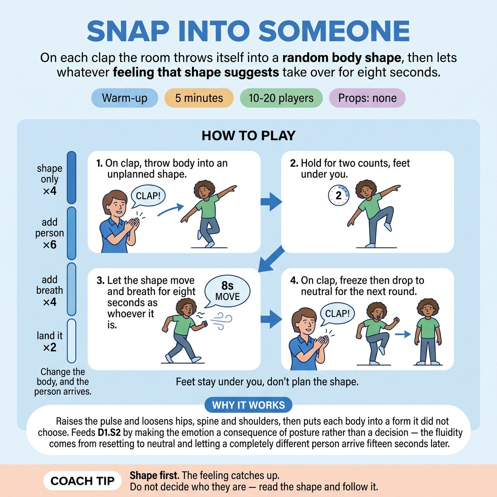

# 🔥 Warm-up cluster — Snap Into Someone

{ .infographic }

> On each clap the room throws itself into a random body shape, then lets whatever feeling that shape suggests take over for eight seconds.

`Players 10–20` · `~5 min` · `Complexity 2/5` · `Energy high` · `Contact none` · `Props: none`

⬅️ [Back to the Week 05 run-sheet](../week-05.md)

## Why this activity, here

Week 5 turns the class outward: character built from posture rather than backstory. This is the first thing they do in the room, before any scene work. It puts the body ahead of the idea while nobody is watching, so that later in the session — in two-handers and in the longer character block — the shape is already a place they know how to arrive from. It feeds directly into anything that asks them to walk in as someone else.

## What students actually learn

- That a feeling can arrive from a hip angle rather than a decision, and arrive faster than a decision.
- That they already have a couple of dozen people in their body, and can reach one in under a second.
- That neutral is a place you can return to on purpose, not a state you drift back into.

## Setup

Clear floor, everyone standing, arm's span between bodies. No chairs, no props, no music. You need a clap loud enough to cut through twenty people breathing. Check shoes are on and bags are off the floor. If the room is narrow, run it in two facing lines rather than a circle so nobody backs into a wall.

## How to run it — 5 minutes

| Min | What you do |
|---:|---|
| 1 | Spread the room. Demo one unplanned shape — hold, drop to neutral. State the two rules: feet stay under you, don't plan. Answer nothing; start. |
| 1 | Shape only. Four rounds. Clap, snap into a shape, hold three counts, shake out. No movement inside the shape, no sound. Keep the pace brisk. |
| 1 | Add the person. Three rounds. Clap, snap, hold two counts, then the shape moves for eight seconds as whoever it is. Clap to reset. |
| 1 | Three more of the same, then four rounds with breath added — the moving body sighs, huffs, grunts. No words. Push for audible. |
| 1 | Two final rounds: move as the person eight seconds, then on the clap freeze and drop to neutral. Feet flat, shoulders down. End there. No discussion. |

## Side-coaching script

| When | Say |
|---|---|
| First shape-only round, if bodies look tidy | *"Uglier. Nothing symmetrical."* |
| Second or third shape-only round | *"Land before you decide. The shape comes first."* |
| First round with movement | *"Don't perform them. Just let them walk."* |
| Mid movement rounds, if people are watching each other | *"Own eyeline. Nobody's the audience."* |
| Breath rounds, first clap | *"Out loud. Let the breath be the wrong shape too."* |
| Breath rounds, if words creep in | *"Sound, not speech."* |
| Final two rounds, on the freeze | *"Freeze. Now drop. Feet flat, shoulders down."* |
| Straight after the last neutral | *"Shake it out. Nobody explain who that was."* |

!!! success "What good looks like"
    Shapes get stranger across the five minutes rather than settling into favourites. On the clap, bodies land before faces do. In the eight-second stretches people move with a clear physical logic — a heavy shuffle, a jerky peer, a leaning drift — without anybody narrating or joking. Breath sounds genuinely come from the posture, not from a comedy voice. And on the last clap, the room drops to a real neutral: no one holding a residual smirk or a half-cocked hip.

## When it goes wrong

| You see | What's causing it | The fix |
|---|---|---|
| Everyone snaps into roughly the same three shapes — arms up, crouch, superhero pose. | They are choosing rather than throwing, and choosing pulls from a small shared library. | Speed up the claps so there is no gap to choose in. Call for asymmetry: one shoulder, one hip, one hand doing something different. |
| Movement rounds turn into stock comedy characters — the drunk, the old man, the zombie. | They have skipped the shape and gone to a reference. The body is illustrating a label. | Call "don't name them". Tell them to move the exact shape they landed in rather than the idea it reminded them of. |
| People break, laugh, and glance around during the eight seconds. | Self-consciousness with no scene to hide behind. Common in week five with a group that still performs at each other. | Name it once and keep going. Call "own eyeline". Laughing bodies still count — tell them to keep the shape moving through the laugh. |
| Breath round stays silent or goes to whispered dialogue. | Vocalising feels more exposing than moving, so they hedge into words. | Demo one loud ugly sigh yourself. Say "sound, not speech". Accept small sounds — the point is the breath coming from the posture. |

## Scaling

| Class size | What changes |
|---|---|
| **10–13** | One loose scatter across the whole floor. Run every round as written — four, six, four, two. You can afford a slightly longer eight-second stretch because the room is easy to read. |
| **14–17** | Still one scatter, but push everyone to the edges first so the middle stays open. Drop one round from the movement phase (five instead of six) to protect the breath and landing phases. |
| **18–20** | Split into two facing halves along the room's long axis, both playing at once — nobody watches. Cut to three shape-only rounds and five movement rounds. Clap harder; twenty people breathing swallows sound. |

## Variations

**Copy the neighbour** — On the clap, instead of inventing a shape, take the shape of whoever is nearest you and hold it. Then let it move.  
*Easier — removes the invention pressure entirely and still delivers the feeling-from-posture effect.*

**Hold and shift** — After the eight seconds, don't reset. On the next clap, change one thing only — the spine, the hands, the weight — and let the person change with it.  
*Harder — they must feel a whole person shift off a single joint rather than starting fresh.*

**Two words at the end** — Same structure, but on your second clap the person says two words before dropping to neutral. Nothing more.  
*Shifts emphasis from body to voice — tests whether the posture has actually produced a person or just a pose.*

## Debrief

1. **Which shape gave you a person fastest?**
   > *A good answer sounds like:* They name a physical detail, not a character — "the one where my weight was all on the back foot" — and say the feeling turned up before they had a thought about it.

2. **Did anything arrive that you would never have chosen?**
   > *A good answer sounds like:* Someone reports a feeling they don't associate with themselves — smug, timid, furious — and can point to the posture that produced it, without apologising for it.

!!! warning "Safety & inclusion"
    No contact at any point; keep an arm's span clear. Feet stay under the body — no jumping, no floor shapes, no sudden twisting. Anyone with a back, knee or neck issue plays the whole thing seated or with small shapes made only in the hands, arms and face; say this out loud before the demo so it is not a request anyone has to make. Loud claps can startle — warn the room that claps are coming and offer to use a spoken "now" instead if anyone prefers. Anyone who wants to sit a round out just drops to neutral and stands still; do not comment on it.

## Why it works

Emotional fluidity stalls when feelings are chosen. A chosen emotion has to be justified, and justification is slow. This activity removes choice by putting a clap where the decision would go: the body lands before the mind has arrived, and the mind then reads the posture and supplies a matching state. That is the cue made mechanical — change the body, and the person arrives. Repeating it sixteen times in five minutes builds the reflex under time pressure, so that in scene work the same route is available without the clap. The breath phase matters because vocal tone is the fastest external signal of state; attaching it to posture rather than intention stops the voice and body drifting apart. The forced neutral at the end teaches the return trip, which is what makes rapid switching safe rather than exhausting.

[Open the full activity card »](../../library/warmups/WU__snap-into-someone.md){target=_blank rel=noopener}
