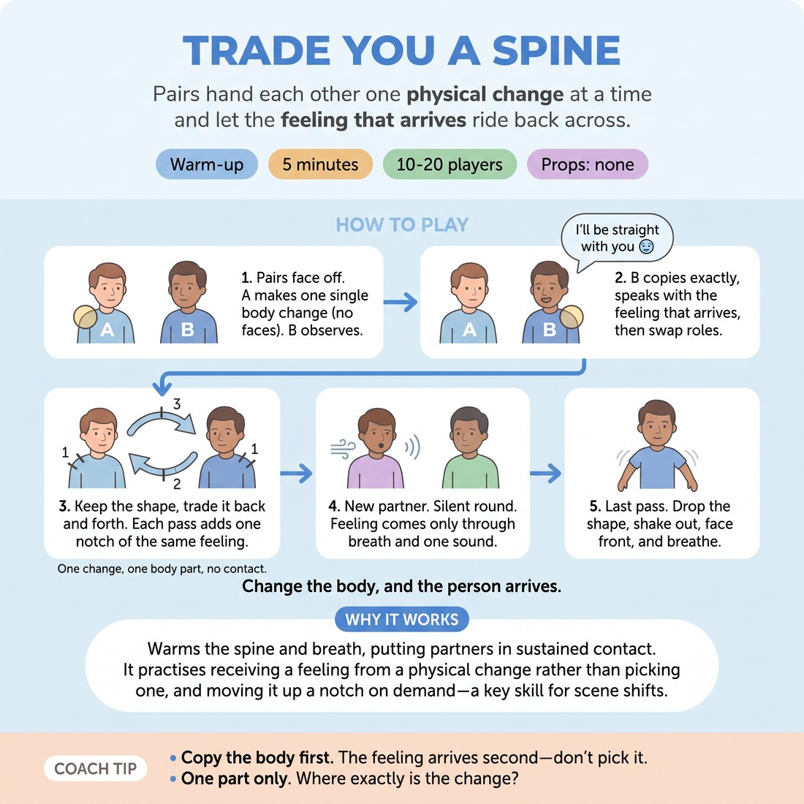

# 🔥 Warm-up cluster — Trade You a Spine

{ .infographic }

> Pairs hand each other one physical change at a time and let the feeling that arrives ride back across.

`Players 10–20` · `~5 min` · `Complexity 3/5` · `Energy medium` · `Contact none` · `Props: none`

⬅️ [Back to the Week 05 run-sheet](../week-05.md)

## Why this activity, here

Week 5 works character from the outside in. This is the first thing they do all session: it puts a physical change in the body before anyone has a chance to decide who they are playing. It feeds the longer character blocks later, where they will need a body they can find in one second, and it sets up the escalation habit — a shape that grows rather than resets.

## What students actually learn

- That a feeling can arrive from a shoulder rather than a decision.
- That copying someone else's body accurately gives you information you didn't have.
- That intensity can be added in notches, not jumps.
- That they can drop a body as cleanly as they picked it up.

## Setup

Clear floor, everyone standing, pairs spread so no one is backing into another pair. No chairs needed unless someone is seated — a seated player runs the whole thing from the chair with upper-body changes. No props, no music. Know the line before you start: "I'll be straight with you." Say it once, plainly, so nobody is guessing at an accent or attitude.

## How to run it — 5 minutes

| Min | What you do |
|---:|---|
| 1 | Pairs up, A and B labelled. Give the rule — one change, one body part, no faces. Demonstrate: drop one shoulder, hold, say the line. Do not explain the feeling. Start them. |
| 1 | A offers a change, B copies exactly and says the line. Swap. Keep them cycling. Call "copy it, don't improve it" if you see approximations. |
| 1 | Freeze the shape they are on. Now trade the same shape back and forth, adding one notch of the same thing each time. Same line every pass. |
| 1 | New partners, fast. Silent round: pass, copy, add a notch. Feeling comes out through breath and one sound. No words at all. |
| 1 | Call the last pass. Drop the shape. Shake out arms, face front, two normal breaths. One question to the room, one or two answers, move on. |

## Side-coaching script

| When | Say |
|---|---|
| First offers, when people make three changes at once | *"One thing. One only."* |
| When copies are approximate | *"Copy it exactly. Don't tidy it up."* |
| When the line comes out flat or generic | *"Let the body say it. Don't act it."* |
| Start of the escalation round | *"One notch. Not double."* |
| When someone jumps to a big emotion | *"Same thing, more of it."* |
| Silent round begins | *"Breath first. Sound second."* |
| If faces start doing the work | *"Below the neck."* |
| Final ten seconds | *"Drop it. Shake it out. Face front."* |

!!! success "What good looks like"
    Small, specific changes — a jaw pushed forward, a hip cocked, one hand curled. Copies that actually match. The line lands differently every pass without anyone deciding what it should mean. In the escalation round the pair drifts somewhere neither of them planned, and it still looks like the same shape, just more of it. In the silent round you hear breath change before you hear sound. At the end, everyone is back to neutral inside five seconds.

## When it goes wrong

| You see | What's causing it | The fix |
|---|---|---|
| Whole-body character poses — hunched pirates, strutting bosses. | They have skipped to a character concept instead of taking one physical change. | Stop them. Name one body part out loud — "jaw" — and run three passes where that is the only thing allowed to change. |
| The line is read the same way every pass, in their own voice. | They are saying the words and separately holding a shape, with no traffic between the two. | Call "say it from the shoulder, not the mouth." Have them hold the shape for three seconds in silence before speaking. |
| Escalation jumps straight to maximum in one pass, then has nowhere to go. | They are playing for the laugh rather than the ladder. | Call "one notch" and count the passes aloud — "two, three, four" — so the increments are audible. |
| Pairs giggling and abandoning the shape within seconds. | Standing close and staring is uncomfortable, and laughing is the exit. | Let it pass once, then say "keep the shape while you laugh." The shape usually survives the laugh and the laugh dies out. |

## Scaling

| Class size | What changes |
|---|---|
| **10–13** | One wave, all pairs at once. Any odd person makes a trio: three-way pass, A to B to C to A. Timings as written. |
| **14–17** | Still one wave. Spread pairs to the edges of the room so nobody is shouting over a neighbour. Trim the demo to fifteen seconds to protect the silent round. |
| **18–20** | One wave, but cut the swap in round two — A offers, B copies, then move straight into escalation without reversing roles. The room is loud enough that a shorter verbal section keeps the silent round clean. |

## Variations

**Named part** — You call the body part before each pass — "hand", "jaw", "left hip". They choose only how it changes.  
*easier — removes the choice that stalls people, keeps offers small*

**Three-way spine** — Run in trios. The shape passes A to B to C, each adding a notch, so it comes back to A twice as strong.  
*harder — you copy someone who has already altered the offer, so accuracy is tested*

**Same shape, new line** — Keep the escalation but change the sentence each pass to something ordinary — "the kettle's boiled", "I found your keys".  
*different emphasis — shifts attention onto how the body colours neutral text*

## Debrief

1. **Which pass gave you a feeling you didn't choose?**
   > *A good answer sounds like:* They name a specific physical thing — "when my jaw came forward I got annoyed" — rather than describing a character they invented.

2. **What changed when the words went away?**
   > *A good answer sounds like:* Something about the breath arriving first, or the shape being clearer without a line to hide behind.

!!! warning "Safety & inclusion"
    No contact at any point — everyone copies by looking, never by adjusting a partner's body. Say that out loud before the first pass. Anyone who does not want to be looked at closely can work at greater distance or side by side rather than face to face. Hips, pelvis and chest are opt-out areas; offer jaw, shoulders and hands as the default menu. Seated players run the whole thing from a chair with upper-body changes only, and their partner copies seated too. Escalation stops at the point of strain — nobody holds a shape that hurts. The shake-out at the end is not optional; do it with them.

## Why it works

D1.S2 is emotional fluidity — moving between feelings without having to justify the move. The bottleneck is that adults tend to decide on an emotion and then illustrate it, which is slow and stays inside one register. This block removes the decision. A single physical change alters breath and muscle tone, and the line spoken through that altered body comes out coloured before the player has formed an intention. Copying a partner's shape exactly is the key mechanism: you receive a body you would never have chosen, so the feeling that arrives is genuinely new information rather than your own default. Adding one notch per pass then teaches gradation — that intensity is a dial, not a switch — which is what makes a feeling changeable rather than committed to. The silent round strips the verbal escape route, so the body has to carry it alone.

[Open the full activity card »](../../library/warmups/WU__trade-you-a-spine.md){target=_blank rel=noopener}
