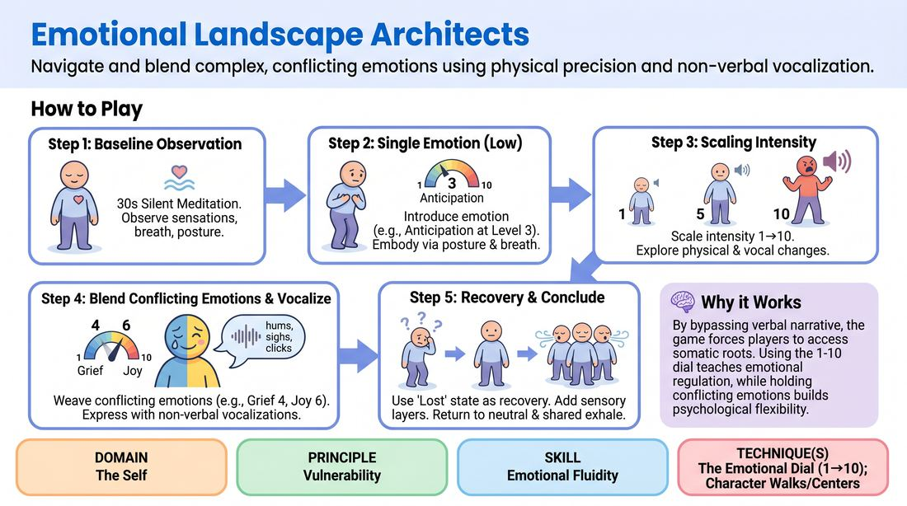

# 🎲 Drill A — isolation — Somatic Weather Systems

{ .infographic }

> Navigate and blend complex, conflicting emotions using physical precision and non-verbal vocalization.

`Players 2–99` · `~25 min` · `Complexity 3/5` · `Energy medium` · `Contact none` · `Props: none`

⬅️ [Back to the Week 05 run-sheet](../week-05.md)

## Why this activity, here

Week 5 works character from the outside in. This is the first block of the day and it stays solo on purpose — no partner, no scene, nothing to be clever about. It teaches the body-first route into feeling and gives everyone a shared dial and a shared recovery move, which the paired and scene blocks later in the session will call on by number.

## What students actually learn

- They stop waiting to feel something before they play it, and start building the feeling out of posture and breath.
- They discover they can hold two emotions at once without resolving them, which is what most real moments look like.
- They get an exit from overwhelm that keeps them in the work — play the confusion rather than apologise for it.
- They hear their own voice make non-verbal sound in a room without dying of embarrassment.

## Setup

Clear floor. Everyone standing, arms' length plus a bit in all directions — check the gaps yourself before you start. No chairs needed except two or three at the wall for anyone who needs to sit out. You need a watch and a voice that carries without shouting. Nothing to hand out. Say at the top: no touching, no words, no memories required — you are building shapes, not excavating your life. Anyone can step to the wall at any point without explaining, and rejoin whenever.

## How to run it — 25 minutes

| Min | What you do |
|---:|---|
| 3 | Frame it in three sentences: body first, no words, wall is always open. Spread the room and check spacing. Thirty seconds of silent standing — notice breath, weight, jaw, shoulders. Then let them shake out. |
| 3 | Call Anticipation at 3. Give them the build in stages: first posture, then breath, then one small sound. Hold it for a full minute in silence while you walk the room. |
| 4 | Run the dial. Call numbers out of order — 3, 6, 2, 9, 4, 1, 8 — leaving fifteen to twenty seconds per number. Say the number, say nothing else. |
| 2 | Teach the recovery tool by doing it. Everyone deliberately plays lost: baffled body, confused breath, one uncertain sound. Then let it resolve into neutral. Name it as the tool they can use any time. |
| 5 | Two emotions at once. Grief 4 under Joy 6, held for ninety seconds. Then swap the numbers — Grief 7 under Joy 2. Then one more pair: Fury 5 with Tenderness 5. |
| 5 | Keep the last blend and add sensation. Cold rain on the back of the neck. Hot sand underfoot. Air like syrup. Twenty seconds' silence between each so the shift is visible. |
| 3 | Return to neutral stance, unhurried breath, eyes open. One count-of-four in-breath, one loud shared exhale. Then two quick questions from the debrief, standing, no long answers. |

## Side-coaching script

| When | Say |
|---|---|
| During the silent standing scan | *"Notice it. Don't fix it."* |
| First build of the baseline emotion | *"Breath first. The face follows."* |
| Calling the dial | *"Same emotion. New size."* |
| When the room goes silent and stiff on the dial | *"Let a sound out. Any sound."* |
| Introducing the conflicting blend | *"Both. Don't choose."* |
| When someone freezes or laughs it off | *"Play the lost. That counts."* |
| Adding sensory stimuli | *"Let it land on your skin. Keep the weather."* |
| Final return | *"Neutral. Weight even. Breathe out together."* |

!!! success "What good looks like"
    The room is quiet apart from breath and odd small sounds, and nobody is looking around to see what anyone else is doing. Bodies are genuinely different from each other — one person's Joy at 6 is a raised sternum, another's is a fast shallow breath and a rocking foot. When you call a new number the change happens in the body before it reaches the face. During the blend round you can see two things at once in a single person: an open chest and a collapsed neck. Nobody performs a punchline. A few people look faintly startled at the end, in a good way.

## When it goes wrong

| You see | What's causing it | The fix |
|---|---|---|
| People mime the emotion — clutching the heart for grief, jazz hands for joy. | They have defaulted to illustrating a word for an audience instead of changing their own state. | Stop the round. Say: hands down by your sides for the next minute, change only breath and spine. Restart at the same number. |
| Nervous laughter spreading, especially when vocalisation starts. | Making sound alone in a room feels exposing and laughter discharges it. Normal in the first ten minutes. | Don't scold it. Say "laughter is a sound, use it, then find the next one." Turn the lights down a notch if you can, and remind them nobody is watching. |
| Someone stops, goes still and glassy, or quietly cries. | Grief at 4 has landed on something real rather than staying a physical shape. | Go to them quietly, low voice, offer the wall and a glass of water. Don't make it a moment for the room. Keep calling the round. |
| The blend round collapses into whichever emotion is at the higher number. | They are switching between the two rather than layering them. | Call it: "put the low one in your legs and the high one in your chest." Splitting the body geographically gets most people there in one go. |

## Scaling

| Class size | What changes |
|---|---|
| **10–13** | One loose scatter across the whole floor, everyone facing outward at random. Run all seven rounds as written. You have time to walk the full room twice during the dial round, so give one quiet individual adjustment each to at least half the group. |
| **14–17** | Same scatter, but split the floor mentally into two halves and stand between them so you can see both. Cut the dial round from seven numbers to five, and use the recovered minute on the blend round. |
| **18–20** | Split into two waves. Wave A works, wave B stands at the wall as silent witnesses with a single instruction: watch one person and notice what their breath does. Swap after the dial round. Run each wave through baseline, dial and one blend only; drop the second and third blend pairs. Do the sensory round and the final exhale with the whole room together. |

## Variations

**Called dial only** — Drop the conflicting blend entirely. Stay on one emotion for the full block, and call every number aloud with ten seconds' warning before each change.  
*Easier. Good for a nervous group or a first weekend — removes the hardest cognitive load and keeps the drill purely physical.*

**Self-driven weather** — After the first blend, stop calling. Each player runs their own dial and their own second emotion, changing at least four times in three minutes, with no announcement.  
*Harder. Forces them to author their own state changes rather than obey a number, which is what a scene will actually demand.*

**Weather on the move** — Run the blend and sensory rounds walking through the space rather than standing. No eye contact, no interaction — the walk carries the state.  
*Different emphasis. Moves the work from static posture into gait, tempo and spatial relationship, which transfers more directly to entering a scene.*

## Debrief

1. **Which came first for you — the breath or the feeling?**
   > *A good answer sounds like:* Someone describes noticing the physical change arriving before any emotional sense of it, and being slightly suspicious that it worked. Anyone saying "I changed my breathing and then I felt it" is exactly the point; move on.

2. **What happened in your body when you had to hold two at once?**
   > *A good answer sounds like:* Concrete location — "the grief was in my knees and the joy was in my face", "my breath and my shoulders disagreed". Vague answers like "it was hard" mean push once for where it lived, then move on.

3. **Did anyone use the lost tool, and what did it do?**
   > *A good answer sounds like:* Someone admits they went blank, played the blankness, and came out the other side still in the drill. Naming it out loud makes it available to the whole room for the rest of the day.

!!! warning "Safety & inclusion"
    No physical contact at any point — spacing is checked before you begin and nobody moves into another person's space. Say at the top that this is shape work, not memory work: they never need to think about anything from their own life, and if a real memory arrives they are free to drop the emotion and stand neutral. Eyes may stay open throughout; closed eyes are an option, never an instruction. The wall is available without explanation and rejoining needs no permission. Anyone with a mobility limitation can run the entire drill seated — the dial works fine in a chair, and say so before you start rather than after. Avoid grief as the named emotion if you know of a recent bereavement in the room; substitute Longing. Keep the room lit enough that you can see faces, and check on anyone who has gone very still. Do not use this as the first activity of a first-ever session.

## Why it works

Emotional fluidity fails when people wait to feel something authentic before they act. The route inward via feeling is slow, unreliable and gets slower under pressure. This drill closes off that route entirely — no words, no story, no partner to react to — leaving only posture, breath rate and sound as the available controls. Changing those reliably produces a corresponding felt state, because the body's signals feed the emotion rather than only reporting it. Putting a number on it converts a vague quality into something adjustable, so a player can go from 3 to 8 without a new justification. The conflicting blend then breaks the assumption that a person is one thing at a time, which is what makes stage emotion look flat. And playing confusion as a state rather than an error removes the last exit route into apology. By the end, changing the body is a move they can make on cue: change the body, and the person arrives.

[Open the full activity card »](../../../../games/D1_P3_S2_T1_G146__emotional-landscape-architects.md){target=_blank rel=noopener}
