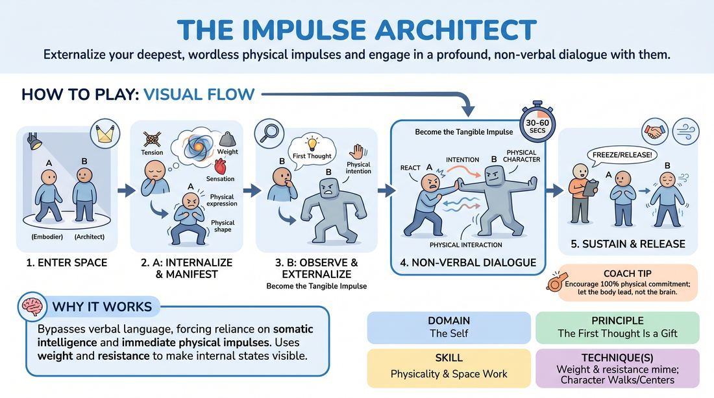

# 🎲 Drill B — under load — The Impulse Architect

{ .infographic }

> Externalize your deepest, wordless physical impulses and engage in a profound, non-verbal dialogue with them.

`Players 2–99` · `~25 min` · `Complexity 3/5` · `Energy low` · `Contact none` · `Props: none`

⬅️ [Back to the Week 05 run-sheet](../week-05.md)

## Why this activity, here

Week 5 has been building character from surface inwards — walks, centres, tempo. Drill A gave them shapes chosen from outside. This one takes the source material from inside their own body instead, then hands it to a partner who plays it back as a separate creature. It feeds the scene work later in the session, where they need to shift emotional state mid-scene without announcing it.

## What students actually learn

- They stop deciding what they feel and start reading it off the body, which is faster and lands more clearly for an audience.
- They find out their state changes when someone else's body pushes on it — emotion becomes something that moves, not something they hold.
- They can commit to a physical intention with no words, no joke and no plan, and still hold a partner's attention for a minute.

## Setup

Clear floor, chairs pushed to the walls. Enough room for every pair to move three or four steps in any direction without collision. No props. No music for the first rounds — the non-verbal sound needs to be audible. Have a timer you can see and a voice that carries over hums and gibberish. Keep a mental list of the four intention verbs: crowd, soothe, pull away, disrupt.

## How to run it — 25 minutes

| Min | What you do |
|---:|---|
| 3 | Frame it in two lines: body first, person second. Take one volunteer and demonstrate the ten-second held shape, then step in as the Architect for fifteen seconds. Set the contact rule and take nods. |
| 4 | Round one. Pairs work simultaneously. A holds the shape ten seconds, B enters, forty-five seconds of wordless exchange, you call freeze. Breathe, shake out. Run it twice with the same roles. |
| 4 | Swap roles. Same structure, two goes each. Side-coach for specificity of the physical centre and for sound that is not language. |
| 3 | Stop everything. Give one note only: choose one intention verb before you enter and keep it. Pairs rerun once, roles as they stand, sixty seconds. |
| 4 | New partners. Round two, both roles, forty-five seconds each. Push A to let the state actually change rather than defending the original shape. |
| 4 | Same partners, final go each way. Tell them the exchange may resolve — the creature may be absorbed, driven off or joined. Let it land before you freeze. |
| 3 | Show two pairs to the room, thirty seconds each, no comment between. Everyone shakes out standing. Move straight into the debrief questions. |

## Side-coaching script

| When | Say |
|---|---|
| During A's ten-second hold | *"Hold the shape. Don't improve it."* |
| As B enters for the first time | *"First impression. Not the clever one."* |
| When B's sounds drift into words | *"Sound, not sentences."* |
| When bodies go vague or general | *"Where's your centre? Lead from it."* |
| Mid-exchange, when A stands neutral | *"Let it move you. Answer with weight."* |
| When pairs speed up and get busy | *"Slower. Let one beat finish."* |
| Fifteen seconds before freeze | *"Find the last shape together."* |
| Immediately after freeze | *"Breathe out. Shake it off. Drop the character."* |

!!! success "What good looks like"
    The room is loud with breath, hums and nonsense sound, and nobody is laughing at themselves. A's stillness is specific enough that you could copy it from across the room. B moves with a readable intention — you can see them crowding or soothing without being told which. The exchange changes at least once: someone yields, someone escalates, someone leaves. On freeze, both look slightly surprised at where they ended up.

## When it goes wrong

| You see | What's causing it | The fix |
|---|---|---|
| B mimes an object or acts out a small scene — miming a mirror, feeding A, opening a door. | They have translated the impression into an idea, then illustrated the idea. | Stop the room. Say: you are not showing us a thing, you are being an energy. Give them one intention verb and forbid hands doing tasks for a round. |
| A stands there and lets B work, barely moving. | A has read the exercise as being watched rather than being in a duet, or is protecting the shape they chose. | Coach A directly: your only job is to answer. Shift weight, turn away, lean in. Tell them the original shape is allowed to be destroyed. |
| Gibberish turns into cartoon voices and the pair start giggling. | The silence got uncomfortable and comedy is the exit. | Cut the voice entirely. Run one round on breath and body only. Reintroduce sound once the physicality holds. |
| Everything is soothing and gentle — no pairs pushing, crowding or disrupting. | Politeness. Nobody wants to be the aggressive one with a near-stranger. | Assign intentions. Half the Bs get crowd, half get pull away. Remind them intention is not aggression and the contact rule still stands. |

## Scaling

| Class size | What changes |
|---|---|
| **10–13** | Five or six pairs, one trio if odd — in the trio, two Architects enter one after the other, second one at thirty seconds. Run the full seven steps as written. Show three pairs at the end instead of two. |
| **14–17** | Seven or eight pairs. Space is tighter, so shorten each exchange to forty seconds and mark pair territories with a chair before you start. Keep both partner changes. Show two pairs. |
| **18–20** | Nine or ten pairs. Split the room in half: half work while half ring the space and watch, then swap after every round. Each half gets three exchanges rather than four. Cut the final showing and give that time back to the halves. |

## Variations

**Named Shape** — Before A holds the shape, they say one physical word out loud — heavy, tight, buzzing, hollow. B works from that plus the body.  
*Easier. Removes the guesswork that makes hesitant Architects freeze on the threshold.*

**Two Architects** — After thirty seconds, a second B enters with an opposing intention — one crowds, one pulls away. A must deal with both.  
*Harder. Forces A to keep changing state rather than settling into one response.*

**Turn and Take** — On freeze, A adopts B's body exactly and holds it for ten seconds as the new starting shape. Then a fresh Architect enters.  
*Different emphasis — moves the work from expression towards absorbing and inhabiting someone else's physicality.*

## Debrief

1. **When your partner came at you as your own state, what changed in your body first?**
   > *A good answer sounds like:* Something located and physical — jaw dropped, weight went back onto the heels, breathing went shallow. Not an emotion word chosen after the fact. Move on when two or three people give body-first answers.

2. **Architects — where did your character come from?**
   > *A good answer sounds like:* They point at something they saw: a lifted shoulder, a held breath, the direction of the gaze. They admit they did not know what it meant. Move on when nobody is claiming they worked it out.

3. **Did the state ever shift, or did you defend the one you started with?**
   > *A good answer sounds like:* Honest admission of defending it early, then an example of a round where it moved — got softer, got angrier, dissolved. That contrast is the point of the drill.

4. **What does this give you in a scene with words in it?**
   > *A good answer sounds like:* Something like: the body can carry the change so the dialogue does not have to announce it. Or: I can start a scene from a physical state and let the character turn up. Stop there.

!!! warning "Safety & inclusion"
    Take contact consent out loud before round one: hands on shoulders, arms or upper back only, and only if both partners nod. Anyone may work entirely no-contact for the whole exercise and does not have to say why — tell them a raised palm at any moment means back off, instantly, no discussion. Every element of this works standing, seated or with limited mobility; a shape can be held in the shoulders, hands and face alone, and an Architect can circle in a chair. Eyes closed is optional at all times. This exercise puts real physical states on display, so name that no one is asked to share what the sensation is about, and there is no debrief question that requires it. Keep the shake-out after every round — it is the off-switch, not a flourish. If someone goes quiet or steps out, let them watch without comment and check in at the break.

## Why it works

D1.S2 asks for emotional fluidity — state that moves rather than a mood held in place. The usual block is that people choose an emotion in the head and then try to feel it, which produces a fixed, defended performance. This drill removes the choosing. A takes what the body already has, so nothing is invented. B works from a first impression, so nothing is interpreted. Then B's committed physical intention applies actual pressure — a body crowding you changes your breathing whether you agree or not. That is the cue in practice: change the body, and the person arrives. The state shifts because it is being pushed, not because anyone decided it should, and the students feel the shift happen from the outside in.

[Open the full activity card »](../../../../games/D1_P4_S3_T3_G234__the-impulse-architect.md){target=_blank rel=noopener}
