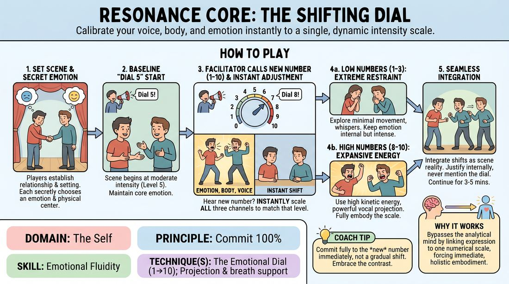

# 🎯 Scene Lab — The Triple-Channel Dial

{ .infographic }

> Calibrate your voice, body, and emotion instantly to a single, dynamic intensity scale.

`Players 3–99` · `~35 min` · `Complexity 3/5` · `Energy high` · `Contact none` · `Props: none`

⬅️ [Back to the Week 05 run-sheet](../week-05.md)

## Why this activity, here

The week has already put bodies first: walks, centres, and a character arriving out of a posture rather than a decision. This block adds the variable the earlier work leaves out — degree. Students can now find a person physically, but they play that person at one fixed volume all scene. The dial forces the same character through ten intensities without losing identity, and it welds emotional change to physical change so neither can drift off alone. It feeds the scene work in Week 6, where they will need to escalate and de-escalate without a facilitator calling numbers.

## What students actually learn

- That an emotion at intensity two is the same emotion as at intensity nine, not a weaker one — restraint stops feeling like absence.
- That the body leads the change. When they raise physical scale first, the feeling and the voice follow without being manufactured.
- That they can be redirected mid-sentence and keep the scene alive, rather than stopping to reset.
- That quiet scenes hold attention as strongly as loud ones, which most of them do not believe until they play one.

## Setup

Clear a playing area with room for two people to move fully. Chairs in a loose arc for watchers. Prepare two stacks of folded slips: one with plain emotions (grief, delight, irritation, fear, pride, longing, boredom, affection), one with body centres (head, chest, gut, hips, hands). You need a voice loud enough to cut over a dial-nine scene — stand at the side, not the back. Have water available; this block uses volume. If you run simultaneous pairs, mark out zones on the floor with tape or chairs so pairs do not drift into each other.

## How to run it — 35 minutes

| Min | What you do |
|---:|---|
| 4 | Everyone stands, spread out, no partners. Call numbers one to ten in random order. On each call they shift walk size, breath and a hummed vowel to match. Say: same person, different volume. |
| 4 | Demo with two volunteers. Assign emotions and centres aloud so the room hears them. Run ninety seconds, calling four dials. Then name for the room what changed and what stayed. |
| 7 | Everyone into pairs, all playing at once in marked zones. Hand out slips. Call one dial number for the whole room every twenty seconds. Two scenes of three minutes, swap partners between. |
| 6 | Same pairs, new slips. This time call the low end only — nothing above four. Hold at one and two for longer. Push them to keep the emotion at full strength while the body and voice shrink. |
| 8 | Two or three pairs perform for the room, three minutes each, full range one to ten. Assign their slips privately. Rest of the class watches for the moment the change lands. |
| 3 | One final pair with split dials: call "A, nine — B, two" and reverse it twice. Let the mismatch drive the scene. |
| 3 | Everyone sits. Run the debrief questions. Close on the cue and move to the next block. |

## Side-coaching script

| When | Say |
|---|---|
| First whole-room calibration, when people are only changing volume | *"Body first. Voice catches up."* |
| A player drops the emotion when the number drops | *"Same feeling. Smaller container."* |
| Players go quiet at low numbers but also go blank | *"Whisper it like it matters."* |
| A high number turns into generic shouting | *"Big, not loud. Fill the room with the body."* |
| A player pauses to reset after a call | *"Change mid-sentence. Don't stop."* |
| Someone references the number in dialogue | *"No numbers. Justify it in the story."* |
| Pairs at eight or nine and the scene is losing its subject | *"Keep talking about the same thing."* |
| Final split-dial round | *"Let the gap between you be the scene."* |

!!! success "What good looks like"
    You call a number and the change is visible within two seconds, in the body before the voice. The relationship established in the first thirty seconds is still recognisable at minute three, at every intensity. A player at dial two is compelling to watch — leaning in, barely moving, and the room has gone silent to hear them. Nobody says "why are you being so loud". Players look slightly out of breath and slightly surprised at what came out of them.

## When it goes wrong

| You see | What's causing it | The fix |
|---|---|---|
| Every low number produces the same limp, sleepy playing regardless of the assigned emotion. | They have read "low" as "less feeling" instead of "less expression". The emotion is being turned down along with the volume. | Stop the scene. Say the number controls the outside only. Have them play dial one while you tell them the emotion is at maximum. Restart. Run several consecutive low calls so they cannot escape upward. |
| Shouting at eight to ten, with the scene's content dissolving into noise and repeated lines. | Players are substituting volume for physical expansion, and volume alone has nowhere to go. | Cap the volume verbally — "nine in the body, five in the voice" — for one round. Once the body carries the intensity, restore the vocal channel. |
| A player freezes for two or three seconds after each call, visibly recalibrating. | They are treating the dial as an instruction to think about rather than a physical event. | Call numbers faster, every ten seconds, for thirty seconds. Speed removes the deliberation. Then return to normal pacing. |
| The scene stops being about anything; it becomes a demonstration of levels. | The relationship was never established, so there is no content for the intensity to attach to. | Insist the first three lines name who they are to each other and where they are. Do not call the first dial change until that is done. |

## Scaling

| Class size | What changes |
|---|---|
| **10–13** | Five or six pairs. Run the simultaneous rounds as written. In the showcase block, three pairs perform at three minutes each — everyone gets seen across the two showcase and split-dial slots if you keep introductions short. |
| **14–17** | Seven or eight pairs. Simultaneous rounds need two zones down each side of the room; you stand centre so your calls reach both. Showcase drops to two pairs at three minutes plus a two-minute third. Pick pairs who struggled in the simultaneous rounds — they get the most from being watched. |
| **18–20** | Nine or ten pairs. Split the simultaneous rounds into two halves: half play while half watch for four minutes, then swap for three. This halves the floor traffic and gives everyone a watching pass. Showcase is two pairs only, four minutes each. Cut the split-dial round to two minutes and take one minute from the debrief. |

## Variations

**Single channel** — Call numbers that control the body only. Voice and emotion stay wherever they naturally land. Run two minutes, then add the voice channel, then the emotion.  
*Easier. Useful with a nervous group or when the three-at-once demand produces freezing. Building the channels one at a time gets the same result more slowly.*

**Silent dial** — Hold up fingers instead of calling out. Players must catch the change peripherally while staying in the scene. Watchers see the number before the players react.  
*Harder. Removes the audible cue that lets players pause on your voice, and lets the room see exactly how long the reaction takes.*

**Partner-driven dial** — Remove the facilitator's calls. Each player may change their own dial whenever they like, and the partner must respond by moving to an adjacent number within five seconds.  
*Different emphasis — shifts from obedience to listening. Prepares them for scenes where nobody is calling numbers and intensity has to be negotiated live.*

## Debrief

1. **Which number was hardest to play honestly?**
   > *A good answer sounds like:* Most say one or two, and can say why — the pull to fill silence, the fear of being boring. A good answer names a specific moment where they added movement they did not need.

2. **When the number changed, what moved first?**
   > *A good answer sounds like:* Someone says the body, and describes it concretely — shoulders dropped, chest closed, weight shifted back — and notices the feeling arrived after. If everyone says "my voice", run one more low round before moving on.

3. **Watchers — when did you believe it, and when did it look like acting?**
   > *A good answer sounds like:* Specific comparisons rather than praise: the moment where a player went to nine but the eyes stayed at five, or the whisper that was more frightening than the shout.

!!! warning "Safety & inclusion"
    No contact is required or expected at any dial level. If a pair wants to touch — a hand on the arm at high intensity — they ask in the moment and either may decline without explanation. High numbers mean full physical presence, not aggression: nobody advances into a partner's space, and nobody is grabbed. Warn the room before the eight-to-ten work that voices will be loud, and that anyone with hearing sensitivity should take a zone at the edge or sit out that round. Vocal projection is from the body, not the throat; stop anyone who is straining. Anyone who does not want to perform in the showcase block observes and reports back in the debrief — that is a full role, not a consolation. Emotions on the slips are ordinary human states, not trauma prompts; if a slip lands badly for someone, swap it, no questions.

## Why it works

Emotional fluidity fails when emotion is treated as an inner state that must be found before it can be shown. The dial reverses the order. A number is an external, arbitrary instruction with no emotional content, so there is nothing to sincerely feel first — the only available response is to change the body and the voice. The feeling then arrives as a consequence of the changed posture, breath and volume, which is what the week's cue names. Repeating this every twenty seconds for thirty-five minutes makes the arrival reliable rather than lucky. Locking the three channels together prevents the common split where a player's face is at nine and their body at three, and the ban on naming the dial forces them to keep justifying, which keeps the scene load-bearing while the calibration happens underneath.

[Open the full activity card »](../../../../games/D1_P1_S2_T1_G343__resonance-core-the-shifting-dial.md){target=_blank rel=noopener}
