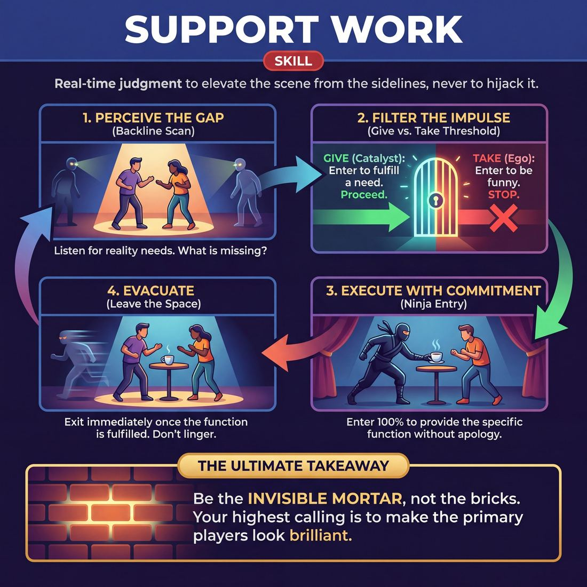

# Week 06 — The Ensemble Mind — Support & Edits

> *The scene belongs to whoever is in it, and everyone else is there to make those two right and to end things cleanly.*

| Course | Week | Domain | Focus | Stage | Length | Class |
|---|---|---|---|---|---|---|
| The Engine — Scene & Ensemble | 6/8 | D4 | `D4.S2` — Support Work | Advanced Beginner → Competent | 180 min | 10–20 |

!!! note "Builds on"
    Five weeks of two-person work made them competent inside a pair; this week makes the other fifteen people responsible for that pair.

## 🎬 The arc of this session

They arrive competent in pairs and quietly proprietary about their own scenes, happy to watch from the back line while someone else works. Across the session the room stops treating the edge of the stage as a safe seat: they learn to walk on carrying information, to cut on a high point, and to take a scene off a friend without apology. They leave with the ensemble, not the pair, as the smallest working unit — and with a felt sense of what a scene ending on time looks like.

!!! tip "Watch for"
    The back line splitting into two castes — three people who edit everything and a wall of people who have decided they are audience. Count who has not stepped in by the end of Drill A and put them on the front foot in Drill B.

## ⏱️ Session flow (180 minutes)

| Time | Block | Activity |
|---|---|---|
| **0:00–0:05** | 🧊 Ice-breaker | *Borrowed News* |
| **0:05–0:10** | 😄 Laughter Blast | *Balloon Escape* |
| **0:10–0:25** | 🔥 Warm-up cluster | *Scaffold*, *Second Shift*, *Clear the Frame* |
| **0:25–0:45** | 🧠 Theory | — |
| **0:45–1:10** | 🎲 Drill A — isolation | *Follow the Leaver* |
| **1:10–1:20** | ☕ Break | — |
| **1:20–1:45** | 🎲 Drill B — under load | *The Tag-Out Edit* |
| **1:45–2:20** | 🎯 Scene Lab | *Hyperlink Roulette* |
| **2:20–2:50** | 🏟️ Showcase round | *The Scoreline* |
| **2:50–3:00** | 💭 Reflection & homework | — |

## 🎒 Before you start

- Clear one clean playing area with a marked back line — tape or chairs — long enough for everyone to stand shoulder-to-shoulder facing in. No one sits during playing blocks.
- Group splits by size: at 10-13 run one back line and one stage all session; at 14-17 split into two groups for Drill A and Drill B (each with its own back line, you rotate between them) and recombine for Scene Lab; at 18-20 run three groups for the drills and two parallel Scene Lab teams, with the showcase always as one whole room.
- Props: a bag of balloons (one per person plus six spares), a timer with an audible end, a whiteboard or flipchart for the Scoreline tally, and two markers.
- Print the Scoreline scoring sheet — one per referee pair — and write the four scoring lines on the whiteboard before anyone arrives.
- Review last week's homework: they were asked to watch a scene and note where it should have ended. Collect two examples in the first five minutes and hold them for the theory block.
- Reset the consent line early: Balloon Escape and tag-outs involve contact — a tap on the shoulder or back. Name it in the first two minutes, offer the no-contact option (a spoken name, or a hand raised in the tagged player's eyeline), and check nobody has to ask twice.

## 1. 🧊 Ice-breaker (5 min)

*Everyone up, loose circle, no bags. Bring me something you read or heard this week that wasn't about you.*

**Why here:** Gets everyone speaking in the first two minutes and quietly establishes that material comes from outside your own head — you are already working with someone else's stuff.

### Borrowed News

> Everyone tells a partner one small true thing from their week, then hands that news to the room on their partner's behalf.

`Players 10–20` · `~5 min` · `Complexity 2/5` · `Energy medium` · `Contact none` · `Props: none`

**How to play**

1. Tell everyone to find a partner. Odd number, make one three. Say each person will share one small true thing from their week — a meal, a text, a walk. Not impressive. Actual.
2. Call go. Both partners talk at once for roughly thirty seconds each. You call the halfway swap out loud.
3. Tell each person to ask their partner one follow-up question before the swap ends.
4. Break the pairs. Send everyone to a new partner across the room, ideally someone they have not spoken to today.
5. Warn them: this time they will report their partner's news to the room. Run the same round — talk at once, one follow-up each, you call the swap.
6. Reform the circle. Go round. Each person names their most recent partner and gives that partner's news in one sentence. Five seconds. No commentary, no jokes.
7. Ask for a show of hands: whose news came back sounding better than they told it. Take the hands, say nothing more, move into the warm-up.

📄 **[Full teaching notes »](week-06/intermediate_w06__b1_1.md)**

**Side-coach:** *“Say it as if it happened to you — don't caption it.”*

## 2. 😄 Laughter Blast (5 min)

*Balloon each, and before we start: this one involves being touched and being blocked. If that's not for you today, take the referee role and I'll hand you a whistle.*

**Why here:** Physical, silly, and involves contact under low stakes, so the consent boundary gets tested and honoured before it matters in a scene.

### Balloon Escape

> Everyone inflates like a party balloon, then lets go and flaps round the room on a long raspberry until they run out of air.

`Players 10–20` · `~5 min` · `Complexity 1/5` · `Energy high` · `Contact none` · `Props: none`

**How to play**

1. Frame it in one line: we are party balloons, someone blows us up, someone lets go. Then demonstrate once yourself — full volume, full flapping, no apology.
2. Round one, small balloon. Three sipping breaths in together, arms and cheeks swelling. Release on a raspberry and wobble on the spot until empty. Do it twice.
3. Round two, bigger balloon. Six breaths in, rise onto toes. Release and travel — eyes up, weaving through gaps, raspberry running until the air is gone. Twice.
4. Round three, enormous balloon. Ten breaths, arms wide, everyone hissing at full stretch. On your count, release: longest raspberry, biggest flapping, finish crumpled on the floor.
5. Finale, the slow leak. Everyone stays down and lets out one thin squeaking whine together, fading quieter and quieter, until the room is flat and silent.
6. Ask one question from the floor, take two answers, move straight on. Do not let anyone stand up to discuss it.

📄 **[Full teaching notes »](week-06/intermediate_w06__b2_1.md)**

**Side-coach:** *“Protect someone else's balloon, not yours.”*

## 3. 🔥 Warm-up cluster (15 min)

*Three warm-ups, five minutes each, back line up. These are the whole day in miniature — don't try to be interesting in them.*

**Why here:** Three short pieces that isolate the three moves of the session — building on someone else's shape, stepping in when they leave, and taking something away — so the theory block has something to point back at.

### Scaffold

> One person makes a shape, everyone else sprints in to hold it up, then clears on the call.

`Players 10–20` · `~5 min` · `Complexity 2/5` · `Energy high` · `Contact incidental` · `Props: none`

**How to play**

1. Stand the group in a wide circle with an empty middle. Tell them the middle is a building site and every shape needs holding up.
2. Explain: one person jumps in, freezes in a big shape, and makes a sound. Everyone else has three seconds to add a shape that supports it.
3. Set the no-contact rule. Shapes brace, lean towards, prop under — but bodies never touch. Demo one shape yourself and let two people add to it.
4. Run three rounds with you counting three seconds aloud. When the middle is full, call 'Clear!' and everyone sprints back to the circle edge.
5. Drop the count. As soon as a shape lands, bodies go. Run five or six rounds back to back, calling 'Clear!' fast so nobody settles in.
6. Add the copy ban: you may not repeat a shape already in the middle. Add what is missing. Run four more rounds.
7. Run one last round. Everyone in, hold the whole structure, breathe once, then clear and stand still in the circle.

📄 **[Full teaching notes »](week-06/intermediate_w06__b3_1.md)**

### Second Shift

> One repeating action never stops; it just keeps changing owner, handed over on eye contact and copied exactly before the first person lets go.

`Players 8–24` · `~5 min` · `Complexity 2/5` · `Energy medium` · `Contact none` · `Props: none`

**How to play**

1. Stand everyone in one circle with clear sightlines. Tell them the only currency here is eye contact — nothing gets passed without it.
2. Start a small repeating action with a sound: sawing, stamping, stirring. Keep it compact and identical on every cycle.
3. Catch one person's eye and hold it. Keep going until they copy the action and sound exactly. Only then drop your hands and rest.
4. State the rule: the action never stops and never changes. No improvements, no flourishes. Whoever receives it reproduces what they were given.
5. Restart the action and let it circulate freely round the group. Handovers happen wherever eye contact lands, not in circle order.
6. Send a second, different action in from the far side. Two actions now travel independently. Anyone may take either one; nobody carries both.
7. Call for speed — handovers every three or four seconds. Then call "last shift": whoever holds each action finishes one cycle and stops together.

📄 **[Full teaching notes »](week-06/intermediate_w06__b3_2.md)**

### Clear the Frame

> Two people freeze in a silent picture and the circle watches until exactly one person steps in to end it.

`Players 10–20` · `~5 min` · `Complexity 2/5` · `Energy low` · `Contact none` · `Props: none`

**How to play**

1. Stand the group in a circle. Tell them two people will step in and freeze together in a silent picture. No speaking, no touching.
2. Tell the circle its job: watch in silence and read the moment the picture is finished. Nobody comments, nobody laughs it along.
3. Give the clearing rule. Anyone may end a picture by stepping forward, raising one hand and saying 'clear'. Only one person gets to do it.
4. Tell them what happens if two people call at once: both step back, the picture holds, and the circle waits for a single caller.
5. Run it. The pair steps out, the caller stays in, and one fresh volunteer joins them to freeze a new picture. Aim for eight to ten.
6. After roughly half the time, add the limit: no picture lasts longer than a slow count of eight. Run three more pictures under that limit.
7. Stop on a clean call. Say nothing about who was funny or who was clever. Move straight into the next block.

📄 **[Full teaching notes »](week-06/intermediate_w06__b3_3.md)**

**Side-coach:** *“You're a beat late — move on the impulse, not after you've checked it.”*

## 4. 🧠 Theory — Support Work (20 min)

{ .infographic }

- **The big idea:** The scene belongs to the people in it. Everyone else has exactly two jobs: make those two look right, and end it cleanly.
- **Where you are on the path:** Competent looks like this: they walk on to serve rather than to score, and they edit on a high point without asking permission. It does not look like polish — expect clumsy, early, honest edits and treat those as the win.
- **The one cue to coach:** *“Follow the follower.”*

**The three beats**

1. **Say it.** Say: for five weeks you have been responsible for your partner. From today you are responsible for a scene you are not in. Support is not vibes. It is three concrete acts — a walk-on that brings information the scene did not have, an edit that lands while the scene is still up, and the nerve to cut a friend who has already finished. Then give them the cue: follow the follower. Nobody is driving. Whoever moves first is right, and the rest of us back them instantly rather than debate it from the wall.
2. **Show it.** Get two volunteers into a running scene — any offer, ten seconds. Walk on yourself twice. First time, top it: enter with a big joke, get the laugh, leave the two of them stranded. Stop. Second time, enter with information — name one of them, name the relationship, hand over an object, leave. Stop. Ask the two players which entrance made their next line easier. Take their answer, not yours. Sixty seconds, no commentary.
3. **Try it.** Groups of three. Player A and B start a scene. Player C counts to ten, walks on, gives one piece of information about A or B, and leaves. Swap so everyone walks on twice. Five minutes, no scene longer than thirty seconds. The only note: did the two left on stage have more to play with after you left than before.

!!! warning "The misunderstanding that always comes up"
    That editing a scene is a verdict on it. They hold on out of politeness, waiting for a scene to fail so the cut feels justified. Say it plainly: you cut scenes because they are good and have arrived, not because they are bad. A late edit is the insult, not an early one.

!!! abstract "📖 Go deeper"
    Read the full write-up: [Support Work](../../../theory/04_the-ensemble/04_S2__support-work.md)

## 5. 🎲 Drill A — isolation (25 min)

*Back line up, shoulders touching. Two people out, and from now on nobody stands still on that line — you're either about to go on or you've just come off.*

**Why here:** Isolates the walk-on with no scene to hide behind, so entering becomes a physical habit rather than a decision they debate on the wall.

### Follow the Leaver

> Drive narrative momentum by letting every character's exit edit and launch the next scene.

`Players 3–99` · `~25 min` · `Complexity 3/5` · `Energy medium` · `Contact none` · `Props: none`

**How to play**

1. Set the group in a wide semi-circle facing an open playing space. Everyone stands. Everyone is offstage until they are onstage.
2. Send two players out to start a scene. Tell them to establish who they are to each other and where they are, quickly and plainly.
3. Tell the pair that at some point one character must physically leave — naming out loud where they are going or why. No sneaking off.
4. The moment that player crosses out of the space, the one left behind steps back to the semi-circle. The scene is over. No button, no tag.
5. The leaver walks straight into a new spot in the space. They have arrived at the place they named.
6. One or two offstage players step in immediately and become whoever is at that destination. Speak first if you can. Do not wait to be invited.
7. Play the new scene until someone leaves it — the traveller again, or one of the new characters. Follow whoever goes.
8. Run five to eight scenes in a chain, then let the last scene find an ending and stop. Reset the semi-circle for the next chain.

📄 **[Full teaching notes »](week-06/intermediate_w06__b5_1.md)**

**Side-coach:** *“Bring something in — a name, a job, a relationship. Don't come on empty.”*

## ☕ Break — 10 minutes

Water, notes, informal talk. Non-negotiable at three hours — do not let it collapse into a working discussion.

## 6. 🎲 Drill B — under load (25 min)

*Same line, harder job. Now you're not adding a person, you're replacing one — and you'll do it while the scene is still going well.*

**Why here:** Adds the pressure of removing a player mid-scene, which is where the politeness reflex shows up and can be trained out.

### The Tag-Out Edit

> Transform scenes instantly by freezing action and swapping players to shift time, place, or perspective.

`Players 3–99` · `~25 min` · `Complexity 3/5` · `Energy medium` · `Contact none` · `Props: none`

**How to play**

1. Ask for consent to shoulder contact before you start. Offer an alternative: tag by touching a forearm, or step into eyeline and call 'Tag' with no contact at all.
2. Send two players out. Tell them to start a relationship scene with real physical object work — hands doing something specific.
3. Line everyone else along the back and sides, facing in, watching for a posture worth stealing. No talking in the line.
4. Tell any watcher they may edit at any moment: run in, tag one active player, call 'Tag' loud enough for the room.
5. On the tag, the tagged player leaves immediately. The untagged player freezes exactly where they are — same shape, same hands, no adjusting.
6. Tell the incoming player to take a physical position off the frozen shape and open a completely new scene: new place, new time, or new relationship.
7. Tell the frozen player to drop their old character on the spot, keep the body, and yes-and whatever the incomer just established.
8. Keep the chain running. Nobody returns to a previous scene. Every tag starts something new.
9. Call time. Do not let one pairing run longer than about ninety seconds — if the line hesitates, tag someone in yourself.

📄 **[Full teaching notes »](week-06/intermediate_w06__b7_1.md)**

**Side-coach:** *“Tag on the laugh, not after it.”*

## 7. 🎯 Scene Lab (35 min)

*Everything so far, joined up. The room owns the whole run now — no scene is anyone's private property.*

**Why here:** Puts walk-ons and edits into connected scene work, so support has to serve a shape larger than the individual scene.

### Hyperlink Roulette

> A fast-paced, tech-assisted scene game driven by random online articles and audience-triggered edits.

`Players 3–99` · `~35 min` · `Complexity 3/5` · `Energy high` · `Contact none` · `Props: required`

**How to play**

1. Put the encyclopedia homepage on a screen the whole room can see. Seat one person at the keyboard as tech operator, side-on, so they can watch the stage.
2. Ask the room for a number between one and ten. The operator hits Random Article that many times. Whatever lands is the starting prompt.
3. Give the players about ten seconds on the page. Title and the first sentence only. Say "title's enough" if anyone starts studying it.
4. Send two or more players out to start a scene from the title, the theme, or one small detail on the page.
5. Tell everyone off-stage, and anyone watching, that they can shout "Dig deeper!" at any time. The operator then clicks a random blue link inside the current article.
6. On "Dig deeper!", players cut where they stand and open a new scene from the new page. No finishing the line, no tidy ending.
7. Give them the second call: "Random page!" The operator hits Random Article. Completely new world, no connection to the scene before it.
8. Keep the cycle turning. Dig deeper for linked worlds, random page to clear the board. Aim for an edit every forty to ninety seconds.

📄 **[Full teaching notes »](week-06/intermediate_w06__b8_1.md)**

**Side-coach:** *“Follow the follower — someone moved, back them, work out why later.”*

## 8. 🏟️ Showcase round (30 min)

*Longer version, and I'm not the referee — two of you are, and you're keeping score on the board where everyone can see it.*

**Why here:** Runs the format long with students refereeing, so the judgement about when a scene ended moves from you to them.

### The Scoreline

> Two teams play the same timed improv game one after the other while a referee whistles fouls and the audience applauds a winner.

`Players 10–20` · `~30 min` · `Complexity 3/5` · `Energy high` · `Contact incidental` · `Props: required`

**How to play**

1. Split the room into two teams and seat each on its own bench facing the playing area. Take the referee role yourself. Hand one student the scoresheet and a marker.
2. State three house rules: applaud both teams, call suggestions only when asked, the referee's word is final. Blow the whistle once so everyone knows the sound.
3. Name the four fouls — blocking an offer, waffling instead of choosing, talking over a partner, laughing at someone's expense. One whistle, one point to the other team.
4. Bank six games; pick five to fit the clock. Open Scene: two players, ninety seconds, audience gives a place. Story One Word: the team lines up, tells a titled story one word each.
5. Emotion Dial: two players, ninety seconds, you call an intensity one to ten. One Prop: players take turns turning a chair into other objects. Expert: one player takes interview questions on a topic.
6. Tag Scene: a two-hander runs; a teammate taps a shoulder — or calls "switch" if that player opted out of touch — and starts a fresh scene from the last line spoken.
7. Run every round the same way. Name the game, read its rule aloud, take one suggestion, then send both teams to play it to that same suggestion. Alternate who starts.
8. Score after each round. Raise a hand over one bench, then the other. The louder side takes two points, the quieter takes one. Scorekeeper flips the numbers.
9. Double the final round. Read the total aloud. Both teams bow together, then name the referee, scorekeeper, tech and front of house and let them bow.

📄 **[Full teaching notes »](week-06/intermediate_w06__b9_1.md)**

**Side-coach:** *“Referees: call the scene the moment it peaks, not when it dies.”*

## 9. 💭 Reflection & homework (10 min)

**Deepen your improv**
1. Think of one scene today you nearly edited and didn't. What stopped you — and what did the scene cost by running on?
2. When someone walked on to your scene, which entrance made your job easier? Name what they actually gave you.

**Beyond the stage**
3. Where in your week are you staying on the back line — watching something that needs a hand, waiting for permission to step in?

➡️ **[This week's homework](../homework/HW-INTW06.md)**

??? note "🎓 Facilitator notes"

    **Timing risks**
    - Drill B eats the break. Set the audible timer at 25 minutes and stop mid-scene when it goes — the interruption makes the point.
    - The Scoreline showcase runs long once students referee, because they hesitate before calling. Cap it at three rounds and reserve the last four minutes for the cohort vote between the two formats.
    - At 18-20 the Scene Lab parallel teams need six minutes of setup you have not budgeted; brief both teams simultaneously rather than sequentially.

    **Failure modes this week**
    - Two or three confident players take every walk-on and the room lets them. Name it out loud and impose a rule: nobody enters twice until everyone has entered once.
    - Edits arrive after the scene has died, then the players blame the scene. Cut it yourself, immediately, and say why — cutting on the high point is the whole lesson.
    - Walk-ons become gags. A player enters, gets a laugh, leaves the pair worse off. Send them back on to do the same entrance carrying information instead.
    - The tag-out gets rough or startling. Reset the contact agreement on the spot and switch the whole group to the spoken-name option for the rest of the drill.

    **What good looks like by the end:** Scenes end while they are still up. Half the room has entered a scene they weren't cast in. When you ask who edited that, several people say they moved at the same time — and nobody is annoyed about it.

    **Carry into next week:** Bring the count forward: note how many scenes ran past their natural end today and tell them the number next week. Also carry the format vote result, and the names of the two or three who still have not stepped off the back line — plan to open next session with them working first.
