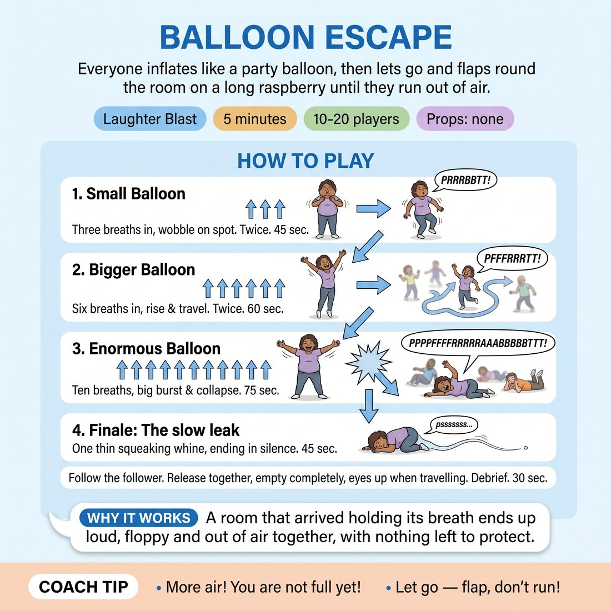

# 😄 Laughter Blast — Balloon Escape

{ .infographic }

> Everyone inflates like a party balloon, then lets go and flaps round the room on a long raspberry until they run out of air.

`Players 10–20` · `~5 min` · `Complexity 1/5` · `Energy high` · `Contact none` · `Props: none`

⬅️ [Back to the Week 06 run-sheet](../week-06.md)

## Why this activity, here

Week 6 is about the ensemble mind — noticing what the group is doing and joining it rather than steering it. This is the first five minutes of the day. It gets breath, voice and floor into the room before anyone has to be interesting, and it does it on a shared count, which is the physical version of the cue. It feeds the support and edit work that follows: the same skill of matching a group's timing without being told to.

## What students actually learn

- They can make an undignified noise in front of fifteen people and nothing bad happens.
- Breathing on someone else's count feels different from breathing on your own — the group sets the tempo and you find it.
- The floor is a place you can be, not a failure state.
- Ending together is a decision the whole room makes, not one person's call.

## Setup

Clear floor, everyone standing scattered with an arm's length of space. No chairs in the playing area. Shoes on or off, their choice. No props. Check the floor is clean enough to lie on and warn anyone in a skirt or stiff clothing that round three ends on the ground — kneeling or a low crouch is fine instead. Ask people to face into open space when they release, not into a neighbour's face.

## How to run it — 5 minutes

| Min | What you do |
|---:|---|
| 1 | Frame it: we are balloons, we get blown up, someone lets go. Demonstrate once at full commitment. Do not explain further — the demo is the explanation. Spread out. |
| 1 | Round one, small balloon. Three sipping breaths in on your count, then release on a raspberry and wobble on the spot until empty. Run it twice. |
| 1 | Round two, bigger. Six breaths in, up onto toes, then release and travel through the room. Eyes up, find the gaps. Run it twice. |
| 1 | Round three, enormous. Ten breaths, arms wide, everyone hissing. Hold the stretch. On your count, release: longest raspberry, biggest flap, land crumpled on the floor. |
| 1 | Slow leak from the floor — one thin whine together, fading to silence. Hold the silence three seconds. Ask one question, take two answers, move on. |

## Side-coaching script

| When | Say |
|---|---|
| During the demo | *"Loud and stupid. That's the whole standard."* |
| On the intake breaths, round one | *"Sip together. Listen for the group."* |
| At the release | *"All the air. Don't save any."* |
| Travelling in round two | *"Eyes up. Find the gap, not the person."* |
| Holding the ten-breath stretch | *"Hold it. Hold it. Let it get uncomfortable."* |
| As people hit the floor | *"Crumple. Don't land — collapse."* |
| During the slow leak | *"Quieter than the person next to you."* |
| In the silence before the question | *"Stay down. Just breathe."* |

!!! success "What good looks like"
    By round two the raspberries are ragged and overlapping and nobody is checking who is watching them. Travel is chaotic but nobody collides. Round three produces a genuine group noise — one sound, not fifteen. The slow leak fades out roughly together without you counting it down, and the silence at the end holds for a beat before anyone laughs.

## When it goes wrong

| You see | What's causing it | The fix |
|---|---|---|
| Polite, quiet raspberries. People smiling apologetically at each other. | Your demo was hedged. They are matching your commitment level, not the instruction. | Stop the round. Do the demo again, louder and worse than before. Then restart immediately. Do not discuss it. |
| Someone goes pale or wobbles after the ten-breath round. | Over-breathing. The deep intakes are genuinely dizzying for some people. | Send them to sit at the edge and breathe normally. Say out loud to the room that half breaths are fine and nobody is scoring the lungs. |
| Collisions or near-misses during travel. | People are looking at the floor or closing their eyes on the raspberry. | Call "eyes up" mid-round. If it continues, shrink the playing area and tell them to travel at half speed. |
| The slow leak turns into a laughing contest and never fades. | Nobody is listening down. Everyone is producing rather than matching. | Say "quieter than the person next to you" and lower your own hand slowly. Restart the leak once if needed, then stop regardless. |

## Scaling

| Class size | What changes |
|---|---|
| **10–13** | Run exactly as written. Full room for travel. In round two you can let them travel for the whole exhale without shrinking the space. |
| **14–17** | Halve the travel space in round two by naming a boundary — the floor is now half as wide. Keep both repetitions. Everything else unchanged. |
| **18–20** | Split for round two only: half the room travels, half stands still as obstacles, then swap. One repetition each rather than two. Round three and the leak stay whole-group. |

## Variations

**Seated balloons** — Run all three rounds from chairs. Breaths in, arms rise, release and wobble in the seat. No travel, no floor.  
*Easier — removes travel risk and the drop to the ground. Use with a stiff group or a bad floor.*

**Punctured** — After the ten-breath intake, call a random moment mid-hold and shout "pop". Everyone bursts on the same instant, no raspberry, just one sharp collapse.  
*Harder — demands exact shared timing and a committed drop with no ramp-up.*

**Balloon pairs** — Ask for consent to work close. One person inflates, the partner mirrors their breath from a metre away and releases at the same instant, matching the route.  
*Different emphasis — moves the listening from group to individual, which is closer to scene-partner support work.*

## Debrief

1. **When did you stop deciding when to breathe?**
   > *A good answer sounds like:* Someone says they were counting at first and then just went with the room. Someone else says they didn't notice the switch. Two answers, then move on.

2. **What was different about the slow leak compared to the big release?**
   > *A good answer sounds like:* They mention listening rather than pushing — having to hear the others to know how quiet to be. Anything about matching down rather than up is the answer you want.

!!! warning "Safety & inclusion"
    No contact is required in the standard version; the pairs variation needs an explicit consent check and an opt-out to a solo balloon. Deep repeated breathing makes some people light-headed — say before round one that half breaths are fine and that sitting out a round is a normal choice, not a withdrawal. Anyone who cannot get to the floor safely can crumple into a chair or a low crouch; say this before round three, not after. Warn asthmatics that the forced exhale can catch; they should breathe out at their own rate. Travel with eyes up and face away from neighbours when releasing. Anyone who prefers not to make voiced noise can flap silently on breath alone.

## Why it works

Support work starts with noticing what the room is already doing. The cue — follow the follower — describes a group where nobody is driving and everyone is adjusting. This activity forces that condition physically: the count belongs to no one after the first round, the release is simultaneous or it is nothing, and the slow leak can only be done by listening to the person beside you and going quieter. Because the task is a raspberry, there is no cleverness to hide behind and no way to be the best at it. The status field flattens in ninety seconds, which is what the following two and a half hours of scene work need.

[Open the full activity card »](../../library/laughter/LB__balloon-escape.md){target=_blank rel=noopener}
