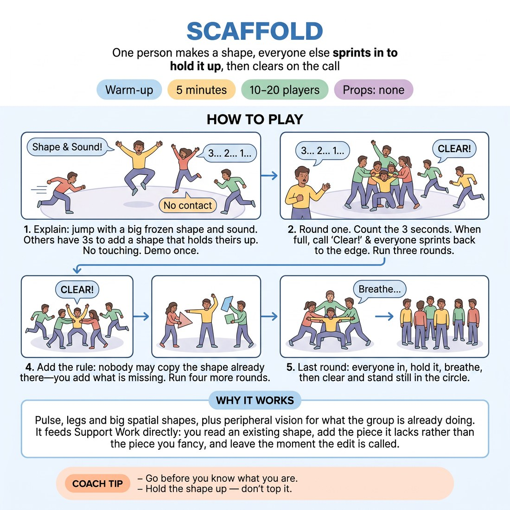

# 🔥 Warm-up cluster — Scaffold

{ .infographic }

> One person makes a shape, everyone else sprints in to hold it up, then clears on the call.

`Players 10–20` · `~5 min` · `Complexity 2/5` · `Energy high` · `Contact incidental` · `Props: none`

⬅️ [Back to the Week 06 run-sheet](../week-06.md)

## Why this activity, here

First thing in the room on the week the class learns support work. It comes before any scene material and sets the physical default: something appears, you go to it. It feeds every edit and every walk-on later in the session, because the body has already practised arriving fast without checking whether it was invited.

## What students actually learn

- Arriving before deciding — the impulse to move fires before the assessment of whether their idea is good.
- Reading what a partner's offer needs rather than what they themselves fancy doing.
- That being the one who supports is as active as being the one who initiates.

## Setup

Clear floor, circle of chairs pushed back, an empty middle roughly three metres across. Nothing to trip on. No props. You need a loud clear voice for 'Clear!' — no whistle. Check for anyone with mobility limits before you start and tell them shapes can be made seated or with one hand.

## How to run it — 5 minutes

| Min | What you do |
|---:|---|
| 1 | Circle up. Explain the shape, the sound, the three-second window and the no-touching rule. Demo: you make a shape, invite two people in to prop it. Point out that they braced it rather than copied it. |
| 1 | Three rounds with the count. Someone jumps in with shape and sound. You count 'three, two, one' aloud while the rest fill in. Call 'Clear!' the moment the middle looks full. Reset fast. |
| 2 | Drop the count. Five or six rounds back to back. As soon as a shape lands, everyone goes. Call 'Clear!' early and often so nobody has time to plan the next one. |
| 1 | Add the copy ban: no repeating a shape already there. Four quick rounds. Then the final round — everyone in, hold, one breath together, clear, stand still in the circle. Move straight on. |

## Side-coaching script

| When | Say |
|---|---|
| First round, people hesitating at the edge | *"Go before you know."* |
| Shapes are small and polite | *"Bigger. Take up floor."* |
| People drifting in one at a time | *"All at once. Crowd it."* |
| Middle is full | *"Clear! Back to the edge."* |
| After dropping the count | *"No gap. Shape lands, bodies go."* |
| Once the copy ban is in | *"Add what's missing, not what's there."* |
| Someone is looking around for permission | *"Nobody's picking. You're already in."* |
| Final hold | *"Hold it. Breathe. Feel the whole thing standing."* |

!!! success "What good looks like"
    The three seconds are noisy and slightly chaotic. Bodies commit at full size before the shape is fully understood. By the fast rounds you cannot tell who initiated, because five people arrived together. Nobody is watching from the edge waiting for a good idea. The structures are ugly and varied — high, low, leaning, curled — and they collapse instantly on 'Clear!'.

## When it goes wrong

| You see | What's causing it | The fix |
|---|---|---|
| Two or three keen people go every round; the rest stay on the edge. | The watchers are waiting to think of something worth adding. The exercise is being treated as an idea game. | Stop and say the shape does not have to be good, only fast and different. Run a round where everybody must be in, no exceptions, and count them in. |
| Everyone makes roughly the same shape — five people in a lunge. | They are matching what they see rather than reading the gap. Common before the copy ban lands. | Bring the copy ban in early. Add one call: 'somebody go low, somebody go high.' |
| Bodies touch and someone gets knocked. | Sprinting into a small middle without eyes up. | Pause. Restate no contact, and add: land a hand's width away. Widen the circle by a step. |
| The energy sags after four or five rounds and clears get slow. | You are calling 'Clear!' too late — they have started to hold and pose. | Call it earlier than feels right. Cut the round in half. Speed is the whole point of the middle section. |

## Scaling

| Class size | What changes |
|---|---|
| **10–13** | One circle, full sequence as written. Everyone goes in every round; the middle will not overcrowd. Run six fast rounds rather than five. |
| **14–17** | One circle, but the middle needs to be four metres. Run the fast section as written; expect the middle to fill in two seconds. Call 'Clear!' the moment the last body lands. |
| **18–20** | Split into two circles with about ten each, side by side, and run them simultaneously. Call 'Clear!' for both at once so the rhythm stays shared. Cut the counted rounds to two to protect the time. |

## Variations

**Named count** — Keep the three-second count aloud for the whole five minutes and never drop it.  
*Easier — the count gives permission to move and removes the decision about when to go.*

**Silent build** — After the copy ban, ban sound as well. The initiator makes a shape with no noise; joiners must read it visually.  
*Harder — removes the audio cue and forces attention onto the body.*

**Second wave** — Once the structure is built, call 'Shift!' instead of 'Clear!'. Everyone adjusts one degree to accommodate whoever moved last, then clear.  
*Different emphasis — moves from arriving in support to sustaining it while the thing keeps changing.*

## Debrief

1. **When did you stop deciding what to add?**
   > *A good answer sounds like:* Someone says the fast rounds gave them no time to choose, and their body picked something before they knew what it was. Not a claim that they got better ideas.

2. **What told you what was missing?**
   > *A good answer sounds like:* References to the actual shapes — a gap under an arm, nobody low, an unsupported lean. Concrete reading of the picture, not 'I just felt it.'

3. **Who was leading?**
   > *A good answer sounds like:* Uncertainty. They cannot say. Someone notices the initiator stopped mattering the moment the second person arrived. That is the cue landing — move on.

!!! warning "Safety & inclusion"
    No contact at any point — state it twice and enforce it the first time it slips. Shapes can be made seated, from a chair, or with a single arm; say so before the demo, not after. Anyone who does not want to sprint can walk in — the timing matters more than the speed. Watch the floor for bags and cables. Nobody is required to make a sound if they would rather not.

## Why it works

Support work fails when people treat joining as a decision. Three seconds is too short to evaluate an idea, so the impulse to move fires first and the assessment never gets a turn. The copy ban then forces attention outward — you cannot know what is missing without reading what is already there. That is 'follow the follower' in the body: the initiator's shape stops being the leader the moment three people brace it, and the structure belongs to the group. By the time the class reaches scene work, the reflex of going to the thing rather than watching it has already been rehearsed forty times.

[Open the full activity card »](../../library/warmups/WU__scaffold.md){target=_blank rel=noopener}
