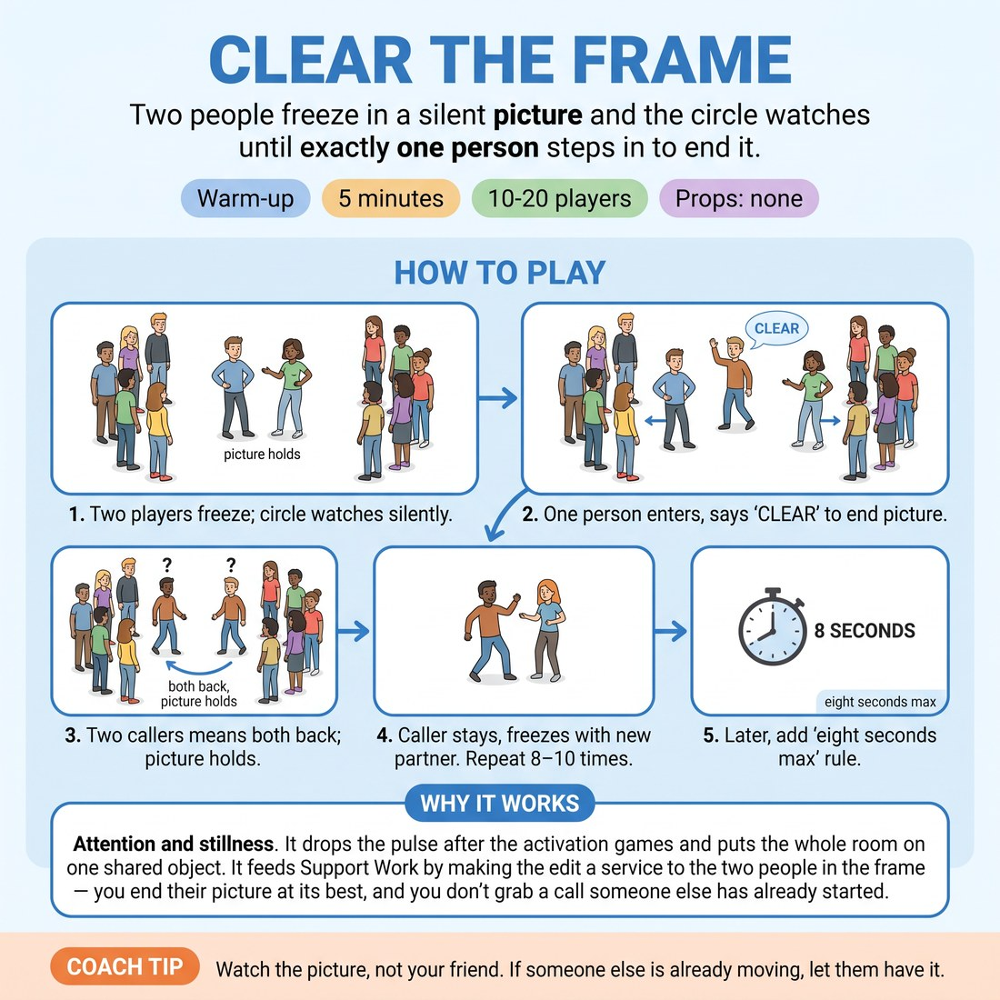

# 🔥 Warm-up cluster — Clear the Frame

{ .infographic }

> Two people freeze in a silent picture and the circle watches until exactly one person steps in to end it.

`Players 10–20` · `~5 min` · `Complexity 2/5` · `Energy low` · `Contact none` · `Props: none`

⬅️ [Back to the Week 06 run-sheet](../week-06.md)

## Why this activity, here

Week 6 is about the ensemble reading itself without a leader. This opens the session before anyone speaks a line, so the group tunes to each other in silence first. It feeds every support and edit exercise that follows: the wipe, the tag-out, the sweep. Those all depend on one person committing to end a moment while the rest yield. Here that decision is stripped down to a hand and a word.

## What students actually learn

- They stop waiting for permission to act, and start reading whether the room has already decided.
- They feel the difference between deciding to move and noticing someone else has already moved.
- They learn that stepping back from a double call costs nothing — the picture survives, and so do they.

## Setup

Open floor, circle of chairs pushed back or standing circle. No props, no music. Everyone can see everyone. Have the eight-count limit in your head before you start so you can drop it in without breaking the flow.

## How to run it — 5 minutes

| Min | What you do |
|---:|---|
| 1 | Circle up. Brief the shape: two people freeze a silent picture, no words, no contact. Give the clearing rule and the double-call rule. Demonstrate one clear yourself, fast, then step back. |
| 2 | Run pictures continuously. Caller stays in, one new volunteer joins, freeze, hold, clear. Do not comment between pictures. Keep the rhythm unbroken and count how many you get. |
| 1 | Add the limit: no picture lives past a slow eight. Run three more. If the count runs out with no caller, say 'clear' yourself and keep going without discussion. |
| 1 | Take one or two final pictures. Stop on a clean single call. Name nothing about content. Say 'that's the muscle for today' and move into the next block. |

## Side-coaching script

| When | Say |
|---|---|
| First picture forms | *"Freeze. Let the circle read it."* |
| Nobody has called for several seconds | *"Someone go. Don't check with anyone."* |
| Two people call together | *"Both back. Picture holds."* |
| Callers keep coming from the same three people | *"New voices. Step in cold."* |
| People start posing for laughs | *"Shape, not joke. Just be somewhere."* |
| After the eight-count limit is added | *"Count's running. Move."* |
| Someone hesitates halfway forward | *"Commit. Hand up, say it."* |
| Final picture | *"Clean call. Done."* |

!!! success "What good looks like"
    Pictures land and die inside a few seconds each. Calls come from at least six or seven different people. When two people call together, both step back without a fuss and someone else takes it a beat later. The room is quiet between pictures — no chatter, no explanation of what the picture was. You get eight or more pictures inside the time.

## When it goes wrong

| You see | What's causing it | The fix |
|---|---|---|
| Long stalls, pictures holding for fifteen seconds while everyone looks at each other. | The group is waiting for the 'right' moment, treating the call as a judgement they could get wrong. | Call one yourself immediately. Then say 'there is no right moment, there's just a moment'. Introduce the eight-count early rather than at the halfway mark. |
| The same two confident people making every call. | Faster movers absorb all the openings; quieter people never get a gap wide enough to enter. | Name it neutrally: 'anyone who has called, sit the next three out'. Do not single anyone out for praise or blame. |
| Repeated double calls, people apologising and negotiating who goes. | They are treating the collision as a mistake rather than part of the rule. | Say 'that's the game working'. Reset the picture and keep moving. Do not stop to discuss. |
| Pictures becoming elaborate mimed scenes with implied dialogue. | They have slipped into scene work and are trying to be interesting. | Say 'freeze means freeze — one shape, no story'. Cut the next long one yourself at four seconds. |

## Scaling

| Class size | What changes |
|---|---|
| **10–13** | One circle. Everyone will get in at least once. Run the full eight to ten pictures and expect the whole group to have called or been in a picture by the end. |
| **14–17** | One circle, still. Pictures will move fast enough. After the eight-count limit, add a rule that anyone already in two pictures stands down, so newer people get the floor. |
| **18–20** | Split into two circles of nine or ten in opposite corners, each running independently. Brief once to the whole room, then set both going. You cannot side-coach both — walk between them and give the eight-count call to each circle separately. Aim for six pictures per circle rather than eight. |

## Variations

**Coach calls the clear** — You make every call for the first minute. The group only forms pictures and steps back when told.  
*easier — removes the decision entirely so nervous groups get the physical rhythm before taking on the risk of calling*

**Silent clear** — Drop the word. The caller only steps forward and raises a hand. The pair must notice and clear without a verbal cue.  
*harder — forces peripheral attention and makes double calls more frequent, which is the point*

**Three in the frame** — Pictures are built by three people, and the caller replaces all three with two fresh volunteers.  
*different emphasis — shifts attention from the moment of the call to reading when a group image is complete rather than a pair*

## Debrief

1. **What told you it was time to call?**
   > *A good answer sounds like:* Something concrete and bodily — 'it stopped changing', 'I felt the room settle', 'nobody was adding anything'. Not 'I thought it was funny enough'. When you hear two or three answers about the picture finishing rather than about their own idea, move on.

2. **What happened in you when two of you called at once?**
   > *A good answer sounds like:* Honest and low-stakes — 'I felt stupid for half a second, then it was fine'. You want them noticing the flinch and noticing it passed. If someone says they then stopped calling for the rest of the game, that is worth thirty seconds.

!!! warning "Safety & inclusion"
    No touching in any picture — say it in the brief and hold to it, including when people get playful. Pictures near each other are fine; contact is not. Anyone can stay in the circle and never step in; watching and reading is a full role in this exercise and say so out loud. If someone has mobility limits, pictures can be made seated or standing still — height and level differences are not required. Nobody is made to explain a picture afterwards.

## Why it works

Support work depends on knowing when to move and when to yield, and both decisions have to happen without discussion. The cue — follow the follower — describes a group where leadership passes on read rather than on rank. This exercise isolates that read and removes everything else: no dialogue to hide behind, no story to justify a choice. The double-call rule is the mechanism. It makes collision a normal event with a defined, costless outcome, so the fear of moving at the wrong time gets tested and dismissed within the first minute. By the time they get to scene edits later in the session, they have already had the experience of stepping forward and being wrong, and finding that nothing happened.

[Open the full activity card »](../../library/warmups/WU__clear-the-frame.md){target=_blank rel=noopener}
