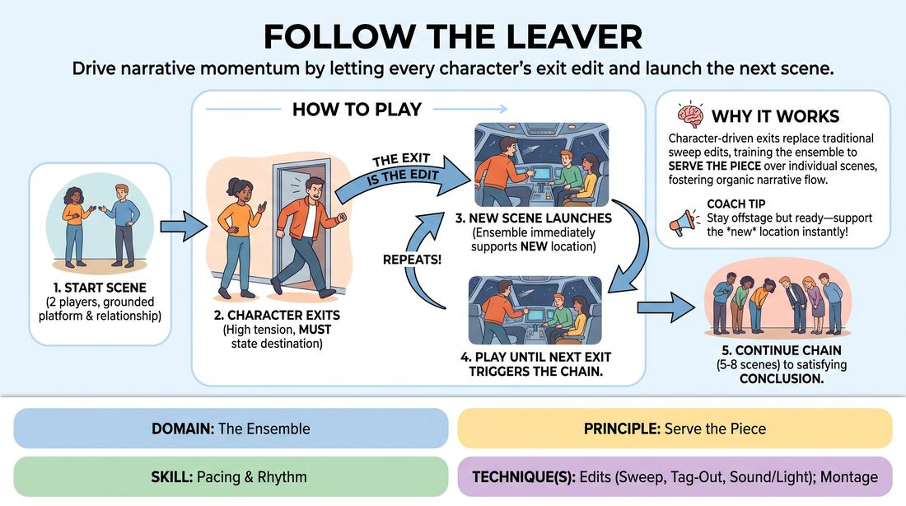

# 🎲 Drill A — isolation — Follow the Leaver

{ .infographic }

> Drive narrative momentum by letting every character's exit edit and launch the next scene.

`Players 3–99` · `~25 min` · `Complexity 3/5` · `Energy medium` · `Contact none` · `Props: none`

⬅️ [Back to the Week 06 run-sheet](../week-06.md)

## Why this activity, here

Week 6 is the ensemble mind. The run-sheet opened the session on shared attention; this is the first isolation drill, and it isolates one thing only — completing someone else's offer without negotiating. It feeds the edit work later in the session, where students choose when to cut a scene. Here they do not choose. The exit chooses for them, so the only available skill is fast, generous support.

## What students actually learn

- That stepping in before you know who you are is survivable, and usually better than waiting until you do.
- That a named exit is a gift — someone has already built the next scene's location for you.
- That letting go of a scene you were enjoying is a support move, not a loss.
- That the ensemble can carry a story between them without anyone steering it.

## Setup

Clear a playing space roughly four metres wide with a clear entrance and exit on both sides. Chairs pushed well back — nobody sits. Group stands in a semi-circle, close enough that stepping in takes one stride, not four. No props, no music. Have a timer visible to you. Water within reach; this drill keeps everyone on their feet for the full block.

## How to run it — 25 minutes

| Min | What you do |
|---:|---|
| 3 | Explain the rule in one line: every scene ends because a character leaves, and we follow them. Demonstrate two scenes yourself with a volunteer so they see the handover, not just hear it. |
| 4 | Run a first short chain — four scenes only, then call stop. Do not correct anything mid-run. Let them feel the gap where support is missing. |
| 2 | Give one note: name your destination out loud, and step in the second the traveller lands. Nothing else. Take no questions longer than a sentence. |
| 6 | Run a full chain of six to eight scenes with new starters. Side-coach the entries hard. Stop when the chain finds an ending or when the time goes. |
| 2 | Swap who has not played yet into the starting pair. Add one constraint: destinations must be places, not abstractions — a kitchen, a bus stop, a waiting room. |
| 6 | Run a second full chain. Coach less. Let the silences sit for a beat before you rescue them, so the group learns to fill them itself. |
| 2 | Run one deliberate short chain of three scenes, fast, no coaching, then stop and hold the group standing for the debrief questions. |

## Side-coaching script

| When | Say |
|---|---|
| A player begins to drift out of a scene without speaking | *"Name where you're going."* |
| A scene has plateaued and nobody is moving | *"Somebody leave."* |
| The traveller has landed and the semi-circle is still watching | *"Meet them there."* |
| The abandoned player lingers, trying to finish a line | *"Clear the space."* |
| An entering player hovers at the edge without committing to a character | *"Talk first, know later."* |
| Two players step in at once and hesitate | *"Both stay. Both are here."* |
| The new scene explains what just happened in the last one | *"Forward, not back."* |
| You are one scene from the end of a chain | *"Land this one."* |

!!! success "What good looks like"
    The handovers are almost invisible. A character says where they are going, walks four steps, and someone is already there talking to them. There is no pause between scenes and no negotiation about who enters. Players leave scenes that are going well. The semi-circle stays alert and leans in slightly — people are watching for the exit, not for their turn. By the second chain the group can run six scenes with barely a word from you.

## When it goes wrong

| You see | What's causing it | The fix |
|---|---|---|
| The traveller lands in the new location and stands alone for three or four seconds before anyone enters. | Offstage players are deciding who they are before they move, or waiting to be sure they are wanted. | Say "Meet them there" the instant the exit happens, not after the pause. Tell the group that entering wrong is fine and entering late is not. |
| Scenes run long. Nobody leaves. Two players talk for three minutes. | Players are enjoying the scene and reading the exit as abandonment or as killing something good. | Call "Somebody leave" out loud. Reframe it: you are not ending the scene, you are handing the story to someone else. Cap scenes at ninety seconds for one chain. |
| Exits are vague — "I'm off", "I need some air" — and the next scene starts nowhere in particular. | Players are exiting to escape the scene rather than to travel somewhere. | Enforce the constraint: name a concrete place. Have the leaver say it on the way out, loud enough for the back of the semi-circle. |
| Four people rush in at once and the new scene is a crowd shouting over each other. | Overcorrection after coaching on late entries. | Cap it at two entrants. Say "Two only" and let the extras step back without shame. Make the retreat normal — do it yourself once. |

## Scaling

| Class size | What changes |
|---|---|
| **10–13** | One playing space, one semi-circle. Run three chains of six to eight scenes. Everyone will get at least two scenes; track who has not started a chain and put them in the opening pair. |
| **14–17** | One playing space, but split the semi-circle into two halves and alternate which half is live for each chain. The non-live half watches. Run four shorter chains of five scenes so both halves play twice. |
| **18–20** | Two playing spaces at opposite ends of the room, nine or ten players each, running simultaneously. Lose the demo scene to a single space with everyone watching, then split. Coach one group, then the other, at ninety-second intervals. Three chains per group. |

## Variations

**Announced arrival** — The leaver names the destination and one person who will be there — "I'm going to see my sister at the shop." The entering player takes that role.  
*Easier. Removes the guess. Good for a group that is freezing on entry.*

**Silent handover** — No naming the destination. The leaver exits with intention only; the entering players read the physicality and build the location around them.  
*Harder. Forces the ensemble to read bodies rather than words.*

**Return** — Keep a mental list of locations visited. In the final two scenes, a traveller must go back to a place already seen, and the players who were there must re-enter as the same characters.  
*Shifts emphasis from support to narrative memory and callback.*

## Debrief

1. **What decided when you stepped in?**
   > *A good answer sounds like:* Something about not deciding — "I just moved before I'd thought of anything" or "I noticed I was waiting for permission and then went anyway." If they describe planning a character, name that as the lag.

2. **Which scene was hardest to leave?**
   > *A good answer sounds like:* They can name a specific one and say it was going well. That is the point — good scenes are the hard ones to hand over. Move on once someone says it out loud.

3. **Where did the story come from?**
   > *A good answer sounds like:* Nobody can claim it. Answers like "it built itself off the exits" or "I only added the place, someone else added the reason." If one person claims authorship, ask who supplied the location they used.

!!! warning "Safety & inclusion"
    No contact is required at any point. Entrances and exits cross the space fast — set the rule that a leaver's path is theirs and everyone else yields. Anyone who does not want to be touched says so before the first chain and nobody negotiates it; if a scene calls for contact, mime it at a distance. This drill keeps players standing for twenty-five minutes. Offer a chair at the edge of the semi-circle to anyone who wants one; they still call and enter from seated, or step in only when they choose. Sitting out a chain and watching is a legitimate way to take part — say that at the start, not as a concession later.

## Why it works

The cue is "follow the follower", and this drill makes it structural rather than aspirational. Nobody can initiate an edit. The only way a scene ends is if a character leaves, and the only way the next scene exists is if someone else completes what the leaver started. That removes the negotiation improvisers usually run under a scene — who is driving, whose idea wins — because the driver changes every ninety seconds and is never self-appointed. Support work fails when players wait for certainty; the timing here punishes waiting immediately and visibly, with a silent stage. Students correct it inside two chains without being told twice.

[Open the full activity card »](../../../../games/D4_P3_S4_T1_G706__follow-the-leaver.md){target=_blank rel=noopener}
