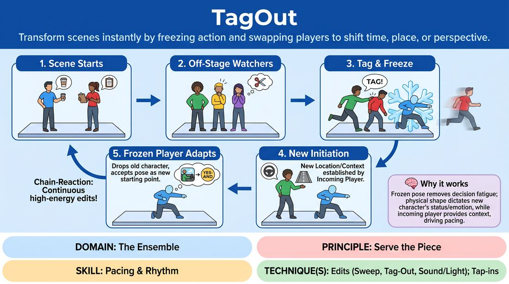

# 🎲 Drill B — under load — The Tag-Out Edit

{ .infographic }

> Transform scenes instantly by freezing action and swapping players to shift time, place, or perspective.

`Players 3–99` · `~25 min` · `Complexity 3/5` · `Energy medium` · `Contact none` · `Props: none`

⬅️ [Back to the Week 06 run-sheet](../week-06.md)

## Why this activity, here

Week 6 is about the ensemble as one mind. Drill A trains noticing from the sideline; this puts noticing under time pressure and makes it a physical commitment. The tag is the cheapest edit there is — no cleverness, just a body arriving. It feeds the back-half scene work, where students need to end scenes without being asked and start scenes without a plan.

## What students actually learn

- They stop waiting for permission to end a scene. The edit becomes a thing you do, not a thing you consider.
- They learn to read a frozen body as an offer, so a new scene can start from information already in the room.
- They find out that the person who initiates is not the leader — the frozen player's justification decides what the scene actually is. That is 'follow the follower' in physical form.
- They lose the fear of a scene 'not being finished'. Interruption stops feeling rude.

## Setup

Clear playing area, roughly four metres wide, with the group standing along the back and one side. No chairs in the space — everything is mimed. You need nothing else. Do the consent check before anyone plays: ask who is happy with a shoulder tap, and tell the room that anyone can instead tag by touching a forearm or by stepping into the players' eyeline and calling 'Tag' with no contact. Do not ask anyone to explain their preference. Note the no-contact players yourself and remind the group once.

## How to run it — 25 minutes

| Min | What you do |
|---:|---|
| 3 | Frame it: this is an edit drill, not a scene showcase. Run the consent check on shoulder contact and name the no-contact alternative. Demo one tag with a volunteer so the mechanics are visible. |
| 4 | Posture drill, no scenes. Two players mime an activity for ten seconds. Call 'freeze'. A third enters, takes a shape off the frozen body, and says one line that names a new place. Rotate fast — six or seven goes. |
| 6 | Full drill, slow gear. Two players start a relationship scene with object work. Watchers tag when they see a shape they want. Insist on a minimum of about twenty seconds per scene so scenes get a chance to exist. |
| 2 | Stop. Two corrections only: freeze means freeze, and the incomer must state a new where or who in the first line. No general notes. Restart immediately. |
| 7 | Full drill, brisk gear. Drop the minimum length. Push for a tag every fifteen to twenty-five seconds. Aim to get every person in at least twice. Tag people in yourself if the line stalls. |
| 3 | Sit the group down where they are and run two debrief questions. Keep it short — this drill feeds the next block, it is not the destination. |

## Side-coaching script

| When | Say |
|---|---|
| During the posture drill, when incomers stand neutral | *"Take the shape. Steal it."* |
| First full round, when the line hangs back | *"Somebody go. Any tag is a good tag."* |
| When a tagged player drifts off slowly | *"Off. Now."* |
| When the frozen player adjusts their body | *"Keep the shape. The shape is the offer."* |
| When an incomer opens with a vague line | *"Name the place. First line."* |
| When the frozen player argues with the new premise | *"Yes-and it. You were always here."* |
| When two players start negotiating who leads | *"Follow the follower."* |
| Brisk round, when scenes start bloating | *"Tag it. Don't wait for the ending."* |

!!! success "What good looks like"
    Tags arrive every fifteen to thirty seconds and land clean — one body out, one body in, no discussion. The frozen player holds still, then justifies without hesitation. New scenes have a location inside the first two lines. The line at the back leans forward. Nobody apologises for editing, and nobody complains that their scene got cut. Content is often thin and that is fine; the rhythm is the point.

## When it goes wrong

| You see | What's causing it | The fix |
|---|---|---|
| Long gaps between tags. Scenes run two or three minutes and start to sag. | Watchers are waiting for a 'good moment' or for the scene to reach a natural end. They think editing is a judgement on the players. | Say out loud that there is no wrong time to tag. Set a hard cap: nobody may watch two scenes in a row without tagging. If the gap stretches past thirty seconds, tag someone in yourself. |
| The frozen player breaks the pose, or shuffles into something comfortable before the new scene starts. | They think the freeze is a pause, not material. They are mentally resetting instead of reading their own body. | Go back to the posture drill for a minute. Freeze someone, walk over, and point at their hands. Ask the incomer what those hands could be doing in a different room. |
| Every new scene is the same two people again in a slightly different setting — same energy, same relationship shape. | Incomers are initiating from an idea they brought in, not from the body in front of them. | Restrict initiations for two minutes: the first line must be about the frozen player's physical position. 'You've been under that car an hour.' |
| Three or four people never come in at all. | The confident players are tagging fastest and the line has sorted itself into performers and spectators. | Name it neutrally and split the line: only the far half may tag for the next three minutes. Then swap. Do not single anyone out. |

## Scaling

| Class size | What changes |
|---|---|
| **10–13** | One playing space, one line. Everyone will get in three or four times across the two rounds. Keep the minimum-length rule in the slow round; the group is small enough that scenes need protecting. |
| **14–17** | One playing space, but split the watchers into two lines, left and right. Alternate which line may tag every ninety seconds. This halves the effective queue and stops the same four people editing everything. |
| **18–20** | Run two spaces side by side with two independent lines of nine or ten, and shorten the slow round to five minutes and the brisk round to eight. Walk between them. Watch the quieter space more. For the last two minutes, merge into one space and let everyone watch a single fast chain. |

## Variations

**Called freeze** — Watchers shout 'freeze' from the line instead of running in. Both players hold. The caller then walks in, chooses one player to send off, and starts the new scene.  
*Easier — removes the contact entirely and gives the incomer three seconds to see the picture before committing. Good for a nervous group or a first-time run.*

**Both frozen, one leaves** — On the tag, both players freeze. The incomer takes a position, and only then does the tagged player peel off. The new scene must use the remaining shape.  
*Harder — the incomer has to compose a three-body picture and pick which two-thirds of it to keep. Sharpens visual reading.*

**Return chain** — Same rules, but every third scene must revisit a location or relationship already seen tonight. Watchers track them.  
*Different emphasis — shifts the load from initiation to group memory, and previews callbacks and running scenes.*

## Debrief

1. **When you were the one frozen, what told you what the new scene was?**
   > *A good answer sounds like:* Something concrete and bodily: 'my arms were up so I was reaching for something on a shelf', or 'they knelt down and I was suddenly taller than them'. If you get 'I just made something up', ask them to find the physical detail they actually used.

2. **What stopped you tagging the times you didn't?**
   > *A good answer sounds like:* Honest: 'I was waiting to have an idea first', or 'it felt like I'd be cutting them off'. The useful landing is that the idea arrives after you're standing there, not before you move.

3. **Who was leading in the scenes that worked?**
   > *A good answer sounds like:* An answer that can't settle on one person — the incomer set the frame, the frozen player defined the relationship, and it flipped inside two lines. That is the cue in practice.

!!! warning "Safety & inclusion"
    Consent for the shoulder tap is asked before the first scene, out loud, with a stated alternative — forearm touch or a no-contact verbal tag from inside the players' eyeline. Do not ask anyone to justify their choice. Running in the space: tell the group to walk quickly rather than sprint, and to enter around the frozen player, never through them. Frozen postures must be holdable — say that anyone can soften an uncomfortable shape and that the essential line of the body is enough. Anyone can sit out a round in the line and rejoin without explanation. Watch for the fast-runners crowding slower movers at the edge of the space; widen the entry lanes if that happens.

## Why it works

The cue is 'follow the follower', and the tag-out makes leadership physically impossible to hold. The incomer supplies the frame; the frozen body supplies the meaning; neither works without the other, and the exchange happens too fast to negotiate. Support work fails when players wait to be told what to do. This drill removes the waiting by attaching a cost to it — the scene ages visibly and someone else takes the space. Under time pressure, students stop generating ideas in advance and start reading what is already in the room, which is what supporting actually is. The freeze is the mechanism: it converts an accident of posture into shared information both players must use.

[Open the full activity card »](../../../../games/D4_P3_S4_T1_G1319__tagout.md){target=_blank rel=noopener}
