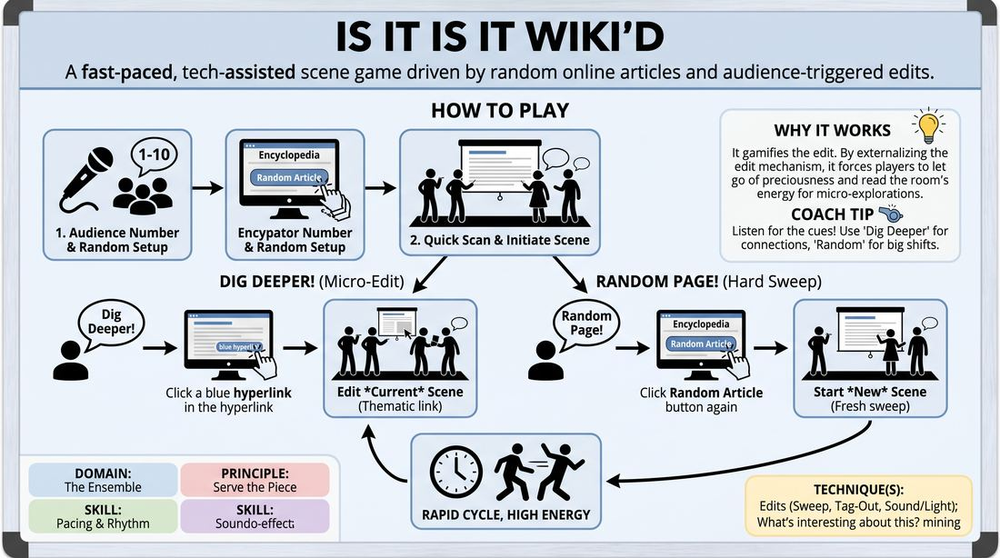

# 🎯 Scene Lab — Hyperlink Roulette

{ .infographic }

> A fast-paced, tech-assisted scene game driven by random online articles and audience-triggered edits.

`Players 3–99` · `~35 min` · `Complexity 3/5` · `Energy high` · `Contact none` · `Props: required`

⬅️ [Back to the Week 06 run-sheet](../week-06.md)

## Why this activity, here

Week 6 has spent the morning on edits and on backing the person who moved first. Earlier blocks made students initiate and made them sweep. This block removes the source of control: nobody chooses the world, the screen does, and somebody else decides when it ends. It feeds the final block of the day, where full scenes run with off-stage players holding the edits, and it sets up next week's longer forms where the ensemble carries the shape.

## What students actually learn

- That an offer can arrive from outside the scene entirely, and taking it is the same muscle as taking a partner's offer.
- That calling an edit is a contribution, not an interruption — and that the caller owes the next scene something.
- That two seconds of a page is enough material, and reading for more is a way of stalling.
- That they can drop a scene mid-sentence without it being a failure.

## Setup

A laptop or tablet on a big screen or projector, showing the homepage of an open encyclopedia with a random-article link. Test it before the room arrives: click random ten times, check the link works, check the text is large enough to read from the back. Chairs in a shallow arc facing a clear playing space, with the screen to one side so players can glance at it without turning their backs. One chair for the tech operator with a clear view of the stage. Have a rota so the operator role changes each round. No other materials.

## How to run it — 35 minutes

| Min | What you do |
|---:|---|
| 3 | Frame it in three lines: the screen picks the world, off-stage picks the moment, players just take it. Demonstrate the two calls yourself. Run one random click so they see the mechanics. |
| 4 | Demo scene. Take two volunteers. Get the number from the room, land a page, give ten seconds, start. Call "Dig deeper!" yourself after forty seconds, then "Random page!" after another forty. Stop. Name what happened. |
| 6 | Round one. Off-stage players make the calls now, not you. Coach hard for speed of the edit itself — the gap between the shout and the new scene starting. Four or five scenes. |
| 6 | Round two. Fresh initiators, new tech operator. Add the rule that the caller must be one of the players who steps out for the next scene. Watch the calls get more considered. |
| 6 | Round three. Drop the caller rule. Ask for dig deeper only, no random page, so the worlds stay thematically chained. Coach for what carries across: a character, a rhythm, a relationship. |
| 6 | Round four. Everything open, both calls live, anyone can call. Push for one edit every forty seconds or so. Let it get scrappy. Cut it while the energy is still up. |
| 4 | Sit the room down. Run the debrief questions. Land the cue and move on. |

## Side-coaching script

| When | Say |
|---|---|
| A player is still reading the screen after ten seconds | *"Title's enough. Go."* |
| Nobody has stepped out and the page has been up for five seconds | *"Two of you. Now."* |
| The scene has settled and no one is calling | *"Somebody call it."* |
| Players finish the line, or wrap the scene, after a call | *"Cut on the word. Don't land it."* |
| A scene turns into reciting facts from the article | *"Take the detail, not the encyclopedia."* |
| A new scene starts and one player hesitates | *"Follow the follower."* |
| Calls are coming only from the same two people | *"New voices. Everyone owns the edit."* |
| Late in round four, energy dipping | *"Faster in, faster out."* |

!!! success "What good looks like"
    The room is loud and the pace is uncomfortable in a good way. A page appears, someone glances, two people are out in under five seconds with a place and a relationship. Scenes last forty to ninety seconds and die mid-line. Calls come from four or five different people, not one keen person. Nobody apologises for a scene that got cut. When a dig deeper lands, you can see the players hunting the new page for one usable thing rather than trying to salvage what they were doing. Laughter comes from the collisions, not from anyone trying to be clever about the subject matter.

## When it goes wrong

| You see | What's causing it | The fix |
|---|---|---|
| Everyone on stage staring at the screen for twenty seconds before anything happens | They are trying to find the funny angle in the article before committing. | Cover the screen with your hand or turn the monitor after ten seconds. Read the title aloud yourself and count them out: three, two, one, go. |
| Only one or two people ever call an edit, or no one calls at all | Calling feels like judging the scene, so people wait to be sure it deserves it. | Give the whole off-stage line a quota — six calls this round, share them out. Say plainly that an edit is a gift, not a verdict. |
| Scenes become two people explaining the article to each other | Players treat the page as content to deliver rather than a launching point. | Restrict them to one word from the title. Ban any other fact from the page. Coach: play a relationship in that world, not a lecture about it. |
| "Random page!" gets shouted every time a scene wobbles | The hard sweep is being used as an escape hatch. | Run a round with dig deeper only. Point out that the sweep is a choice about pace, not a rescue for a struggling player. |

## Scaling

| Class size | What changes |
|---|---|
| **10–13** | One screen, one circle. Everyone not on stage is a caller. Run the four rounds as written; each round fits four or five scenes, so most people initiate twice across the block. |
| **14–17** | Split into two halves seated on opposite sides of the arc. Half A plays rounds one and three, half B plays rounds two and four; the resting half are the callers and hold the tech role. Same timings. |
| **18–20** | Use two devices if you have them — two screens at opposite ends of the room, two circles of nine or ten, each with its own operator, running the same rounds independently. Walk between them. With one device only, split into two halves as above and cap each scene at forty-five seconds so everyone gets on. |

## Variations

**Title Only** — The operator reads the title aloud and nothing else. Players never see the page. Random page is the only call available.  
*easier — removes reading pressure, removes the choice between two calls, and gets nervous groups moving fast*

**Carry One Thing** — On every dig deeper edit, the new scene must keep one element from the old one: a character, an object, a relationship, or a line.  
*harder — adds a memory load on top of the speed, and forces players to build a chain rather than start clean each time*

**Caller Steps Out** — Whoever shouts the call has to be one of the two players who initiate the next scene.  
*different emphasis — moves the work from taking edits to owning them, so calls come with an offer attached*

## Debrief

1. **What happened in your head between the shout and your first line in the new scene?**
   > *A good answer sounds like:* Someone describing the gap honestly — either a scramble for something clever that slowed them down, or noticing they just said the first concrete thing and it worked. Look for the recognition that speed beat quality.

2. **When did an edit feel like support, and when did it feel like being pulled off?**
   > *A good answer sounds like:* A distinction based on timing, not on who called it — edits that arrived at a peak felt like support, edits that arrived while they were mid-build felt like a rescue they hadn't asked for. Move on once someone says that out loud.

3. **Did anyone call an edit and then regret it?**
   > *A good answer sounds like:* Honesty about hesitancy — waiting until they were certain, or calling to save a friend. Good answers connect it to being willing to make a decision for the group and live with it.

!!! warning "Safety & inclusion"
    Random articles land on real atrocities, illness, and living people. Tell the operator before you start that they can skip any page instantly, with no explanation and no discussion — just click again. Say this out loud to the room so nobody has to be the one who objects. Ban playing real named people as themselves. Reading aloud is never required: the operator reads the title if a player prefers, and nobody has to take the tech chair. No physical contact is needed in this activity; if players want any, they ask first and the answer can be no. Warn anyone photosensitive that pages will flick fast, and offer them a seat facing away from the screen with no loss of participation.

## Why it works

Support work fails when players are still managing their own idea. This removes the idea entirely. The world is chosen by a machine, the ending is chosen by someone else, and the only thing left to do is respond to what has just arrived. That is the cue in literal form: the person leading is themselves being led, so the only stable move is to follow whoever moved last. The pace does the rest — at forty seconds a scene there is no room to plan, evaluate, or protect a bit, so players default to accepting and adding. The two-call structure also trains the other half of support: off-stage players learn that watching is an active job with a decision attached.

[Open the full activity card »](../../../../games/D4_P3_S4_T1_G743__is-it-is-it-wiki-d.md){target=_blank rel=noopener}
