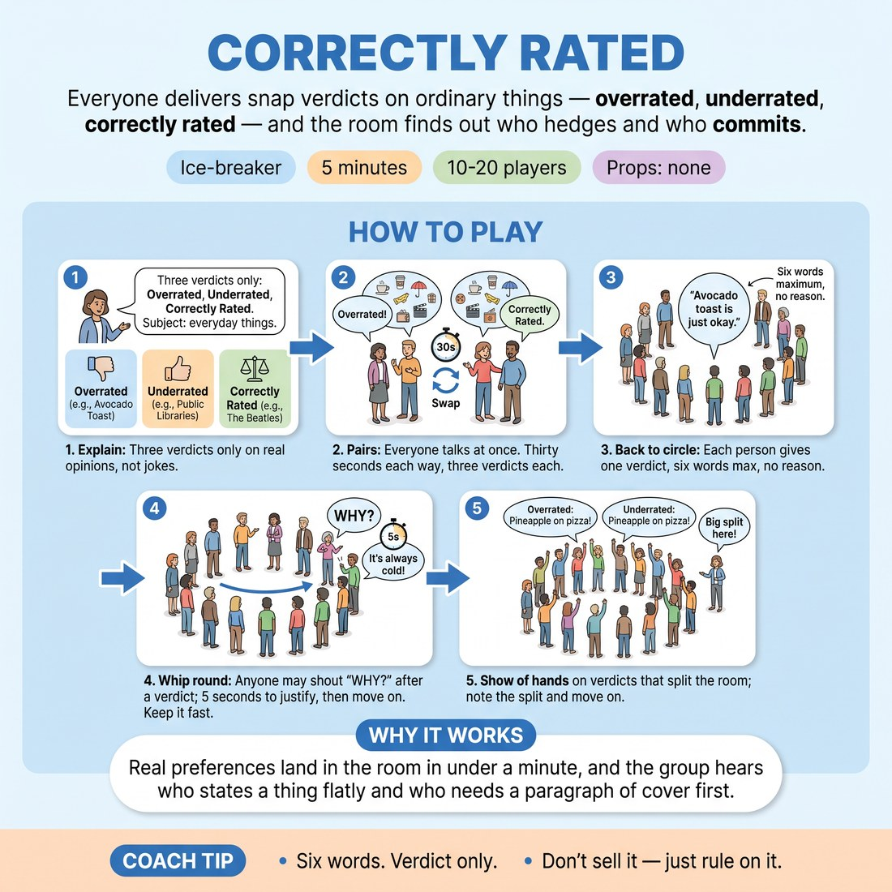

# 🧊 Ice-breaker — Correctly Rated

{ .infographic }

> Everyone delivers snap verdicts on ordinary things — overrated, underrated, correctly rated — and the room finds out who hedges and who commits.

`Players 10–20` · `~5 min` · `Complexity 2/5` · `Energy medium` · `Contact none` · `Props: none`

⬅️ [Back to the Week 07 run-sheet](../week-07.md)

## Why this activity, here

Week 7 is match play — short-form under pressure, where the audience is a live variable. This is the first five minutes of the day. It puts everyone's voice in the air before the warm-up and, more usefully, gives the room a live read on itself: who commits, who hedges, where the disagreements sit. Everything after this trades on that read. It feeds directly into the session's cue, because a verdict that lands gets its laugh from conviction, not from decoration.

## What students actually learn

- That a flat, committed opinion gets more from a room than a hedged clever one.
- That they can hear a room's temperature in the first second of its reaction.
- That being challenged with 'why?' is survivable and quick, not a trial.

## Setup

Chairs in a circle, or standing circle if the room is tight. No props. Have three or four ordinary subjects in your back pocket in case someone freezes: tinned soup, January, umbrellas, the sofa. Nothing else to prepare.

## How to run it — 5 minutes

| Min | What you do |
|---:|---|
| 1 | Explain in the circle. Three verdicts only: overrated, underrated, correctly rated. Subjects must be everyday things. Real opinions, not jokes. Take no questions — start. |
| 1 | Pairs, everyone talking at once. Thirty seconds one way, three verdicts each, then call the swap loudly. Everyone has now spoken once before the circle. |
| 2 | Back to the circle. Whip round: one verdict each, six words maximum, no reasons. Anyone may shout 'why?' — five seconds to justify, then cut and move. |
| 1 | Pick the two verdicts that split the room hardest. Show of hands on each. Name the split out loud in one sentence. Move straight into the warm-up. |

## Side-coaching script

| When | Say |
|---|---|
| As pairs start and someone is explaining themselves at length | *"Verdict first. Reasons later, or never."* |
| Mid-pairs, when the volume drops | *"Three each. Keep them coming."* |
| First hedged verdict in the circle | *"Pick a side. 'Correctly rated' is a side too."* |
| When the whip round starts to sag | *"Six words. Go."* |
| After a 'why?' challenge runs long | *"Time. Next."* |
| When someone reaches for a joke instead of an opinion | *"Mean it. Funny comes after."* |
| When a verdict gets a big reaction | *"Hear that. That's the room."* |

!!! success "What good looks like"
    The whip round moves faster than people expect. Verdicts are flat and short. A few 'why?' shouts land and get answered in a breath. Two or three genuine groans or laughs happen without anyone trying for them. Nobody is still talking when you say next.

## When it goes wrong

| You see | What's causing it | The fix |
|---|---|---|
| Everyone is picking absurd subjects and playing for laughs — 'cutlery: underrated'. | They think it's a comedy game, so they perform instead of stating. | Interrupt. Give the next three people their subjects yourself: January, tinned soup, umbrellas. Real subjects force real opinions. |
| Long justifications; the whip round runs past two minutes and you lose the block. | You are not cutting at five seconds, so the room reads it as optional. | Cut the next one mid-word. Say 'time, next'. Two hard cuts and the rest self-regulate. |
| Half the circle says 'correctly rated' with a shrug. | Hedging feels safest when a room is cold at nine in the morning. | Ban 'correctly rated' for one lap. Say so out loud. Restore it once the room has warmth. |
| One argument catches fire and two people start debating properly. | A genuine disagreement, which is a good sign at the wrong moment. | Name it — 'that's the split, hold it' — and move. Use it in the show-of-hands at the end. |

## Scaling

| Class size | What changes |
|---|---|
| **10–13** | One circle. Two full laps in the whip round if time allows — it will. Keep the pairs at thirty seconds each way. |
| **14–17** | One circle, one lap only. Shorten your explanation to forty seconds to protect the whip. Expect three or four 'why?' challenges, no more. |
| **18–20** | Split into two circles for the whip, each with a nominated timekeeper who says 'time, next'. Run them simultaneously. Come back together for the show of hands as one room. |

## Variations

**Handed subjects** — You name the subject for each person before they give their verdict. They only supply the rating.  
*Easier — removes the choice paralysis that makes people stall or reach for a joke.*

**Defend on demand** — Every verdict must be justified, five seconds, no 'why?' needed. No exceptions.  
*Harder — no hiding behind brevity, and the room hears who thinks under time pressure.*

**Read the room first** — Before speaking, each person predicts aloud whether the circle will agree or disagree with them, then gives the verdict.  
*Different emphasis — shifts the work from having an opinion to forecasting the room's reaction.*

## Debrief

1. **Which verdict got the biggest reaction, and was it the funniest one?**
   > *A good answer sounds like:* Someone names a flat, unadorned verdict — not a joke — and notices the reaction came from conviction or surprise, not from wording.

2. **What did you feel when someone shouted 'why?' at you?**
   > *A good answer sounds like:* A short, honest answer: a jolt, then it was fine. Not a rehearsed lesson. If they say it was fine and quick, move on.

!!! warning "Safety & inclusion"
    No contact. No moving around the room, so it works seated and for anyone with mobility limits. Anyone may pass on their turn by saying 'pass' — take it without comment and go straight to the next person. Keep subjects to objects, food, weather and media; if a verdict drifts towards a group of people, redirect with 'things, not people' and keep the whip moving. Quiet voices: repeat the verdict yourself so the far side of the circle hears it.

## Why it works

Room reading needs a room that is producing readable signals, and a cold room produces almost none. Compressing every contribution to six words strips out the padding people use to hide behind, so what reaches the circle is bare commitment or bare hedging — and the difference is audible. The 'why?' challenge adds a second signal: the room can now interrupt, which teaches everyone that the audience is an active participant rather than a surface. And because nobody is asked to be funny, the laughs that do arrive are unbought. That is the cue in miniature: the room rewards the verdict that meant it, not the one that reached for approval.

[Open the full activity card »](../../library/icebreakers/IB__correctly-rated.md){target=_blank rel=noopener}
