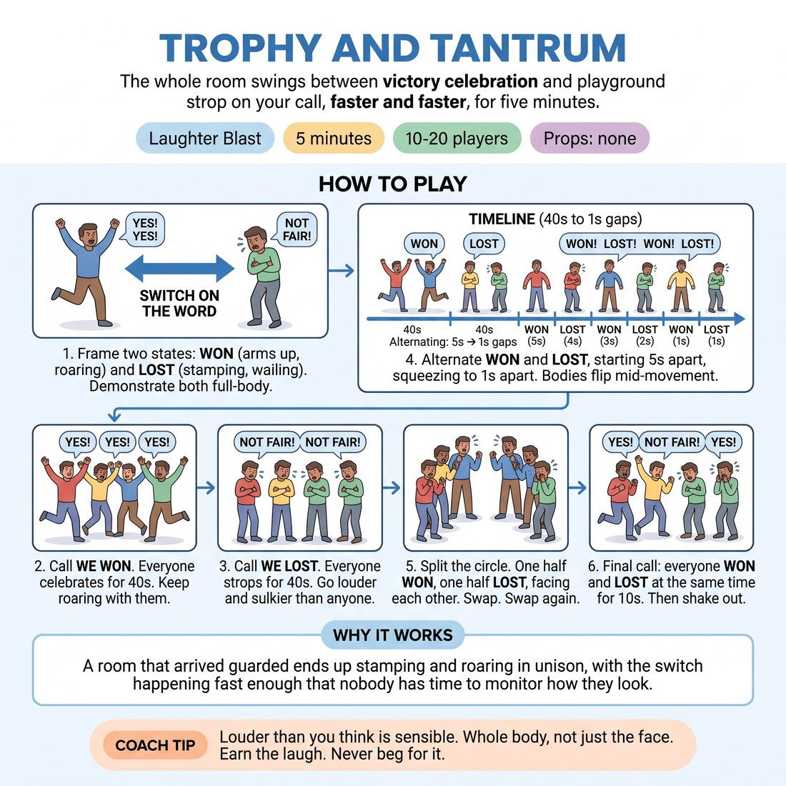

# 😄 Laughter Blast — Trophy and Tantrum

{ .infographic }

> The whole room swings between full-body victory celebration and full-body playground strop on your call, faster and faster, for five minutes.

`Players 10–20` · `~5 min` · `Complexity 1/5` · `Energy high` · `Contact none` · `Props: none`

⬅️ [Back to the Week 07 run-sheet](../week-07.md)

## Why this activity, here

Week 7 is match play — short-form under pressure, where the temptation is to angle for laughs. This blast comes before scene work to burn off self-monitoring and put everyone at the same volume. It feeds Room Reading: you cannot read a room you are hiding from.

## What students actually learn

- Full commitment costs nothing when everyone commits at the same time.
- Emotional size can be switched instantly and does not need a run-up or justification.
- The laugh in the room came from total commitment, not from anyone trying to be funny.

## Setup

Standing circle, arms' length apart. Clear the floor of bags and chairs. No props. You stand inside the circle or in a gap where all faces are visible. Warn the room next door if the walls are thin.

## How to run it — 5 minutes

| Min | What you do |
|---:|---|
| 1 | Frame the two settings and demonstrate both yourself at full size. Then call WE WON and celebrate with the room for forty seconds. |
| 1 | Call WE LOST. Everyone stamps, huffs, wails NOT FAIR for forty seconds. Then start alternating the calls at five-second gaps. |
| 1 | Keep alternating, squeezing the gaps down to one second. Bodies flip mid-movement. Do not let the pace sag. |
| 1 | Split the circle. Half won, half lost, facing each other, full volume, twenty seconds. Swap. Swap again. |
| 1 | Final call: won and lost at the same time, ten seconds. Shake out arms and legs. Ask the debrief question, take two answers, move on. |

## Side-coaching script

| When | Say |
|---|---|
| First WON call, if the room starts small | *"Bigger than you want to be."* |
| During the first LOST | *"Stamp it. Let the floor hear you."* |
| When people start glancing at each other | *"Eyes off each other. Too busy to look."* |
| As the alternating gaps tighten | *"Flip on the word. No run-up."* |
| During the split halves | *"Aim it across. Louder than the other half."* |
| If anyone is playing it for laughs | *"Not funny. Just committed."* |
| Final combined call | *"Both at once. Won and lost. Go."* |
| Immediately after the shake-out | *"Breathe. Drop the shoulders."* |

!!! success "What good looks like"
    The room is loud, red-faced and slightly out of breath. Bodies change on the word, not a beat after. People are laughing at the switch itself, not at anyone's cleverness. Nobody is standing still watching.

## When it goes wrong

| You see | What's causing it | The fix |
|---|---|---|
| Half the circle at seventy per cent, arms half-raised, mumbling. | You demonstrated at a size they can hide behind, or you dropped your own volume once they started. | Stay at maximum yourself for the whole five minutes. Call "bigger than you want to be" and re-demonstrate for three seconds mid-round. |
| People turn the strop into a bit — funny voices, running gags, commentary. | The room is angling for laughs, which is exactly the habit this week is meant to interrupt. | Call "not funny, just committed". Tighten the alternation gaps so there is no time to construct a joke. |
| The switches lag — people finish their celebration before starting the strop. | They are treating each call as a new scene rather than a hard cut. | Call "flip on the word". Fire two calls two seconds apart to prove the cut is possible. |
| Someone stops entirely and stands with arms crossed, not in character. | Volume or noise is too much for them, not reluctance to play. | Catch their eye, nod, keep going. Let them rejoin at the split-halves round. Do not name them to the room. |

## Scaling

| Class size | What changes |
|---|---|
| **10–13** | One circle. Run exactly as written. At the split, six versus six facing across the circle — the gap between halves stays wide enough to project across. |
| **14–17** | One circle, slightly wider. Cut the opening WON and LOST holds to thirty-five seconds each and give the extra ten seconds to the alternating round, where the energy pays off most. |
| **18–20** | Two concentric arcs rather than one circle so everyone can see you. At the split, divide by arc — inner faces outer. Cut the third swap; two swaps is enough at this size. |

## Variations

**Sitting version** — Run it seated. WON is arms up and stamping feet; LOST is slumping, folded arms and wailing. Same calls, same pace.  
*Easier — removes the running on the spot for tired or mixed-mobility rooms without dropping the volume.*

**Three settings** — Add SMUG: slow strut, hands behind head, quiet gloating. Call all three at random in the alternating round.  
*Harder — the third setting breaks the binary rhythm so nobody can anticipate the switch.*

**One at a time** — In the last minute, point at individuals for two seconds each while the rest hold still and watch.  
*Different emphasis — shifts from shared cover to being seen alone, which sharpens the Room Reading focus.*

## Debrief

1. **When did the room laugh — and what caused it?**
   > *A good answer sounds like:* Someone says the laugh came from the switch, or from everyone going at once, not from anything anybody said. That is the cue landing: earned, not begged for.

2. **What did it cost you to go full size?**
   > *A good answer sounds like:* "Nothing, because nobody was watching me" or "less than I expected once the noise started." Take two answers, then move straight on — do not let this become a discussion.

!!! warning "Safety & inclusion"
    No contact. Say before you start that stamping, jumping and running on the spot are all optional — sitting, or doing it with arms only, counts as full participation. Warn the room it gets loud; anyone sensitive to noise can stand at the edge or step out for a minute with no explanation. Watch for knees and lower backs during the stamping. Nobody is pointed at or singled out in the standard version.

## Why it works

Room Reading depends on being inside the room's energy rather than assessing it from outside. Simultaneous full-volume commitment removes the audience: when everyone is occupied, nobody is judging, so self-monitoring has nothing to attach to. The accelerating switches then take away the planning window — at one-second gaps there is no time to compose a funny choice, only time to commit. What the room laughs at is the collective flip. That gives everyone direct evidence for the cue before they have to apply it under short-form pressure.

[Open the full activity card »](../../library/laughter/LB__trophy-and-tantrum.md){target=_blank rel=noopener}
