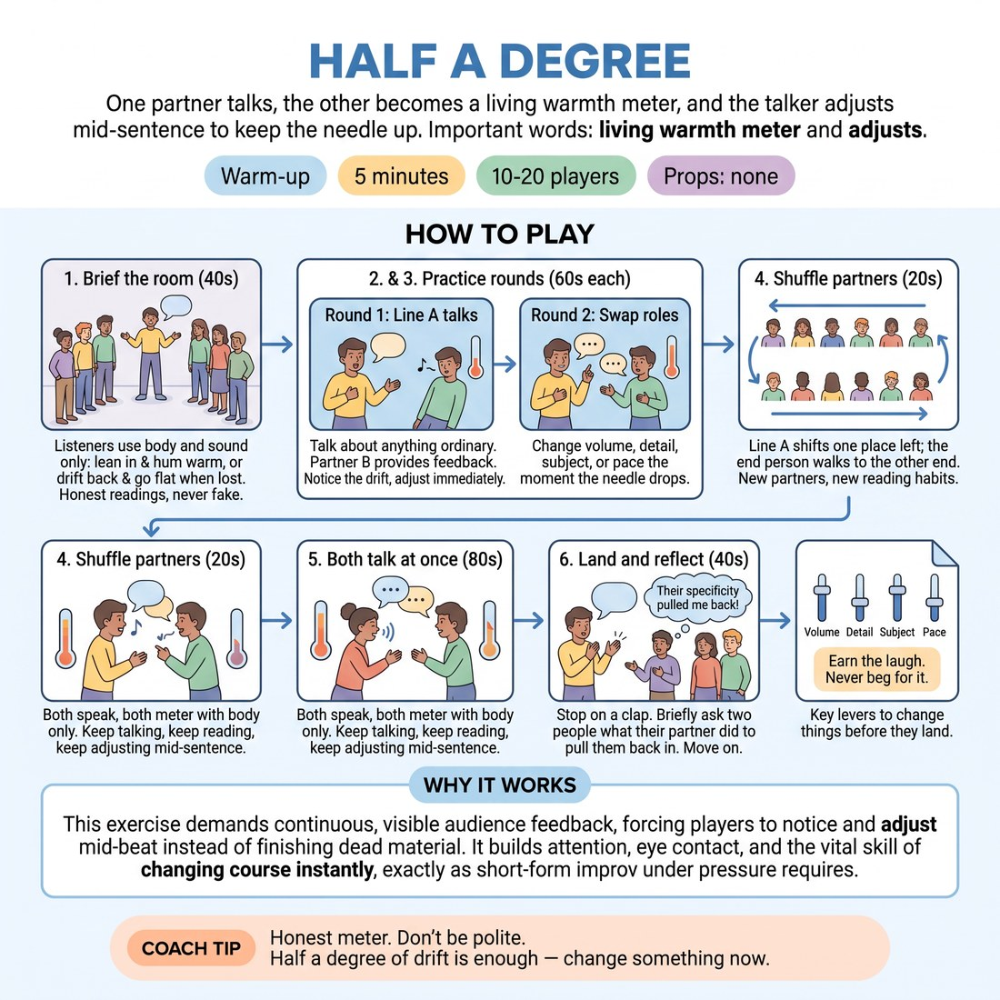

# 🔥 Warm-up cluster — Half a Degree

{ .infographic }

> One partner talks, the other becomes a living warmth meter, and the talker adjusts mid-sentence to keep the needle up.

`Players 10–20` · `~5 min` · `Complexity 2/5` · `Energy medium` · `Contact none` · `Props: none`

⬅️ [Back to the Week 07 run-sheet](../week-07.md)

## Why this activity, here

Week 7 puts them under short-form pressure, where the temptation is to push harder at a cold audience. This is the first block of the day and it installs the session skill physically before any game is played: read the room, adjust, keep going. It feeds every match-play format that follows, where the scoreboard makes begging for the laugh almost automatic.

## What students actually learn

- They notice a room cooling while they are still mid-sentence, rather than after they have finished.
- They learn that adjusting is a change of size, detail or pace — not a change of effort.
- They stop reading indifference as a demand to be funnier.
- They get used to being metered honestly without taking it as a verdict on them.

## Setup

Clear floor space for two facing lines about a metre apart. No chairs, no props. Have a folded list of ordinary topics in your pocket in case someone freezes — journey to work, last meal, a queue, a haircut. Know your clap cue and use it loudly; the simultaneous round is noisy.

## How to run it — 5 minutes

| Min | What you do |
|---:|---|
| 1 | Form two facing lines. Brief the meter: body and wordless sound only, lean in and hum when held, drift back and flatten when not. Honest, never cruel, never fake. |
| 1 | Line A talks about something ordinary. Line B meters. Call out that the job is to notice the drift and change something before it lands. |
| 1 | Swap. Line B talks, line A meters. Same rule — adjust volume, detail, subject or pace the moment the needle drops. |
| 1 | Shuffle line A one place left, end person walks to the far end. Then run the double round: both partners talk at once, each metering the other with body only. |
| 1 | Clap to stop. Ask two people what their partner did that pulled them back in. Take the answers, name the cue, move straight into the next block. |

## Side-coaching script

| When | Say |
|---|---|
| As the first round starts | *"Ordinary subject. Not a story, just talk."* |
| Ten seconds into round one | *"Meters — honest, not kind."* |
| When talkers start pushing volume | *"Change something. Not louder — different."* |
| Mid-round, when someone ploughs on regardless | *"You've lost them. Adjust now, not at the full stop."* |
| Entering the swap | *"Meters talk. Talkers watch the needle."* |
| Starting the double round | *"Both talk. Both read. Don't wait for a gap."* |
| Late in the double round | *"Half a degree. Small adjustment, keep going."* |
| On the clap | *"Stop. Hands down. Two answers, then we move."* |

!!! success "What good looks like"
    Talkers are changing tack mid-sentence — dropping a detail in, going quieter, switching subject — and you can hear the hums come back up. The room is loud but not shrieking. Nobody is doing a bit. When you clap, at least two people can say exactly what their partner did, and it is usually something small: slowed down, got specific, stopped explaining.

## When it goes wrong

| You see | What's causing it | The fix |
|---|---|---|
| Meters hum warmly the whole time regardless of what is said. | Politeness. They think flatness will hurt their partner. | Call it: "Honest, not kind. A flat meter is a gift." Tell them a partner who never gets a reading learns nothing. |
| Talkers start doing voices, jokes and escalating nonsense. | They have read "keep the needle up" as "be entertaining". | Say "Not funnier — clearer." Point out the warmest moments were specific detail, not gags. Name the cue: earn it, don't beg. |
| The double round collapses into laughter and nobody speaks. | Talking and reading at once is genuinely hard and the room releases the pressure by laughing. | Let five seconds of it go, then call "Keep talking through it." If it collapses again, split the round into two thirty-second solos instead. |
| One or two people stand silent, unable to find a subject. | Blank-page freeze under time pressure. | Walk over and hand them a topic from your pocket list. Do not make it a moment. |

## Scaling

| Class size | What changes |
|---|---|
| **10–13** | One pair of facing lines. Everyone plays every round. If odd, make one trio: two talk simultaneously to a single meter, and rotate who meters at the swap. |
| **14–17** | Still one pair of lines but stand them closer, half a metre apart, so nobody has to shout over neighbours. Keep all four rounds. Shorten the double round by ten seconds if the noise makes the clap hard to hear. |
| **18–20** | placeholder |

## Variations

**Meter Out Loud** — Listeners may add one word only — "more", "less", "stop" — alongside the body reading.  
*easier: gives talkers an explicit instruction instead of asking them to interpret a body signal under pressure*

**Silent Needle** — Remove the hum entirely. Meters use posture, distance and eye contact only. No sound at all.  
*harder: forces talkers to read visual attention, which is what an actual audience gives them*

**Three-Deep** — Groups of three. One talks, two meter, and the two meters must give the same reading without conferring.  
*different emphasis: shifts from reading one person to reading a room that does not agree with itself*

## Debrief

1. **What did your partner do that pulled you back in?**
   > *A good answer sounds like:* Something small and concrete — "she slowed down", "he stopped explaining and just told me what happened", "she got specific about the sandwich". Move on as soon as you hear two of these.

2. **What did you do when the needle dropped?**
   > *A good answer sounds like:* An honest admission of the wrong instinct — "I got louder", "I tried to make it funny" — followed by what actually worked. If everyone says "I adjusted" with no detail, push once, then move on.

!!! warning "Safety & inclusion"
    No contact in this activity. Lines stand a metre apart; anyone who wants more space can take a step back and still play. Humming is optional — a nod and a lean carries the same reading, and say so in the brief for anyone self-conscious about their voice. Personal subject matter is not required; ordinary is the instruction. Anyone who would rather not talk can meter both rounds and join the shuffle. The double round is loud; tell the group up front so nobody is startled, and offer a spot near the edge of the room to anyone sensitive to noise.

## Why it works

Room reading fails because attention arrives too late — most people only notice the room after they have finished their sentence, when the only available correction is to try harder. This puts the feedback signal a metre away, continuous and physical, so the drift is visible while the sentence is still in progress. That collapses the gap between reading and adjusting into one action. The double round removes the luxury of full attention, which is the actual condition on stage: you are always talking and reading at once. And because the meter responds to specificity and pace rather than jokes, the room learns by repetition that warmth comes from being held, not from being sold to — which is the cue, made physical rather than explained.

[Open the full activity card »](../../library/warmups/WU__half-a-degree.md){target=_blank rel=noopener}
