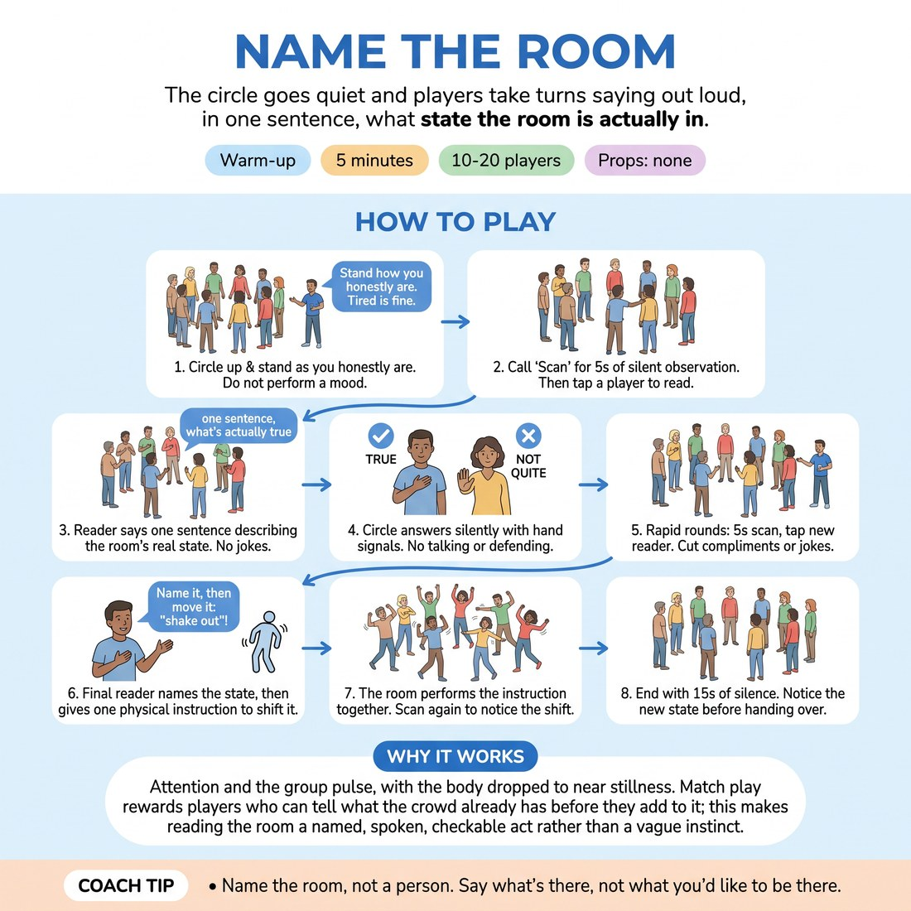

# 🔥 Warm-up cluster — Name the Room

{ .infographic }

> The circle goes quiet and players take turns saying out loud, in one sentence, what state the room is actually in.

`Players 10–20` · `~5 min` · `Complexity 2/5` · `Energy low` · `Contact none` · `Props: none`

⬅️ [Back to the Week 07 run-sheet](../week-07.md)

## Why this activity, here

Week 7 is short-form under pressure, where players will be reading an audience in real time and choosing whether to push or wait. This is the first block of the day: it makes the room itself the thing being read, before anyone has to be funny. It feeds directly into the match-play blocks later, where a player who can name what the room is doing will stop begging and start earning.

## What students actually learn

- They stop confusing what they want the room to be with what it is.
- They find out their read is usually shared — the palms confirm it — which lowers the fear of naming something awkward out loud.
- They learn that a small physical instruction can move a room, and that this is a skill rather than a personality trait.
- They notice the pull towards flattery and jokes, which is the same pull that makes them beg for laughs later.

## Setup

Clear floor space for a standing circle of 10-20. No chairs, no props, no music. Have a watch or phone timer where you can see it. Know before you start what state you think the room is in — you will need it if the first reads are all compliments. Doors closed. This runs cold, first thing, before any other warm-up.

## How to run it — 5 minutes

| Min | What you do |
|---:|---|
| 1 | Circle up standing. Give the honesty instruction — stand as you are, do not perform a mood, do not fix your face. Explain the two palm signals. Do not take questions. |
| 1 | First round, slow. Call "Scan", ten seconds of silence. Call "Read", tap one player. One sentence. Take the palms in silence. Move on without comment. |
| 2 | Rapid rounds. Five-second scan, tap a new reader, one sentence, silent palms. Six to eight readers. Send back anything that is a compliment or a joke. |
| 1 | Final reader names the room, then gives one physical instruction. Room does it. Five-second scan. Palms on whether it moved. Fifteen seconds of stillness, then move on. |

## Side-coaching script

| When | Say |
|---|---|
| As they settle into the circle | *"Stand how you actually are. Nobody is being looked at yet."* |
| Opening the first scan | *"Scan. Eyes move, faces stay."* |
| A reader hesitates for more than three seconds | *"First sentence. Not the best one."* |
| A read comes out as a compliment or a gag | *"That's kind. Now say what's true."* |
| Someone starts explaining their read | *"One sentence. Palms only."* |
| Mid rapid rounds, if energy tightens | *"Nobody's wrong here. You're describing weather."* |
| Before the final instruction | *"Name it, then move it. Something the body can do."* |
| In the closing stillness | *"Don't fill it. Just notice where you are now."* |

!!! success "What good looks like"
    Reads get shorter and blunter as the rounds go on. Someone says something mildly unflattering — "half of us haven't woken up", "we're all being careful" — and most palms go to chests. Nobody laughs to cover it. The final instruction produces a visible change in posture across the circle, and when you scan afterwards the room looks different from how it looked ninety seconds earlier. The closing silence holds without fidgeting.

## When it goes wrong

| You see | What's causing it | The fix |
|---|---|---|
| Every read is positive — "good energy today", "nice group". | The group is being polite to you and to each other, and treating the read as a performance to be graded. | Say the room's state yourself, bluntly and unflatteringly, and take the palms on your own read. Once they see an honest read is safe, the next three land. |
| Readers turn it into a bit and the circle laughs. | Laughter is the group's tool for discharging the discomfort of being looked at. It is exactly the begging reflex the cue names. | x";,"fix":"x"' |

## Scaling

| Class size | What changes |
|---|---|
| **10–13** | One circle. Slow first round, then six rapid readers, then the final instruction. Everyone will be tapped or near enough, so tap the quietest people first while the risk is lowest. |
| **14–17** | One circle, still. Cut the rapid rounds to five-second scans with no pause between readers and run seven readers. Do not try to include everyone — say so out loud at the start so nobody waits for a turn that isn't coming. |
| **18–20** | Split into two circles of nine or ten, each with its own timekeeper — you take one, a volunteer counts for the other. Four rapid readers per circle. Bring both circles into one for the final naming and the instruction, so the whole room moves together. |

## Variations

**Palms first** — You give the read, and the room only answers with palms. Do three of these before anyone else reads.  
*Easier. Removes the exposure of speaking and teaches the signal vocabulary before asking for honesty.*

**Read the person** — Instead of the room, the tapped player names the state of the person directly opposite them, in one neutral sentence. That person answers with a palm.  
*Harder. Much higher exposure. Only run with a group that has worked together for weeks, and offer an explicit pass.*

**Two-word read** — Cap every read at two words. "Tired, willing." "Guarded." "Slow start." Same scan and palm structure.  
*Different emphasis. Kills the qualifying and hedging, and drills the speed of read the short-form blocks need.*

## Debrief

1. **Whose read landed with the most palms, and what did it have that the others didn't?**
   > *A good answer sounds like:* They point at specificity or bluntness rather than accuracy — "she said we were being careful, and we were". Move on as soon as someone names the difference between describing and flattering.

2. **What did you nearly say and swallow?**
   > *A good answer sounds like:* One or two people admit to a harsher read they held back. You do not need everyone. As soon as the swallowing is named out loud, connect it to the cue and stop.

!!! warning "Safety & inclusion"
    No contact except your tap on a shoulder to select a reader. Ask at the start whether anyone would rather be pointed at than touched, and point at those people instead — no explanation required. Anyone may pass on a read by shaking their head; tap the next person immediately and without comment. Standing is not required; a chair in the circle works the same. Keep reads about the room, not about named individuals — cut anything that singles a person out. If the honest state of the room is that someone is upset, name the room's state generally and move on rather than turning the circle onto them.

## Why it works

Room reading fails because players read for what they hope is true rather than what is. Silence and the palm verdict break that: the read is spoken with no time to polish and answered with no time to argue, so the group's actual perception is visible within two seconds. Repeated across six or seven rounds, players learn their private read usually matches the room's — which is the confidence that lets them wait for a laugh instead of chasing one. The final instruction closes the loop by proving the room is not fixed weather but something a player can move, which is the whole basis of earning rather than begging.

[Open the full activity card »](../../library/warmups/WU__name-the-room.md){target=_blank rel=noopener}
