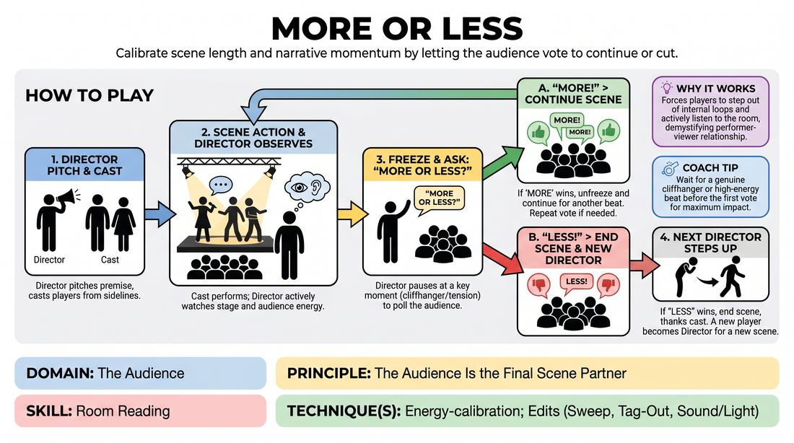

# 🎲 Drill A — isolation — More or Less

{ .infographic }

> Calibrate scene length and narrative momentum by letting the audience vote to continue or cut.

`Players 5–99` · `~25 min` · `Complexity 3/5` · `Energy medium` · `Contact none` · `Props: none`

⬅️ [Back to the Week 07 run-sheet](../week-07.md)

## Why this activity, here

Week 7 puts short form under pressure, and the session skill is reading the room rather than guessing at it. This is the isolation drill: it strips out everything except the moment of listening to an audience and acting on what you hear. It feeds the later blocks, where players have to make the same judgement mid-scene without anyone stopping to take a vote, and it puts the week's cue — earn the laugh, never beg for it — into physical practice, because a Director who begs gets a lukewarm room and has to end the scene anyway.

## What students actually learn

- They stop treating audience silence as neutral. Lukewarm reads as 'no', and they learn to feel the difference between polite attention and actual appetite.
- They get less precious about their own material. Cutting a scene you started stops feeling like a failure after the second or third time.
- They learn that momentum is a thing you can hear from outside the scene — and that the best cut point is usually earlier than instinct says.

## Setup

Chairs in a shallow arc facing an open playing space. No props needed. Have the group sit close enough together that their voting reads as one sound rather than scattered individuals — if the arc is wide, pull it in. Decide before you start whether you want suggestions from the room or Director-pitched premises, and say which. Keep a visible timer for yourself only.

## How to run it — 25 minutes

| Min | What you do |
|---:|---|
| 3 | Frame it. Explain the shape: Director pitches, casts, watches, freezes, asks 'More or less?' Practise the vote twice with the room on a fake question so they learn to answer loudly. |
| 5 | Run the first two Directors. Coach out loud during these — stop and name what you see, especially if the Director watches the stage instead of the audience. Accept that the first one will be rough. |
| 5 | Two more Directors, no interruptions from you. Side-coach only from the edge. Push the freeze earlier if Directors are letting scenes run past ninety seconds. |
| 5 | Two more Directors. Add the constraint: at least one Director must cut on a lukewarm response, not a clear 'less'. Say this out loud to the room before you start. |
| 4 | Fast round. Two Directors, forty-five second scenes, vote after each. Everyone who has not directed yet goes first. Speed removes the deliberation. |
| 3 | Stop. Run the debrief questions seated where they are. Do not let it become notes on individual scenes. |

## Side-coaching script

| When | Say |
|---|---|
| As the Director sets the scene up | *"Cast fast. Don't design it."* |
| Once the scene is running and the Director is watching the stage | *"Turn your head. Watch them, not us."* |
| Around sixty seconds in | *"Freeze on the way up, not on the way down."* |
| When a Director asks the question apologetically | *"Ask it like you mean it. No sales pitch."* |
| When the room's answer is thin or split | *"That's a no. Cut it."* |
| When a Director argues with or coaxes the audience | *"Earn it. Never beg."* |
| After a scene is cut and the Director lingers | *"Thank them. Sit down. Next."* |
| In the fast round | *"Pitch, cast, go. Now."* |

!!! success "What good looks like"
    Directors turning their bodies to watch faces rather than the scene. Freezes landing on a rise, not after a scene has already sagged. Votes that are loud and immediate because the room trusts the question is real. At least two Directors cutting a scene the audience mildly liked, without visible reluctance. Cast members dropping out cleanly and returning to the sideline without a look back. The whole thing moving briskly — eight or nine Directors across the block, not four.

## When it goes wrong

| You see | What's causing it | The fix |
|---|---|---|
| Every vote comes back 'more', every time, from everyone. | The room is being kind. They read 'less' as rejecting their classmates. | Stop and reframe out loud: 'less' is a compliment to the Director's judgement, not a verdict on the cast. Then run one scene where you vote first, loudly, for 'less'. |
| Directors let scenes run two or three minutes before freezing. | They are watching for a perfect cliffhanger instead of a live one, and they are enjoying the scene. | Take over the clock. Call 'freeze' yourself at sixty seconds for two rounds so they feel how early it is. |
| The Director freezes, hears 'more', restarts — and the scene has gone dead. | The cast dropped the tension during the freeze and restarted from a standstill. | Tell the cast to hold position and hold the thought. Coach: 'Pick it up mid-breath.' Restart the scene with a clap rather than a conversation. |
| A Director tries to win the vote with jokes to the audience before asking. | They have read the exercise as a popularity test. | Name it lightly and use the cue. Ask the question, take the answer. Point out that the begged 'more' produced a worse scene than the honest 'less'. |

## Scaling

| Class size | What changes |
|---|---|
| **10–13** | One playing area, everyone in the audience arc. Every person directs once — you will get through ten to twelve Directors, so hold scenes to sixty seconds and keep the handover to five seconds. Skip the fast round if everyone has already had a turn. |
| **14–17** | One playing area. Roughly nine Directors across the block, so not everyone directs — say this upfront and take volunteers first, then nominate the quiet ones for the fast round. Cast three players per scene so more people play. |
| **18–20** | Split into two groups in opposite corners, each with its own audience and its own facilitator eye. Run the same clock. Around minute 18, stop both and bring everyone together for the fast round in one big room so the whole group hears what a twenty-person vote sounds like. |

## Variations

**Show of hands** — Replace the shout with raised hands. Director counts, then decides.  
*Easier — removes the volume-reading judgement and the social pressure of shouting, so nervous Directors can practise the freeze and the cut in isolation.*

**Silent read** — The Director never asks the question. They freeze, look at the room for three seconds, and either continue or cut based on what they see.  
*Harder — takes away the data and forces the read from body language and attention alone, which is closer to what a real audience gives you.*

**Cast votes too** — After the audience answers, the Director asks the cast the same question. If cast and audience disagree, the audience wins and the Director says why out loud.  
*Different emphasis — surfaces the gap between how a scene feels from inside and how it plays from outside.*

**Three-strike Director** — One Director stays out for three consecutive scenes with different casts. They may not repeat a premise type.  
*Harder — builds stamina in the directing seat and shows whether the read improves within a single stretch.*

## Debrief

1. **When you were directing, what actually told you the answer before the room shouted?**
   > *A good answer sounds like:* Something physical and specific — people leaning forward, someone laughing a beat late, three people looking at their shoes. Not 'I just felt it'. If they only offer feelings, push once for a detail, then move on.

2. **Did anyone cut a scene they wanted to keep going? What did that cost you?**
   > *A good answer sounds like:* Honest reluctance, followed by a recognition that it ended cleanly rather than dying. Someone saying 'I wanted more but the room didn't' is the whole point. Move on once two people have said it.

3. **What's the difference between a scene that earned 'more' and one that asked for it?**
   > *A good answer sounds like:* They point at momentum or an unanswered question in the scene, versus the Director selling. Anything that lands on 'the scene was doing the work, not the pitch' is enough.

!!! warning "Safety & inclusion"
    No physical contact is built into this. If a Director wants to place cast members in a stage picture involving touch, they ask first and take no for an answer without discussion — say this once at the top. Voting can feel exposing for whoever is on stage when 'less' wins; frame the vote as feedback on pacing, not on performance, and make sure you personally vote 'less' at least once early so it stops being loaded. Anyone who does not want to direct can pass; give them a clear job in the audience instead, such as tracking where the freeze landed. Directors may stand or sit at the edge as they prefer, and the audience arc should leave a clear path for anyone who needs to step out.

## Why it works

Room Reading normally happens too fast to examine — the performer senses something and adjusts within a second, and cannot say afterwards what they sensed. This drill slows the loop down and makes it explicit. The Director makes a private prediction while watching the room, then gets the answer out loud, immediately, from the same room. That tight feedback pairing is what builds the calibration: guess, hear, correct, repeat, eight or nine times in twenty-five minutes. The cue lands because the mechanism punishes begging directly — a Director who works the audience for 'more' gets a compliance vote, restarts a scene with no fuel, and watches it die in front of them. Nobody has to be told the difference between an earned response and a coaxed one after they have felt both inside four minutes.

[Open the full activity card »](../../../../games/D5_P1_S1_T1_G1188__more-or-less.md){target=_blank rel=noopener}
